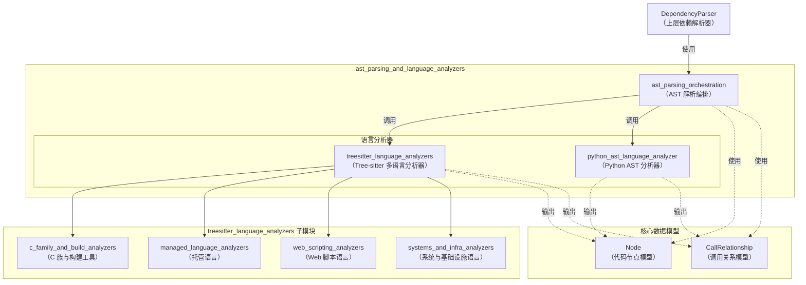
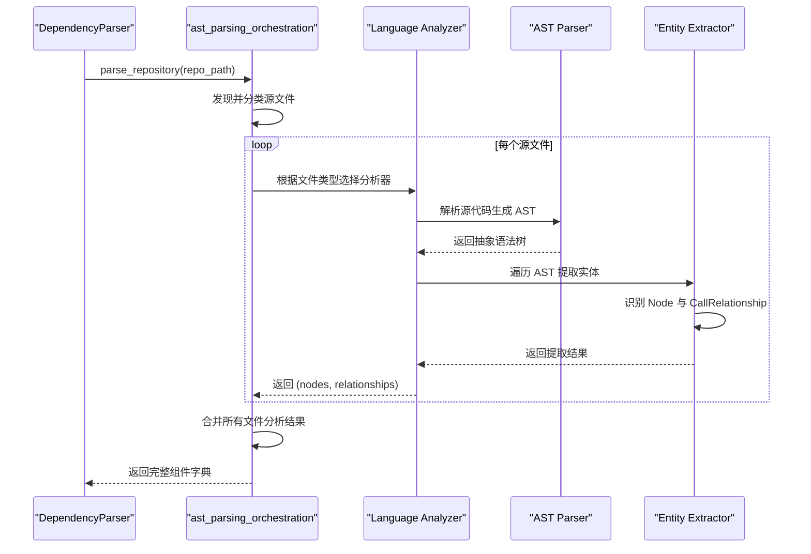

# `ast_parsing_and_language_analyzers` 模块概述

## 1. 模块目的

`ast_parsing_and_language_analyzers` 模块是 `dependency_analysis_engine` 依赖分析引擎的核心子模块，负责多语言源代码的抽象语法树（AST）解析与分析工作。该模块的主要设计目的是：

- **统一多语言解析接口**：为不同编程语言提供一致的代码解析入口，屏蔽底层解析细节
- **AST 生成与遍历**：利用 Python 原生 `ast` 模块或 Tree-sitter 库生成各类语言的抽象语法树，并进行结构化遍历
- **代码实体提取**：从源代码中识别并提取类、函数、方法、变量等核心代码实体
- **依赖关系识别**：分析代码实体之间的调用、继承、实现、引用等依赖关系
- **标准化数据输出**：生成标准化的 `Node` 和 `CallRelationship` 数据结构，供上层依赖图构建模块使用

该模块通过将语言特定的解析逻辑封装在独立的分析器中，同时保持统一的接口，实现了代码库的多语言依赖分析能力，为整个 CodeWiki 系统的文档生成和代码理解提供了基础支撑。

## 2. 模块架构

`ast_parsing_and_language_analyzers` 模块采用分层架构设计，将解析编排与语言特定分析器分离，并对分析器按语言特性进行组织，形成清晰的结构。

### 2.1 整体架构图

### 2.2 数据流程图

### 2.3 架构说明

该模块按功能和职责分为以下几个核心部分：

1. **ast_parsing_orchestration**：负责解析过程的编排与协调，作为中央调度器接收解析请求，选择合适的语言分析器，并整合分析结果。
   
2. **treesitter_language_analyzers**：基于 Tree-sitter 库的多语言分析器集合，进一步按语言特性分为四个子组：
   - **c_family_and_build_analyzers**：处理 C、C++ 和 CMake 语言
   - **managed_language_analyzers**：处理 Java 和 C# 等托管语言
   - **web_scripting_analyzers**：处理 JavaScript、TypeScript 和 PHP 等 Web 脚本语言
   - **systems_and_infra_analyzers**：处理 Go、Rust、Bash 和 TOML 等系统与基础设施语言

3. **python_ast_language_analyzer**：专门针对 Python 语言的分析器，利用 Python 标准库的 `ast` 模块进行解析，提供与 Python 语言特性的完美兼容性。

这种分层设计使得模块具有良好的扩展性，添加新语言支持时只需添加相应的分析器，而无需修改编排逻辑。

## 3. 核心组件参考

`ast_parsing_and_language_analyzers` 模块包含以下核心子模块和组件：

### 3.1 ast_parsing_orchestration 子模块
- [DependencyParser](./ast_parsing_orchestration.md)：AST 解析编排器，负责协调整个解析过程，管理多语言代码库的抽象语法树解析工作，是该模块的核心入口类。

### 3.2 treesitter_language_analyzers 子模块
- [treesitter_language_analyzers 概述](./treesitter_language_analyzers.md)：基于 Tree-sitter 的多语言分析器集合，为 C、C++、Java、JavaScript、TypeScript、PHP、Go、Rust 等多种语言提供统一的解析接口。

#### treesitter_language_analyzers 子模块包含的分析器组：
- **c_family_and_build_analyzers**：
  - `TreeSitterCAnalyzer`：C 语言代码分析器
  - `TreeSitterCppAnalyzer`：C++ 语言代码分析器
  - `TreeSitterCMakeAnalyzer`：CMake 构建脚本分析器

- **managed_language_analyzers**：
  - `TreeSitterJavaAnalyzer`：Java 语言代码分析器
  - `TreeSitterCSharpAnalyzer`：C# 语言代码分析器

- **web_scripting_analyzers**：
  - `TreeSitterJSAnalyzer`：JavaScript 代码分析器
  - `TreeSitterTSAnalyzer`：TypeScript 代码分析器
  - `TreeSitterPHPAnalyzer`：PHP 代码分析器
  - `NamespaceResolver`：PHP 命名空间解析器

- **systems_and_infra_analyzers**：
  - `TreeSitterGoAnalyzer`：Go 语言代码分析器
  - `TreeSitterRustAnalyzer`：Rust 语言代码分析器
  - `TreeSitterBashAnalyzer`：Bash 脚本分析器
  - `TreeSitterTOMLAnalyzer`：TOML 配置文件分析器

### 3.3 python_ast_language_analyzer 子模块
- [PythonASTAnalyzer](./python_ast_language_analyzer.md)：Python 语言专用分析器，利用 Python 标准库 `ast` 模块进行源代码解析，提取类、函数定义及其调用关系。

### 3.4 核心数据模型
- [Node](../core_domain_models.md)：表示代码实体（类、函数、方法等）的节点对象
- [CallRelationship](../core_domain_models.md)：表示节点间调用或依赖关系的对象

这些核心组件共同协作，为上层的依赖分析提供了强大的多语言代码解析能力，是整个依赖分析引擎的基础。