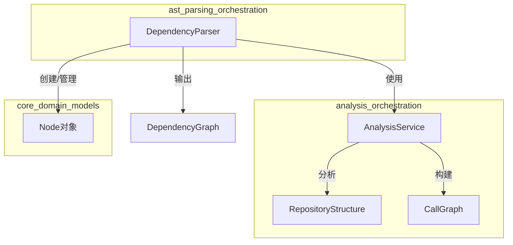
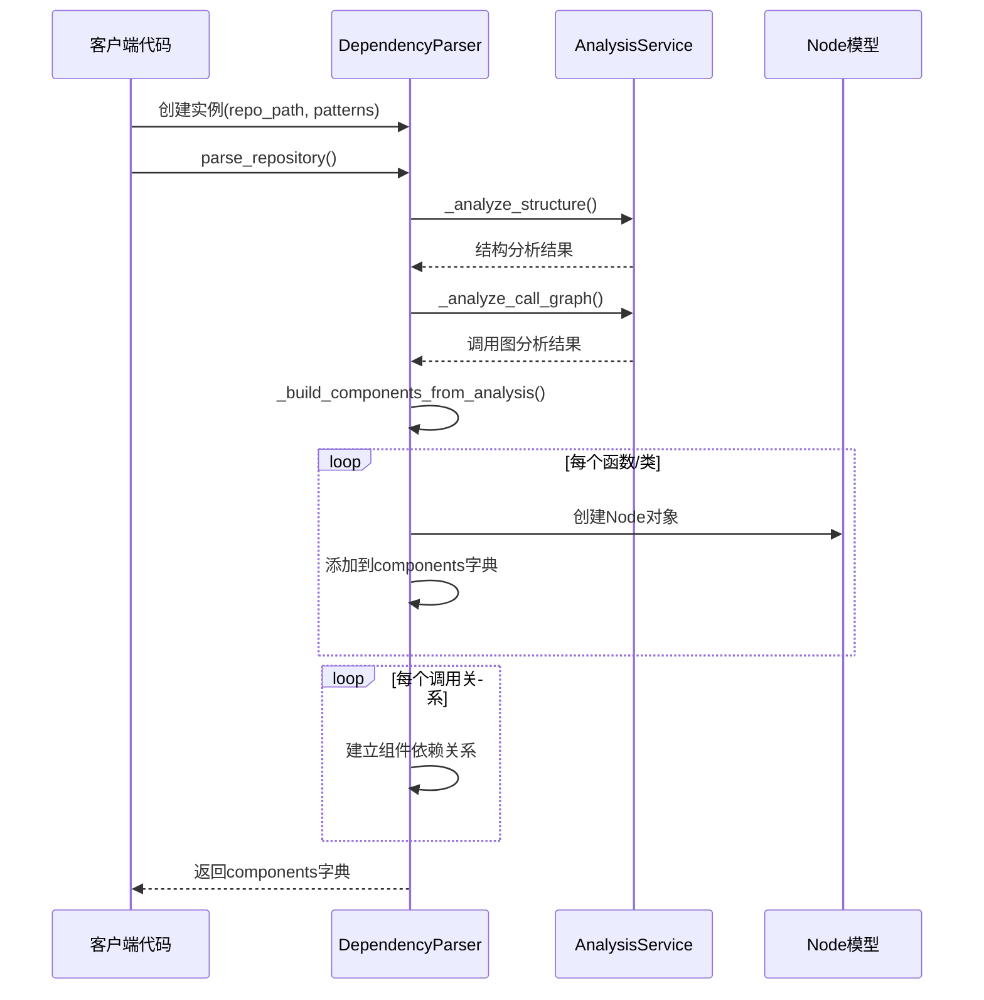

# ast_parsing_orchestration 模块文档

## 概述

ast_parsing_orchestration 模块是 codewiki 依赖分析引擎的核心组成部分，负责协调和管理多语言代码库的抽象语法树（AST）解析工作。该模块作为解析过程的中央编排器，将底层的语言特定分析器与高层的依赖图构建功能连接起来，为整个代码库分析系统提供统一的组件提取和依赖关系解析接口。

### 设计理念

该模块的设计遵循了关注点分离和单一职责原则，通过 `DependencyParser` 类提供一个简洁的高层接口，隐藏了多语言 AST 解析的复杂性。它利用 `AnalysisService` 来处理实际的语言特定分析，然后将结果转换为统一的 `Node` 对象模型，使得上层应用可以以一致的方式处理不同编程语言的代码结构。

## 核心组件

### DependencyParser

`DependencyParser` 是该模块的核心类，负责从多语言代码库中提取代码组件并构建依赖关系图。

#### 初始化

```python
def __init__(self, repo_path: str, include_patterns: List[str] = None, exclude_patterns: List[str] = None):
```

**参数说明：**
- `repo_path` (str): 要分析的代码库的绝对或相对路径
- `include_patterns` (List[str], 可选): 用于包含特定文件的通配符模式列表，例如 `["*.py", "*.js"]`
- `exclude_patterns` (List[str], 可选): 用于排除特定文件或目录的通配符模式列表，例如 `["*Tests*", "node_modules"]`

**主要属性：**
- `repo_path`: 代码库的绝对路径
- `components`: 存储解析后组件的字典，键为组件 ID，值为 `Node` 对象
- `modules`: 发现的模块路径集合
- `include_patterns` 和 `exclude_patterns`: 文件过滤模式
- `analysis_service`: 用于执行实际分析工作的 `AnalysisService` 实例

#### 主要方法

##### parse_repository

```python
def parse_repository(self, filtered_folders: List[str] = None) -> Dict[str, Node]:
```

解析整个代码库，提取所有代码组件及其依赖关系。

**参数：**
- `filtered_folders` (List[str], 可选): 限制解析范围的文件夹列表

**返回值：**
- `Dict[str, Node]`: 包含所有解析组件的字典，键为组件 ID

**工作流程：**
1. 记录分析开始的日志信息
2. 使用 `AnalysisService` 分析代码库结构
3. 执行调用图分析
4. 从分析结果构建组件模型
5. 返回解析后的组件字典

**使用示例：**

```python
from codewiki.src.be.dependency_analyzer.ast_parser import DependencyParser

# 创建解析器实例
parser = DependencyParser(
    repo_path="/path/to/repository",
    include_patterns=["*.py", "*.js"],
    exclude_patterns=["*test*", "node_modules"]
)

# 解析代码库
components = parser.parse_repository()

# 输出结果
print(f"找到 {len(components)} 个组件")
for component_id, component in components.items():
    print(f"{component_id}: {component.name} ({component.component_type})")
```

##### _build_components_from_analysis

```python
def _build_components_from_analysis(self, call_graph_result: Dict):
```

从调用图分析结果构建组件模型。这是一个内部方法，不应该被外部直接调用。

**参数：**
- `call_graph_result` (Dict): 包含函数和关系信息的调用图分析结果

**主要功能：**
1. 遍历分析结果中的函数/类定义
2. 创建对应的 `Node` 对象
3. 建立组件 ID 映射（包括传统 ID 格式的兼容性支持）
4. 处理调用关系，将其转换为组件之间的依赖关系
5. 识别并记录模块路径

##### save_dependency_graph

```python
def save_dependency_graph(self, output_path: str) -> Dict:
```

将解析后的依赖图保存为 JSON 文件。

**参数：**
- `output_path` (str): 输出文件的路径

**返回值：**
- `Dict`: 保存的依赖图数据，格式为组件 ID 到组件字典的映射

**使用示例：**

```python
# 解析代码库后保存依赖图
parser.parse_repository()
dependency_graph = parser.save_dependency_graph("/path/to/output/dependency_graph.json")
print(f"依赖图已保存，包含 {len(dependency_graph)} 个组件")
```

#### 辅助方法

##### _determine_component_type

```python
def _determine_component_type(self, func_dict: Dict) -> str:
```

根据函数/类字典确定组件类型。

**参数：**
- `func_dict` (Dict): 包含组件信息的字典

**返回值：**
- `str`: 组件类型，如 "method"、"class"、"function" 等

##### _file_to_module_path

```python
def _file_to_module_path(self, file_path: str) -> str:
```

将文件路径转换为模块路径格式。

**参数：**
- `file_path` (str): 原始文件路径

**返回值：**
- `str`: 转换后的模块路径，使用点作为分隔符

## 架构与工作流程

### 模块架构图



### 工作流程

解析代码库的完整工作流程如下：



## 与其他模块的关系

ast_parsing_orchestration 模块在整个依赖分析引擎中扮演着中央协调者的角色，与多个关键模块紧密协作：

1. **analysis_orchestration**：提供核心的分析服务，包括仓库结构分析和调用图生成。DependencyParser 依赖 AnalysisService 来执行实际的分析工作。
   
2. **core_domain_models**：定义了 Node 等核心数据模型，DependencyParser 使用这些模型来表示解析出的代码组件。

3. **dependency_graph_construction**：接收 DependencyParser 输出的组件和依赖关系，用于构建完整的依赖图。

4. **各种语言特定分析器**（如 PythonASTAnalyzer、TreeSitterJSAnalyzer 等）：虽然 DependencyParser 不直接调用这些分析器，但它们通过 AnalysisService 间接为 DependencyParser 提供语言特定的解析能力。

## 使用指南

### 基本使用

以下是使用 DependencyParser 的基本步骤：

```python
from codewiki.src.be.dependency_analyzer.ast_parser import DependencyParser

# 1. 创建解析器实例
parser = DependencyParser(
    repo_path="/path/to/your/repository",
    include_patterns=["*.py", "*.js", "*.ts"],  # 可选：只解析特定类型的文件
    exclude_patterns=["tests", "node_modules"]   # 可选：排除特定目录
)

# 2. 解析代码库
components = parser.parse_repository()

# 3. 处理结果
for comp_id, component in components.items():
    print(f"组件: {component.get_display_name()}")
    print(f"  类型: {component.component_type}")
    print(f"  位置: {component.file_path}:{component.start_line}")
    print(f"  依赖: {len(component.depends_on)} 个组件")
    print()

# 4. 保存依赖图（可选）
parser.save_dependency_graph("dependency_graph.json")
```

### 配置选项

DependencyParser 提供以下配置选项：

#### include_patterns

指定要包含的文件模式。可以使用通配符来匹配多个文件：

```python
include_patterns = [
    "*.py",           # 所有Python文件
    "src/**/*.js",    # src目录下的所有JavaScript文件
    "*.tsx"           # 所有TypeScript JSX文件
]
```

#### exclude_patterns

指定要排除的文件或目录模式：

```python
exclude_patterns = [
    "tests",          # 排除tests目录
    "*_test.py",      # 排除所有测试文件
    "node_modules",   # 排除node_modules目录
    "build"           # 排除build目录
]
```

## 进阶功能

### 自定义分析范围

可以通过 `filtered_folders` 参数来限制分析范围：

```python
# 只分析特定子目录
components = parser.parse_repository(filtered_folders=["src/core", "src/api"])
```

### 组件查询与遍历

解析完成后，可以通过多种方式查询和遍历组件：

```python
# 按类型过滤
classes = [c for c in components.values() if c.component_type == "class"]
functions = [c for c in components.values() if c.component_type == "function"]

# 查找特定模块的组件
module_components = [
    c for c in components.values() 
    if c.id.startswith("myproject.module.")
]

# 查找被最多组件依赖的组件
dependency_count = {}
for component in components.values():
    for dep in component.depends_on:
        dependency_count[dep] = dependency_count.get(dep, 0) + 1

most_depended = sorted(dependency_count.items(), key=lambda x: x[1], reverse=True)[:5]
print("被依赖最多的组件:")
for comp_id, count in most_depended:
    print(f"  {components[comp_id].name}: {count} 次")
```

## 注意事项与限制

### 边缘情况

1. **大型代码库**：对于包含数万个文件的超大型代码库，解析过程可能需要较长时间和较多内存。建议使用 `include_patterns` 和 `exclude_patterns` 来限制分析范围。

2. **动态语言特性**：对于使用大量动态特性的代码（如 Python 的动态导入、JavaScript 的 eval），解析结果可能不完整，因为这些特性在静态分析中难以完全捕捉。

3. **复杂的依赖关系**：某些依赖关系（如通过配置文件或字符串定义的依赖）可能无法被正确识别。

### 错误条件

1. **无效的仓库路径**：如果提供的 `repo_path` 不存在或不可访问，将导致解析失败。

2. **权限问题**：如果没有足够的权限读取某些文件，可能会导致部分解析结果缺失。

3. **语法错误**：包含语法错误的文件可能无法被正确解析，导致该文件中的组件无法被识别。

### 性能考量

1. **增量更新**：当前版本不支持增量更新，每次调用 `parse_repository` 都会完全重新解析整个代码库。

2. **并行处理**：对于包含大量文件的代码库，考虑实现并行解析以提高性能（当前版本未实现）。

3. **内存使用**：解析大型代码库时，所有组件都会保留在内存中。对于超大型代码库，这可能导致内存压力。

## 扩展与集成

### 自定义组件处理

可以继承 `DependencyParser` 并重写 `_build_components_from_analysis` 方法来实现自定义的组件处理逻辑：

```python
class CustomDependencyParser(DependencyParser):
    def _build_components_from_analysis(self, call_graph_result: Dict):
        # 先调用父类方法
        super()._build_components_from_analysis(call_graph_result)
        
        # 添加自定义处理逻辑
        for component_id, component in self.components.items():
            # 例如：添加自定义标签、修改组件属性等
            self._process_component(component)
    
    def _process_component(self, component):
        # 自定义组件处理逻辑
        pass
```

### 与其他系统集成

DependencyParser 可以轻松集成到更大的系统中：

```python
def integrate_with_documentation_system(repo_path):
    # 创建解析器
    parser = DependencyParser(repo_path)
    
    # 解析代码库
    components = parser.parse_repository()
    
    # 为每个组件生成文档
    for component in components.values():
        if component.has_docstring:
            generate_documentation(component)
    
    # 保存依赖图以供可视化
    parser.save_dependency_graph("docs/dependency_graph.json")
```

## 总结

ast_parsing_orchestration 模块通过 DependencyParser 类提供了一个强大而灵活的接口，用于解析多语言代码库并提取组件及其依赖关系。它隐藏了底层语言特定分析的复杂性，为上层应用提供了统一的组件模型。

通过合理使用 include_patterns 和 exclude_patterns，用户可以精确控制分析范围，平衡分析的全面性和性能。虽然该模块在处理某些动态语言特性和大型代码库时存在一定限制，但它仍然是构建代码分析、文档生成和架构可视化工具的坚实基础。
