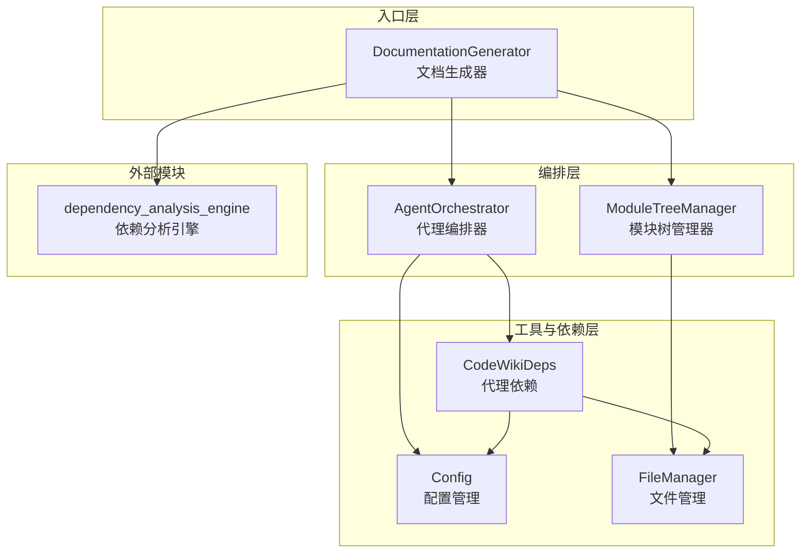
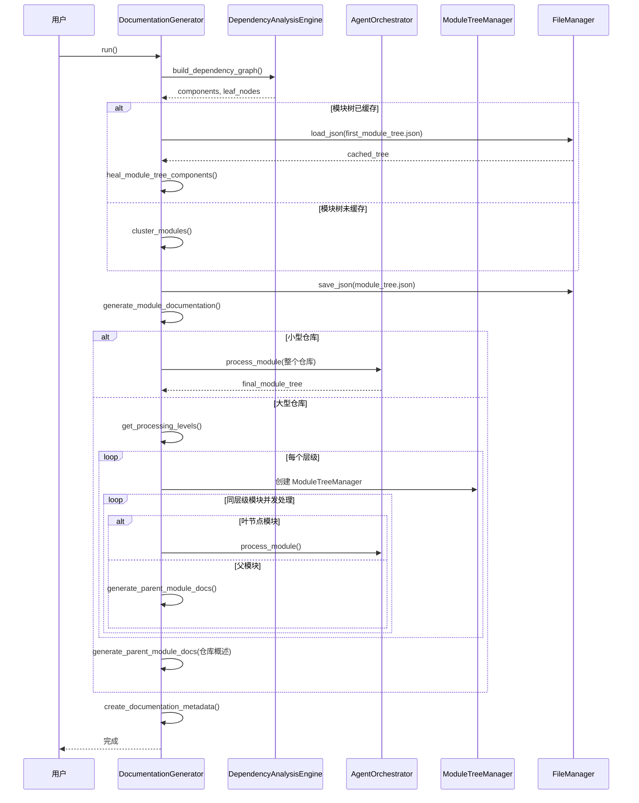

# backend_documentation_orchestration 模块文档

## 1. 模块概述

`backend_documentation_orchestration` 模块是 CodeWiki 系统的核心编排层，负责协调和管理整个文档生成流程。该模块通过智能代理 orchestration、并发处理和动态规划技术，将代码仓库自动转换为结构化的技术文档。

### 1.1 设计理念

本模块采用自底向上的文档生成策略，先处理最底层的叶节点模块，再逐步向上生成父模块和仓库级别的概述文档。这种设计确保了父模块文档能够基于其子模块的完整内容进行聚合和总结，从而保证文档的一致性和完整性。

### 1.2 核心问题解决

- **大规模代码库的文档生成**：通过模块化聚类和并发处理，能够高效处理大型代码仓库
- **文档一致性保证**：通过依赖图分析和自底向上的生成策略，确保模块间引用的准确性
- **可扩展性**：通过代理工具和灵活的配置系统，支持不同类型的文档生成需求
- **并发安全**：通过锁机制保护共享资源，确保多代理环境下的数据一致性

## 2. 系统架构

### 2.1 架构图



### 2.2 组件关系说明

- **DocumentationGenerator**：作为整个系统的入口点，协调整个文档生成流程，包括依赖图构建、模块聚类、并发文档生成和元数据创建。
- **AgentOrchestrator**：负责为每个模块创建适当的 AI 代理，根据模块复杂度选择不同的工具集和提示词模板。
- **ModuleTreeManager**：提供线程安全的模块树访问和持久化机制，确保并发环境下数据的一致性。
- **CodeWikiDeps**：为 AI 代理提供运行时依赖，包括文件路径、组件信息、模块树状态等。
- **Config**：集中管理系统配置，包括 LLM 参数、输出路径、文档生成选项等。
- **FileManager**：提供统一的文件 I/O 操作接口，简化文件读写和目录管理。

## 3. 核心功能模块

### 3.1 DocumentationGenerator

`DocumentationGenerator` 是整个文档生成流程的主控制器，负责从依赖分析到最终文档输出的完整流程。

#### 主要功能：
1. **依赖图构建**：利用 `dependency_analysis_engine` 模块构建代码库的依赖关系图
2. **模块聚类**：将相关组件聚合为逻辑模块，形成层次化结构
3. **并发文档生成**：采用基于层级的并发策略，高效生成各模块文档
4. **父模块文档聚合**：基于子模块文档生成父模块和仓库级别的概述
5. **元数据创建**：记录文档生成的相关信息，便于追踪和版本管理

#### 关键方法：

**`run()`** - 主入口方法，执行完整的文档生成流程
- 首先构建依赖图，识别所有代码组件和叶节点
- 然后进行模块聚类，形成层次化的模块树
- 接着采用自底向上的方式生成各模块文档
- 最后创建元数据文件记录生成信息

**`generate_module_documentation(components, leaf_nodes)`** - 生成模块文档的核心方法
- 根据模块树的存在与否选择不同的处理策略
- 对于小型仓库，直接处理整个仓库
- 对于大型仓库，采用基于层级的并发处理
- 最后生成仓库级别的概述文档

**`get_processing_levels(module_tree, parent_path)`** - 计算模块处理层级
- 通过递归遍历模块树，为每个模块分配处理级别
- 叶节点模块级别为 0，父模块级别为子模块最大级别 + 1
- 同一级别的模块可以并发处理，提高效率

### 3.2 AgentOrchestrator

`AgentOrchestrator` 负责为每个模块创建和配置适当的 AI 代理，是智能文档生成的核心。

#### 主要功能：
1. **代理创建**：根据模块复杂度创建不同类型的 AI 代理
2. **工具选择**：为复杂模块提供完整工具集，为简单模块提供基础工具集
3. **提示词定制**：根据配置和模块特性定制系统提示词
4. **模块处理**：协调代理执行文档生成任务

#### 关键方法：

**`create_agent(module_name, components, core_component_ids)`** - 创建 AI 代理
- 根据模块复杂度判断是否需要生成子模块文档
- 复杂模块获得完整工具集，包括子模块文档生成工具
- 简单模块仅获得基础工具集
- 根据配置定制系统提示词

**`process_module(module_name, components, core_component_ids, module_path, working_dir, tree_manager)`** - 处理单个模块
- 检查文档是否已存在，避免重复生成
- 获取模块树快照（来自管理器或磁盘）
- 创建代理和依赖对象
- 执行代理并保存结果
- 持久化更新后的模块树

### 3.3 ModuleTreeManager

`ModuleTreeManager` 提供线程安全的模块树访问和持久化机制，是并发处理的关键组件。

#### 主要功能：
1. **锁保护访问**：使用异步锁保护模块树的并发访问
2. **快照提供**：返回模块树的深拷贝，确保调用者可以安全修改
3. **增量更新**：支持更新特定路径下的子模块
4. **自动持久化**：在更新时自动将模块树保存到磁盘

#### 关键方法：

**`get_snapshot()`** - 获取模块树快照
- 返回深拷贝的模块树，防止并发修改问题
- 使用锁保护读取操作

**`update_children(path, new_children)`** - 更新子模块
- 合并新的子模块到指定路径的 children 字典中
- 自动持久化更新后的模块树
- 使用锁保护写入操作

**`save()`** - 强制持久化
- 将当前内存中的模块树保存到磁盘
- 使用锁保护写入操作

### 3.4 Config

`Config` 类集中管理 CodeWiki 系统的所有配置项，提供灵活的配置方式。

#### 主要功能：
1. **配置集中管理**：将所有配置项集中在一个类中
2. **多源配置加载**：支持从命令行参数、CLI 参数和环境变量加载配置
3. **智能提示词生成**：根据代理指令生成定制化的提示词附加内容
4. **路径计算**：自动计算输出目录、文档目录等路径

#### 关键属性和方法：

**`get_prompt_addition()`** - 生成提示词附加内容
- 根据文档类型添加相应的指导
- 针对关注模块提供更详细的文档
- 包含自定义指令

**`from_args(args)`** - 从命令行参数创建配置
- 解析命令行参数
- 自动计算仓库名称和输出路径
- 设置默认值

**`from_cli(...)`** - 从 CLI 参数创建配置
- 提供完整的参数列表
- 支持自定义所有配置项
- 适用于编程式调用

### 3.5 FileManager

`FileManager` 提供统一的文件 I/O 操作接口，简化文件和目录管理。

#### 主要功能：
1. **目录管理**：确保目录存在，避免路径错误
2. **JSON 操作**：简化 JSON 数据的保存和加载
3. **文本操作**：提供文本文件的读写功能

#### 关键方法：

**`ensure_directory(path)`** - 确保目录存在
- 如果目录不存在则创建
- 使用 `exist_ok=True` 避免重复创建错误

**`save_json(data, filepath)`** - 保存 JSON 数据
- 使用缩进格式保存，提高可读性
- 处理文件打开和关闭

**`load_json(filepath)`** - 加载 JSON 数据
- 如果文件不存在返回 None
- 处理文件打开和关闭

## 4. 工作流程

### 4.1 完整文档生成流程



### 4.2 并发处理流程

对于大型仓库，系统采用基于层级的并发处理策略：

1. **层级计算**：首先计算每个模块的处理级别，叶节点为 0，父节点为子节点最大级别 + 1
2. **层级顺序处理**：从最低级别开始，逐级向上处理
3. **同级别并发**：同一级别的模块可以并发处理，提高效率
4. **锁保护共享资源**：使用 `ModuleTreeManager` 保护模块树的并发访问
5. **信号量控制并发度**：使用信号量限制最大并发数，避免资源耗尽

## 5. 配置与使用

### 5.1 基本配置

使用 `Config` 类可以配置文档生成的各个方面：

```python
from codewiki.src.config import Config

# 从 CLI 创建配置
config = Config.from_cli(
    repo_path="/path/to/repo",
    output_dir="/path/to/output",
    llm_base_url="http://localhost:4000",
    llm_api_key="your-api-key",
    main_model="claude-sonnet-4",
    cluster_model="claude-sonnet-4",
    max_concurrent=5,
    output_language="zh"
)
```

### 5.2 代理指令定制

可以通过 `agent_instructions` 参数定制文档生成行为：

```python
agent_instructions = {
    "doc_type": "architecture",
    "focus_modules": ["backend_documentation_orchestration", "dependency_analysis_engine"],
    "custom_instructions": "特别关注系统架构和组件交互",
    "include_patterns": ["*.py"],
    "exclude_patterns": ["test_*.py", "*_test.py"]
}

config = Config.from_cli(
    # ... 其他参数
    agent_instructions=agent_instructions
)
```

### 5.3 运行文档生成

使用 `DocumentationGenerator` 运行完整的文档生成流程：

```python
import asyncio
from codewiki.src.be.documentation_generator import DocumentationGenerator

async def main():
    generator = DocumentationGenerator(config)
    await generator.run()

asyncio.run(main())
```

## 6. 与其他模块的关系

### 6.1 依赖关系

`backend_documentation_orchestration` 模块依赖以下模块：

- **dependency_analysis_engine**：提供代码依赖分析功能，是文档生成的基础
- **cli_documentation_workflow**：提供 CLI 界面，使用本模块的功能
- **web_application_frontend**：提供 Web 界面，使用本模块的功能

### 6.2 数据交换

- 从 `dependency_analysis_engine` 接收组件和依赖图数据
- 向 `cli_documentation_workflow` 和 `web_application_frontend` 提供生成的文档

详细信息请参考 [dependency_analysis_engine](dependency_analysis_engine.md)、[cli_documentation_workflow](cli_documentation_workflow.md) 和 [web_application_frontend](web_application_frontend.md) 的文档。

## 7. 错误处理与调试

### 7.1 常见错误

1. **LLM 调用失败**：检查 API 密钥、base URL 和模型名称是否正确
2. **文件路径错误**：确保 repo_path 存在且有读写权限
3. **并发冲突**：如果遇到模块树不一致问题，尝试降低 max_concurrent 值
4. **内存不足**：处理大型仓库时可能需要增加系统内存或降低并发数

### 7.2 日志记录

系统使用 Python 标准 logging 模块记录日志，可以通过配置 logging 级别来调整日志详细程度：

```python
import logging
logging.basicConfig(level=logging.DEBUG)
```

## 8. 扩展性与定制

### 8.1 添加新的代理工具

可以通过扩展 `AgentOrchestrator` 的 `create_agent` 方法添加新的代理工具，参考 `codewiki.src.be.agent_tools` 目录下的现有工具实现。

### 8.2 自定义提示词模板

可以通过修改 `codewiki.src.be.prompt_template` 模块中的提示词模板来自定义文档生成风格和内容。

## 9. 总结

`backend_documentation_orchestration` 模块是 CodeWiki 系统的核心编排层，通过智能代理、并发处理和动态规划技术，实现了从代码到文档的自动化转换。其自底向上的生成策略、灵活的配置系统和线程安全的并发处理，使其能够高效处理各种规模的代码仓库，生成高质量的技术文档。
