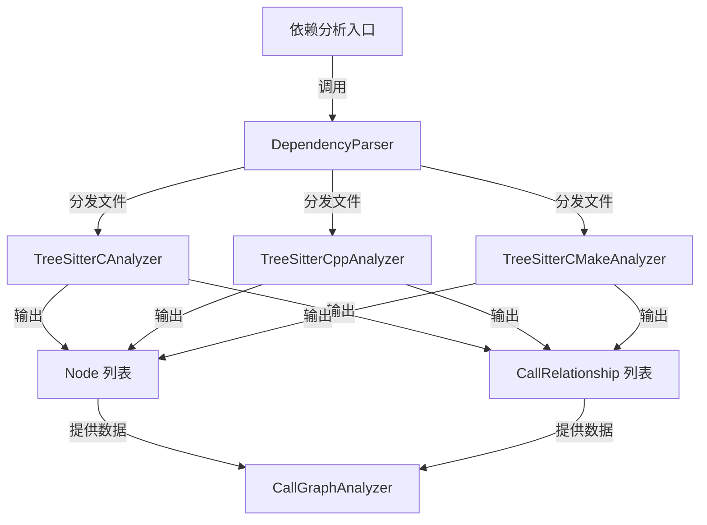

# C/C++/CMake 依赖分析器模块

## 1. 模块概述

`c_family_and_build_analyzers` 模块是一个专门用于分析 C、C++ 和 CMake 语言源代码的依赖关系分析工具。该模块是 `dependency_analysis_engine` 系统的重要组成部分，主要负责解析这些语言的抽象语法树（AST），提取代码中的关键组件（如函数、类、结构体等）并构建它们之间的依赖关系图。

### 1.1 设计目的

该模块的设计目的是为了解决以下问题：
- 准确识别和提取 C/C++ 代码中的关键结构元素
- 分析这些元素之间的调用、继承、依赖等关系
- 处理 CMake 构建脚本并提取构建配置和项目结构关系
- 为上层的文档生成和代码分析提供结构化的依赖信息

### 1.2 在系统中的位置

本模块位于 `dependency_analysis_engine` 下的 `ast_parsing_and_language_analyzers` 子模块中，与其他语言分析器（如 Python、JavaScript、Java 等）平行协作。它通过 `DependencyParser` 与上层模块进行交互，为 `CallGraphAnalyzer` 和 `AnalysisService` 提供基础的代码解析数据。

## 2. 架构设计

本模块采用了分层架构设计，各组件职责清晰，通过协同工作完成对目标语言的分析。

### 2.1 整体架构图



### 2.2 组件职责说明

该模块包含三个主要的语言分析器，每个分析器负责处理一种特定的语言或文件类型：

1. **TreeSitterCAnalyzer**：负责分析 C 语言源文件，提取函数、结构体、全局变量等节点及其关系
2. **TreeSitterCppAnalyzer**：负责分析 C++ 源文件，相比 C 语言分析器增加了对类、继承关系、方法等 C++ 特性的支持
3. **TreeSitterCMakeAnalyzer**：负责分析 CMake 构建脚本，提取函数定义、宏定义以及各种构建命令的关系

每个分析器都采用类似的工作流程：使用 Tree-sitter 库解析源代码生成 AST，然后通过递归遍历 AST 提取关键节点和关系，最后返回结构化的 Node 和 CallRelationship 数据。

## 3. 核心功能

### 3.1 C 语言代码分析

TreeSitterCAnalyzer 提供了对 C 语言代码的深度分析能力，主要功能包括：

- 识别和提取函数定义、结构体定义（包括 typedef struct）、全局变量
- 分析函数调用关系，包括本地函数调用和跨文件函数引用
- 检测函数对全局变量的使用关系
- 识别系统库函数并进行适当的过滤，避免对标准库函数的误分析

该分析器会从代码中构建一个清晰的节点-关系图，为后续的分析提供基础数据。

### 3.2 C++ 语言代码分析

TreeSitterCppAnalyzer 在 C 语言分析器的基础上，增加了对 C++ 特有功能的支持：

- 识别和提取类定义、结构体定义、函数定义、方法定义
- 分析类之间的继承关系
- 处理类的实例化关系（new 表达式）
- 识别类方法调用和对象成员访问
- 支持命名空间的识别和处理

该分析器能够构建更加复杂的依赖关系图，包括继承链、类成员访问、对象创建等多种类型的关系。

### 3.3 CMake 构建脚本分析

TreeSitterCMakeAnalyzer 专注于分析 CMake 构建系统的配置文件，主要功能包括：

- 识别和提取用户定义的 CMake 函数和宏
- 分析函数和宏的调用关系
- 识别并标记构建系统的关键命令（如 add_executable, target_link_libraries 等）
- 构建构建脚本内部的依赖关系

这部分分析帮助理解项目的构建结构和依赖组织方式，为全面理解代码库提供构建层面的视角。

## 4. 子模块文档

本模块的三个核心分析器各有特点，我们将在以下子模块文档中进行详细说明：

- [TreeSitterCAnalyzer 文档](treesitter_c_analyzer.md)：详细介绍 C 语言分析器的实现细节、使用方法和注意事项
- [TreeSitterCppAnalyzer 文档](treesitter_cpp_analyzer.md)：详细介绍 C++ 语言分析器的特性、实现和使用指南
- [TreeSitterCMakeAnalyzer 文档](treesitter_cmake_analyzer.md)：详细介绍 CMake 脚本分析器的功能和使用方式

## 5. 使用示例

### 5.1 基本使用方式

所有分析器都提供了简洁的 API 接口，可以通过统一的方式使用：

```python
# 分析 C 文件
from codewiki.src.be.dependency_analyzer.analyzers.c import analyze_c_file

nodes, relationships = analyze_c_file(
    file_path="/path/to/file.c",
    content="int main() { return 0; }",
    repo_path="/path/to/repo"
)

# 分析 C++ 文件
from codewiki.src.be.dependency_analyzer.analyzers.cpp import analyze_cpp_file

nodes, relationships = analyze_cpp_file(
    file_path="/path/to/file.cpp",
    content="class MyClass {};",
    repo_path="/path/to/repo"
)

# 分析 CMake 文件
from codewiki.src.be.dependency_analyzer.analyzers.cmake import analyze_cmake_file

nodes, relationships = analyze_cmake_file(
    file_path="/path/to/CMakeLists.txt",
    content="cmake_minimum_required(VERSION 3.10)",
    repo_path="/path/to/repo"
)
```

### 5.2 集成到依赖分析流程

通常情况下，这些分析器会通过 `DependencyParser` 组件被统一调用，而不是直接使用：

```python
from codewiki.src.be.dependency_analyzer.ast_parser import DependencyParser

parser = DependencyParser()
# 内部会根据文件类型自动选择合适的分析器
result = parser.parse_file("/path/to/source/file")
```

## 6. 注意事项与限制

### 6.1 语言特性支持

- C++ 分析器目前对模板、运算符重载等高级特性的支持有限
- 复杂的 C++ 元编程代码可能无法被完全正确解析
- 对预处理器宏的处理有限，宏展开后的代码结构可能无法正确分析

### 6.2 跨文件依赖解析

- 当前分析器主要专注于单文件内的依赖关系分析
- 跨文件的依赖关系需要依赖上层的 CallGraphAnalyzer 进行解析和链接
- 部分标记为 is_resolved=False 的关系需要后续处理才能确定具体的目标

### 6.3 CMake 分析限制

- 对复杂的 CMake 变量展开和条件判断的处理有限
- 某些动态生成的目标和依赖可能无法被正确识别
- 对 find_package 等命令的依赖解析仅限于表面，不深入解析找到的包内容

## 7. 与其他模块的关系

本模块与以下模块有紧密的协作关系：

- [ast_parsing_and_language_analyzers](ast_parsing_and_language_analyzers.md)：本模块的父模块，负责协调各语言分析器
- [dependency_graph_construction](dependency_graph_construction.md)：接收本模块输出的节点和关系，构建完整的依赖图
- [analysis_orchestration](analysis_orchestration.md)：使用本模块的分析结果进行更高层次的代码库分析

通过与这些模块的协同工作，`c_family_and_build_analyzers` 为整个代码库的依赖分析提供了坚实的基础。
