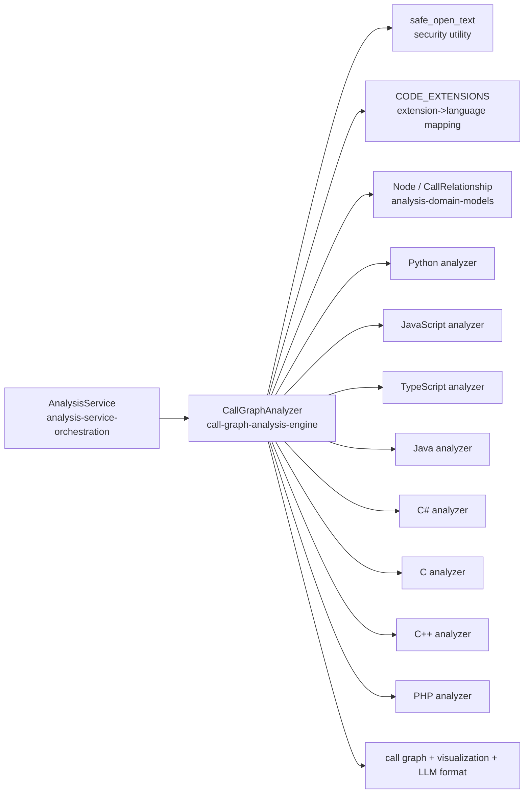
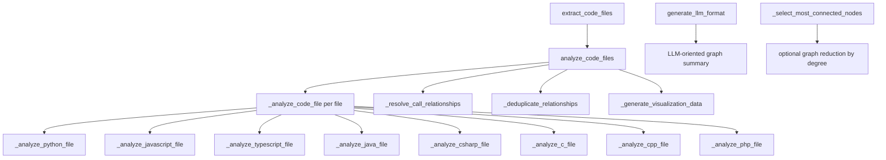
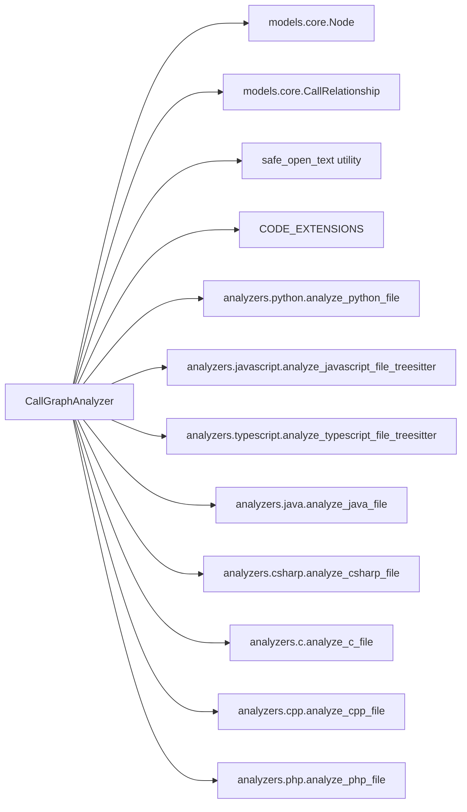
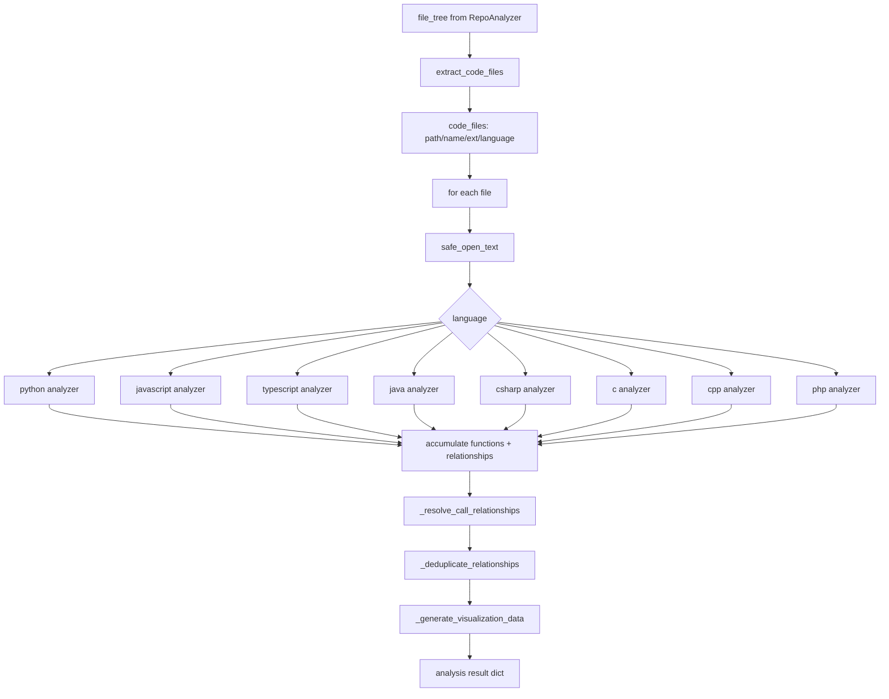
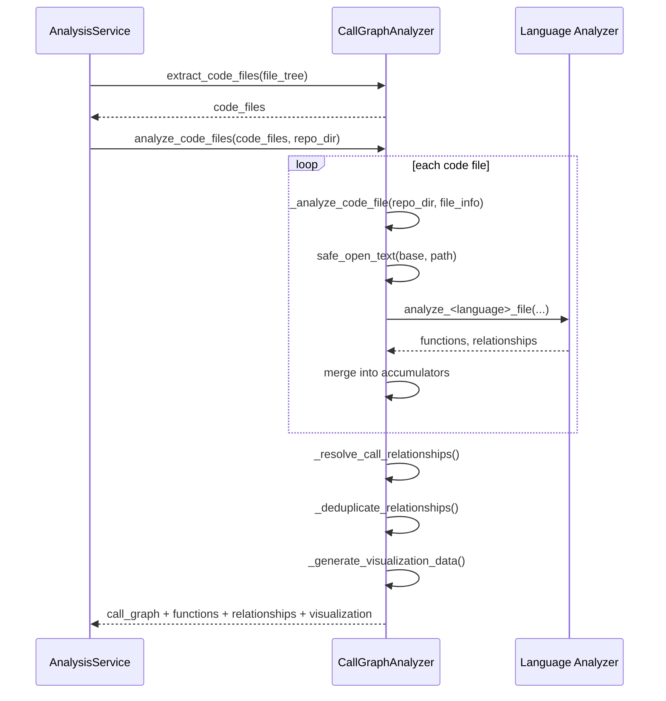
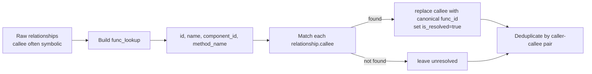
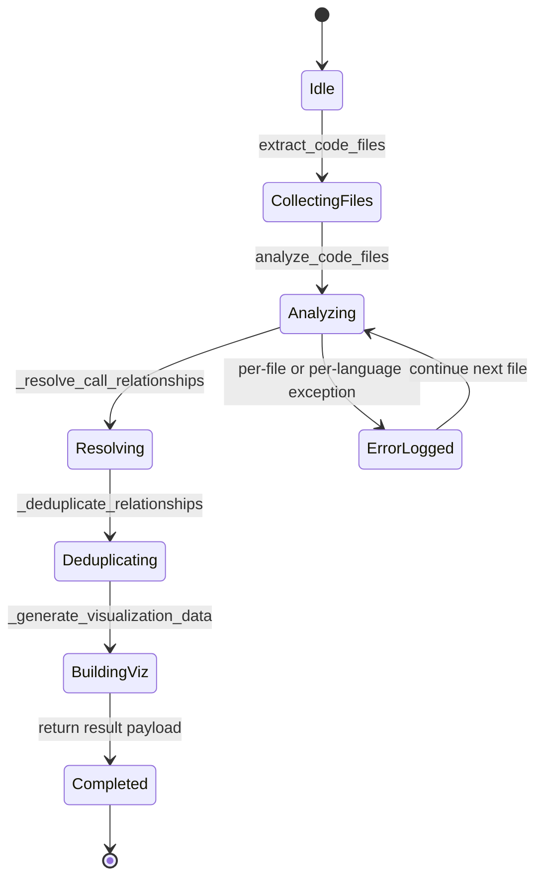
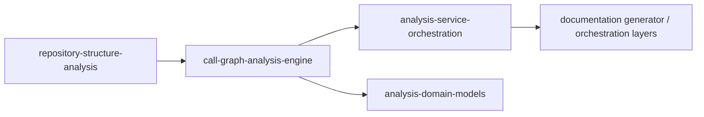

# call-graph-analysis-engine Module

## Introduction

The `call-graph-analysis-engine` module provides the core multi-language call graph extraction engine for the Dependency Analyzer subsystem.
Its central component, `CallGraphAnalyzer`, scans repository source files, delegates AST parsing to language-specific analyzers, resolves call targets, deduplicates edges, and produces both machine-oriented and visualization-ready graph outputs.

In short: this module converts a repository file tree into a normalized function-level call graph.

---

## Core Component

### `CallGraphAnalyzer`

`CallGraphAnalyzer` is a stateful analysis engine with two in-memory accumulators:

- `functions: Dict[str, Node]` — discovered callable nodes keyed by canonical function ID.
- `call_relationships: List[CallRelationship]` — caller→callee relationships (resolved and unresolved during intermediate phases).

It is responsible for:

1. Extracting analyzable code files from repository tree metadata.
2. Dispatching each file to the correct language analyzer.
3. Consolidating discovered `Node` and `CallRelationship` objects.
4. Resolving symbolic call names to concrete node IDs.
5. Deduplicating graph edges.
6. Exporting graph payloads for API/LLM/visualization consumers.

---

## Architectural Position

`CallGraphAnalyzer` does **not** perform repository cloning or tree traversal policy enforcement itself; those concerns are handled upstream by [analysis-service-orchestration.md](analysis-service-orchestration.md) and [repository-structure-analysis.md](repository-structure-analysis.md).

---

## Internal Method Architecture

---

## Dependency Map

### Key dependency behavior

- **Security-aware file read**: file content is loaded through `safe_open_text(...)`, which enforces safe path checks and no-follow symlink semantics.
- **Lazy imports for analyzers**: per-language analyzer imports occur inside each handler method, keeping initialization lightweight and deferring language dependency loading until needed.
- **Domain model output**: all outputs normalize around `Node` and `CallRelationship` model dumps for downstream compatibility.

---

## End-to-End Data Flow

---

## Component Interaction (Runtime Sequence)

---

## Public/Operational API

### `extract_code_files(file_tree) -> List[Dict]`

Traverses nested tree nodes and extracts files that match supported extensions.
Each extracted record includes:

- `path`
- `name`
- `extension`
- `language` (from extension mapping)

### `analyze_code_files(code_files, base_dir) -> Dict`

Main orchestration method. Performs full analysis pass and returns:

- `call_graph` summary:
  - `total_functions`
  - `total_calls`
  - `languages_found`
  - `files_analyzed`
  - `analysis_approach = "complete_unlimited"`
- `functions` (serialized `Node` list)
- `relationships` (serialized `CallRelationship` list)
- `visualization` (Cytoscape-compatible elements + graph summary)

### `generate_llm_format() -> Dict`

Returns compact LLM-oriented projection:

- function catalog (purpose, params, recursion hint)
- adjacency-style `calls` and `called_by` index

> Note: this method expects `analyze_code_files` (or equivalent population) to run first.

---

## Relationship Resolution and Graph Normalization

Resolution strategy supports multiple naming patterns:

- exact function ID,
- plain function/method name,
- full component ID,
- dotted call fallback (`A.B.method` → `method`).

After resolution, deduplication removes duplicate edges using `(caller, callee)` as the uniqueness key.

---

## Visualization Contract

`_generate_visualization_data()` creates Cytoscape.js-compatible output:

- **Node elements** include ID, label, file, type, and inferred language.
- **Edge elements** include source, target, and call line.
- Only **resolved relationships** are emitted as edges.
- Summary includes:
  - `total_nodes`
  - `total_edges`
  - `unresolved_calls`

Language-specific CSS classes are added for styling (`lang-python`, `lang-javascript`, etc.), with function/method classes (`node-function`, `node-method`).

---

## Process Flow (State View)

This design favors **best-effort analysis**: failures in one file/language are logged, while analysis continues for the remaining files.

---

## Behavioral Notes and Implementation Nuances

- **State reset per run**: `analyze_code_files` clears `self.functions` and `self.call_relationships` at start, so one instance is reusable across runs without cross-contamination.
- **Canonicalization policy**: function IDs default to analyzer-provided `func.id`; fallback is `"<file_path>:<func.name>"`.
- **Resolution is heuristic**: name-based matching can resolve ambiguous method names to a single target when multiple candidates share names.
- **Dedup granularity**: dedup ignores line numbers, so repeated calls from same caller to same callee collapse into one edge.
- **Language class coverage mismatch**: visualization classes include explicit handling for `.py/.js/.ts/.c/.cpp/.php`; Java/C# styling classes are not explicitly assigned in this method (though analysis support exists).
- **Graph reduction utility**: `_select_most_connected_nodes(...)` exists for centrality-based pruning but is not currently invoked in the default pipeline.

---

## How This Module Fits Into the Overall System

`call-graph-analysis-engine` is the execution core that transforms repository source code into callable dependency structure.

- Upstream: [analysis-service-orchestration.md](analysis-service-orchestration.md) provides repository lifecycle orchestration and decides when call-graph analysis runs.
- Side dependency: [repository-structure-analysis.md](repository-structure-analysis.md) provides file-tree input consumed by `extract_code_files`.
- Downstream: [analysis-domain-models.md](analysis-domain-models.md) define the schema consumed by documentation, planning, and UI layers.

---

## Related Modules

For deeper details outside this module boundary:

- [analysis-service-orchestration.md](analysis-service-orchestration.md)
- [repository-structure-analysis.md](repository-structure-analysis.md)
- [analysis-domain-models.md](analysis-domain-models.md)
- [dependency-parser-and-component-projection.md](dependency-parser-and-component-projection.md)
- [dependency-graph-build-and-leaf-selection.md](dependency-graph-build-and-leaf-selection.md)
- [logging-and-console-formatting.md](logging-and-console-formatting.md)
