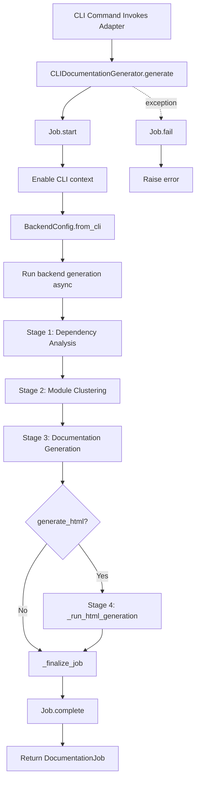
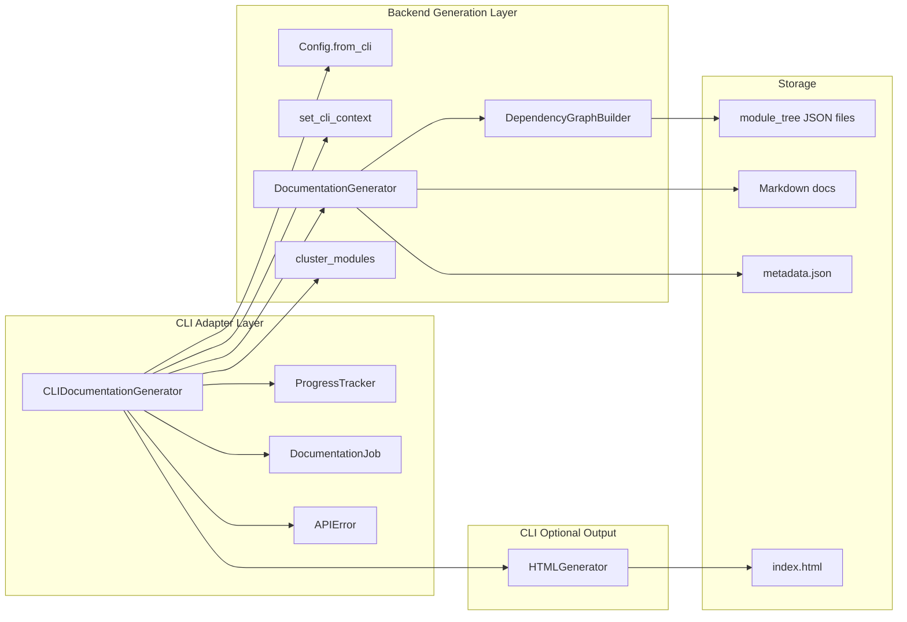
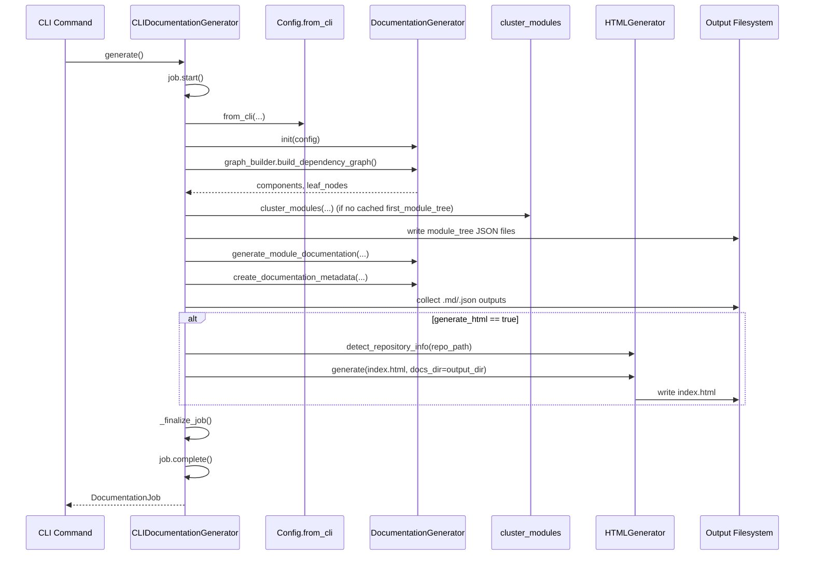
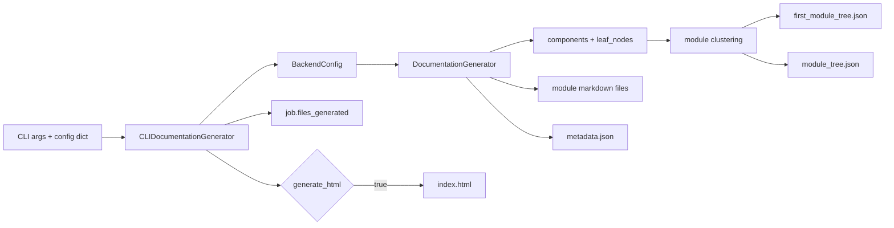

# cli-adapter-generation Module

## Introduction

The `cli-adapter-generation` module provides the CLI-facing orchestration layer for documentation generation. Its core component, `CLIDocumentationGenerator`, adapts backend generation capabilities for terminal usage by adding:

- staged progress reporting,
- CLI-oriented logging behavior,
- job lifecycle/status tracking,
- backend configuration bridging,
- optional HTML viewer generation.

In short: it is the **execution adapter** between CLI commands and backend documentation services.

---

## Core Component

- **`codewiki.cli.adapters.doc_generator.CLIDocumentationGenerator`**

This class wraps backend `DocumentationGenerator` and drives a complete run from dependency analysis to (optional) HTML output.

---

## Responsibilities and Scope

### In scope

1. Convert CLI inputs into backend `Config` (`Config.from_cli(...)`).
2. Initialize and update `DocumentationJob` metadata/status.
3. Configure backend logger output for CLI verbosity modes.
4. Execute staged pipeline:
   - Dependency analysis
   - Module clustering
   - Documentation generation
   - Optional HTML generation
   - Finalization
5. Normalize failures into CLI-layer `APIError` where stage-specific wrapping is used.

### Out of scope (delegated)

- Detailed configuration persistence and credential management → see [configuration-and-credentials.md](configuration-and-credentials.md)
- Git repository operations and metadata extraction in CLI flows → see [git-operations.md](git-operations.md)
- HTML rendering internals/template behavior → see [html-viewer-generation.md](html-viewer-generation.md)
- Progress/logging subsystem internals → see [cli-observability.md](cli-observability.md)
- Core documentation/LLM orchestration logic → see [documentation-generator.md](documentation-generator.md)
- Dependency graph construction internals → see [dependency-analyzer.md](dependency-analyzer.md)

---

## Constructor and Runtime State

`CLIDocumentationGenerator(repo_path, output_dir, config, verbose=False, generate_html=False)` initializes:

- path context (`repo_path`, `output_dir`),
- raw CLI LLM config dictionary,
- verbosity and HTML toggle,
- `ProgressTracker(total_stages=5, verbose=verbose)`,
- `DocumentationJob` with repository/output/LLM metadata.

It also immediately calls `_configure_backend_logging()` to align backend logging with CLI output expectations.

### Job metadata seeded at init

- `job.repository_path`
- `job.repository_name`
- `job.output_directory`
- `job.llm_config = LLMConfig(main_model, cluster_model, base_url)`

---

## High-Level Execution Flow

---

## Internal Architecture

---

## Stage-by-Stage Behavior

## Stage 1 — Dependency Analysis

In `_run_backend_generation(...)`:

1. Starts progress stage 1.
2. Instantiates backend `DocumentationGenerator(backend_config)`.
3. Calls `doc_generator.graph_builder.build_dependency_graph()`.
4. Updates job stats:
   - `statistics.total_files_analyzed = len(components)`
   - `statistics.leaf_nodes = len(leaf_nodes)`
5. Wraps stage failures as `APIError("Dependency analysis failed: ...")`.

Outputs:

- in-memory `components`
- in-memory `leaf_nodes`

## Stage 2 — Module Clustering

1. Starts progress stage 2.
2. Ensures output dir exists.
3. Reads/writes:
   - `first_module_tree.json` (seed/cached tree)
   - `module_tree.json` (active tree)
4. If `first_module_tree.json` exists, reuses it; otherwise runs `cluster_modules(...)`.
5. Sets `job.module_count = len(module_tree)`.
6. Wraps failures as `APIError("Module clustering failed: ...")`.

Outputs:

- persisted module tree files
- updated module count

## Stage 3 — Documentation Generation

1. Starts progress stage 3.
2. Calls `await doc_generator.generate_module_documentation(components, leaf_nodes)`.
3. Calls `doc_generator.create_documentation_metadata(...)`.
4. Scans output directory and records generated `.md` / `.json` files to `job.files_generated`.
5. Wraps failures as `APIError("Documentation generation failed: ...")`.

Outputs:

- module markdown files
- overview docs
- metadata JSON
- updated job generated-file list

## Stage 4 — Optional HTML Generation

Executed only when `generate_html=True`:

1. Starts progress stage 4.
2. Uses `HTMLGenerator.detect_repository_info(repo_path)`.
3. Generates `index.html` via `HTMLGenerator.generate(...)` with `docs_dir=output_dir` for module tree/metadata auto-loading.
4. Appends `index.html` to `job.files_generated`.

## Stage 5 — Finalization

`_finalize_job()` verifies `metadata.json` exists. If missing, writes `DocumentationJob.to_json()` to `metadata.json` as fallback.

> Note: the adapter conceptually includes stage 5 (matching `ProgressTracker` stage model), but does not call `start_stage(5, ...)`/`complete_stage()` explicitly in current implementation.

---

## Key Interactions (Sequence)

---

## Dependency Map

```mermaid
graph TD
    A[CLIDocumentationGenerator]

    A --> B[codewiki.cli.models.job.DocumentationJob]
    A --> C[codewiki.cli.models.job.LLMConfig]
    A --> D[codewiki.cli.utils.progress.ProgressTracker]
    A --> E[codewiki.cli.utils.errors.APIError]

    A --> F[codewiki.src.config.Config.from_cli]
    A --> G[codewiki.src.config.set_cli_context]
    A --> H[codewiki.src.be.documentation_generator.DocumentationGenerator]
    A --> I[codewiki.src.be.cluster_modules.cluster_modules]
    A --> J[codewiki.src.be.dependency_analyzer.utils.logging_config.ColoredFormatter]
    A --> K[codewiki.cli.html_generator.HTMLGenerator]
```

---

## Configuration Bridging Details

The adapter accepts a plain dict (`config`) and maps to backend strongly-typed config fields:

- endpoint/credentials: `base_url`, `api_key`
- models: `main_model`, `cluster_model`, `fallback_model`
- token controls: `max_tokens`, `max_token_per_module`, `max_token_per_leaf_module`
- decomposition: `max_depth`
- localization: `output_language`
- prompt customization: `agent_instructions`

This mapping is done through `BackendConfig.from_cli(...)`, which also sets backend dirs (`output_dir/temp`, dependency graph dir, docs dir).

---

## Logging and Observability Behavior

`_configure_backend_logging()` targets logger namespace `codewiki.src.be` and replaces handlers to avoid duplicates.

- **Verbose mode (`verbose=True`)**
  - Backend logger level: `INFO`
  - Stream: `stdout`
  - Formatter: `ColoredFormatter`

- **Non-verbose mode (`verbose=False`)**
  - Backend logger level: `WARNING`
  - Stream: `stderr`
  - Formatter: `ColoredFormatter`

Propagation to root is disabled (`propagate = False`) to prevent duplicate lines.

For deeper observability contracts, see [cli-observability.md](cli-observability.md).

---

## Data Flow and Artifacts

Main output set (typical):

- `module_tree.json`
- `first_module_tree.json`
- `*.md` module docs and overview
- `metadata.json`
- optionally `index.html`

---

## Error Semantics

- Stage-specific backend exceptions are wrapped into `APIError` with contextual prefixes:
  - dependency analysis failed
  - module clustering failed
  - documentation generation failed
- Top-level `generate()` marks job failed for both `APIError` and generic `Exception`, then re-raises.

This ensures callers can inspect both raised exception and persisted `DocumentationJob.status/error_message`.

---

## How This Module Fits in the System

Within the **CLI Interface** domain, this module is the execution hub that coordinates multiple sibling modules:

- reads runtime options established by configuration flows ([configuration-and-credentials.md](configuration-and-credentials.md)),
- invokes backend generation pipeline ([documentation-generator.md](documentation-generator.md), [dependency-analyzer.md](dependency-analyzer.md)),
- optionally renders static viewer ([html-viewer-generation.md](html-viewer-generation.md)),
- surfaces progress and status for operators ([cli-observability.md](cli-observability.md)).

It does **not** replace backend orchestration; it adapts it for reliable CLI UX and job reporting.

---

## Practical Notes for Maintainers

1. **Event loop usage**: `asyncio.run(...)` is used directly in `generate()`. Avoid calling `generate()` from an already-running loop context without adaptation.
2. **Progress model mismatch**: tracker defines 5 stages; current code emits 4 explicit stages (1–4) and performs stage-5 logic without tracker events.
3. **Metadata fallback shape**: fallback metadata writes `DocumentationJob` JSON, which differs from backend `metadata.json` schema (`generation_info`/`statistics`/`files_generated`). Keep downstream consumers tolerant.
4. **Cache behavior**: presence of `first_module_tree.json` skips reclustering, which speeds reruns but may preserve stale grouping unless file is removed.

---

## Related Module Documentation

- [configuration-and-credentials.md](configuration-and-credentials.md)
- [git-operations.md](git-operations.md)
- [html-viewer-generation.md](html-viewer-generation.md)
- [cli-observability.md](cli-observability.md)
- [documentation-generator.md](documentation-generator.md)
- [dependency-analyzer.md](dependency-analyzer.md)
- [agent-orchestration.md](agent-orchestration.md)
