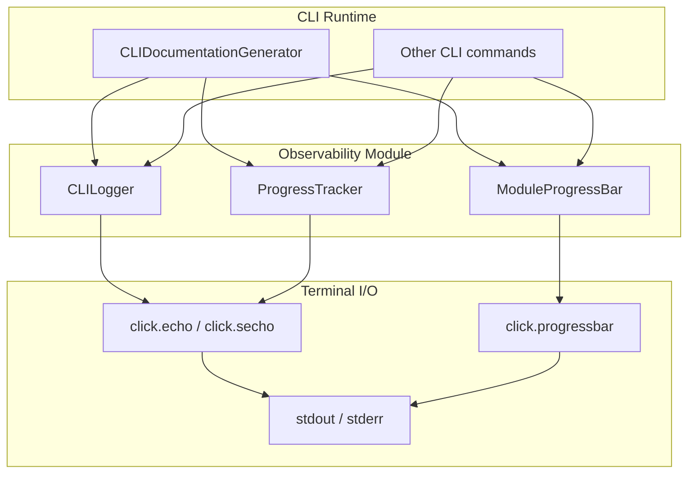
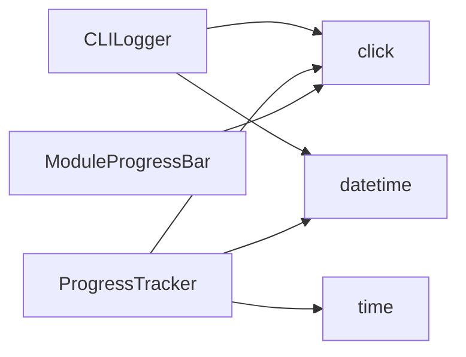
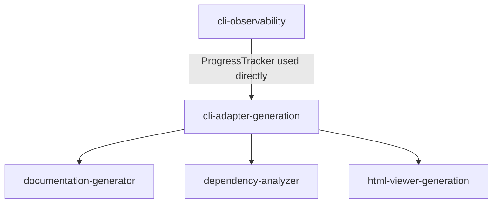
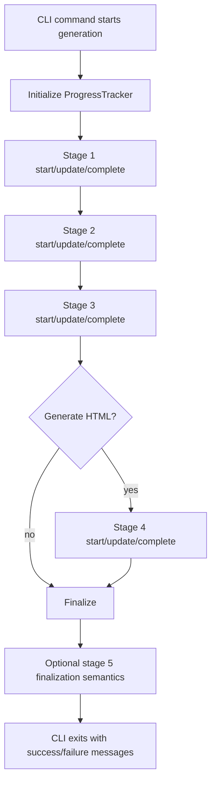
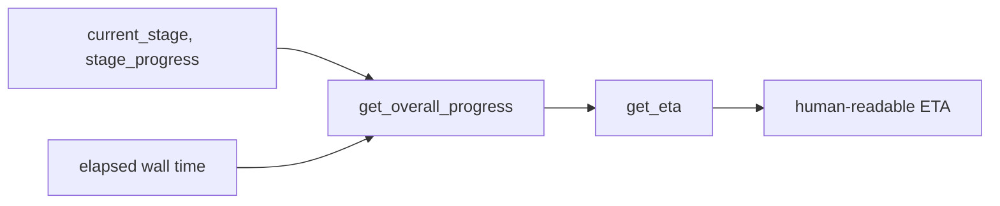
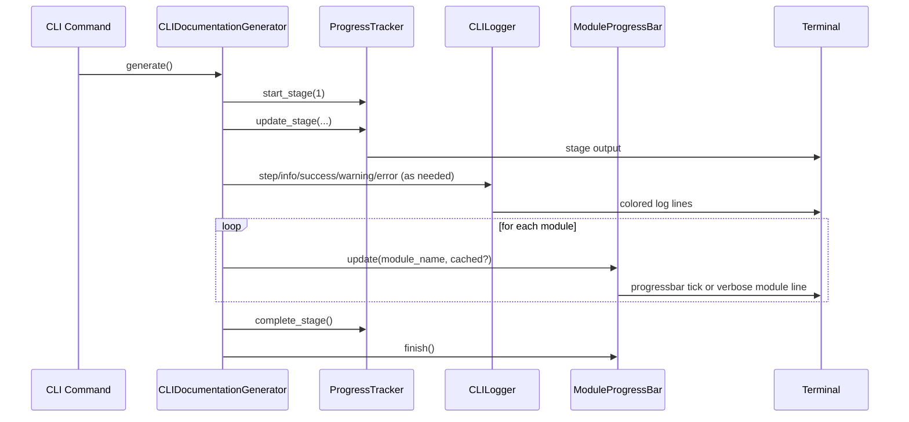
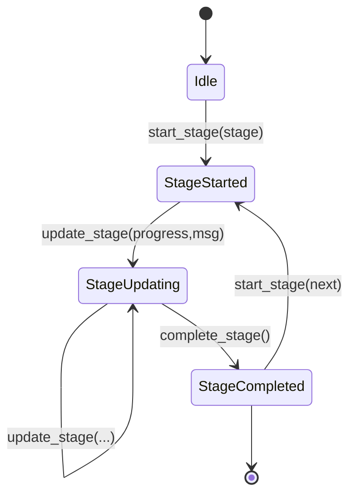
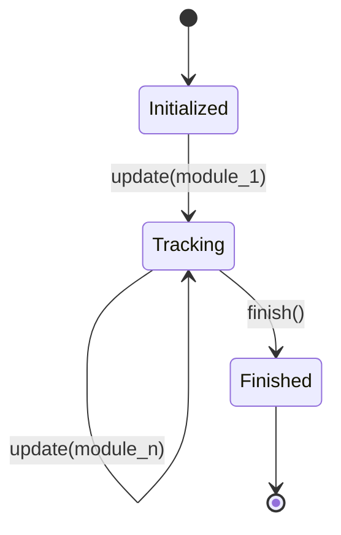
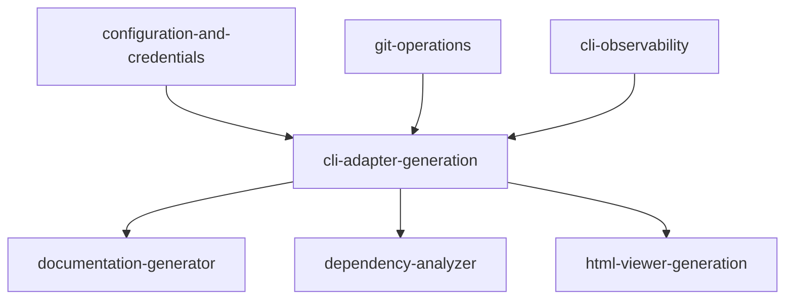

# cli-observability Module

## Introduction

The `cli-observability` module provides the terminal-facing observability primitives for the CodeWiki CLI pipeline.

It focuses on **operator feedback** rather than business logic: colored log output, phase-level progress tracking, and module-by-module progress visualization.

Core components:

- `codewiki.cli.utils.logging.CLILogger`
- `codewiki.cli.utils.progress.ProgressTracker`
- `codewiki.cli.utils.progress.ModuleProgressBar`

In practice, this module is consumed by execution modules such as [cli-adapter-generation.md](cli-adapter-generation.md) to make long-running generation tasks understandable and debuggable in interactive CLI sessions.

---

## Scope and Responsibilities

### In scope

1. Human-readable log messaging with severity styles (`debug`, `info`, `success`, `warning`, `error`, `step`).
2. Phase-oriented progress instrumentation with weighted overall-progress + ETA estimation.
3. Compact module iteration progress bar for non-verbose mode.
4. Verbose-mode detailed progress traces (timestamped updates and per-module status lines).

### Out of scope

- Running documentation generation itself (see [cli-adapter-generation.md](cli-adapter-generation.md) and [documentation-generator.md](documentation-generator.md)).
- CLI config persistence and credential lifecycle (see [configuration-and-credentials.md](configuration-and-credentials.md)).
- HTML output generation (see [html-viewer-generation.md](html-viewer-generation.md)).

---

## Architecture Overview

### Design intent

- `CLILogger` handles **semantic messages** (what happened, severity, elapsed duration).
- `ProgressTracker` handles **pipeline-stage state** (where we are in a multi-phase run).
- `ModuleProgressBar` handles **high-volume repetitive units** (N modules processed).

Together they separate *message semantics* from *progress mechanics*.

---

## Component Documentation

## 1) `CLILogger`

`CLILogger` is a lightweight wrapper around Click output primitives with optional verbose-only debug messaging.

### Public API and behavior

- `debug(message)`
  - Printed only when `verbose=True`.
  - Includes `HH:MM:SS` timestamp, cyan + dim styling.
- `info(message)`
  - Plain `click.echo` output.
- `success(message)`
  - Green message with `✓` prefix.
- `warning(message)`
  - Yellow message with warning symbol.
- `error(message)`
  - Red message with `✗` prefix, emitted to stderr (`err=True`).
- `step(message, step=None, total=None)`
  - Blue bold step heading.
  - Uses `[step/total]` prefix when counters are provided, else `→`.
- `elapsed_time()`
  - Human-readable time since logger initialization (`Xs` or `Xm Ys`).

### Constructor state

- `verbose: bool`
- `start_time: datetime`

### Factory

- `create_logger(verbose=False)` returns configured `CLILogger`.

---

## 2) `ProgressTracker`

`ProgressTracker` models CLI generation as a weighted stage pipeline and provides elapsed-time formatting plus ETA estimation.

### Built-in stage model

`ProgressTracker` encodes five canonical phases:

1. Dependency Analysis — 40%
2. Module Clustering — 20%
3. Documentation Generation — 30%
4. HTML Generation — 5% (optional)
5. Finalization — 5%

These are represented by:

- `STAGE_WEIGHTS: Dict[int, float]`
- `STAGE_NAMES: Dict[int, str]`

### Public API

- `start_stage(stage, description=None)`
  - Resets per-stage progress to 0.
  - Prints stage header (`[stage/total] ...`) and verbose elapsed prefix when enabled.
- `update_stage(progress, message=None)`
  - Clamps progress to `[0.0, 1.0]`.
  - In verbose mode, emits timestamped update messages.
- `complete_stage(message=None)`
  - Marks stage progress as complete (`1.0`).
  - In verbose mode, prints stage completion line and stage duration.
- `get_overall_progress()`
  - Computes weighted aggregate progress across completed + current stage.
- `get_eta()`
  - Estimates remaining time from elapsed/progress ratio.
  - Returns `None` when no progress exists.

### Internal timing state

- `start_time`
- `current_stage_start`
- `current_stage`
- `stage_progress`

---

## 3) `ModuleProgressBar`

`ModuleProgressBar` tracks document generation progress over a known count of modules.

### Mode behavior

- **Non-verbose mode**
  - Creates a `click.progressbar` with ETA and percent.
  - Updates are visual, compact, and low-noise.
- **Verbose mode**
  - Does not open click progressbar.
  - Emits explicit per-module lines, e.g. `[...] module_name... ✓ (cached)`.

### Public API

- `update(module_name, cached=False)`
  - Increments internal module count.
  - Displays cache/generating status in verbose mode.
- `finish()`
  - Closes open click progressbar context safely.

---

## Dependencies

### Cross-module consumers

Current direct integration shown in core code: `CLIDocumentationGenerator` instantiates `ProgressTracker(total_stages=5, verbose=verbose)` and drives stage transitions around backend orchestration.

---

## Data and Control Flow

### Progress math flow

---

## Component Interaction Sequence

---

## Verbose vs Non-Verbose Observability Contract

| Concern | Verbose (`True`) | Non-verbose (`False`) |
|---|---|---|
| `CLILogger.debug` | Printed with timestamp | Suppressed |
| `ProgressTracker.start_stage` | Includes elapsed time prefix | Compact stage line |
| `ProgressTracker.update_stage` | Emits messages | Silent unless stage starts/completes |
| `ProgressTracker.complete_stage` | Prints stage duration | Silent |
| `ModuleProgressBar` | Per-module text lines | Rendered click progress bar |

This contract allows the same pipeline to support both:

- **quiet operator mode** (minimal noise, strong progress signal), and
- **diagnostic mode** (fine-grained timing and event trace).

---

## Process Flows

### A. Stage lifecycle process

### B. Module progress process

---

## Error Handling and Edge Cases

- `ProgressTracker.update_stage()` clamps progress inputs, preventing invalid percentage drift.
- `ProgressTracker.get_eta()` returns `None` when progress is 0 to avoid divide-by-zero semantics.
- `ProgressTracker.get_eta()` returns `< 1 min` for negative remainder edge cases.
- `ModuleProgressBar.finish()` is idempotent-friendly in practice (`self.bar` checked before exit).
- `CLILogger.error()` routes to stderr to separate failures from standard output streams.

---

## Integration Notes for Maintainers

1. **Progress stage alignment matters**
   - The tracker defines five stages. Upstream callers should emit all intended stages consistently.
   - In current adapter behavior, stage-5 finalization logic exists conceptually; ensure tracker events remain synchronized with real pipeline semantics.

2. **Avoid mixed progress surfaces**
   - If using `ModuleProgressBar`, avoid redundant per-item logging in non-verbose mode to prevent noisy UX.

3. **Prefer one observability abstraction per concern**
   - Use `CLILogger` for semantic messages.
   - Use `ProgressTracker` for phase lifecycle.
   - Use `ModuleProgressBar` for repeated item loops.

4. **Click dependency is central**
   - Styling, stderr routing, and progressbar behavior all rely on `click`; terminal behavior may vary by environment.

---

## How This Module Fits in the Overall System

`cli-observability` is a horizontal utility module in the CLI Interface layer.

It does not own domain decisions, but it is critical for operational clarity during long-running LLM-assisted generation.

In short:

- upstream modules decide **what to run**,
- backend modules execute **core analysis/generation**,
- this module communicates **what is happening right now** to the CLI operator.

---

## Related Module Documentation

- [cli-adapter-generation.md](cli-adapter-generation.md)
- [configuration-and-credentials.md](configuration-and-credentials.md)
- [git-operations.md](git-operations.md)
- [html-viewer-generation.md](html-viewer-generation.md)
- [documentation-generator.md](documentation-generator.md)
- [dependency-analyzer.md](dependency-analyzer.md)
