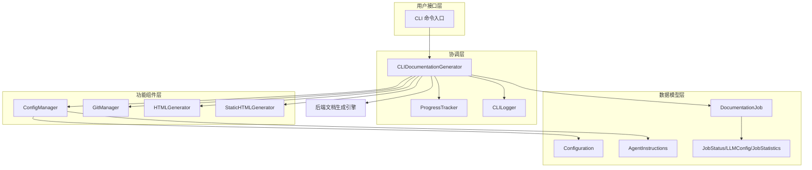
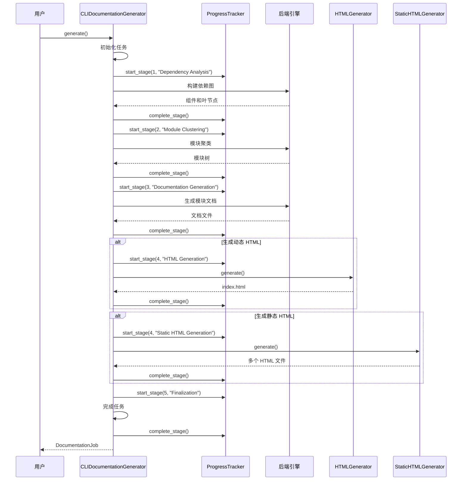

# CLI Documentation Workflow Module

## 1. 模块概述

CLI Documentation Workflow 模块是 CodeWiki 系统的命令行接口层，负责将后端文档生成引擎与用户交互连接起来。该模块提供了完整的命令行工具功能，包括配置管理、Git 仓库操作、文档生成流程协调、进度跟踪以及 HTML 静态站点生成等核心功能。

### 1.1 设计理念

本模块采用适配器模式设计，将后端复杂的文档生成逻辑封装为简洁的 CLI 命令。它通过以下核心设计原则实现：

- **关注点分离**：将配置管理、Git 操作、文档生成、HTML 渲染等功能划分为独立组件
- **渐进式披露**：通过进度跟踪器和日志系统向用户逐步展示生成过程
- **安全优先**：使用系统密钥环安全存储 API 密钥，避免明文保存
- **可扩展性**：通过数据模型和配置系统支持灵活的自定义选项

### 1.2 解决的核心问题

1. **配置管理复杂性**：提供统一的配置管理机制，支持持久化存储和安全凭证管理
2. **生成流程可视化**：通过多阶段进度跟踪，让用户了解文档生成的实时状态
3. **Git 工作流集成**：自动创建文档分支、提交更改，简化文档版本管理
4. **多格式输出**：支持 Markdown、动态 HTML 查看器和完全预渲染的静态 HTML 网站

## 2. 系统架构

CLI Documentation Workflow 模块采用分层架构设计，从用户接口到后端服务形成完整的处理流水线。



### 2.1 架构组件说明

#### 协调层
- **CLIDocumentationGenerator**：整个 CLI 工作流的核心协调器，负责编排文档生成的全流程
- **ProgressTracker**：多阶段进度跟踪器，提供阶段权重计算和 ETA 预估
- **CLILogger**：彩色日志输出器，支持详细和简洁两种模式

#### 功能组件层
- **ConfigManager**：配置管理器，处理用户设置的持久化和 API 密钥的安全存储
- **GitManager**：Git 仓库操作管理器，处理分支创建、提交和远程仓库检测
- **HTMLGenerator**：动态 HTML 查看器生成器，创建单页应用式的文档浏览器
- **StaticHTMLGenerator**：静态 HTML 预渲染器，为每个 Markdown 文件生成独立的 HTML 页面

#### 数据模型层
- **Configuration**：主配置数据模型，包含 LLM 设置、输出选项等
- **AgentInstructions**：代理指令模型，支持自定义文档生成行为
- **DocumentationJob**：文档生成任务模型，跟踪任务状态和结果
- **JobStatus/LLMConfig/JobStatistics**：支持任务管理的辅助数据模型

## 3. 核心功能模块

### 3.1 文档生成协调器

`CLIDocumentationGenerator` 是整个 CLI 工作流的核心组件，它封装了后端文档生成引擎并添加了 CLI 特有的功能。

#### 主要职责：
- 初始化和配置后端文档生成器
- 管理五阶段生成流程（依赖分析、模块聚类、文档生成、HTML 生成、完成）
- 跟踪生成进度并提供用户反馈
- 处理错误和异常情况
- 协调可选的 HTML 生成步骤

#### 关键流程：


### 3.2 配置管理系统

`ConfigManager` 负责管理 CodeWiki 的配置，包括安全存储 API 密钥和持久化用户设置。

#### 核心特性：
- 使用系统密钥环（Keychain、Credential Manager、Secret Service）安全存储 API 密钥
- 配置文件存储在 `~/.codewiki/config.json`
- 支持配置的验证、迁移和合并
- 运行时指令与持久化设置的智能合并

#### 配置数据模型：
- `Configuration`：主配置模型，包含 LLM 端点、模型选择、令牌限制等
- `AgentInstructions`：自定义代理指令，支持文件过滤、模块聚焦、文档类型定制等

### 3.3 Git 仓库管理

`GitManager` 提供了与 Git 仓库交互的功能，简化文档版本管理。

#### 主要功能：
- 检查工作目录状态
- 创建带时间戳的文档分支
- 提交生成的文档
- 检测远程仓库和生成 PR 链接
- 获取当前分支和提交信息

### 3.4 HTML 生成器

提供两种 HTML 生成方式以适应不同场景：

#### 3.4.1 动态 HTML 查看器
`HTMLGenerator` 创建单页应用式的文档查看器：
- 客户端 Markdown 渲染
- 交互式模块树导航
- 深色/浅色主题切换
- 响应式设计

#### 3.4.2 静态 HTML 预渲染
`StaticHTMLGenerator` 生成完全预渲染的静态网站：
- 每个 Markdown 文件对应一个 HTML 文件
- 内联侧边栏导航
- 所有链接预转换为 HTML 链接
- 无运行时 Markdown 渲染依赖

### 3.5 进度跟踪系统

#### 3.5.1 多阶段进度跟踪器
`ProgressTracker` 管理五阶段生成流程：
1. 依赖分析（40%）
2. 模块聚类（20%）
3. 文档生成（30%）
4. HTML 生成（5%，可选）
5. 完成（5%）

特性包括阶段权重计算、ETA 预估、详细日志记录。

#### 3.5.2 模块级进度条
`ModuleProgressBar` 提供细粒度的模块生成进度显示，支持缓存命中指示。

### 3.6 日志系统

`CLILogger` 提供彩色格式化的 CLI 日志输出：
- 详细模式（verbose）：显示时间戳和调试信息
- 正常模式：简洁的进度更新
- 支持多种日志级别（debug、info、success、warning、error）

## 4. 数据模型

### 4.1 配置模型

#### Configuration
主配置数据模型，包含以下字段：
- `base_url`：LLM API 基础 URL
- `main_model`：主要文档生成模型
- `cluster_model`：模块聚类模型
- `fallback_model`：备用模型
- `default_output`：默认输出目录
- `max_tokens`：LLM 响应最大令牌数
- `max_token_per_module`：每个模块的最大令牌数
- `max_token_per_leaf_module`：每个叶模块的最大令牌数
- `max_depth`：层次分解的最大深度
- `max_concurrent`：最大并发数
- `output_language`：输出语言
- `agent_instructions`：自定义代理指令

#### AgentInstructions
代理指令模型，支持自定义文档生成行为：
- `include_patterns`：包含的文件模式
- `exclude_patterns`：排除的文件/目录模式
- `focus_modules`：重点关注的模块
- `doc_type`：文档类型（api、architecture、user-guide、developer）
- `custom_instructions`：自定义指令

### 4.2 任务模型

#### DocumentationJob
代表整个文档生成任务：
- `job_id`：唯一任务标识符
- `repository_path`：仓库绝对路径
- `repository_name`：仓库名称
- `output_directory`：输出目录路径
- `commit_hash`：Git 提交 SHA
- `branch_name`：Git 分支名称
- `timestamp_start`：任务开始时间
- `timestamp_end`：任务结束时间
- `status`：当前任务状态
- `error_message`：错误信息
- `files_generated`：生成的文件列表
- `module_count`：文档化的模块数量
- `generation_options`：生成选项
- `llm_config`：LLM 配置
- `statistics`：任务统计信息

#### 支持模型
- `JobStatus`：任务状态枚举（pending、running、completed、failed）
- `GenerationOptions`：生成选项（创建分支、GitHub Pages、无缓存、自定义输出）
- `JobStatistics`：任务统计（分析文件数、叶节点数、最大深度、总令牌使用量）
- `LLMConfig`：LLM 配置（主模型、聚类模型、基础 URL）

## 5. 使用指南

### 5.1 基本使用流程

1. **配置设置**
   ```python
   from codewiki.cli.config_manager import ConfigManager
   
   config_manager = ConfigManager()
   config_manager.save(
       api_key="your-api-key",
       base_url="https://api.example.com",
       main_model="gpt-4",
       cluster_model="gpt-3.5-turbo"
   )
   ```

2. **文档生成**
   ```python
   from pathlib import Path
   from codewiki.cli.adapters.doc_generator import CLIDocumentationGenerator
   
   generator = CLIDocumentationGenerator(
       repo_path=Path("/path/to/repo"),
       output_dir=Path("/path/to/output"),
       config=config,
       verbose=True,
       generate_html=True
   )
   job = generator.generate()
   ```

3. **Git 集成**
   ```python
   from codewiki.cli.git_manager import GitManager
   
   git_manager = GitManager(Path("/path/to/repo"))
   branch_name = git_manager.create_documentation_branch()
   commit_hash = git_manager.commit_documentation(Path("/path/to/docs"))
   ```

### 5.2 配置选项

详细的配置选项和使用说明请参考配置管理相关文档。

### 5.3 HTML 生成选项

两种 HTML 生成方式的比较和使用场景请参考 HTML 生成器相关文档。

## 6. 与其他模块的关系

CLI Documentation Workflow 模块作为前端接口层，与以下模块紧密协作：

- **backend_documentation_orchestration**：提供核心文档生成引擎
- **dependency_analysis_engine**：执行依赖分析（通过后端间接使用）
- **web_application_frontend**：共享 HTML 模板和渲染逻辑

详细的模块间交互和依赖关系请参考各个相关模块的文档。

## 7. 扩展和定制

### 7.1 自定义代理指令

通过 `AgentInstructions` 可以高度自定义文档生成行为：

```python
from codewiki.cli.models.config import AgentInstructions

instructions = AgentInstructions(
    include_patterns=["*.py", "*.js"],
    exclude_patterns=["*test*", "*__pycache__*"],
    focus_modules=["src/core", "src/api"],
    doc_type="api",
    custom_instructions="Pay special attention to error handling code"
)
```

### 7.2 进度跟踪扩展

可以通过继承 `ProgressTracker` 来创建自定义的进度跟踪器：

```python
from codewiki.cli.utils.progress import ProgressTracker

class CustomProgressTracker(ProgressTracker):
    def update_stage(self, progress: float, message: str = None):
        # 自定义进度更新逻辑
        super().update_stage(progress, message)
        # 添加自定义行为
```

## 8. 注意事项和限制

1. **密钥环可用性**：在某些无头环境中，系统密钥环可能不可用，此时 API 密钥会保存在配置文件中
2. **Git 仓库要求**：Git 相关功能需要仓库已初始化并且有有效的远程配置
3. **HTML 生成选项**：动态 HTML 和静态 HTML 可以同时生成，但会增加处理时间
4. **并发限制**：`max_concurrent` 参数应根据 API 速率限制和系统资源合理设置
5. **令牌限制**：各种令牌限制参数会影响生成的文档质量和完整性，需要根据实际情况调整
