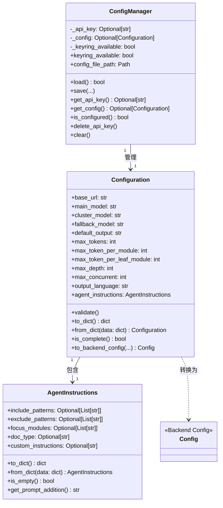
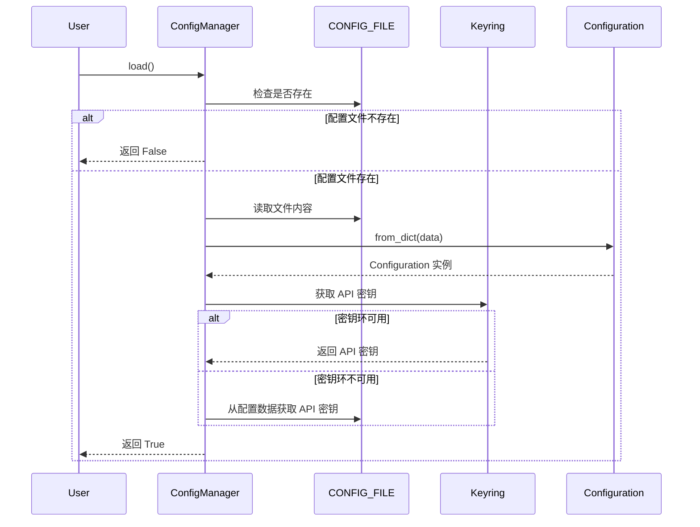
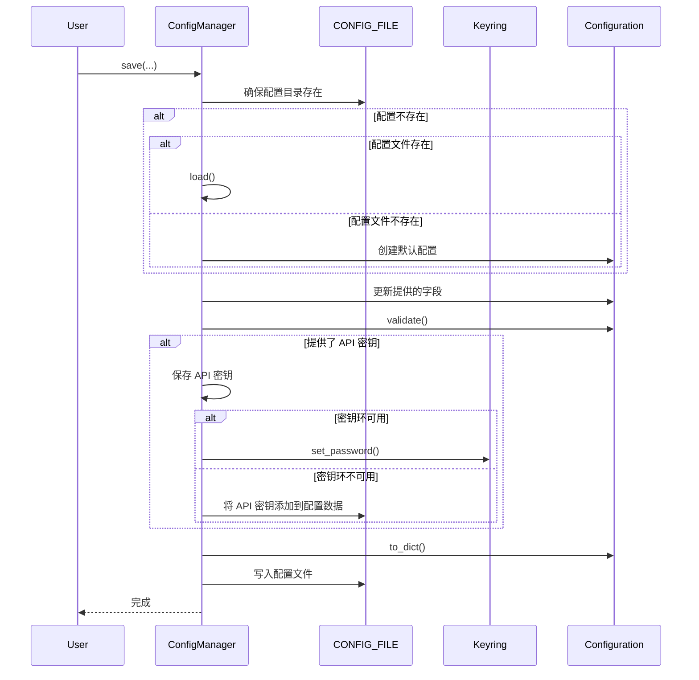

# 配置管理子模块 (config_manager_submodule)

## 概述

配置管理子模块是 CodeWiki CLI 工具的核心组件之一，负责管理用户配置的持久化存储和安全访问。该模块提供了一套完整的配置管理解决方案，包括配置文件的读写、API 密钥的安全存储、配置验证以及与后端系统的配置转换功能。

### 设计理念

本模块的设计遵循以下核心原则：

1. **安全性优先**：API 密钥等敏感信息优先存储在系统密钥环中，而非明文配置文件
2. **灵活性**：支持多种配置选项，满足不同用户的需求
3. **兼容性**：当系统密钥环不可用时，提供降级存储方案
4. **可扩展性**：配置模型设计支持未来功能的扩展

## 核心组件

### ConfigManager

`ConfigManager` 是配置管理的核心类，负责协调配置文件和密钥环的交互。

#### 主要功能

- 配置文件的加载与保存
- API 密钥的安全存储与检索
- 配置完整性检查
- 配置目录和文件的管理

#### 存储策略

配置信息分为两部分存储：

1. **敏感信息**（API 密钥）：存储在系统密钥环中
   - macOS: Keychain
   - Windows: Credential Manager
   - Linux: Secret Service
   
2. **非敏感配置**：存储在 `~/.codewiki/config.json` 文件中

#### 关键方法

##### `__init__()`

初始化配置管理器，设置内部状态并检查密钥环可用性。

```python
def __init__(self):
    """Initialize the configuration manager."""
    self._api_key: Optional[str] = None
    self._config: Optional[Configuration] = None
    self._keyring_available = self._check_keyring_available()
```

##### `load()`

从文件和密钥环加载配置。

**返回值**: `bool` - 配置是否存在且加载成功

**异常**: `ConfigurationError` - 当配置加载失败时抛出

```python
def load(self) -> bool:
    """
    Load configuration from file and keyring.
    
    Returns:
        True if configuration exists, False otherwise
    """
    # 实现省略...
```

##### `save()`

保存配置到文件和密钥环。

**参数**:
- `api_key`: API 密钥（存储在密钥环中）
- `base_url`: LLM API 基础 URL
- `main_model`: 主要模型
- `cluster_model`: 聚类模型
- `fallback_model`: 备用模型
- `default_output`: 默认输出目录
- `max_tokens`: LLM 响应的最大令牌数
- `max_token_per_module`: 每个模块用于聚类的最大令牌数
- `max_token_per_leaf_module`: 每个叶节点模块的最大令牌数
- `max_depth`: 层次分解的最大深度
- `max_concurrent`: 最大并发数
- `output_language`: 输出语言

**异常**: `ConfigurationError` - 当配置保存失败时抛出

##### `get_api_key()`

获取 API 密钥。

**返回值**: `Optional[str]` - API 密钥或 None（如果未设置）

##### `get_config()`

获取当前配置。

**返回值**: `Optional[Configuration]` - 配置对象或 None（如果未加载）

##### `is_configured()`

检查配置是否完整且有效。

**返回值**: `bool` - 配置是否完整

##### `delete_api_key()`

从密钥环中删除 API 密钥。

##### `clear()`

清除所有配置（文件和密钥环）。

#### 配置属性

- `keyring_available`: 检查密钥环是否可用
- `config_file_path`: 获取配置文件路径

### Configuration

`Configuration` 是配置数据模型，代表存储在配置文件中的持久化用户设置。

#### 主要属性

| 属性 | 类型 | 默认值 | 描述 |
|------|------|--------|------|
| `base_url` | `str` | - | LLM API 基础 URL |
| `main_model` | `str` | - | 文档生成的主要模型 |
| `cluster_model` | `str` | - | 模块聚类模型 |
| `fallback_model` | `str` | `"glm-4p5"` | 文档生成的备用模型 |
| `default_output` | `str` | `"docs"` | 默认输出目录 |
| `max_tokens` | `int` | `32768` | LLM 响应的最大令牌数 |
| `max_token_per_module` | `int` | `36369` | 每个模块用于聚类的最大令牌数 |
| `max_token_per_leaf_module` | `int` | `16000` | 每个叶节点模块的最大令牌数 |
| `max_depth` | `int` | `2` | 层次分解的最大深度 |
| `max_concurrent` | `int` | `3` | 最大并发数 |
| `output_language` | `str` | `"en"` | 输出语言 |
| `agent_instructions` | `AgentInstructions` | `AgentInstructions()` | 文档生成的自定义代理指令 |

#### 关键方法

##### `validate()`

验证所有配置字段。

**异常**: `ConfigurationError` - 当验证失败时抛出

##### `to_dict()`

将配置转换为字典。

**返回值**: `dict` - 配置字典

##### `from_dict()`

从字典创建配置对象。

**参数**:
- `data`: 配置字典

**返回值**: `Configuration` - 配置实例

##### `is_complete()`

检查所有必填字段是否已设置。

**返回值**: `bool` - 配置是否完整

##### `to_backend_config()`

将 CLI 配置转换为后端配置。

**参数**:
- `repo_path`: 要文档化的仓库路径
- `output_dir`: 生成文档的输出目录
- `api_key`: LLM API 密钥（来自密钥环）
- `runtime_instructions`: 运行时代理指令（覆盖持久化设置）

**返回值**: `Config` - 准备好用于文档生成的后端配置实例

### AgentInstructions

`AgentInstructions` 是文档代理的自定义指令数据模型。

#### 主要属性

| 属性 | 类型 | 默认值 | 描述 |
|------|------|--------|------|
| `include_patterns` | `Optional[List[str]]` | `None` | 要包含的文件模式 |
| `exclude_patterns` | `Optional[List[str]]` | `None` | 要排除的文件/目录模式 |
| `focus_modules` | `Optional[List[str]]` | `None` | 需要更详细文档的模块 |
| `doc_type` | `Optional[str]` | `None` | 要生成的文档类型 |
| `custom_instructions` | `Optional[str]` | `None` | 文档代理的额外指令 |

#### 关键方法

##### `to_dict()`

转换为字典，排除 None 值。

**返回值**: `dict` - 指令字典

##### `from_dict()`

从字典创建 AgentInstructions。

**参数**:
- `data`: 指令字典

**返回值**: `AgentInstructions` - 指令实例

##### `is_empty()`

检查所有字段是否为空/None。

**返回值**: `bool` - 所有字段是否为空

##### `get_prompt_addition()`

根据指令生成提示词附加内容。

**返回值**: `str` - 提示词附加内容

## 架构与工作流

### 组件关系图



### 配置加载流程



### 配置保存流程



## 使用指南

### 基本使用

#### 初始化配置管理器

```python
from codewiki.cli.config_manager import ConfigManager

config_manager = ConfigManager()
```

#### 加载现有配置

```python
if config_manager.load():
    print("配置加载成功")
    config = config_manager.get_config()
    print(f"基础 URL: {config.base_url}")
    print(f"主模型: {config.main_model}")
else:
    print("未找到配置文件")
```

#### 保存配置

```python
config_manager.save(
    api_key="your-api-key",
    base_url="https://api.example.com",
    main_model="gpt-4",
    cluster_model="gpt-3.5-turbo",
    fallback_model="glm-4p5",
    default_output="./docs",
    max_tokens=32768,
    max_depth=3,
    output_language="zh"
)
```

#### 检查配置完整性

```python
if config_manager.is_configured():
    print("配置已完成，可以开始使用")
else:
    print("配置不完整，请先设置必要的配置项")
```

#### 获取 API 密钥

```python
api_key = config_manager.get_api_key()
if api_key:
    print(f"API 密钥已设置: {api_key[:10]}...")
else:
    print("未设置 API 密钥")
```

### 高级配置

#### 设置代理指令

```python
from codewiki.cli.models.config import Configuration, AgentInstructions

# 创建自定义代理指令
agent_instructions = AgentInstructions(
    include_patterns=["*.py", "*.js"],
    exclude_patterns=["*test*", "*Tests*"],
    focus_modules=["src/core", "src/api"],
    doc_type="api",
    custom_instructions="特别注意错误处理和参数验证的文档"
)

# 创建配置并设置代理指令
config = Configuration(
    base_url="https://api.example.com",
    main_model="gpt-4",
    cluster_model="gpt-3.5-turbo",
    agent_instructions=agent_instructions
)

# 保存配置
config_manager.save(
    api_key="your-api-key",
    base_url=config.base_url,
    main_model=config.main_model,
    cluster_model=config.cluster_model
)
```

#### 转换为后端配置

```python
# 加载配置
config_manager.load()

# 获取配置和 API 密钥
config = config_manager.get_config()
api_key = config_manager.get_api_key()

# 转换为后端配置
backend_config = config.to_backend_config(
    repo_path="./my-project",
    output_dir="./docs",
    api_key=api_key
)

# 现在可以使用 backend_config 进行文档生成
```

## 配置选项详解

### 必需配置项

以下配置项是必需的，没有默认值，必须由用户提供：

- `base_url`: LLM API 的基础 URL
- `main_model`: 用于文档生成的主要模型
- `cluster_model`: 用于模块聚类的模型
- `api_key`: 用于访问 LLM API 的密钥

### 可选配置项

以下配置项有默认值，但可以根据需要进行调整：

- `fallback_model`: 当主模型不可用时使用的备用模型（默认: `"glm-4p5"`）
- `default_output`: 文档输出的默认目录（默认: `"docs"`）
- `max_tokens`: LLM 响应的最大令牌数（默认: `32768`）
- `max_token_per_module`: 每个模块用于聚类的最大令牌数（默认: `36369`）
- `max_token_per_leaf_module`: 每个叶节点模块的最大令牌数（默认: `16000`）
- `max_depth`: 模块层次分解的最大深度（默认: `2`）
- `max_concurrent`: 最大并发处理数（默认: `3`）
- `output_language`: 生成文档的语言（默认: `"en"`）

### 代理指令配置

代理指令允许您自定义文档生成过程的行为：

- `include_patterns`: 指定要包含在文档中的文件模式
- `exclude_patterns`: 指定要从文档中排除的文件/目录模式
- `focus_modules`: 指定需要更详细文档的模块
- `doc_type`: 指定要生成的文档类型（支持: `"api"`, `"architecture"`, `"user-guide"`, `"developer"`）
- `custom_instructions`: 提供给文档代理的自由格式额外指令

## 安全考虑

### API 密钥存储

本模块优先使用系统密钥环存储 API 密钥，这是最安全的方式：

1. **macOS**: 存储在 Keychain 中，受系统安全机制保护
2. **Windows**: 存储在 Credential Manager 中
3. **Linux**: 存储在 Secret Service 中

当系统密钥环不可用时，API 密钥会存储在配置文件中，这种情况下请确保配置文件的权限设置正确（建议设置为只有用户可读写）。

### 配置文件权限

配置文件默认存储在 `~/.codewiki/config.json`，建议确保该目录和文件的权限设置正确：

```bash
chmod 700 ~/.codewiki
chmod 600 ~/.codewiki/config.json
```

## 错误处理

### 常见异常

1. **ConfigurationError**: 配置相关错误，如加载或保存失败
2. **FileSystemError**: 文件系统操作错误，如无法创建目录或写入文件

### 错误处理示例

```python
from codewiki.cli.config_manager import ConfigManager
from codewiki.cli.utils.errors import ConfigurationError, FileSystemError

config_manager = ConfigManager()

try:
    config_manager.save(
        api_key="your-api-key",
        base_url="https://api.example.com",
        main_model="gpt-4",
        cluster_model="gpt-3.5-turbo"
    )
    print("配置保存成功")
except ConfigurationError as e:
    print(f"配置错误: {e}")
except FileSystemError as e:
    print(f"文件系统错误: {e}")
```

## 限制与注意事项

1. **密钥环可用性**: 在某些受限环境中，系统密钥环可能不可用，此时 API 密钥会存储在配置文件中
2. **配置版本**: 当前配置版本为 "1.0"，未来版本可能需要实现配置迁移逻辑
3. **并发安全**: ConfigManager 类不是线程安全的，在多线程环境中使用时需要额外的同步机制
4. **配置验证**: 只有在 base_url、main_model 和 cluster_model 都设置的情况下才会执行完整的配置验证

## 与其他模块的关系

配置管理子模块与以下模块有密切关系：

1. **doc_generator_submodule**: 文档生成子模块使用配置管理子模块提供的配置来执行文档生成任务
2. **data_models_submodule**: 配置管理子模块使用数据模型子模块中的一些验证工具
3. **backend_documentation_orchestration**: 配置管理子模块提供了将 CLI 配置转换为后端配置的功能

相关模块的详细信息请参考各自的文档：
- [文档生成子模块](doc_generator_submodule.md)
- [数据模型子模块](data_models_submodule.md)
- [后端文档编排](backend_documentation_orchestration.md)
