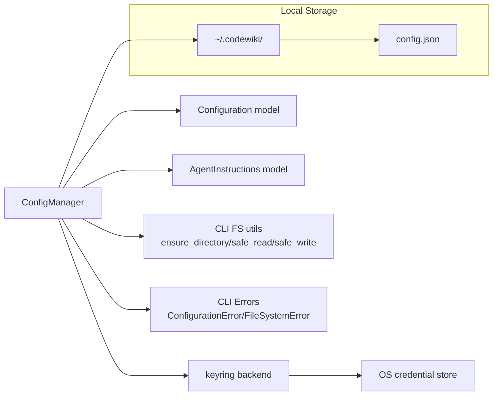
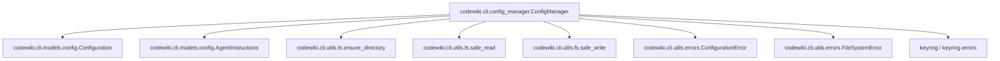
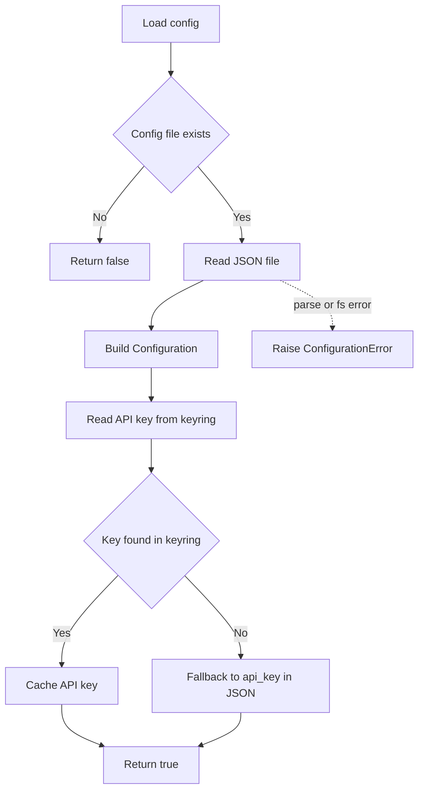
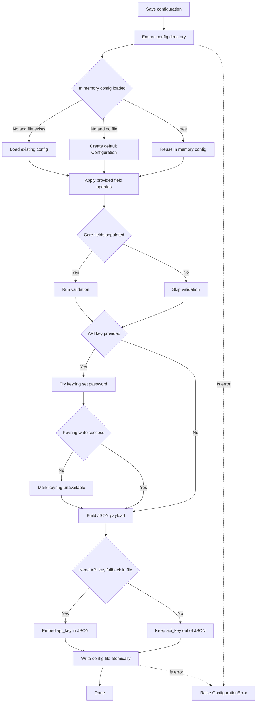
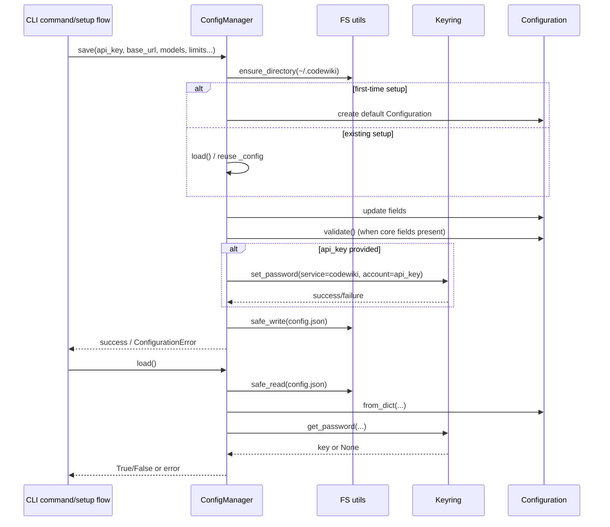
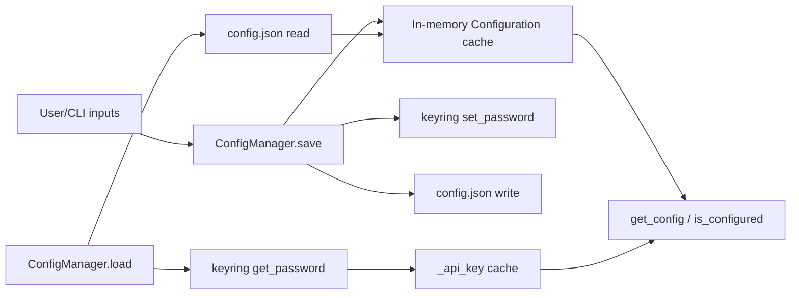
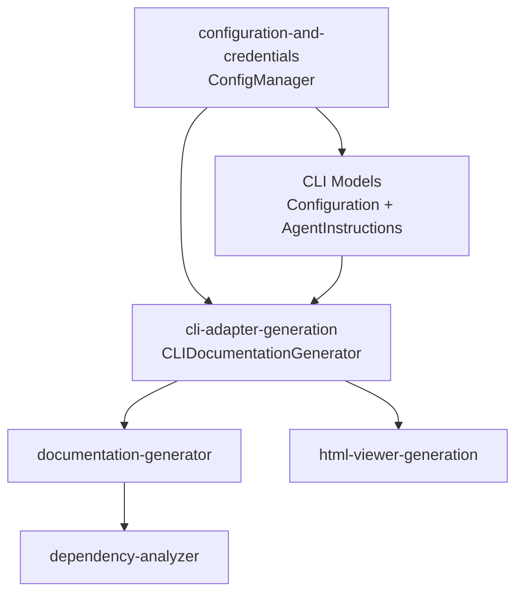

# configuration-and-credentials Module

## Introduction

The `configuration-and-credentials` module is the CLI persistence and secret-management layer for CodeWiki.

Its core component, `codewiki.cli.config_manager.ConfigManager`, is responsible for:

- storing **non-sensitive settings** in `~/.codewiki/config.json`,
- storing the **LLM API key** securely in the system keyring when available,
- validating and exposing runtime-ready configuration for the rest of the CLI pipeline.

This module is a foundational dependency for generation flows because it determines whether the CLI is correctly configured to call LLM-backed backend services.

---

## Core Component

- **`codewiki.cli.config_manager.ConfigManager`**

Primary collaborators:

- `codewiki.cli.models.config.Configuration`
- `codewiki.cli.models.config.AgentInstructions`
- `codewiki.cli.utils.fs.ensure_directory`
- `codewiki.cli.utils.fs.safe_read`
- `codewiki.cli.utils.fs.safe_write`
- `codewiki.cli.utils.errors.ConfigurationError`
- `codewiki.cli.utils.errors.FileSystemError`
- `keyring` (external system credential backend)

---

## Responsibilities and Scope

### In scope

1. Detect whether keyring is usable on the current machine/session.
2. Load persisted configuration from JSON and credentials from keyring (with fallback behavior).
3. Save updated configuration with partial-update semantics.
4. Keep API key out of plain-text config whenever keyring is available.
5. Report user-facing configuration errors through CLI error types.
6. Provide completion checks (`is_configured`) used by higher-level CLI execution paths.

### Out of scope (delegated)

- Running documentation generation jobs: see [cli-adapter-generation.md](cli-adapter-generation.md)
- Backend configuration schema/runtime internals: see [shared-configuration-and-utilities.md](shared-configuration-and-utilities.md)
- Full generation orchestration and LLM agent execution: see [documentation-generator.md](documentation-generator.md) and [agent-orchestration.md](agent-orchestration.md)
- CLI logging/progress UX: see [cli-observability.md](cli-observability.md)

---

## Storage Model and Security Strategy

`ConfigManager` uses a split-storage approach:

- **Sensitive value**: `api_key`
  - stored in keyring under service/account:
    - `KEYRING_SERVICE = "codewiki"`
    - `KEYRING_API_KEY_ACCOUNT = "api_key"`
- **Non-sensitive settings** (models, endpoints, limits, output defaults, instructions)
  - stored as JSON at:
    - `CONFIG_DIR = ~/.codewiki`
    - `CONFIG_FILE = ~/.codewiki/config.json`

When keyring is unavailable/failing, API key falls back to config JSON for continuity.

### Configuration versioning

`CONFIG_VERSION = "1.0"` is persisted in JSON. Current implementation checks version on load, with migration intentionally left as future extension.

---

## Architecture Overview

---

## Dependency Map

---

## Lifecycle and Process Flows

### 1) Initialization

On `ConfigManager()` construction:

1. Internal cache is empty (`_config = None`, `_api_key = None`).
2. `_check_keyring_available()` calls `keyring.get_password(...)` on a test account.
3. Any exception marks keyring as unavailable.

### 2) Load flow

### 3) Save flow (partial update)

### 4) Runtime readiness check

`is_configured()` returns `True` only when:

1. `_config` exists,
2. API key can be retrieved (`get_api_key()`),
3. `Configuration.is_complete()` is true (`base_url`, `main_model`, `cluster_model`, `fallback_model`).

### 5) Credential deletion and full reset

- `delete_api_key()` removes keyring credential (best-effort, suppressing exceptions).
- `clear()` removes both keyring API key and `config.json`, then clears in-memory state.

---

## Component Interaction Sequence

---

## Data Model Contracts Used by This Module

### `Configuration`

`ConfigManager` treats this model as the authoritative structure for persisted non-secret settings:

- endpoint + model selection (`base_url`, `main_model`, `cluster_model`, `fallback_model`)
- generation controls (`max_tokens`, `max_token_per_module`, `max_token_per_leaf_module`, `max_depth`)
- output defaults (`default_output`, `output_language`)
- instruction customization (`agent_instructions`)

`Configuration.validate()` is called only when required base fields are populated, enabling progressive onboarding (user can save partial settings first).

### `AgentInstructions`

Stored as nested optional instructions in config JSON (only when non-empty via `to_dict()`).
These instructions influence generation behavior later through model conversion APIs (see CLI model docs).

For broader model semantics and backend bridging (`to_backend_config`), see [cli-models.md](cli-models.md).

---

## Error Handling Semantics

- FS-level errors (`FileSystemError`) are translated to `ConfigurationError` in high-level load/save operations.
- JSON parse errors are wrapped as `ConfigurationError`.
- Keyring failures are generally treated as **degradation** rather than hard failure:
  - set `_keyring_available = False`
  - fallback to file-based API key persistence/retrieval.

This design prioritizes operability across diverse desktop/server environments while still preferring secure storage.

---

## Data Flow (Credentials + Configuration)

---

## Integration in the Overall System

Within the **CLI Interface** area, this module is the configuration entry point that feeds the runtime adapter.

Typical integration path:

1. User configures credentials/settings via CLI commands using `ConfigManager`.
2. CLI execution path checks `is_configured()`.
3. Runtime adapter consumes resolved settings/API key to build backend runtime config.
4. Backend generation proceeds.

---

## Maintainer Notes and Design Trade-offs

1. **Graceful keyring degradation**
   - Pros: works in containers/headless environments where keyring can fail.
   - Trade-off: may store API key in plain JSON when keyring is unavailable.

2. **Partial-save behavior**
   - Validation is conditional on key fields being present, supporting stepwise setup.

3. **Best-effort cleanup methods**
   - `delete_api_key()` suppresses exceptions; useful for UX robustness but may hide environment issues.

4. **Version field reserved for migration**
   - Current implementation checks version but does not migrate automatically.

5. **Atomic writes via `safe_write`**
   - Helps avoid corrupted config during interrupted writes.

---

## Related Module Documentation

- [cli-adapter-generation.md](cli-adapter-generation.md)
- [cli-models.md](cli-models.md)
- [documentation-generator.md](documentation-generator.md)
- [dependency-analyzer.md](dependency-analyzer.md)
- [html-viewer-generation.md](html-viewer-generation.md)
- [cli-observability.md](cli-observability.md)
- [shared-configuration-and-utilities.md](shared-configuration-and-utilities.md)
