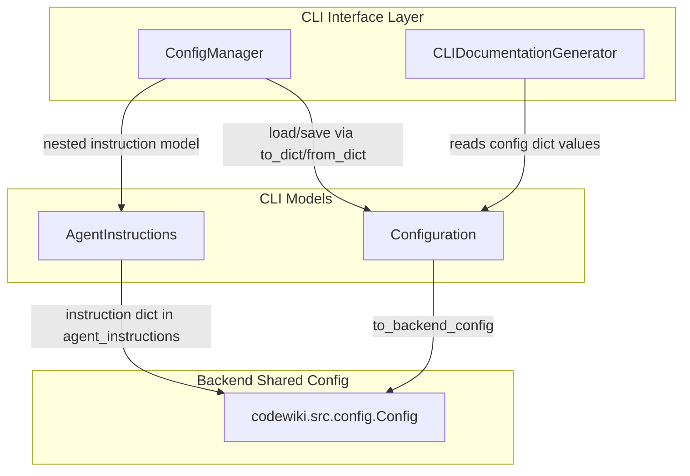
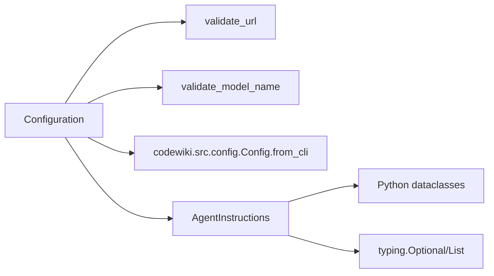
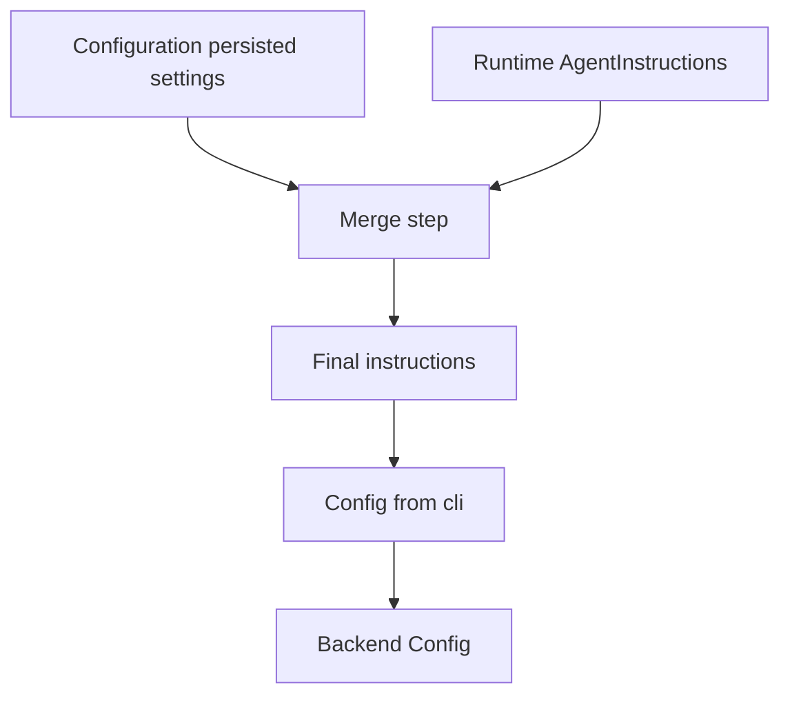
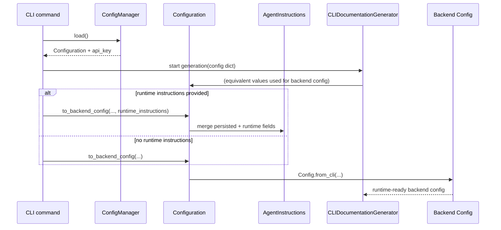
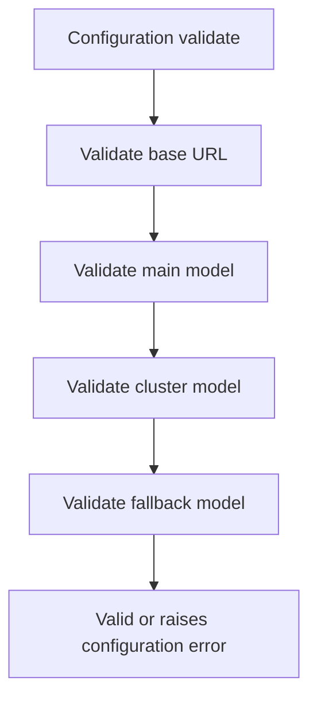
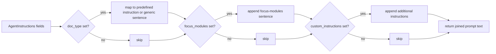
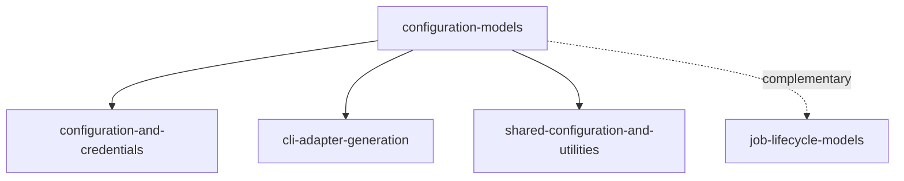

# configuration-models Module

## Introduction

The `configuration-models` module defines the **CLI-side configuration schema** used to persist user preferences and convert them into runtime backend configuration for documentation generation.

It contains two core dataclasses:

- `codewiki.cli.models.config.Configuration`
- `codewiki.cli.models.config.AgentInstructions`

In the overall system, this module acts as a **model contract layer** between:

1. configuration persistence logic in [configuration-and-credentials.md](configuration-and-credentials.md), and
2. backend runtime configuration in [shared-configuration-and-utilities.md](shared-configuration-and-utilities.md).

---

## Module Purpose and Responsibilities

### Primary responsibilities

1. Represent persistent CLI configuration fields (models, API endpoint, token limits, output options).
2. Represent optional agent customization instructions for generation behavior.
3. Validate core configuration fields before runtime use.
4. Serialize/deserialize configuration to/from JSON-compatible dictionaries.
5. Bridge CLI configuration to backend `Config` using `to_backend_config(...)`.

### Out of scope

- File I/O, keyring management, and configuration lifecycle orchestration (handled by [configuration-and-credentials.md](configuration-and-credentials.md)).
- Job execution lifecycle and progress tracking (see [cli-adapter-generation.md](cli-adapter-generation.md) and [cli-observability.md](cli-observability.md)).
- Backend generation logic and dependency analysis (see `documentation-generator` / `dependency-analyzer` docs).

---

## Core Components

## 1) `AgentInstructions`

`AgentInstructions` models optional user guidance for how documentation should be generated.

### Fields

- `include_patterns: Optional[List[str]]`
- `exclude_patterns: Optional[List[str]]`
- `focus_modules: Optional[List[str]]`
- `doc_type: Optional[str]` (e.g., `api`, `architecture`, `user-guide`, `developer`)
- `custom_instructions: Optional[str]`

### Key behaviors

- `to_dict()`
  - Serializes only non-empty fields.
  - Keeps output compact and avoids storing null-heavy objects.
- `from_dict(data)`
  - Rehydrates from persisted dictionary.
- `is_empty()`
  - Returns `True` if all instruction fields are unset/empty.
- `get_prompt_addition()`
  - Converts instruction fields into natural-language prompt additions.
  - Includes built-in phrasing for known `doc_type` values.

---

## 2) `Configuration`

`Configuration` is the main CLI configuration model for generation defaults.

### Fields

Required for complete setup:

- `base_url: str`
- `main_model: str`
- `cluster_model: str`
- `fallback_model: str` (default `"glm-4p5"`)

Other defaults and controls:

- `default_output: str = "docs"`
- `max_tokens: int = 32768`
- `max_token_per_module: int = 36369`
- `max_token_per_leaf_module: int = 16000`
- `max_depth: int = 2`
- `output_language: str = "en"`
- `agent_instructions: AgentInstructions = AgentInstructions()`

### Key behaviors

- `validate()`
  - Validates URL and model names using CLI validation utilities.
- `to_dict()` / `from_dict(data)`
  - JSON-compat serialization and reconstruction.
- `is_complete()`
  - Checks whether required connection/model fields are populated.
- `to_backend_config(repo_path, output_dir, api_key, runtime_instructions=None)`
  - Merges persisted and runtime instructions.
  - Creates backend `codewiki.src.config.Config` via `Config.from_cli(...)`.

---

## Architecture Overview



### Design intent

- `Configuration` and `AgentInstructions` are **pure data + transformation models**.
- Side effects (disk/keyring/network execution) are deliberately kept outside this module.
- The module provides a clean boundary for persistent settings and runtime conversion.

---

## Dependency Map



Notes:

- `validate_api_key` is imported in `config.py` but not used by these classes.
- `Path` and `asdict` are imported but not used in the shown implementation.

---

## Data Model and Serialization Contracts

### Persisted JSON shape (conceptual)

```json
{
  "base_url": "https://...",
  "main_model": "...",
  "cluster_model": "...",
  "default_output": "docs",
  "max_tokens": 32768,
  "max_token_per_module": 36369,
  "max_token_per_leaf_module": 16000,
  "max_depth": 2,
  "output_language": "en",
  "agent_instructions": {
    "include_patterns": ["*.py"],
    "doc_type": "architecture"
  }
}
```

`agent_instructions` is omitted when empty.

### Important current behavior

`Configuration.to_dict()` does **not** include `fallback_model`, while `from_dict()` expects it (with default fallback value). This means customized fallback model values may not persist when serialized through this method.

---

## Runtime Conversion and Merge Semantics

`Configuration.to_backend_config(...)` is the module’s most important integration method.

### Merge rule

If `runtime_instructions` is provided and non-empty:

- each field uses `runtime_instructions.<field> or persisted.<field>`
- runtime values therefore take precedence per field
- unspecified runtime fields inherit persisted values

### Conversion output

The method builds backend `Config` with:

- repository and output paths from runtime invocation
- API key from secure config flow
- model/token/depth/output_language from CLI configuration
- merged instruction dict under `agent_instructions`



---

## Component Interaction Sequence



---

## Process Flows

### 1) Configuration validation flow



### 2) Agent prompt addition flow



---

## Relationship to Other Modules

- **Configuration lifecycle owner**: [configuration-and-credentials.md](configuration-and-credentials.md)
  - Uses `Configuration`/`AgentInstructions` as persistence models.
- **Runtime generation adapter**: [cli-adapter-generation.md](cli-adapter-generation.md)
  - Consumes equivalent configuration values to construct backend runtime config.
- **Backend config contract**: [shared-configuration-and-utilities.md](shared-configuration-and-utilities.md)
  - Receives converted config via `Config.from_cli`.
- **Job models**: [job-lifecycle-models.md](job-lifecycle-models.md)
  - Complementary model layer for execution state, separate from settings.



---

## Maintainer Notes and Caveats

1. **Persistence gap for `fallback_model`**
   - `to_dict()` currently omits it; consider adding it to avoid silent reset to default.

2. **Validation coverage**
   - API key validation is not performed in this module despite `validate_api_key` import; credential checks are handled elsewhere.

3. **Prompt logic duplication risk**
   - Prompt addition logic exists both in CLI `AgentInstructions` and backend `Config` (`get_prompt_addition` pattern). Keep mappings synchronized.

4. **Instruction merge semantics use truthy-or**
   - Empty runtime values cannot intentionally clear persisted values (because `or` fallback restores persisted value). If explicit clearing is needed, semantics should be revised.

---

## Summary

`configuration-models` is a small but foundational module that defines **what configuration means** in the CLI layer and **how it becomes backend-executable settings**. It is intentionally side-effect-light and serves as a contract boundary for persistence, validation, and runtime conversion across the CodeWiki pipeline.
