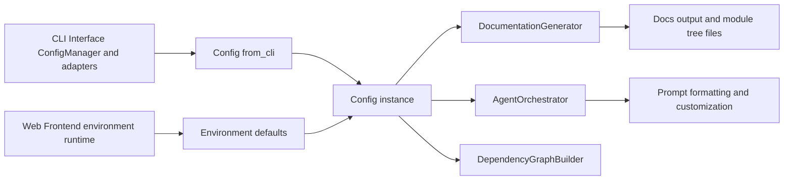
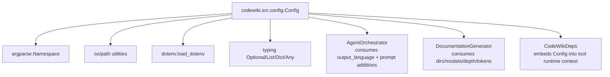
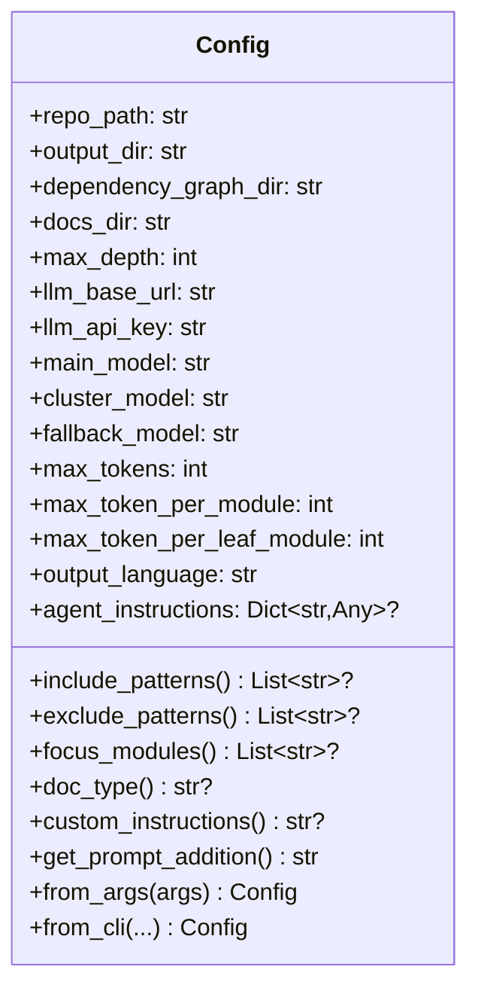
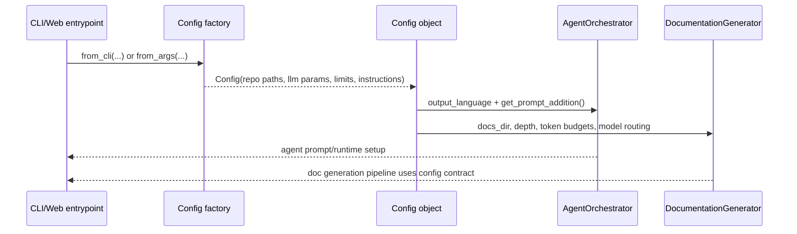
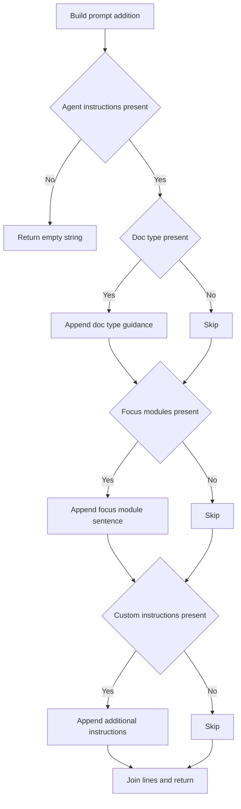
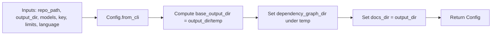
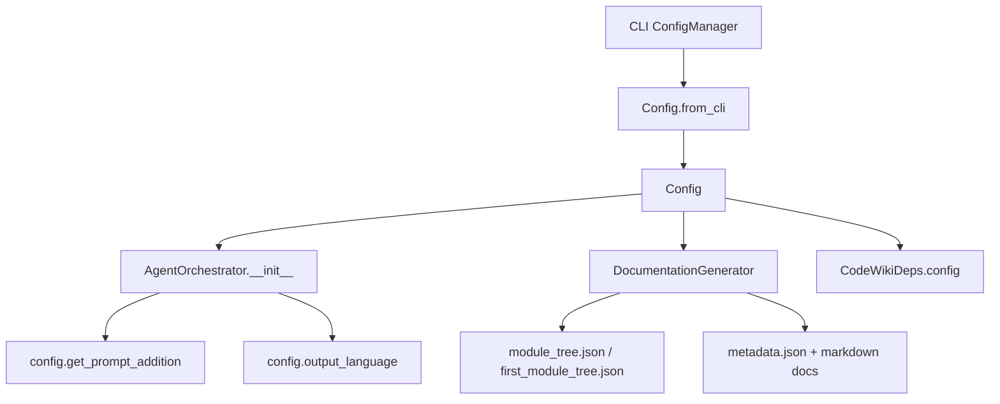

# configuration-runtime-and-prompt-control Module

## Introduction

`configuration-runtime-and-prompt-control` is the runtime configuration nucleus of CodeWiki backend execution.

Its core component, `codewiki.src.config.Config`, standardizes **where documentation is written**, **which LLM endpoints/models are used**, **token/depth budgets**, and **how prompt behavior is customized** (doc type, focus modules, custom instructions, include/exclude patterns).

This module does not generate docs directly. Instead, it provides the configuration contract consumed by orchestration and generation layers.

---

## Scope and Responsibilities

### In scope

- Define global constants for output paths, filenames, and defaults.
- Build runtime config instances for different entry points (`from_args`, `from_cli`).
- Expose LLM/runtime parameters in a single dataclass (`Config`).
- Convert optional `agent_instructions` into prompt-ready text (`get_prompt_addition`).
- Provide CLI-context signaling (`set_cli_context`, `is_cli_context`).

### Out of scope

- Persistent user config + keyring handling (see [configuration-and-credentials.md](configuration-and-credentials.md)).
- Job scheduling and module processing (see [Documentation Generator.md](Documentation%20Generator.md)).
- Agent execution runtime/tool invocation (see [orchestration-runtime.md](orchestration-runtime.md)).

---

## Core Component

- `codewiki.src.config.Config`

`Config` is a dataclass that combines:

1. **Repository/output topology** (`repo_path`, `output_dir`, `dependency_graph_dir`, `docs_dir`)
2. **LLM connection and model routing** (`llm_base_url`, `llm_api_key`, `main_model`, `cluster_model`, `fallback_model`)
3. **Prompt and generation controls** (`output_language`, `agent_instructions`)
4. **Token/decomposition controls** (`max_tokens`, `max_token_per_module`, `max_token_per_leaf_module`, `max_depth`)

---

## Configuration Constants and Runtime Defaults

The module defines shared constants used across backend workflows:

- Directory/file conventions:
  - `OUTPUT_BASE_DIR = output`
  - `DEPENDENCY_GRAPHS_DIR = dependency_graphs`
  - `DOCS_DIR = docs`
  - `FIRST_MODULE_TREE_FILENAME = first_module_tree.json`
  - `MODULE_TREE_FILENAME = module_tree.json`
  - `OVERVIEW_FILENAME = overview.md`
- Hierarchy depth control:
  - `MAX_DEPTH = 2`
- Token defaults:
  - `DEFAULT_MAX_TOKENS = 32768`
  - `DEFAULT_MAX_TOKEN_PER_MODULE = 36369`
  - `DEFAULT_MAX_TOKEN_PER_LEAF_MODULE = 16000`
- Backward-compatibility aliases:
  - `MAX_TOKEN_PER_MODULE`, `MAX_TOKEN_PER_LEAF_MODULE`

LLM defaults are read from environment variables (via `load_dotenv()`), with safe fallbacks:

- `MAIN_MODEL` (default: `claude-sonnet-4`)
- `FALLBACK_MODEL_1` (default: `glm-4p5`)
- `CLUSTER_MODEL` (default: `MAIN_MODEL`)
- `LLM_BASE_URL` (default: `http://0.0.0.0:4000/`)
- `LLM_API_KEY` (default: `sk-1234`)

---

## Position in System Architecture

`Config` is the bridge between user/operator inputs and runtime behaviors in generation/orchestration modules.

---

## Dependency Relationships

Related module docs:
- [configuration-and-credentials.md](configuration-and-credentials.md)
- [orchestration-runtime.md](orchestration-runtime.md)
- [Documentation Generator.md](Documentation%20Generator.md)
- [Shared Configuration and Utilities.md](Shared%20Configuration%20and%20Utilities.md)

---

## Internal Model and Prompt-Control API

### `agent_instructions` accessors

`Config` exposes instruction fields through typed properties so calling code does not manually parse dict keys:

- `include_patterns`
- `exclude_patterns`
- `focus_modules`
- `doc_type`
- `custom_instructions`

### `get_prompt_addition()` behavior

Prompt additions are assembled in this order:

1. **Doc type instruction** (predefined templates for `api`, `architecture`, `user-guide`, `developer`; generic fallback for other values)
2. **Focus modules emphasis**
3. **Free-form custom instructions**

If `agent_instructions` is absent/empty, returns empty string.

---

## Data Flow: Configuration Construction and Consumption

---

## Factory Methods and Path Semantics

### `from_args(args)`

- Uses defaults from module constants/environment.
- Builds docs path under `output/docs/<sanitized-repo-name>-docs`.
- Suitable for classic argument-driven flows.

### `from_cli(...)`

- Accepts explicit runtime parameters from CLI configuration layer.
- Writes intermediate outputs under `<output_dir>/temp`.
- Writes final docs into `<output_dir>` directly.
- Allows caller-controlled depth/token/language/instructions.

This split supports a cleaner CLI UX where persistent user settings are resolved before runtime `Config` object creation.

---

## Process Flows

### 1) Prompt addition generation

### 2) Runtime config construction

---

## Component Interaction in Runtime

`Config` is therefore both:
- a **constructor-time dependency** for orchestrators/generators, and
- a **runtime context payload** propagated to agent tools via `CodeWikiDeps`.

---

## CLI vs Web Context Control

The module-level helpers:

- `set_cli_context(enabled=True)`
- `is_cli_context()`

maintain a global execution-mode flag (`_CLI_CONTEXT`) to distinguish CLI-oriented behavior from web-app behavior. This provides a lightweight switch for mode-aware logic in higher layers.

---

## Design Notes and Trade-offs

1. **Single object contract**: Concentrating runtime controls in `Config` reduces parameter sprawl across orchestration code.
2. **Environment defaults + explicit override**: Supports both quick-start and controlled production use.
3. **Dict-based instructions**: Flexible and forward-compatible, but not as strictly validated as a typed schema.
4. **Dual constructor strategy**: `from_args` and `from_cli` preserve backward compatibility while supporting newer CLI runtime separation.
5. **Backward-compatible constants**: Legacy aliases prevent breaking older integrations.

---

## Integration Guidance for Maintainers

- If you add new prompt controls, expose them through `Config` properties and include them in `get_prompt_addition()` to centralize prompt policy.
- If you add new runtime limits, propagate defaults in this module first, then thread into CLI models/config manager.
- Keep path constants aligned with downstream consumers in generation modules to avoid artifact mismatches.

---

## Related Documentation

- [Shared Configuration and Utilities.md](Shared%20Configuration%20and%20Utilities.md)
- [configuration-and-credentials.md](configuration-and-credentials.md)
- [orchestration-runtime.md](orchestration-runtime.md)
- [Documentation Generator.md](Documentation%20Generator.md)
- [frontend-models-and-configuration.md](frontend-models-and-configuration.md)
