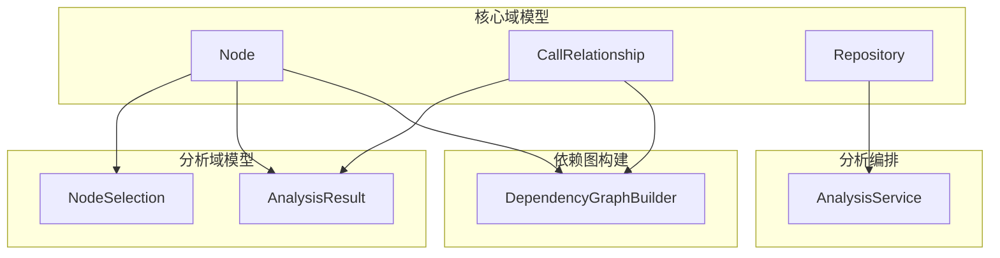
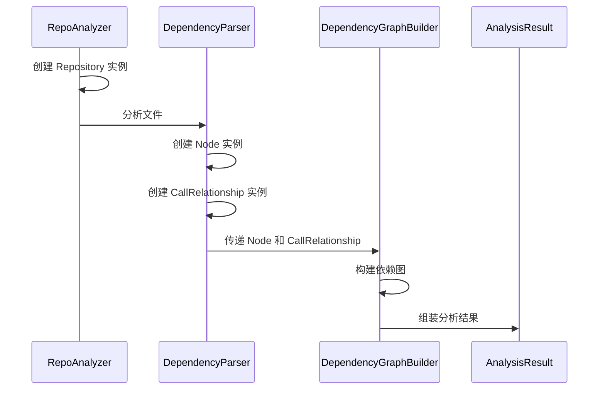

# 核心域模型 (core_domain_models) 模块文档

## 1. 模块概述

核心域模型模块定义了代码依赖分析系统中最基础的数据结构和核心实体。该模块为整个依赖分析引擎提供了统一的领域模型，确保不同组件之间能够一致地表示和交换代码结构信息。这些模型是构建依赖图、分析调用关系以及表示代码库结构的基础。

## 2. 架构与依赖关系

核心域模型模块是整个依赖分析引擎的基础层，其他所有分析组件都依赖于这些核心模型。它与其他模块的关系如下：

- **被依赖模块**：analysis_orchestration、ast_parsing_and_language_analyzers、dependency_graph_construction
- **相关模块**：analysis_domain_models



## 3. 核心组件详解

### 3.1 Node 类

`Node` 类是代码依赖分析系统中最核心的实体之一，它代表代码库中的一个可分析组件，如函数、类、方法或模块。

#### 主要属性

- `id: str` - 节点的唯一标识符，用于在依赖图中唯一标识该节点
- `name: str` - 节点的名称，通常是函数名、类名或模块名
- `component_type: str` - 组件类型，标识该节点代表的代码元素类型（如 "function", "class", "method" 等）
- `file_path: str` - 节点所在文件的绝对路径
- `relative_path: str` - 节点所在文件相对于仓库根目录的相对路径
- `depends_on: Set[str]` - 该节点依赖的其他节点的 ID 集合
- `source_code: Optional[str]` - 节点的源代码内容（可选）
- `start_line: int` - 节点在文件中的起始行号
- `end_line: int` - 节点在文件中的结束行号
- `has_docstring: bool` - 标识该节点是否有文档字符串
- `docstring: str` - 节点的文档字符串内容
- `parameters: Optional[List[str]]` - 函数或方法的参数列表（可选）
- `node_type: Optional[str]` - 节点的更具体类型（可选）
- `base_classes: Optional[List[str]]` - 类的基类列表（仅适用于类节点）
- `class_name: Optional[str]` - 类名（如果该节点是类的成员）
- `display_name: Optional[str]` - 用于显示的名称（可选）
- `component_id: Optional[str]` - 组件标识符（可选）

#### 主要方法

`get_display_name() -> str` - 获取节点的显示名称。如果设置了 `display_name` 则返回该值，否则返回 `name`。

#### 使用示例

```python
# 创建一个函数节点
function_node = Node(
    id="func_001",
    name="calculate_total",
    component_type="function",
    file_path="/repo/src/utils.py",
    relative_path="src/utils.py",
    start_line=10,
    end_line=25,
    has_docstring=True,
    docstring="Calculate the total sum of items.",
    parameters=["items", "tax_rate"],
    depends_on={"func_002", "func_003"}
)

# 获取显示名称
display_name = function_node.get_display_name()
```

### 3.2 CallRelationship 类

`CallRelationship` 类表示代码中两个节点之间的调用关系，它记录了哪个节点（调用者）调用了另一个节点（被调用者）。这个类是构建调用图和理解代码执行流程的基础。

#### 主要属性

- `caller: str` - 调用者节点的唯一标识符，必须与某个 `Node` 实例的 `id` 字段对应
- `callee: str` - 被调用者节点的唯一标识符，同样必须与某个 `Node` 实例的 `id` 字段对应
- `call_line: Optional[int]` - 调用发生的具体行号（可选），如果已知则应设置，有助于精确定位调用位置
- `is_resolved: bool` - 标识该调用关系是否已被解析，`True` 表示能够找到被调用者的定义，`False` 表示无法解析（例如调用了外部库函数）

#### 使用示例

```python
# 创建一个已解析的调用关系
resolved_call = CallRelationship(
    caller="func_001",
    callee="func_002",
    call_line=15,
    is_resolved=True
)

# 创建一个未解析的调用关系（例如调用外部库）
unresolved_call = CallRelationship(
    caller="func_001",
    callee="external_library_function",
    call_line=20,
    is_resolved=False
)
```

### 3.3 Repository 类

`Repository` 类表示一个代码仓库，它是分析的顶层容器，包含了仓库的基本信息和位置。这个类是整个分析过程的起点，它为所有后续的分析操作提供了上下文信息。

#### 主要属性

- `url: str` - 仓库的远程 URL，通常是 Git 仓库地址（如 GitHub、GitLab 等）
- `name: str` - 仓库的名称，用于标识和显示
- `clone_path: str` - 仓库在本地文件系统中的克隆路径，这是分析过程中访问代码文件的基础路径
- `analysis_id: str` - 分析任务的唯一标识符，用于关联和追踪特定的分析运行

#### 使用示例

```python
# 创建一个仓库实例
repo = Repository(
    url="https://github.com/example/project.git",
    name="project",
    clone_path="/tmp/repos/project",
    analysis_id="analysis_2023_001"
)

# 仓库实例通常被传递给分析服务进行处理
# analysis_service.analyze(repo)
```

## 4. 组件交互与数据流程

在典型的分析流程中，这些核心模型按以下方式交互：



1. **仓库初始化**：首先创建 `Repository` 实例，表示要分析的代码仓库。
2. **代码解析**：各语言分析器解析代码文件，创建 `Node` 实例表示代码中的函数、类等组件。
3. **关系发现**：解析过程中同时发现调用关系，创建 `CallRelationship` 实例。
4. **图构建**：`DependencyGraphBuilder` 使用 `Node` 和 `CallRelationship` 构建完整的依赖图。
5. **结果组装**：最终所有模型实例被组装到 `AnalysisResult` 中，供上层应用使用。

## 5. 配置与使用

### 5.1 基本使用模式

这些核心模型主要在依赖分析引擎内部使用，通常不需要直接实例化，但了解其结构对于理解分析结果和扩展系统很重要。

### 5.2 扩展指南

如果需要扩展这些模型，可以继承相应的基类并添加额外的字段或方法：

```python
from codewiki.src.be.dependency_analyzer.models.core import Node

class EnhancedNode(Node):
    # 添加额外的字段
    complexity_score: float = 0.0
    test_coverage: float = 0.0
    
    # 添加自定义方法
    def calculate_maintainability_index(self) -> float:
        # 实现计算可维护性指数的逻辑
        pass
```

## 6. 最佳实践

- **使用 `get_display_name()`**：在显示节点名称时，优先使用 `get_display_name()` 方法而不是直接访问 `name` 字段，这样可以尊重自定义的显示名称。
- **合理设置组件类型**：为 `component_type` 字段使用一致的类型标识，这有助于后续的分析和可视化。
- **文档字符串处理**：如果代码元素有文档字符串，应同时设置 `has_docstring` 为 `True` 并填充 `docstring` 字段。

## 7. 实际应用场景

### 7.1 完整的分析流程示例

下面是一个完整的分析流程示例，展示了如何将这些核心模型组合使用：

```python
from codewiki.src.be.dependency_analyzer.models.core import (
    Node, CallRelationship, Repository
)
from codewiki.src.be.dependency_analyzer.models.analysis import AnalysisResult

# 1. 创建仓库实例
repository = Repository(
    url="https://github.com/example/myproject.git",
    name="myproject",
    clone_path="/tmp/myproject",
    analysis_id="analysis_001"
)

# 2. 模拟分析过程中创建的节点
nodes = [
    Node(
        id="node_001",
        name="main",
        component_type="function",
        file_path="/tmp/myproject/main.py",
        relative_path="main.py",
        start_line=1,
        end_line=20,
        depends_on={"node_002", "node_003"}
    ),
    Node(
        id="node_002",
        name="process_data",
        component_type="function",
        file_path="/tmp/myproject/utils.py",
        relative_path="utils.py",
        start_line=5,
        end_line=15,
        depends_on=set()
    ),
    Node(
        id="node_003",
        name="validate_input",
        component_type="function",
        file_path="/tmp/myproject/utils.py",
        relative_path="utils.py",
        start_line=20,
        end_line=30,
        depends_on=set()
    )
]

# 3. 模拟发现的调用关系
call_relationships = [
    CallRelationship(
        caller="node_001",
        callee="node_002",
        call_line=10,
        is_resolved=True
    ),
    CallRelationship(
        caller="node_001",
        callee="node_003",
        call_line=8,
        is_resolved=True
    )
]

# 4. 组装分析结果（实际中由 AnalysisResult 处理）
# analysis_result = AnalysisResult(
#     repository=repository,
#     nodes=nodes,
#     call_relationships=call_relationships,
#     # 其他分析结果字段
# )
```

### 7.2 与依赖图构建器集成

这些核心模型是依赖图构建的基础，以下是与 DependencyGraphBuilder 集成的示例：

```python
from codewiki.src.be.dependency_analyzer.models.core import Node, CallRelationship
from codewiki.src.be.dependency_analyzer.dependency_graphs_builder import DependencyGraphBuilder

# 假设我们已经有了节点和调用关系列表
nodes = [...]  # Node 实例列表
call_relationships = [...]  # CallRelationship 实例列表

# 创建依赖图构建器
graph_builder = DependencyGraphBuilder()

# 添加节点和关系
for node in nodes:
    graph_builder.add_node(node)

for rel in call_relationships:
    graph_builder.add_call_relationship(rel)

# 构建完整的依赖图
dependency_graph = graph_builder.build()

# 现在可以使用依赖图进行各种分析
# 例如查找循环依赖、计算影响范围等
```

## 8. 注意事项与限制

### 8.1 重要注意事项

1. **节点 ID 一致性**：在同一个分析上下文中，必须确保所有节点 ID 的唯一性。如果两个不同的节点具有相同的 ID，将会导致依赖图构建错误和分析结果不准确。

2. **路径规范**：`file_path` 和 `relative_path` 应该使用一致的路径分隔符，建议在跨平台应用中使用正斜杠 `/`，或者根据操作系统自动适配。

3. **调用关系解析**：对于无法解析的调用关系（`is_resolved=False`），仍然应该创建 CallRelationship 实例，因为这些信息对于理解外部依赖仍然很有价值。

4. **性能考虑**：当处理大型代码库时，节点和调用关系的数量可能会非常大。在这种情况下，需要考虑内存使用和处理性能，可能需要实现分批处理或延迟加载机制。

### 8.2 已知限制

1. **当前模型不支持**：
   - 版本控制系统的特定信息（如提交历史、分支信息等）
   - 代码变更历史和演化分析
   - 多语言项目的高级跨语言依赖分析

2. **扩展性考虑**：虽然可以通过继承扩展这些模型，但过度使用继承可能会导致复杂性增加。建议在需要扩展时优先考虑组合模式。

## 9. 相关模块参考

- [分析域模型 (analysis_domain_models)](analysis_domain_models.md) - 包含基于核心模型扩展的分析相关模型
- [依赖图构建 (dependency_graph_construction)](dependency_graph_construction.md) - 使用核心模型构建依赖图的组件
- [分析编排 (analysis_orchestration)](analysis_orchestration.md) - 使用这些模型进行分析流程编排的组件
- [AST 解析与语言分析器 (ast_parsing_and_language_analyzers)](ast_parsing_and_language_analyzers.md) - 创建这些核心模型实例的组件
