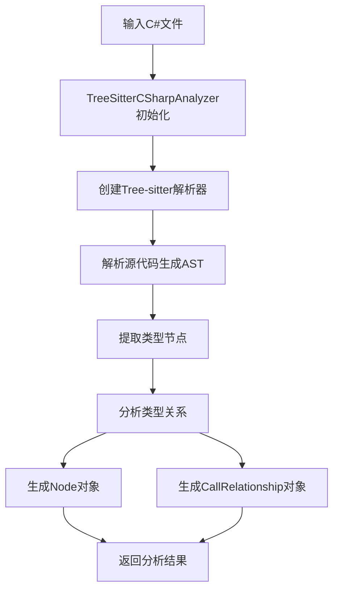
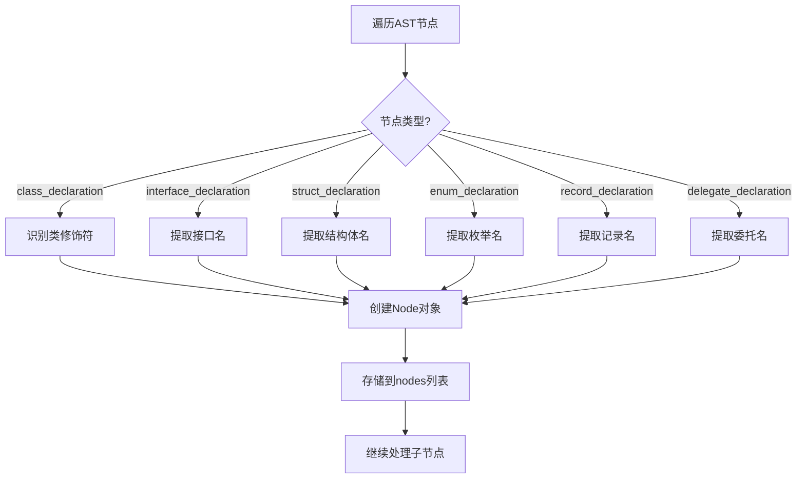
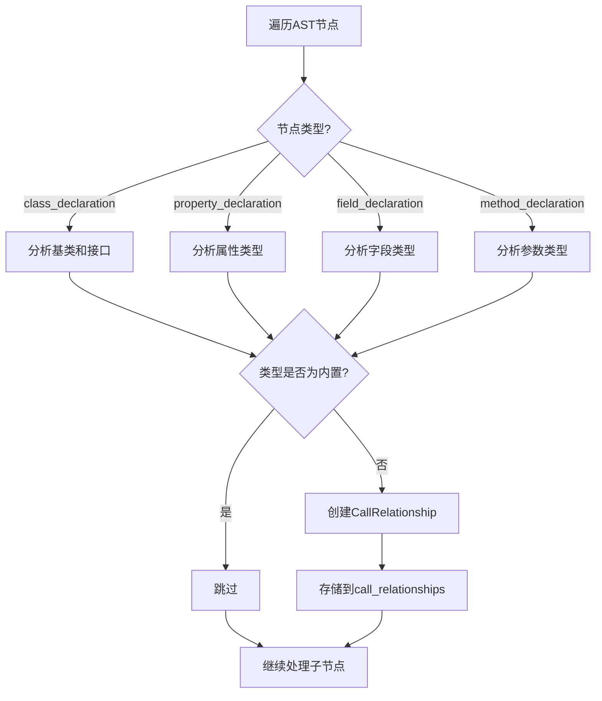
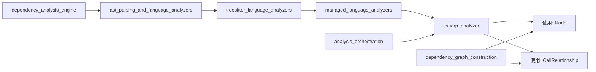

# C# 分析器模块文档

## 概述

`csharp_analyzer` 模块是一个专门用于分析 C# 源代码文件的组件，它使用 Tree-sitter 解析技术来提取代码结构和依赖关系。该模块是 `dependency_analysis_engine` 中 `managed_language_analyzers` 子模块的一部分，负责识别 C# 文件中的类型定义、成员声明以及它们之间的关系。

### 核心功能

- 解析 C# 源代码并构建抽象语法树 (AST)
- 提取类、接口、结构体、枚举、记录和委托等类型定义
- 分析继承关系和类型依赖
- 识别属性、字段和方法参数中的类型引用
- 生成可用于依赖图构建的节点和调用关系对象

## 核心组件

### TreeSitterCSharpAnalyzer 类

`TreeSitterCSharpAnalyzer` 是本模块的核心类，负责执行 C# 代码的实际分析工作。

#### 初始化与基本属性

```python
def __init__(self, file_path: str, content: str, repo_path: str = None):
    self.file_path = Path(file_path)
    self.content = content
    self.repo_path = repo_path or ""
    self.nodes: List[Node] = []
    self.call_relationships: List[CallRelationship] = []
    self._analyze()
```

**参数说明：**
- `file_path`: C# 文件的完整路径
- `content`: 文件的内容字符串
- `repo_path`: 可选的仓库根路径，用于计算相对路径和模块路径

**主要属性：**
- `nodes`: 存储提取到的所有类型节点
- `call_relationships`: 存储识别到的类型关系

#### 核心方法

##### `_analyze()`

这是分析过程的主入口方法，它：
1. 初始化 Tree-sitter 解析器和 C# 语言支持
2. 解析输入内容生成抽象语法树
3. 调用 `_extract_nodes` 提取类型定义
4. 调用 `_extract_relationships` 分析类型关系

##### `_extract_nodes(node, top_level_nodes, lines)`

递归遍历 AST，提取所有顶层类型定义：

**支持的类型：**
- 类（class）：包括抽象类和静态类
- 接口（interface）
- 结构体（struct）
- 枚举（enum）
- 记录（record）
- 委托（delegate）

对于每个识别到的类型，该方法会创建一个 `Node` 对象，包含：
- 唯一标识符（基于文件路径和类型名）
- 类型名称和类型类别
- 源代码位置信息
- 完整的源代码片段

##### `_extract_relationships(node, top_level_nodes)`

分析类型之间的关系，主要处理：

1. **继承关系**：识别类的基类和接口实现
2. **属性类型依赖**：分析属性声明中使用的类型
3. **字段类型依赖**：分析字段声明中使用的类型
4. **方法参数依赖**：分析方法参数中使用的类型

对于每种关系，会创建一个 `CallRelationship` 对象，记录调用者、被调用者和位置信息。

##### 辅助方法

- `_get_module_path()`: 计算文件的模块路径（用于构建组件 ID）
- `_get_relative_path()`: 获取文件相对于仓库根目录的路径
- `_get_component_id(name)`: 生成唯一的组件标识符
- `_is_primitive_type(type_name)`: 判断类型是否为 C# 内置类型
- `_find_containing_class(node, top_level_nodes)`: 查找包含给定节点的类型

### analyze_csharp_file 函数

```python
def analyze_csharp_file(file_path: str, content: str, repo_path: str = None) -> Tuple[List[Node], List[CallRelationship]]:
    analyzer = TreeSitterCSharpAnalyzer(file_path, content, repo_path)
    return analyzer.nodes, analyzer.call_relationships
```

这是模块的公共接口函数，提供了一种简洁的方式来使用 `TreeSitterCSharpAnalyzer` 类。它创建分析器实例并返回分析结果。

## 架构与工作流程

### 分析流程



### 类型识别流程



### 关系分析流程



## 使用示例

### 基本使用

```python
from codewiki.src.be.dependency_analyzer.analyzers.csharp import analyze_csharp_file

# 读取C#文件内容
with open("Example.cs", "r", encoding="utf-8") as f:
    content = f.read()

# 分析文件
nodes, relationships = analyze_csharp_file(
    file_path="path/to/Example.cs",
    content=content,
    repo_path="path/to/repository"
)

# 处理结果
for node in nodes:
    print(f"Found {node.component_type}: {node.name}")

for rel in relationships:
    print(f"Relationship: {rel.caller} -> {rel.callee}")
```

### 集成到依赖分析流程

```python
from codewiki.src.be.dependency_analyzer.analyzers.csharp import analyze_csharp_file
from codewiki.src.be.dependency_analyzer.dependency_graphs_builder import DependencyGraphBuilder

def process_csharp_files(file_paths, repo_path):
    graph_builder = DependencyGraphBuilder()
    
    for file_path in file_paths:
        with open(file_path, "r", encoding="utf-8") as f:
            content = f.read()
        
        nodes, relationships = analyze_csharp_file(file_path, content, repo_path)
        graph_builder.add_nodes(nodes)
        graph_builder.add_relationships(relationships)
    
    return graph_builder.build()
```

## 与其他模块的关系

`csharp_analyzer` 模块在整个系统中的位置：



### 依赖关系

- **输入依赖**：需要 `tree-sitter` 和 `tree-sitter-c-sharp` 库来解析 C# 代码
- **模型依赖**：使用 `Node` 和 `CallRelationship` 模型来表示分析结果
- **集成点**：通常被 `DependencyParser` 或 `AnalysisService` 调用

## 限制与注意事项

### 当前限制

1. **命名空间处理**：目前不处理 C# 命名空间，所有类型都基于文件路径生成 ID
2. **泛型类型**：对泛型类型的支持有限，可能无法正确解析复杂的泛型约束
3. **部分类**：不支持分部类（partial classes）的合并处理
4. **别名解析**：不处理 `using` 别名，类型识别仅基于简单名称
5. **方法体分析**：当前不分析方法体内的调用关系，只关注声明级别的依赖

### 已知问题

1. 对于使用复杂类型推断（如 `var` 关键字）的代码，可能无法准确识别类型依赖
2. 不支持分析 LINQ 查询表达式中的类型关系
3. 属性和索引器的高级用法（如显式接口实现）可能无法正确处理

### 扩展建议

1. 添加命名空间解析支持，提高类型识别的准确性
2. 增强对泛型类型和约束的处理
3. 实现方法体内调用关系的分析
4. 添加对 C# 最新特性（如记录类型、init-only 属性等）的完整支持
5. 集成语义分析能力，提供更准确的类型引用解析

## 配置与扩展

### 添加新的类型识别

要支持识别新的 C# 类型或结构，可以扩展 `_extract_nodes` 方法：

```python
def _extract_nodes(self, node, top_level_nodes, lines):
    # 现有代码...
    
    # 添加对新类型的支持
    elif node.type == "your_new_type":
        node_type = "your_type_category"
        node_name = self._get_identifier_name(node)
        
        # 创建Node对象
        # ...
    
    # 继续递归处理
    for child in node.children:
        self._extract_nodes(child, top_level_nodes, lines)
```

### 自定义类型过滤

可以通过扩展 `_is_primitive_type` 方法来调整哪些类型被视为内置类型：

```python
def _is_primitive_type(self, type_name: str) -> bool:
    # 基础类型检查
    result = super()._is_primitive_type(type_name)
    
    # 添加自定义类型过滤
    custom_types = {"MyCustomType", "AnotherBuiltInLikeType"}
    return result or type_name in custom_types
```

## 总结

`csharp_analyzer` 模块提供了一个强大的基础，用于分析 C# 代码的结构和依赖关系。虽然它有一些限制，但它已经能够处理大多数常见的 C# 代码分析场景，并为更高级的依赖分析和文档生成提供了坚实的基础。通过与系统其他模块的协作，它在整个代码文档生成流程中扮演着重要角色。
