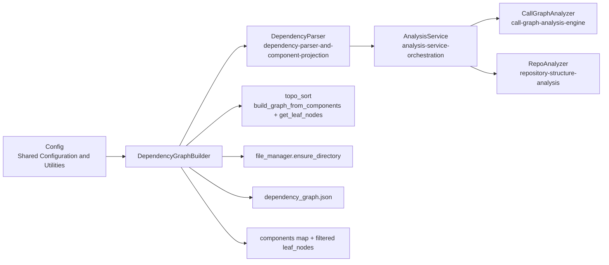
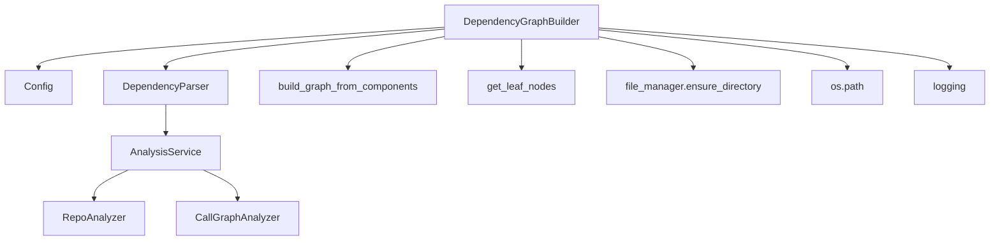
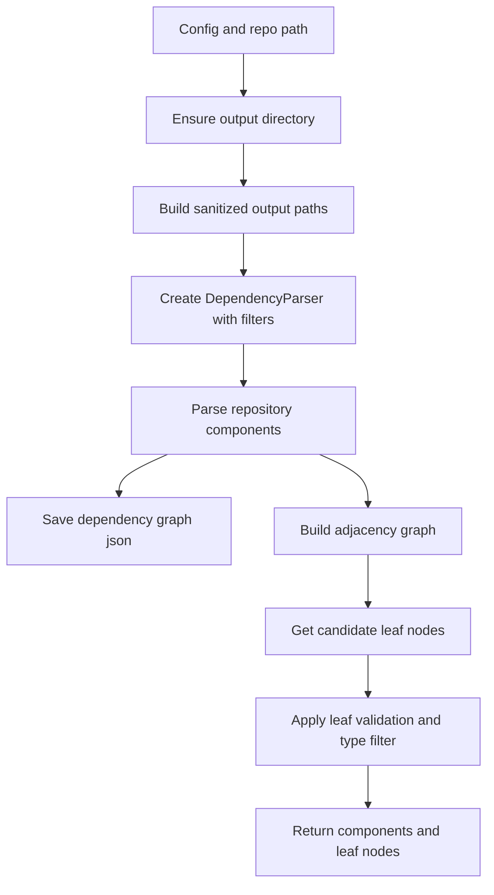
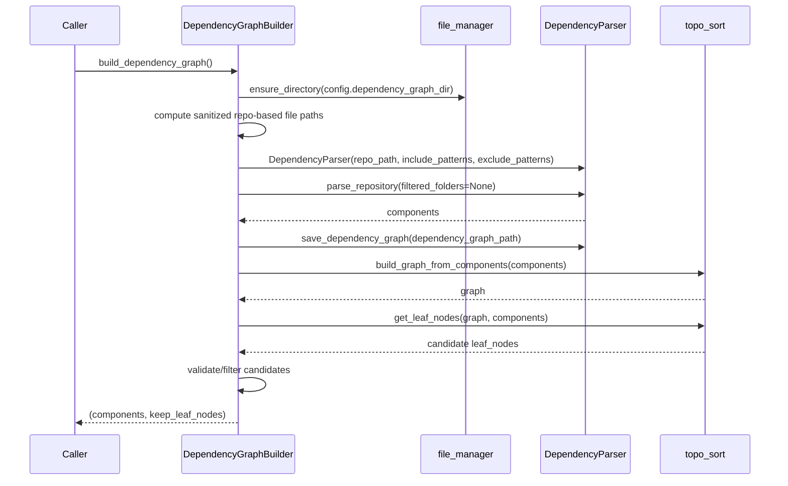
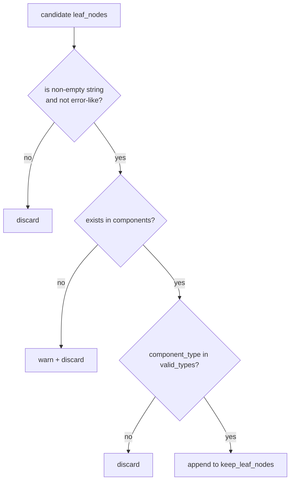
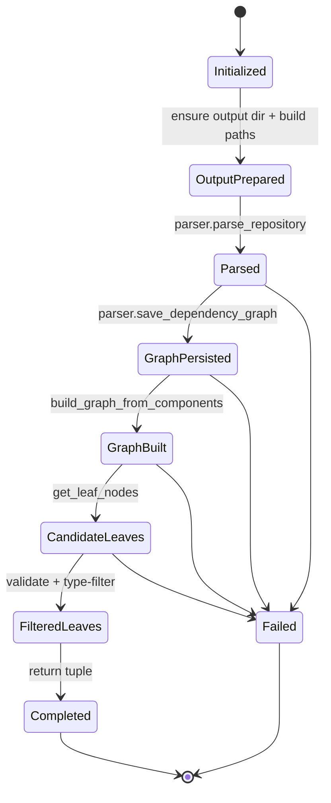

# dependency-graph-build-and-leaf-selection Module

## Introduction

The `dependency-graph-build-and-leaf-selection` module is the finalization layer of dependency analysis.
Its core component, `DependencyGraphBuilder`, transforms parsed repository components into a traversable dependency graph, persists graph artifacts, and selects valid **leaf nodes** that are suitable as downstream documentation entry points.

In the Dependency Analyzer pipeline, this module sits after component projection and before documentation planning/generation.

---

## Core Component

### `DependencyGraphBuilder`

`DependencyGraphBuilder` exposes one primary workflow method:

- **`build_dependency_graph() -> tuple[Dict[str, Any], List[str]]`**

It performs six responsibilities in order:

1. Ensure dependency graph output directory exists.
2. Build repository-scoped output file paths (sanitized repo name).
3. Read include/exclude file patterns from runtime config.
4. Parse repository components via `DependencyParser`.
5. Build in-memory graph and compute candidate leaf nodes.
6. Apply post-filtering to keep only valid, component-backed, type-eligible leaf IDs.

---

## Architectural Position

`DependencyGraphBuilder` does not parse AST directly; it composes:

- projection from [`dependency-parser-and-component-projection.md`](dependency-parser-and-component-projection.md), and
- graph/leaf algorithms from topo-sort helpers.

---

## Dependency Relationships

### Key dependency semantics

- `Config` provides:
  - `repo_path`
  - `dependency_graph_dir`
  - `include_patterns` / `exclude_patterns` (from agent instructions)
- `DependencyParser` returns normalized `components: Dict[str, Node]`.
- `build_graph_from_components` converts `Node.depends_on` into adjacency sets.
- `get_leaf_nodes` derives initial leaves after cycle handling.
- `DependencyGraphBuilder` then applies **additional hardening filter logic** before returning leaf nodes.

---

## End-to-End Data Flow

---

## Component Interaction (Sequence)

---

## Leaf Selection and Filtering Logic

The module performs a two-stage leaf strategy:

1. **Topology stage** (from `get_leaf_nodes`) to get candidate leaves.
2. **Validation stage** (inside `DependencyGraphBuilder`) to enforce runtime quality constraints.

### Validation rules in `DependencyGraphBuilder`

- Reject invalid identifiers:
  - non-string
  - empty/whitespace-only
  - strings containing error markers (`error`, `exception`, `failed`, `invalid`)
- Keep only IDs that exist in `components`.
- Keep only components with allowed `component_type`:
  - default: `{class, interface, struct}`
  - fallback: include `function` if none of those structural types exist in the repository.

This extra filter protects downstream module/document generation from malformed graph outputs and from selecting semantically weak node types.

---

## Build Process Flow (Operational)

---

## Inputs and Outputs

### Input

- `DependencyGraphBuilder(config: Config)`
  - expects a fully initialized config with repository and output paths.

### Output of `build_dependency_graph()`

- `components: Dict[str, Node-like]`
  - keyed by canonical component ID
  - each value includes metadata and dependency references (`depends_on`)
- `keep_leaf_nodes: List[str]`
  - validated leaf component IDs suitable for downstream selection logic

### Side effects

- Creates output directory if missing.
- Writes `<sanitized_repo>_dependency_graph.json` under `dependency_graph_dir`.
- (Currently disabled in code) reserved path for `<sanitized_repo>_filtered_folders.json` caching.

---

## Error Handling and Robustness Notes

- Uses conservative leaf-node validation to avoid propagating parser/analyzer artifacts.
- Logs warnings for unknown or invalid leaf IDs rather than failing entire build.
- Uses repository-name sanitization for filesystem-safe output filenames.
- Relies on upstream parser/analyzer modules for deep error handling; see:
  - [`dependency-parser-and-component-projection.md`](dependency-parser-and-component-projection.md)
  - [`analysis-service-orchestration.md`](analysis-service-orchestration.md)

---

## Cross-Module Context

For deeper details, refer to:

- **Component projection and serialization**: [`dependency-parser-and-component-projection.md`](dependency-parser-and-component-projection.md)
- **Analysis orchestration and multi-language pipeline**: [`analysis-service-orchestration.md`](analysis-service-orchestration.md)
- **Call graph extraction internals**: [`call-graph-analysis-engine.md`](call-graph-analysis-engine.md)
- **Repository file tree and filtering policies**: [`repository-structure-analysis.md`](repository-structure-analysis.md)

This module should be read as the graph finalization/selection layer on top of those lower-level analysis modules.
