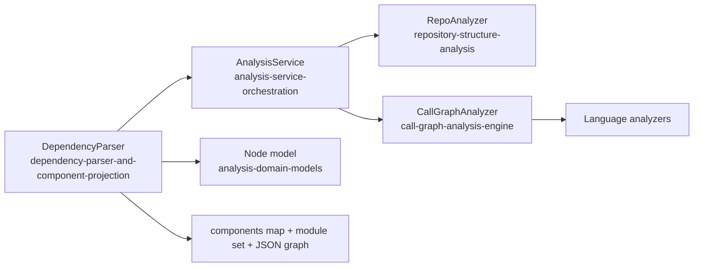
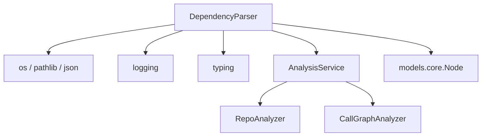
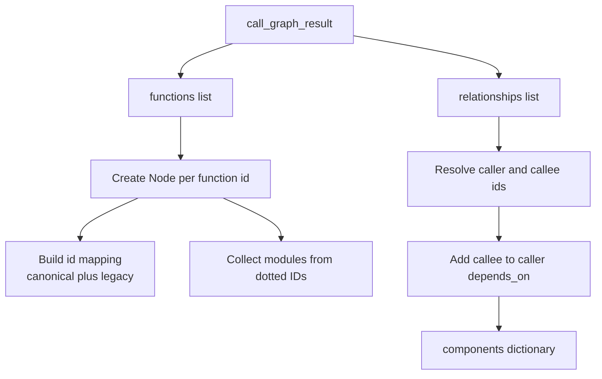
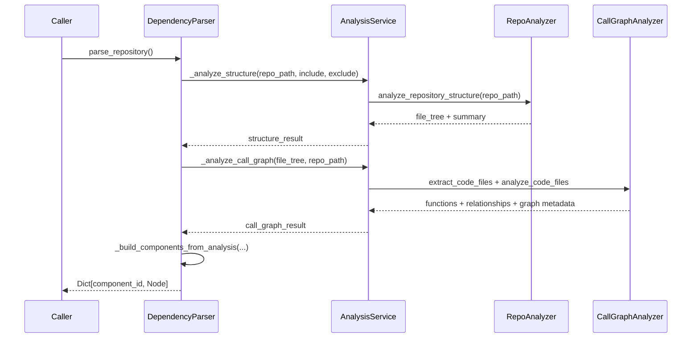
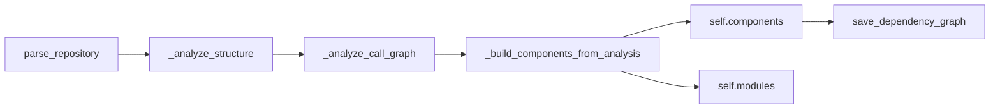
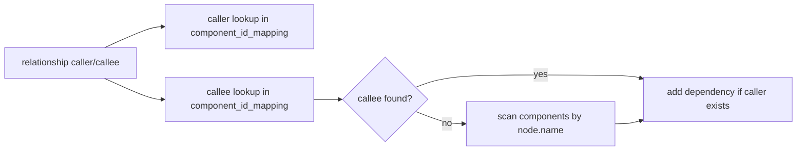
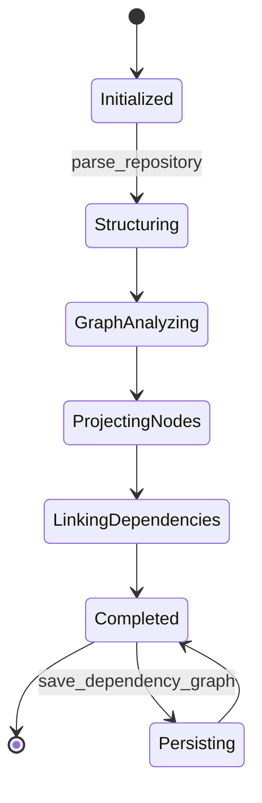
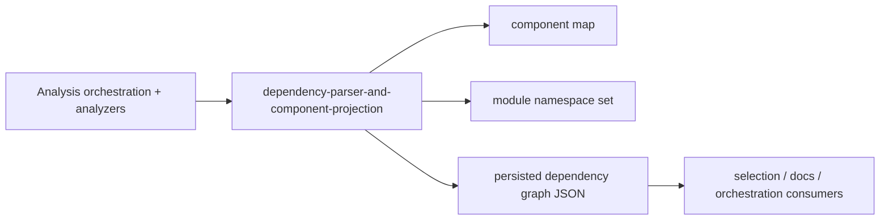

# dependency-parser-and-component-projection Module

## Introduction

The `dependency-parser-and-component-projection` module provides the **component projection layer** on top of the Dependency Analyzer pipeline.
Its core class, `DependencyParser`, takes repository analysis output (functions + call relationships) and converts it into a normalized in-memory map of `Node` components keyed by stable component IDs, with dependency edges projected into each node’s `depends_on` set.

In practical terms, this module is the bridge between raw call-graph extraction and downstream consumers that need a **component-centric dependency graph**.

---

## Core Component

### `DependencyParser`

`DependencyParser` is responsible for:

- orchestrating structure + call-graph analysis for a local repository path,
- converting function dictionaries into `Node` model instances,
- creating compatibility mappings between canonical and legacy IDs,
- projecting call relationships into `Node.depends_on`,
- collecting discovered module namespaces,
- serializing the projected dependency graph to JSON.

Primary public methods:

- `parse_repository(filtered_folders: List[str] = None) -> Dict[str, Node]`
- `save_dependency_graph(output_path: str)`

Important internal helpers:

- `_build_components_from_analysis(call_graph_result)`
- `_file_to_module_path(file_path)`
- `_determine_component_type(func_dict)`

---

## Architectural Position



This module does not parse source files directly; it composes existing orchestration and analysis services, then reshapes results into a projection tailored for component dependency use cases.

---

## Dependency Map



### Dependency behavior notes

- `DependencyParser` delegates analysis through `AnalysisService` internal methods (`_analyze_structure`, `_analyze_call_graph`).
- Component schema is aligned to `Node` fields, including documentation and source location metadata.
- Serialization relies on `Node.model_dump()` and performs explicit conversion of `depends_on` sets to JSON-safe lists.

---

## Internal Data Model Projection

`_build_components_from_analysis(...)` ingests:

- `functions`: list of analyzer-produced function/component dictionaries.
- `relationships`: list of caller/callee relationship dictionaries.

Projection behavior:

1. Build canonical `Node` objects from each function entry (`id` is mandatory).
2. Register lookup aliases in `component_id_mapping`:
   - canonical: `component_id -> component_id`
   - legacy fallback: `"<file_path>:<name>" -> component_id`
3. Derive module namespace candidates from dotted component IDs.
4. Resolve relationships and add edges to `Node.depends_on`.



---

## End-to-End Process Flow



---

## Component Interaction Details



### `parse_repository(...)`

- Logs repository and optional filtering configuration.
- Runs structure analysis first, then call-graph analysis.
- Builds in-memory projected components and dependency links.
- Returns `self.components`.

### `_build_components_from_analysis(...)`

- Normalizes heterogeneous analyzer payload keys (`source_code` vs `code_snippet`, `component_type` vs `node_type`).
- Preserves metadata such as docstrings, line spans, class context, display name.
- Attempts fallback callee resolution by direct `Node.name` matching if ID mapping misses.

### `save_dependency_graph(...)`

- Dumps component map as JSON object keyed by component ID.
- Ensures target directory exists.
- Converts set-valued dependencies for JSON compatibility.

---

## Relationship Resolution Logic



Resolution characteristics:

- Caller must resolve to an existing component ID; otherwise edge is skipped.
- Callee resolution prefers explicit mapping, then falls back to first name match.
- `is_resolved` is read from input but not currently used in projection decisions.

---

## Runtime Lifecycle (State View)



---

## Input/Output Contracts

### Constructor

`DependencyParser(repo_path, include_patterns=None, exclude_patterns=None)`

- `repo_path` is normalized to an absolute path.
- Include/exclude patterns are stored and forwarded to structure analysis.
- Initializes empty component/module collections and an `AnalysisService` instance.

### `parse_repository(...)` output

- `Dict[str, Node]`
  - key: canonical component ID
  - value: projected `Node` with populated metadata and `depends_on`

### `save_dependency_graph(...)` output

- returns serialized dictionary that was written to disk
- shape:

```json
{
  "component_id": {
    "id": "component_id",
    "name": "...",
    "depends_on": ["callee_id_1", "callee_id_2"],
    "...": "..."
  }
}
```

---

## Behavioral Nuances and Edge Cases

- `filtered_folders` parameter in `parse_repository(...)` is currently unused.
- `_determine_component_type(...)` and `_file_to_module_path(...)` are defined but not used in current projection flow.
- `processed_relationships` is tracked internally but not logged/returned.
- Name-based callee fallback may be ambiguous when multiple components share the same name.
- `self.components`/`self.modules` are instance state; repeated calls on the same parser instance can accumulate data unless explicitly reset externally.
- The parser depends on non-public `AnalysisService` methods (`_analyze_structure`, `_analyze_call_graph`), creating tighter coupling to orchestration internals.

---

## How This Module Fits the Overall System

`dependency-parser-and-component-projection` sits between analysis orchestration and downstream dependency graph consumers:

1. Reuses orchestration and analyzers from [analysis-service-orchestration.md](analysis-service-orchestration.md).
2. Consumes structure/call outputs from [repository-structure-analysis.md](repository-structure-analysis.md) and [call-graph-analysis-engine.md](call-graph-analysis-engine.md).
3. Produces component-level dependency data that can be consumed by graph post-processing modules such as [dependency-graph-build-and-leaf-selection.md](dependency-graph-build-and-leaf-selection.md).



---

## Related Modules

- [analysis-service-orchestration.md](analysis-service-orchestration.md)
- [repository-structure-analysis.md](repository-structure-analysis.md)
- [call-graph-analysis-engine.md](call-graph-analysis-engine.md)
- [analysis-domain-models.md](analysis-domain-models.md)
- [dependency-graph-build-and-leaf-selection.md](dependency-graph-build-and-leaf-selection.md)
