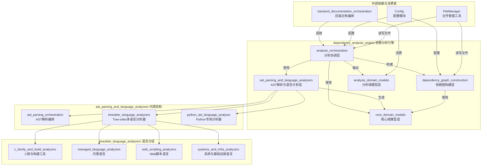
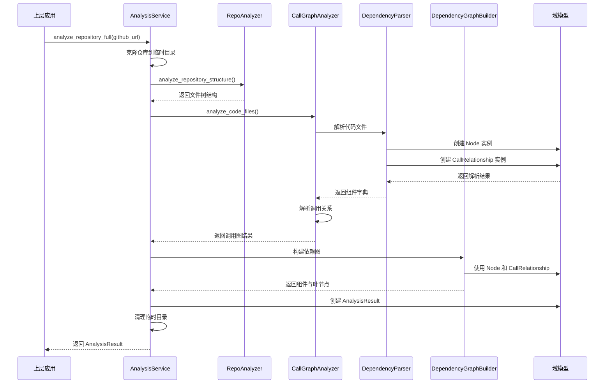

# `dependency_analysis_engine` 模块概览

## 1. 模块目的

`dependency_analysis_engine`（依赖分析引擎）是 CodeWiki 系统的核心分析组件，主要负责解析代码库并构建其内部依赖关系图。该模块通过多语言源代码解析、抽象语法树（AST）遍历和调用关系分析，为文档生成、代码理解和架构可视化提供基础数据支持。

本模块的核心价值在于：
- **多语言支持**：提供对 Python、JavaScript、TypeScript、Java、C#、C、C++、PHP、Go、Rust 等多种编程语言的解析能力
- **代码实体提取**：自动识别代码库中的类、函数、方法、接口等核心代码实体
- **依赖关系发现**：分析并构建代码实体间的调用、继承、实现、引用等依赖关系
- **结构化数据输出**：生成标准化的依赖图数据结构，供上层应用进行文档生成和可视化展示
- **叶节点识别**：智能识别代码库中的核心独立组件（叶节点），为模块化文档生成提供支持

`dependency_analysis_engine` 模块位于系统架构的中间层，向下对接具体的代码解析技术，向上为 `backend_documentation_orchestration` 提供分析结果，是连接原始代码与结构化文档的桥梁。

## 2. 模块架构

`dependency_analysis_engine` 采用分层架构设计，将代码解析、分析协调、图构建和数据建模等关注点分离，形成清晰的职责边界和灵活的扩展能力。

### 整体架构图

### 分层架构说明

`dependency_analysis_engine` 模块由以下五个核心子模块组成，形成自底向上的分析栈：

1. **core_domain_models（核心域模型层）**：
   - 定义系统中最基础的数据结构，如 `Node`、`CallRelationship` 和 `Repository`
   - 作为整个分析引擎的数据基础，被所有其他层依赖

2. **analysis_domain_models（分析域模型层）**：
   - 定义分析结果的数据结构，如 `AnalysisResult` 和 `NodeSelection`
   - 封装完整的分析输出，供上层应用消费

3. **ast_parsing_and_language_analyzers（AST解析与语言分析层）**：
   - 负责多语言源代码的解析，生成抽象语法树并提取代码实体
   - 包含基于 Tree-sitter 的通用分析器和 Python 专用分析器
   - 按语言特性进一步分组为 C 族、托管语言、Web 脚本语言和系统语言分析器

4. **dependency_graph_construction（依赖图构建层）**：
   - 通过 `DependencyGraphBuilder` 协调依赖解析过程
   - 构建完整的依赖关系图并智能识别叶节点组件
   - 提供依赖图的持久化存储功能

5. **analysis_orchestration（分析协调层）**：
   - 作为模块的门面（Facade），对外提供统一的分析接口
   - 协调仓库克隆、结构分析、调用图生成等完整流程
   - 管理整个分析生命周期，包括资源分配与清理

### 核心数据流

## 3. 核心子模块与组件参考

`dependency_analysis_engine` 包含以下核心子模块，每个子模块都有详细的文档说明：

### 3.1 analysis_orchestration（分析协调模块）
- **职责**：作为整个依赖分析引擎的入口和协调者，管理完整的分析流程
- **核心组件**：
  - `AnalysisService`：提供统一的分析 API，协调仓库克隆、结构分析和代码分析
  - `RepoAnalyzer`：负责仓库结构分析，构建文件树并应用过滤规则
  - `CallGraphAnalyzer`：协调多语言分析器，提取调用关系并构建调用图
- **详细文档**：[analysis_orchestration 模块文档](./analysis_orchestration.md)

### 3.2 ast_parsing_and_language_analyzers（AST 解析与语言分析器模块）
- **职责**：负责多语言源代码的解析，提取代码实体和依赖关系
- **核心组件**：
  - `DependencyParser`：AST 解析编排器，管理多语言解析过程
  - `PythonASTAnalyzer`：Python 语言专用分析器，基于 Python 标准库 `ast` 模块
  - 多种 Tree-sitter 分析器：支持 JavaScript、TypeScript、Java、C#、C、C++、PHP、Go、Rust 等语言
- **语言分组**：
  - `c_family_and_build_analyzers`：C、C++、CMake 分析器
  - `managed_language_analyzers`：Java、C# 分析器
  - `web_scripting_analyzers`：JavaScript、TypeScript、PHP 分析器
  - `systems_and_infra_analyzers`：Go、Rust、Bash、TOML 分析器
- **详细文档**：[ast_parsing_and_language_analyzers 模块文档](./ast_parsing_and_language_analyzers.md)

### 3.3 dependency_graph_construction（依赖图构建模块）
- **职责**：构建完整的代码依赖关系图，识别叶节点组件
- **核心组件**：
  - `DependencyGraphBuilder`：协调依赖图构建过程，提供持久化功能
- **主要功能**：
  - 从解析结果构建可遍历的图结构
  - 智能识别叶节点（无依赖或被依赖但不依赖其他的核心组件）
  - 支持依赖图的 JSON 持久化
- **详细文档**：[dependency_graph_construction 模块文档](./dependency_graph_construction.md)

### 3.4 core_domain_models（核心域模型模块）
- **职责**：定义依赖分析系统的基础数据结构
- **核心模型**：
  - `Node`：表示代码实体（类、函数、方法等）的节点对象
  - `CallRelationship`：表示节点间调用或依赖关系的对象
  - `Repository`：表示代码仓库的顶层容器对象
- **详细文档**：[core_domain_models 模块文档](./core_domain_models.md)

### 3.5 analysis_domain_models（分析域模型模块）
- **职责**：定义分析结果和选择配置的数据结构
- **核心模型**：
  - `AnalysisResult`：封装完整的仓库分析结果，包括仓库信息、函数列表、关系、文件树等
  - `NodeSelection`：定义部分导出或聚焦可视化的节点选择配置
- **详细文档**：[analysis_domain_models 模块文档](./analysis_domain_models.md)

## 4. 模块交互与集成

### 与其他模块的关系

`dependency_analysis_engine` 模块在 CodeWiki 系统中与以下模块有紧密交互：

1. **backend_documentation_orchestration（后端文档编排模块）**：
   - 作为主要消费者，调用 `dependency_analysis_engine` 进行代码分析
   - 消费 `AnalysisResult` 数据结构生成文档

2. **Config（配置模块）**：
   - 提供仓库路径、输出目录等关键配置信息
   - 支持自定义文件包含/排除模式

3. **FileManager（文件管理工具）**：
   - 提供目录创建和文件读写功能
   - 支持依赖图的持久化存储

4. **cli_documentation_workflow（CLI 文档工作流模块）**：
   - 通过后端间接使用依赖分析功能
   - 为命令行用户提供分析能力

### 典型使用流程

1. **初始化**：创建 `AnalysisService` 实例，配置分析参数
2. **执行分析**：调用 `analyze_repository_full()` 或相关方法开始分析
3. **获取结果**：接收 `AnalysisResult` 对象，包含完整的分析数据
4. **应用结果**：使用分析结果进行文档生成、可视化或其他处理
5. **资源清理**：确保临时资源被正确释放

## 5. 扩展与定制

`dependency_analysis_engine` 模块设计具有良好的扩展性，可以通过以下方式进行定制：

1. **添加新语言支持**：
   - 继承相应的分析器基类
   - 实现语言特定的解析逻辑
   - 在 `DependencyParser` 中注册新分析器

2. **自定义分析逻辑**：
   - 扩展 `AnalysisService` 添加新的分析方法
   - 定制叶节点识别逻辑
   - 添加自定义的依赖关系类型

3. **增强数据模型**：
   - 继承核心域模型添加额外字段
   - 扩展分析结果包含更多元数据

## 6. 注意事项与最佳实践

- **资源管理**：分析大型仓库可能消耗大量内存和时间，建议使用 `max_files` 参数限制分析规模
- **错误处理**：所有公共方法可能抛出 `RuntimeError`，建议使用 try-except 块进行错误处理
- **性能考虑**：结构分析通常很快，但完整的代码分析可能需要较长时间，建议先使用结构分析了解仓库规模
- **缓存机制**：当前实现不支持缓存，每次调用都会重新分析整个代码库，可根据需要扩展添加缓存功能

更多详细信息请参考各子模块的具体文档。