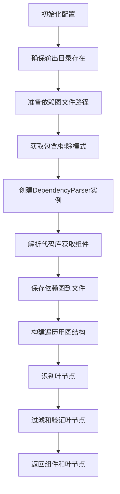
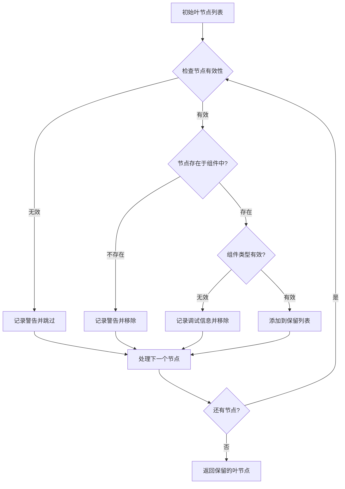
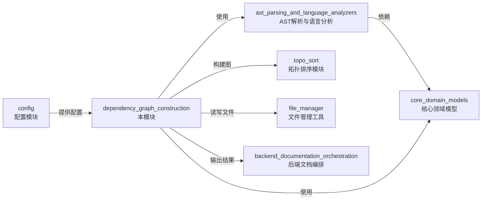

# dependency_graph_construction 模块文档

## 1. 模块概述

dependency_graph_construction 模块是 CodeWiki 依赖分析引擎的核心组件之一，主要负责构建代码库的依赖关系图并识别叶节点组件。该模块通过 `DependencyGraphBuilder` 类实现依赖图的构建、存储和分析，为后续的文档生成和代码理解提供了基础的结构信息。

### 设计目的

该模块的设计旨在：
- 协调依赖解析过程，将原始代码分析结果转换为结构化的依赖图
- 提供可持久化的依赖关系存储机制
- 智能识别代码库中的叶节点（无依赖或被其他组件依赖但自身不依赖其他组件的关键组件）
- 支持多语言代码库的统一依赖图表示

## 2. 核心组件详解

### DependencyGraphBuilder 类

`DependencyGraphBuilder` 是该模块的唯一核心类，负责整个依赖图构建流程的协调与执行。

#### 类定义与初始化

```python
class DependencyGraphBuilder:
    """Handles dependency analysis and graph building."""
    
    def __init__(self, config: Config):
        self.config = config
```

**参数说明：**
- `config`：`Config` 类型的配置对象，包含代码库路径、输出目录等关键配置信息

#### 主要方法：build_dependency_graph

```python
def build_dependency_graph(self) -> tuple[Dict[str, Any], List[str]]:
    """
    Build and save dependency graph, returning components and leaf nodes.
    
    Returns:
        Tuple of (components, leaf_nodes)
    """
```

这是该类的核心方法，执行完整的依赖图构建流程，返回解析得到的组件字典和叶节点列表。

**返回值：**
- `components`：字典类型，键为组件标识符，值为组件对象，包含组件的所有元数据和依赖关系
- `leaf_nodes`：列表类型，包含被识别为叶节点的组件标识符

## 3. 工作流程与架构

### 依赖图构建流程

`DependencyGraphBuilder` 的工作流程可以分为以下几个关键步骤：



### 详细流程说明

1. **初始化阶段**：
   - 接收配置对象并保存引用
   - 配置对象提供代码库路径、输出目录等关键信息

2. **输出准备阶段**：
   - 确保依赖图输出目录存在
   - 根据代码库名称生成安全的文件名（替换非字母数字字符为下划线）
   - 构造依赖图和过滤文件夹的完整输出路径

3. **解析配置阶段**：
   - 从配置中提取自定义的文件包含/排除模式
   - 这些模式用于限制分析的文件范围

4. **解析执行阶段**：
   - 创建 `DependencyParser` 实例，传入代码库路径和过滤模式
   - 调用 `parse_repository` 方法解析整个代码库，获取所有组件
   - 通过 `save_dependency_graph` 方法将依赖图保存为 JSON 文件

5. **图构建与分析阶段**：
   - 使用 `build_graph_from_components` 从组件构建可遍历的图结构
   - 使用 `get_leaf_nodes` 识别图中的叶节点
   - 根据组件类型和有效性对叶节点进行过滤和验证

6. **结果返回阶段**：
   - 返回完整的组件字典和过滤后的叶节点列表

### 叶节点过滤逻辑

叶节点过滤是该模块的一个关键功能，它确保只有有效的、有意义的组件被识别为叶节点：



**叶节点有效性检查包括：**
- 节点必须是字符串类型
- 节点不能是空字符串或仅包含空白字符
- 节点标识符不能包含错误相关关键词（如 'error'、'exception'、'failed'、'invalid'）

**有效组件类型确定逻辑：**
- 默认有效类型：`class`、`interface`、`struct`
- 如果代码库中没有上述类型的组件，则添加 `function` 类型作为有效类型

## 4. 与其他模块的关系

dependency_graph_construction 模块在整个依赖分析引擎中处于中间协调位置，与多个模块有紧密的交互：



### 关键依赖关系

1. **config 模块**：提供必要的配置信息，包括代码库路径、输出目录等
2. **ast_parsing_and_language_analyzers 模块**：通过 `DependencyParser` 类进行实际的代码解析
3. **topo_sort 模块**：提供图构建和叶节点识别的功能
4. **file_manager 工具**：负责目录创建和文件读写操作
5. **core_domain_models 模块**：定义了组件和节点的数据结构

## 5. 使用示例

### 基本使用方式

```python
from codewiki.src.config import Config
from codewiki.src.be.dependency_analyzer.dependency_graphs_builder import DependencyGraphBuilder

# 创建配置对象
config = Config(
    repo_path="/path/to/your/repository",
    output_dir="/path/to/output",
    dependency_graph_dir="/path/to/output/dependency_graphs",
    # 其他必要配置...
)

# 创建依赖图构建器
builder = DependencyGraphBuilder(config)

# 构建依赖图
components, leaf_nodes = builder.build_dependency_graph()

# 使用结果
print(f"找到 {len(components)} 个组件")
print(f"识别出 {len(leaf_nodes)} 个叶节点")

# 遍历叶节点
for leaf_node_id in leaf_nodes:
    component = components[leaf_node_id]
    print(f"叶节点: {component.name} ({component.component_type})")
```

### 带自定义过滤模式的使用

```python
# 创建带自定义指令的配置
agent_instructions = {
    "include_patterns": ["*.py", "*.js"],  # 只分析 Python 和 JavaScript 文件
    "exclude_patterns": ["*test*", "*Tests*"]  # 排除测试文件
}

config = Config.from_cli(
    repo_path="/path/to/repo",
    output_dir="/path/to/output",
    llm_base_url="https://api.example.com",
    llm_api_key="your-api-key",
    main_model="gpt-4",
    cluster_model="gpt-3.5-turbo",
    agent_instructions=agent_instructions
)

builder = DependencyGraphBuilder(config)
components, leaf_nodes = builder.build_dependency_graph()
```

## 6. 配置与依赖

### 配置项

`DependencyGraphBuilder` 依赖于 `Config` 对象提供以下关键配置：

| 配置项 | 类型 | 描述 |
|--------|------|------|
| `repo_path` | `str` | 要分析的代码库路径 |
| `dependency_graph_dir` | `str` | 依赖图文件的输出目录 |
| `include_patterns` | `Optional[List[str]]` | 可选的文件包含模式列表 |
| `exclude_patterns` | `Optional[List[str]]` | 可选的文件排除模式列表 |

### 依赖项

- **`DependencyParser`**：来自 `ast_parsing_and_language_analyzers` 模块，负责实际的代码解析
- **`build_graph_from_components`** 和 **`get_leaf_nodes`**：来自 `topo_sort` 模块，用于图结构构建和叶节点识别
- **`file_manager`**：文件管理工具，提供目录创建和 JSON 文件读写功能
- **`Config`**：配置类，提供所有必要的配置信息

## 7. 注意事项与限制

### 叶节点识别限制

- 叶节点识别基于组件类型，默认只考虑类、接口和结构体
- 对于函数式编程或主要由函数构成的代码库，会自动调整为包含函数类型
- 叶节点必须同时满足图论上的叶节点定义和组件类型有效性条件

### 错误处理

- 该模块会记录并跳过无效的叶节点标识符
- 如果叶节点在组件字典中找不到，会记录警告并从结果中移除
- 包含错误关键词的节点标识符会被自动过滤

### 性能考虑

- 依赖图构建的性能主要取决于代码库大小和复杂度
- 大型代码库可能需要较长的解析时间
- 生成的依赖图文件可能会很大，特别是对于大型代码库

### 持久化行为

- 依赖图会自动保存到配置的输出目录
- 文件命名基于代码库名称，特殊字符会被替换为下划线
- 当前实现不支持缓存机制，每次调用都会重新解析整个代码库

## 8. 扩展与定制

虽然 `DependencyGraphBuilder` 类的设计相对固定，但可以通过以下方式进行扩展：

1. **自定义叶节点过滤逻辑**：可以继承该类并重写叶节点验证部分
2. **添加缓存机制**：可以实现对解析结果的缓存，避免重复解析
3. **支持更多输出格式**：可以扩展保存依赖图的格式，除了 JSON 外还可以支持 GraphML、DOT 等格式

### 扩展示例：添加缓存功能

```python
class CachedDependencyGraphBuilder(DependencyGraphBuilder):
    def build_dependency_graph(self) -> tuple[Dict[str, Any], List[str]]:
        # 检查缓存是否存在
        if self._cache_exists():
            logger.info("Loading dependency graph from cache")
            return self._load_from_cache()
        
        # 缓存不存在，执行正常构建
        components, leaf_nodes = super().build_dependency_graph()
        
        # 保存到缓存
        self._save_to_cache(components, leaf_nodes)
        
        return components, leaf_nodes
```

## 9. 相关模块参考

- [ast_parsing_and_language_analyzers](ast_parsing_and_language_analyzers.md)：提供底层的代码解析功能
- [core_domain_models](core_domain_models.md)：定义了组件和依赖关系的数据结构
- [analysis_orchestration](analysis_orchestration.md)：负责更高层次的分析流程编排
- [backend_documentation_orchestration](../backend_documentation_orchestration.md)：使用本模块的输出进行文档生成
