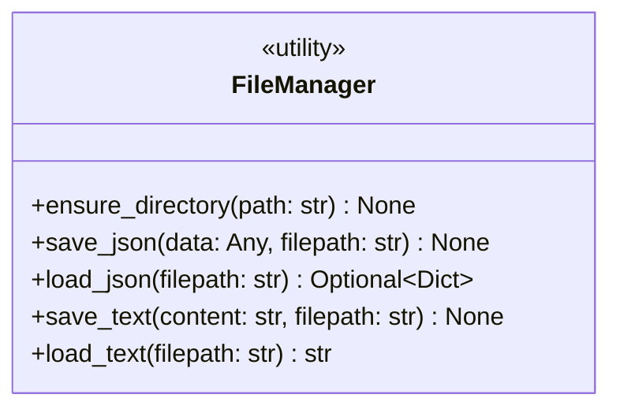
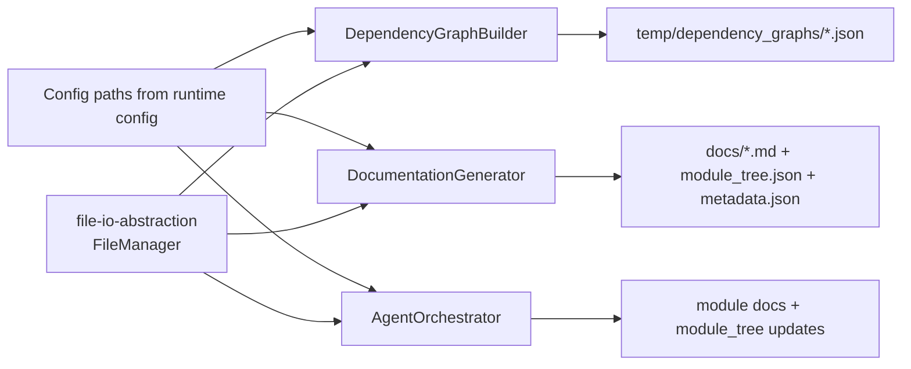
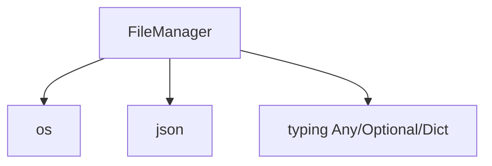
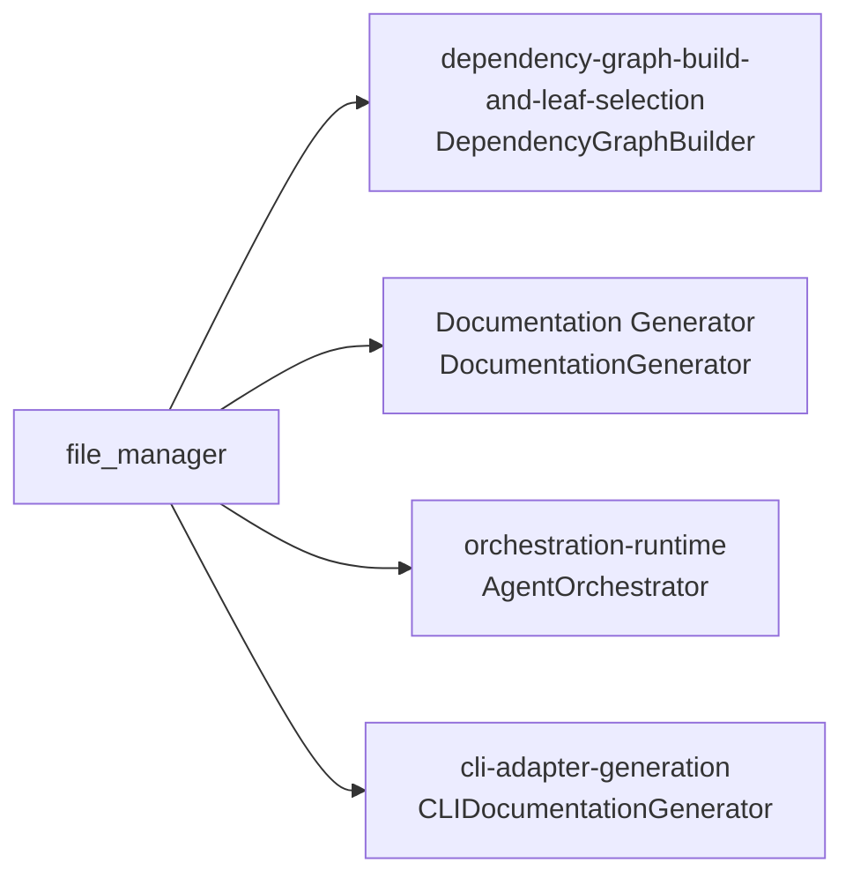
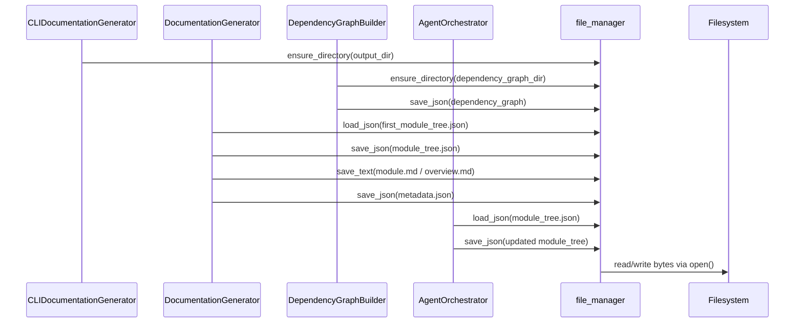
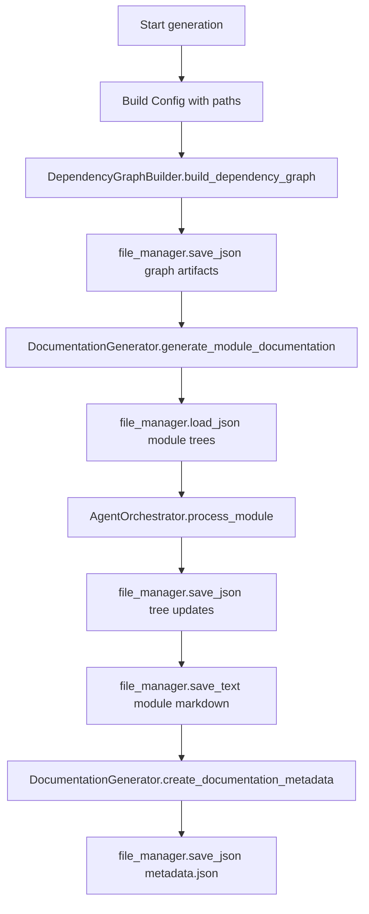
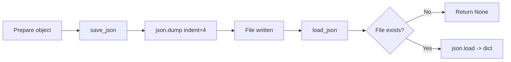

# file-io-abstraction Module

## Introduction

`file-io-abstraction` provides CodeWiki’s minimal, shared file-system I/O layer via a single core component: `codewiki.src.utils.FileManager` (plus the exported instance `file_manager`).

Its role is intentionally small but critical: **standardize directory creation and JSON/text persistence across backend generation workflows**.

Instead of each module doing ad-hoc `open()/json.dump()/os.makedirs()`, this module centralizes those operations so orchestration code stays focused on analysis and documentation logic.

---

## Purpose and Scope

### What this module does

- Creates directories safely (`ensure_directory`)
- Persists JSON (`save_json`)
- Loads JSON with missing-file tolerance (`load_json` returns `None` when absent)
- Persists plain text (`save_text`)
- Loads plain text (`load_text`)
- Exposes a reusable singleton-style object: `file_manager = FileManager()`

### What this module does **not** do

- No schema validation for JSON payloads
- No atomic writes/locking/concurrency control
- No custom exception wrapping/retry logic
- No path policy management (that belongs to configuration/runtime modules)

For configuration/path semantics, see [configuration-runtime-and-prompt-control.md](configuration-runtime-and-prompt-control.md).

---

## Core Component



### API behavior summary

| Method | Behavior | Return | Notable semantics |
|---|---|---|---|
| `ensure_directory(path)` | Calls `os.makedirs(path, exist_ok=True)` | `None` | Idempotent directory creation |
| `save_json(data, filepath)` | Writes pretty JSON (`indent=4`) | `None` | Overwrites file if it exists |
| `load_json(filepath)` | Reads JSON file | `dict` or `None` | Returns `None` if file is missing |
| `save_text(content, filepath)` | Writes string to file | `None` | Overwrites file if it exists |
| `load_text(filepath)` | Reads full file content | `str` | Raises if file missing/unreadable |

---

## Internal Design

`FileManager` is implemented as a **stateless static-method utility**. This gives:

- low coupling (no internal mutable state)
- easy call sites (`file_manager.save_json(...)`)
- straightforward testability (can monkeypatch at module boundary)

A module-level instance is exported:

```python
file_manager = FileManager()
```

This pattern offers ergonomic usage while preserving stateless semantics.

---

## Architecture Position



`file-io-abstraction` is a shared infrastructure layer under [Shared Configuration and Utilities.md](Shared%20Configuration%20and%20Utilities.md).

---

## Dependency Relationships

### Code-level dependencies



### System-level consumers



Related docs:
- [dependency-graph-build-and-leaf-selection.md](dependency-graph-build-and-leaf-selection.md)
- [Documentation Generator.md](Documentation%20Generator.md)
- [orchestration-runtime.md](orchestration-runtime.md)
- [cli-adapter-generation.md](cli-adapter-generation.md)

---

## Data Flow Patterns



Key observation: most high-level pipeline state transitions (graph snapshots, module trees, generated docs, metadata) cross the persistence boundary through this module.

---

## Component Interaction in a Typical Run



---

## Process Flows

### 1) JSON lifecycle flow



### 2) Text document flow


---

## Error Handling and Operational Semantics

- `load_json` is the only method with built-in missing-file soft behavior (`None`).
- Other methods rely on Python I/O exceptions (`FileNotFoundError`, `PermissionError`, JSON decode errors, etc.) to bubble up to orchestrators.
- This design keeps abstraction thin and lets higher layers decide retry/fallback policy.

This aligns with how `DocumentationGenerator` and CLI adapter already wrap stage-level failures and report them as job/runtime errors.

---

## Design Trade-offs

1. **Thin abstraction over robustness features**
   - Pros: simple, predictable, low overhead.
   - Cons: no atomic writes or corruption safeguards.

2. **Static utility + exported instance**
   - Pros: easy to import and use everywhere.
   - Cons: global usage pattern can make strict dependency injection harder.

3. **Mixed strictness across read methods**
   - `load_json`: tolerant of missing file.
   - `load_text`: strict; raises when missing.
   - This is practical for current pipeline expectations but should be documented for maintainers.

---

## Maintainer Guidance

If you extend this module, keep it narrowly scoped. Prefer adding generic, reusable filesystem primitives rather than workflow-specific logic.

Potential safe enhancements:

- optional UTF-8 encoding parameters
- atomic write helper (`write temp + rename`)
- `exists()` / `safe_load_text()` helper for symmetry with `load_json`

Any behavior change (especially exception semantics) should be validated against:
- [Documentation Generator.md](Documentation%20Generator.md)
- [orchestration-runtime.md](orchestration-runtime.md)
- [cli-adapter-generation.md](cli-adapter-generation.md)

---

## Related Module Documentation

- Parent context: [Shared Configuration and Utilities.md](Shared%20Configuration%20and%20Utilities.md)
- Configuration counterpart: [configuration-runtime-and-prompt-control.md](configuration-runtime-and-prompt-control.md)
- Main consumer orchestration:
  - [Documentation Generator.md](Documentation%20Generator.md)
  - [dependency-graph-build-and-leaf-selection.md](dependency-graph-build-and-leaf-selection.md)
  - [orchestration-runtime.md](orchestration-runtime.md)
  - [cli-adapter-generation.md](cli-adapter-generation.md)
