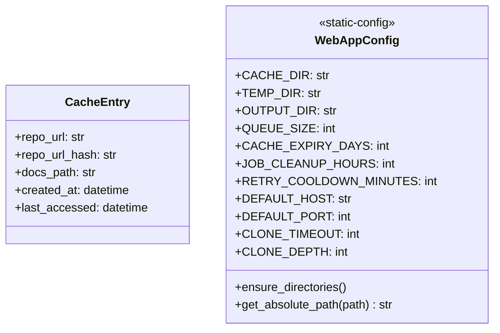
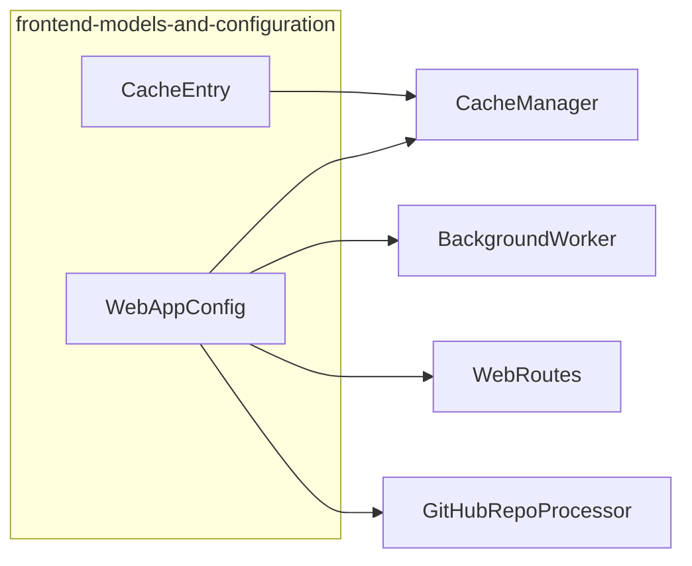
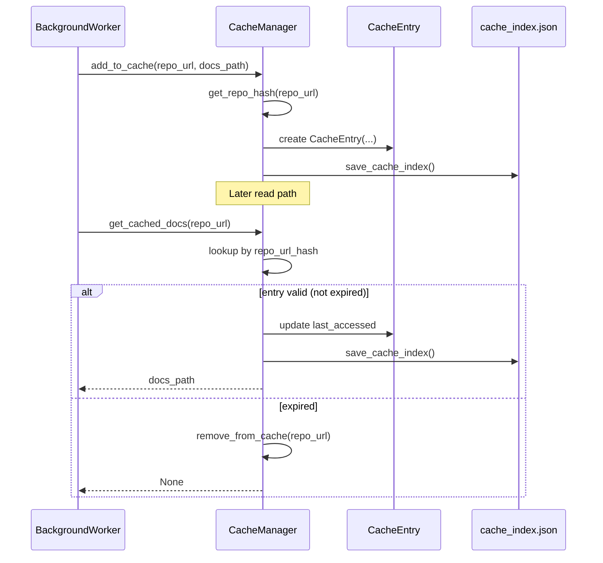
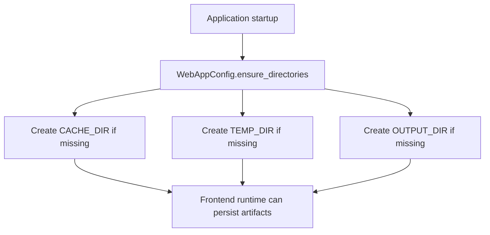
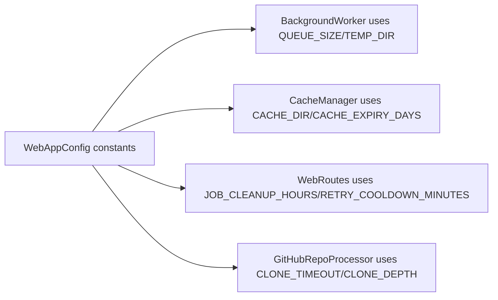
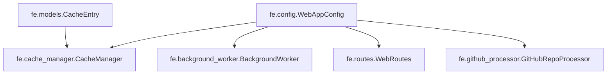
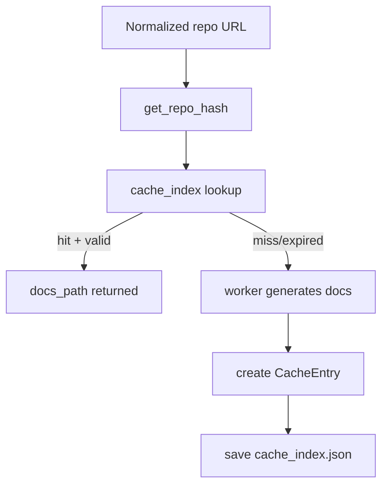

# frontend-models-and-configuration

## Introduction

The **frontend-models-and-configuration** module defines two foundational building blocks used across the Web Frontend runtime:

- `CacheEntry` (`codewiki.src.fe.models.CacheEntry`): the canonical in-memory/domain record for cached documentation metadata.
- `WebAppConfig` (`codewiki.src.fe.config.WebAppConfig`): centralized operational constants and filesystem setup utilities for frontend execution.

Although small, this module is a critical contract boundary: it standardizes how cache metadata is represented and how runtime defaults (paths, queue limits, cache TTL, retry windows, server defaults, git knobs) are shared across web-facing services.

---

## Purpose and Scope

This module is responsible for:

1. **Cache metadata schema** used by cache persistence/retrieval logic.
2. **Frontend runtime configuration constants** consumed by worker, routing, and repository processing code.
3. **Directory bootstrapping and path normalization helpers** used during app startup and path handling.

It does **not** contain queue execution, route orchestration, or rendering logic. For those behaviors, see:

- [job-processing-and-execution](job-processing-and-execution.md)
- [web-routing-and-request-lifecycle](web-routing-and-request-lifecycle.md)

---

## Component Overview

---

## Architecture Context

### Key relationships
- `CacheEntry` is instantiated and managed by `CacheManager` as the typed representation of each cache index row.
- `WebAppConfig` is a shared static configuration source for multiple frontend runtime components:
  - queue sizing (`BackgroundWorker`)
  - cleanup/retry policy (`WebRoutes`)
  - cache location and expiry (`CacheManager`)
  - clone behavior defaults (`GitHubRepoProcessor`)

---

## `CacheEntry` Detailed Documentation

### Data contract

`CacheEntry` is a dataclass with five fields:

- `repo_url`: normalized repository URL (e.g., `https://github.com/org/repo`)
- `repo_url_hash`: stable short hash key derived from URL
- `docs_path`: absolute/relative filesystem path to generated docs
- `created_at`: timestamp of cache creation
- `last_accessed`: timestamp updated on successful cache reads

### Lifecycle in the system

### Semantics and constraints
- Cache identity is URL-hash based (not commit-hash based in this module).
- Validity is determined by `created_at` relative to `WebAppConfig.CACHE_EXPIRY_DAYS`.
- `last_accessed` supports read-tracking and future cache policy evolution.

---

## `WebAppConfig` Detailed Documentation

### Configuration surface

| Area | Constants / Methods | Role |
|---|---|---|
| Directories | `CACHE_DIR`, `TEMP_DIR`, `OUTPUT_DIR` | Filesystem roots for cache, temporary clones, and output artifacts |
| Queue | `QUEUE_SIZE` | Upper bound for pending background jobs |
| Cache | `CACHE_EXPIRY_DAYS` | TTL used to invalidate stale cache entries |
| Job retention/retry | `JOB_CLEANUP_HOURS`, `RETRY_COOLDOWN_MINUTES` | Cleanup horizon and failed-job resubmission cooldown |
| Server | `DEFAULT_HOST`, `DEFAULT_PORT` | Web server defaults |
| Git | `CLONE_TIMEOUT`, `CLONE_DEPTH` | Clone behavior defaults for repo operations |
| Utility | `ensure_directories()` | Creates required output directories |
| Utility | `get_absolute_path(path)` | Normalizes paths to absolute form |

### Process flow: directory initialization

### Process flow: runtime policy usage

---

## Dependency Map

> For deeper behavior of these consumers, refer to:
> - [job-processing-and-execution](job-processing-and-execution.md)
> - [web-routing-and-request-lifecycle](web-routing-and-request-lifecycle.md)

---

## Data Flow Summary

This module contributes the **data shape** (`CacheEntry`) and **policy values** (`WebAppConfig`) that make the above flow deterministic across services.

---

## Interaction with Adjacent Frontend Models

`codewiki.src.fe.models` contains additional models (`RepositorySubmission`, `JobStatus`, `JobStatusResponse`) that define request and job-lifecycle contracts. This module focuses on the cache/config subset only.

For full request and status lifecycle details, see [web-routing-and-request-lifecycle](web-routing-and-request-lifecycle.md).

---

## Operational Notes for Maintainers

- Keep `WebAppConfig` as the single source of truth for frontend runtime defaults; avoid hardcoding equivalent constants in worker/router/cache code.
- If cache key precision must become commit-aware, evolve both `CacheEntry` semantics and `CacheManager` keying strategy together.
- Any changes to directory constants should be validated against startup initialization (`ensure_directories`) and persisted artifact locations used by job execution.

---

## Summary

The **frontend-models-and-configuration** module is a compact but central contract layer for the Web Frontend: `CacheEntry` standardizes cache metadata, while `WebAppConfig` centralizes runtime settings and bootstrapping utilities. Together, they provide stable data and policy primitives consumed by route handling and background execution flows.