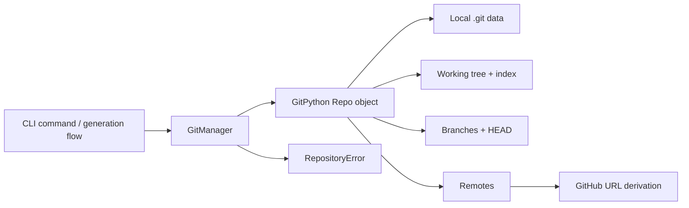
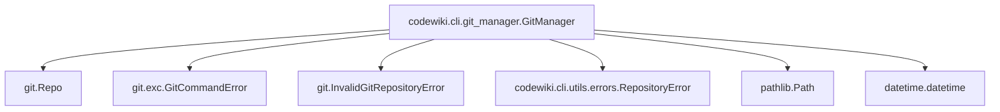
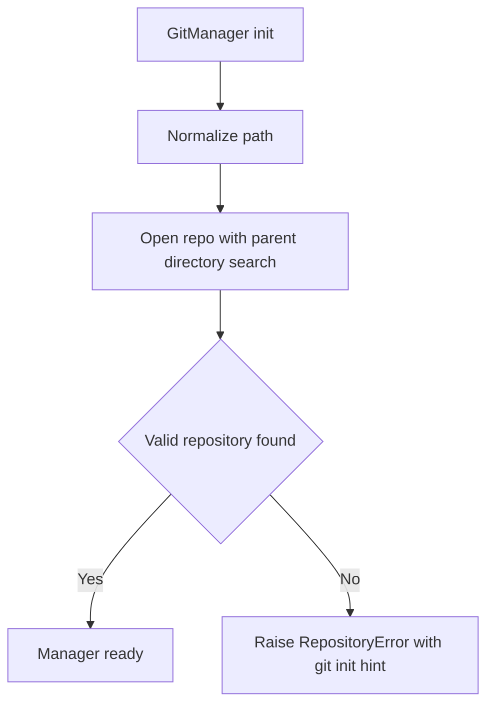
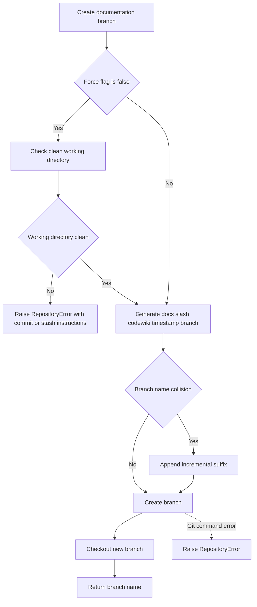
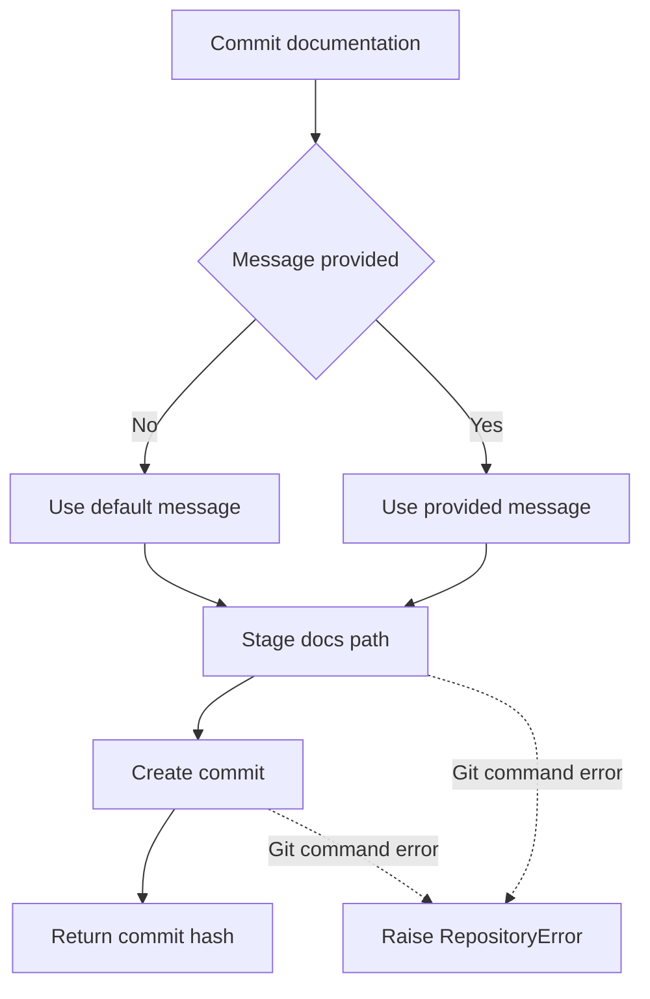
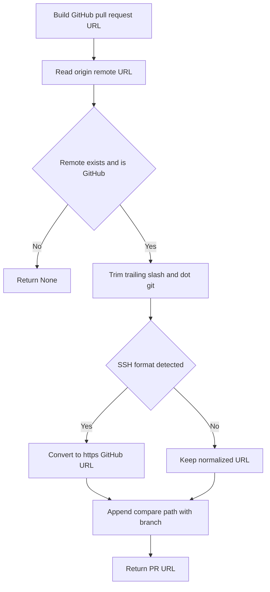
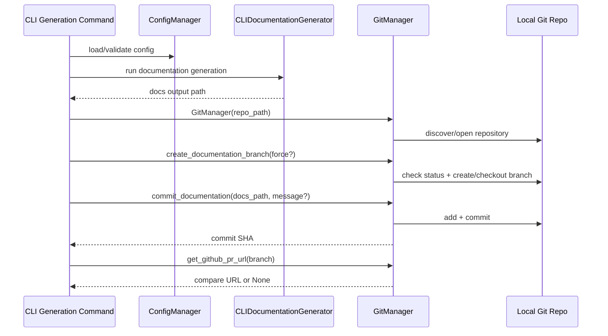
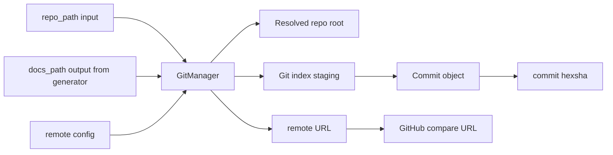
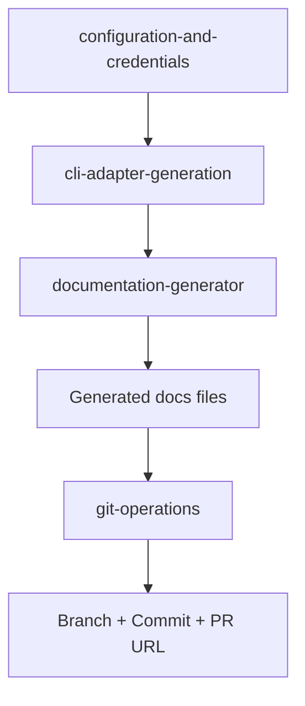

# git-operations Module

## Introduction

The `git-operations` module provides the CLI’s Git integration layer for documentation workflows.

Its core component, `codewiki.cli.git_manager.GitManager`, wraps GitPython operations behind CLI-friendly methods and errors so the rest of the system can:

- validate repository state,
- safely create documentation branches,
- commit generated docs,
- inspect branch/commit/remote metadata,
- generate GitHub PR links when possible.

In practice, this module is the **source-control safety and publishing helper** used by CLI generation flows.

---

## Core Component

- **`codewiki.cli.git_manager.GitManager`**

Primary direct dependencies:

- `git.Repo` / `git.exc.GitCommandError` (GitPython)
- `codewiki.cli.utils.errors.RepositoryError`
- `pathlib.Path`
- `datetime.datetime`

---

## Responsibilities and Scope

### In scope

1. Resolve and validate a Git repository from a user-provided path.
2. Check working tree cleanliness (including untracked files).
3. Create a timestamped docs branch (`docs/codewiki-YYYYMMDD-HHMMSS`) and checkout it.
4. Stage and commit generated documentation paths.
5. Expose repository metadata needed by CLI UX:
   - current branch,
   - current commit hash,
   - remote URL.
6. Build GitHub compare URL for opening PRs.

### Out of scope (delegated)

- CLI command orchestration and stage lifecycle management → [cli-adapter-generation.md](cli-adapter-generation.md)
- Runtime config/credentials resolution → [configuration-and-credentials.md](configuration-and-credentials.md)
- Documentation/LLM generation internals → [documentation-generator.md](documentation-generator.md)
- Progress bars and logging UX → [cli-observability.md](cli-observability.md)

---

## Architecture Overview

`GitManager` acts as a narrow adapter over GitPython, translating low-level Git failures and state checks into CLI-appropriate return values and `RepositoryError` exceptions.

---

## Public API and Behavior

### Constructor

- `GitManager(repo_path: Path)`

Behavior:

1. Normalizes path with `expanduser().resolve()`.
2. Opens repo via `git.Repo(..., search_parent_directories=True)`.
3. Raises `RepositoryError` with actionable guidance if path is not in a Git repository.

### Repository state methods

- `check_clean_working_directory() -> tuple[bool, str]`
  - Returns `(True, "Working directory is clean")` when clean.
  - Returns `(False, status_message)` with summarized modified and/or untracked files when dirty.

- `get_current_branch() -> str`
  - Returns active branch name.
  - Returns `"HEAD"` in detached-head state.

- `get_commit_hash() -> str`
  - Returns current HEAD commit SHA.

- `branch_exists(branch_name: str) -> bool`
  - Checks local branches only.

### Write operations

- `create_documentation_branch(force: bool = False) -> str`
  - If `force=False`, rejects dirty working directory with a detailed `RepositoryError`.
  - Creates `docs/codewiki-<timestamp>` and checks it out.
  - Adds numeric suffix (`-1`, `-2`, ...) if collision occurs.

- `commit_documentation(docs_path: Path, message: Optional[str] = None) -> str`
  - Stages `docs_path` into index.
  - Commits with provided message or default:
    - `Add generated documentation\n\nGenerated by CodeWiki CLI`
  - Returns commit hash.

### Remote/PR helpers

- `get_remote_url(remote_name: str = "origin") -> Optional[str]`
  - Returns remote URL if present, else `None`.

- `get_github_pr_url(branch_name: str) -> Optional[str]`
  - Returns compare URL only for GitHub remotes.
  - Handles SSH format conversion:
    - `git@github.com:org/repo.git` → `https://github.com/org/repo`
  - Produces: `<base>/compare/<branch_name>`.

---

## Dependency Map

---

## Process Flows

### 1) Repository initialization flow

### 2) Branch creation flow

### 3) Commit flow

### 4) GitHub PR URL flow

---

## Component Interaction (Typical CLI Usage)

---

## Data Flow and Artifacts

Key outputs surfaced to callers:

- branch name (on branch creation),
- commit hash (on commit),
- remote URL / GitHub compare URL (when available),
- cleanliness status summary (for preflight checks).

---

## Error Handling Semantics

`GitManager` normalizes Git-specific failures into `RepositoryError` for predictable CLI handling:

- invalid/non-repo path at construction,
- dirty tree blocking branch creation (unless forced),
- branch creation Git command failures,
- commit failures.

It uses non-exceptional `None` returns for optional metadata absence (e.g., missing remote), preserving a smooth UX for local-only repositories.

---

## Edge Cases and Operational Notes

1. **Detached HEAD**
   - `get_current_branch()` returns `"HEAD"` rather than failing.

2. **Dirty-state check includes untracked files**
   - `is_dirty(untracked_files=True)` means new files can block branch creation unless `force=True`.

3. **Branch uniqueness**
   - Timestamp naming minimizes collisions; suffix fallback handles same-second collisions.

4. **Remote detection scope**
   - `get_remote_url()` defaults to `origin`; non-standard remote names require explicit parameter.

5. **GitHub-only PR links**
   - Non-GitHub remotes return `None`; caller should conditionally present PR instructions.

---

## How This Module Fits in the Overall System

Within the **CLI Interface** layer, `git-operations` is typically used after documentation files are generated to package outputs into reviewable Git changes.

System role summary:

- **Before generation**: may provide repo metadata for context.
- **After generation**: creates branch/commit for sharing and review.
- **Publishing handoff**: emits URL hints to accelerate GitHub PR creation.

---

## Related Module Documentation

- [cli-adapter-generation.md](cli-adapter-generation.md)
- [configuration-and-credentials.md](configuration-and-credentials.md)
- [cli-observability.md](cli-observability.md)
- [html-viewer-generation.md](html-viewer-generation.md)
- [documentation-generator.md](documentation-generator.md)
- [dependency-analyzer.md](dependency-analyzer.md)
