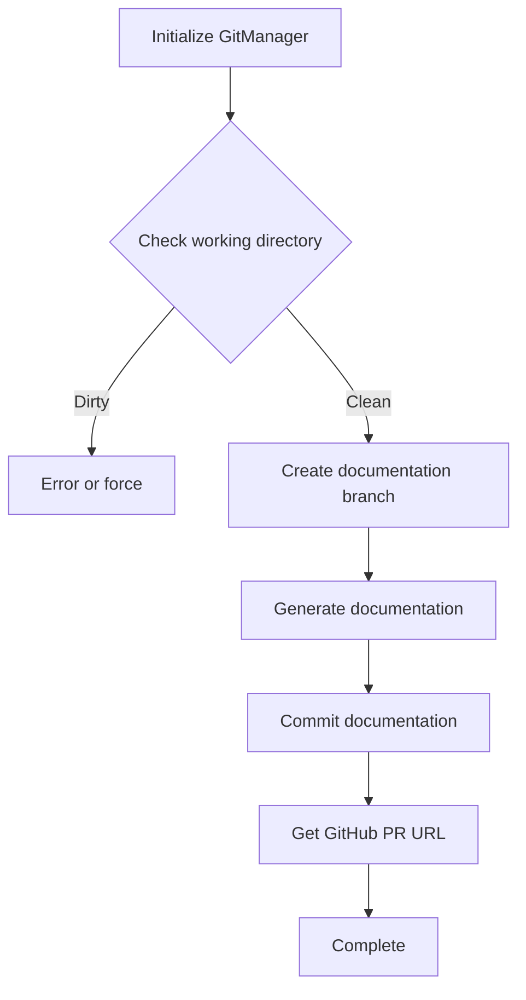

# Git Manager Submodule Documentation

## Overview

The `git_manager_submodule` is a core component of the CodeWiki CLI documentation workflow, providing Git repository management capabilities specifically tailored for documentation generation processes. This module encapsulates Git operations to ensure safe and structured handling of documentation changes within version control.

## Core Component: GitManager

The `GitManager` class is the central component of this module, responsible for managing all Git-related operations during the documentation generation workflow.

### Initialization

```python
def __init__(self, repo_path: Path):
    """
    Initialize git manager.
    
    Args:
        repo_path: Path to git repository
        
    Raises:
        RepositoryError: If not a valid git repository
    """
```

**Purpose**: Creates a new GitManager instance connected to a specific Git repository.

**Parameters**:
- `repo_path`: Path to the target Git repository (will be expanded and resolved)

**Behavior**:
- Automatically searches parent directories for a Git repository
- Validates that the path points to a valid Git repository
- Raises `RepositoryError` if no valid Git repository is found

**Example**:
```python
from pathlib import Path
from codewiki.cli.git_manager import GitManager

# Initialize with a repository path
git_manager = GitManager(Path("./my-project"))
```

### Key Methods

#### check_clean_working_directory

```python
def check_clean_working_directory(self) -> Tuple[bool, str]:
    """
    Check if working directory is clean (no uncommitted changes).
    
    Returns:
        Tuple of (is_clean, status_message)
    """
```

**Purpose**: Verifies that the working directory has no uncommitted changes or untracked files.

**Returns**:
- A tuple containing:
  - `bool`: `True` if working directory is clean, `False` otherwise
  - `str`: Human-readable status message describing any changes

**Behavior**:
- Checks both modified files and untracked files
- Provides a summary of changes (up to 3 files each for modified and untracked)
- Indicates if there are additional files beyond the first 3

**Example**:
```python
is_clean, status = git_manager.check_clean_working_directory()
if not is_clean:
    print(f"Working directory not clean: {status}")
```

#### create_documentation_branch

```python
def create_documentation_branch(self, force: bool = False) -> str:
    """
    Create a new documentation branch with timestamp.
    
    Args:
        force: Force creation even if dirty working directory
        
    Returns:
        Branch name
        
    Raises:
        RepositoryError: If working directory is dirty (unless force=True)
    """
```

**Purpose**: Creates and checks out a new branch specifically for documentation changes.

**Parameters**:
- `force`: If `True`, bypasses the clean working directory check

**Returns**:
- The name of the newly created branch

**Branch Naming Convention**:
- Format: `docs/codewiki-YYYYMMDD-HHMMSS`
- Example: `docs/codewiki-20231215-143022`
- If the timestamp-based name already exists, appends a counter (e.g., `-1`, `-2`)

**Behavior**:
- By default, checks for clean working directory first
- If dirty and not forced, provides helpful Git commands to resolve the situation
- Creates the branch and checks it out automatically
- Raises `RepositoryError` if branch creation fails

**Example**:
```python
try:
    branch_name = git_manager.create_documentation_branch()
    print(f"Created and switched to branch: {branch_name}")
except RepositoryError as e:
    print(f"Error: {e}")
```

#### commit_documentation

```python
def commit_documentation(
    self,
    docs_path: Path,
    message: Optional[str] = None
) -> str:
    """
    Commit generated documentation.
    
    Args:
        docs_path: Path to documentation directory
        message: Commit message (optional)
        
    Returns:
        Commit hash
        
    Raises:
        RepositoryError: If commit fails
    """
```

**Purpose**: Commits the generated documentation files to the current branch.

**Parameters**:
- `docs_path`: Path to the documentation directory to commit
- `message`: Optional custom commit message

**Returns**:
- The hexadecimal SHA hash of the new commit

**Default Commit Message**:
```
Add generated documentation

Generated by CodeWiki CLI
```

**Behavior**:
- Adds all files in the specified documentation directory
- Creates a commit with either the provided or default message
- Returns the commit hash for reference
- Raises `RepositoryError` if the commit operation fails

**Example**:
```python
docs_path = Path("./docs/generated")
commit_hash = git_manager.commit_documentation(
    docs_path,
    message="Update API documentation for v2.1"
)
print(f"Documentation committed with hash: {commit_hash}")
```

#### get_remote_url

```python
def get_remote_url(self, remote_name: str = "origin") -> Optional[str]:
    """
    Get remote repository URL.
    
    Args:
        remote_name: Name of remote (default: origin)
        
    Returns:
        Remote URL or None if no remote
    """
```

**Purpose**: Retrieves the URL of a named remote repository.

**Parameters**:
- `remote_name`: Name of the remote to query (default: "origin")

**Returns**:
- The remote URL as a string, or `None` if the remote doesn't exist

**Example**:
```python
remote_url = git_manager.get_remote_url()
if remote_url:
    print(f"Remote repository: {remote_url}")
```

#### get_current_branch

```python
def get_current_branch(self) -> str:
    """
    Get current branch name.
    
    Returns:
        Branch name
    """
```

**Purpose**: Returns the name of the currently active branch.

**Returns**:
- The current branch name, or "HEAD" if in detached HEAD state

**Example**:
```python
current_branch = git_manager.get_current_branch()
print(f"Currently on branch: {current_branch}")
```

#### get_commit_hash

```python
def get_commit_hash(self) -> str:
    """
    Get current commit hash.
    
    Returns:
        Commit hash
    """
```

**Purpose**: Retrieves the hash of the current HEAD commit.

**Returns**:
- The full hexadecimal commit hash

**Example**:
```python
commit_hash = git_manager.get_commit_hash()
print(f"Current commit: {commit_hash}")
```

#### branch_exists

```python
def branch_exists(self, branch_name: str) -> bool:
    """
    Check if a branch exists.
    
    Args:
        branch_name: Branch name to check
        
    Returns:
        True if exists, False otherwise
    """
```

**Purpose**: Checks if a branch with the given name exists in the repository.

**Parameters**:
- `branch_name`: Name of the branch to check

**Returns**:
- `True` if the branch exists, `False` otherwise

**Example**:
```python
if git_manager.branch_exists("docs/old-version"):
    print("Old documentation branch still exists")
```

#### get_github_pr_url

```python
def get_github_pr_url(self, branch_name: str) -> Optional[str]:
    """
    Get GitHub PR creation URL for a branch.
    
    Args:
        branch_name: Branch name
        
    Returns:
        PR URL or None if not a GitHub repo
    """
```

**Purpose**: Generates a URL for creating a GitHub Pull Request from the specified branch.

**Parameters**:
- `branch_name`: Name of the branch to create a PR for

**Returns**:
- A GitHub PR URL, or `None` if the remote isn't a GitHub repository

**Behavior**:
- Converts SSH URLs to HTTPS format for better accessibility
- Removes `.git` suffix from the URL if present
- Returns `None` if "github.com" is not found in the remote URL

**Example**:
```python
pr_url = git_manager.get_github_pr_url("docs/codewiki-20231215-143022")
if pr_url:
    print(f"Create a PR at: {pr_url}")
```

## Architecture and Usage

### Integration with Other Modules

The `git_manager_submodule` is designed to work closely with other components of the CLI documentation workflow:

- **[config_manager_submodule](config_manager_submodule.md)**: May provide configuration for Git operations
- **[doc_generator_submodule](doc_generator_submodule.md)**: Uses GitManager to commit generated documentation
- **[progress_logging_submodule](progress_logging_submodule.md)**: May log Git operations for user feedback

### Typical Workflow

A typical documentation generation workflow using GitManager would be:



**Step-by-Step Explanation**:
1. Initialize GitManager with the repository path
2. Check if the working directory is clean
3. Create a new documentation branch
4. Generate documentation (using other components)
5. Commit the generated documentation
6. Optionally, get a GitHub PR URL for the branch

## Error Handling

The module uses custom exceptions from `codewiki.cli.utils.errors`:

- **RepositoryError**: Raised for various Git-related error conditions:
  - Invalid Git repository during initialization
  - Dirty working directory when creating a branch (without force)
  - Failed branch creation
  - Failed commit operation

## Edge Cases and Considerations

1. **Detached HEAD State**: `get_current_branch()` returns "HEAD" when in detached HEAD state
2. **Existing Branch Names**: The branch creation logic handles duplicate timestamp-based names by appending counters
3. **SSH vs HTTPS Remotes**: `get_github_pr_url()` automatically converts SSH URLs to HTTPS
4. **Non-GitHub Repositories**: The PR URL generation gracefully returns `None` for non-GitHub repositories
5. **Large Number of Changes**: The status check only shows the first 3 files for each category (modified, untracked) with an indicator if there are more

## Configuration Options

Currently, GitManager doesn't have explicit configuration options beyond what's provided through method parameters. Future versions might integrate with [Configuration](config_manager_submodule.md) for additional customization.

## Security Considerations

- GitManager doesn't handle authentication for remote operations
- Users should ensure they have appropriate Git credentials configured for any remote operations
- The module doesn't perform any sanitization of branch names beyond the timestamp-based generation

## Extending the Module

When extending GitManager, consider:
- Adding methods for pushing branches to remotes
- Implementing pull/rebase operations
- Adding support for tagging documentation versions
- Integrating with GitLab or other Git platforms for PR/MR URL generation
