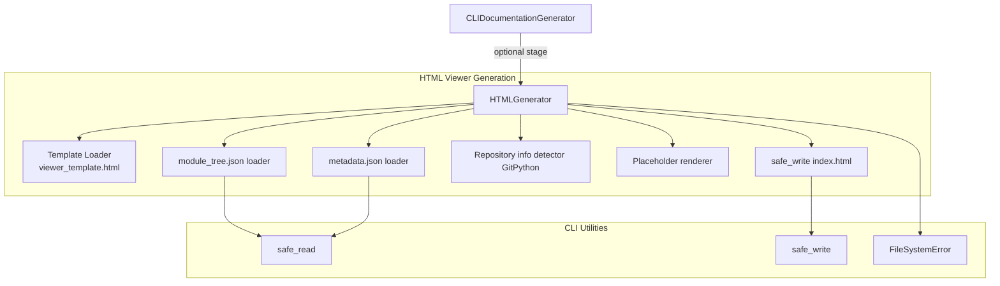
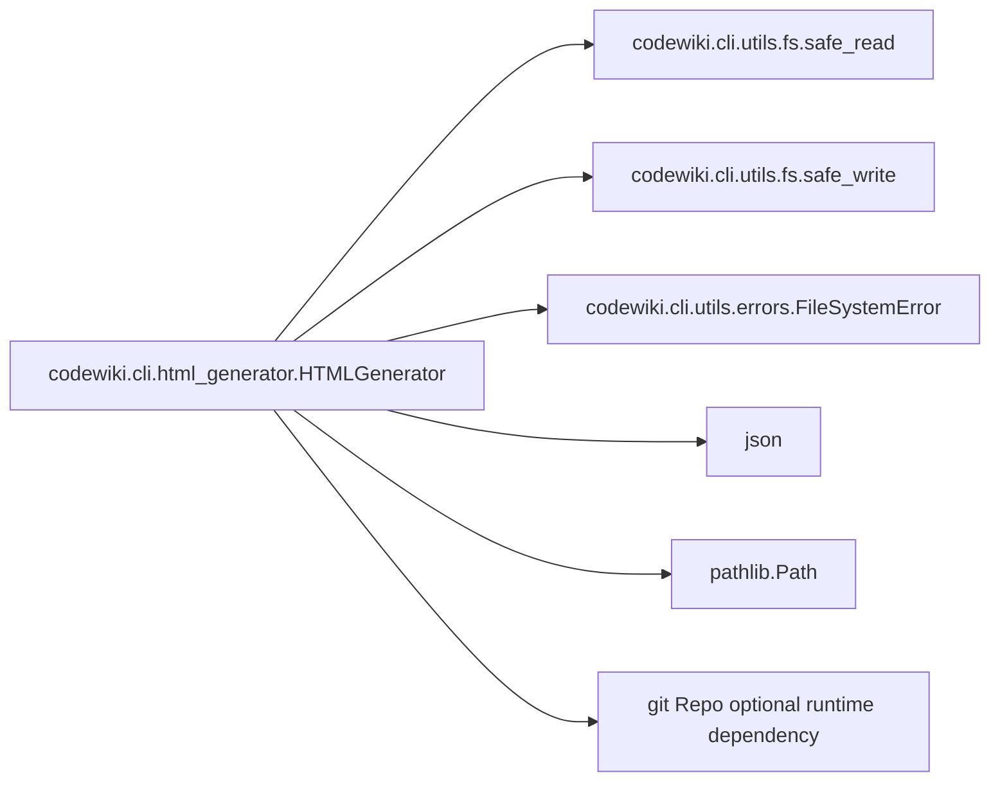
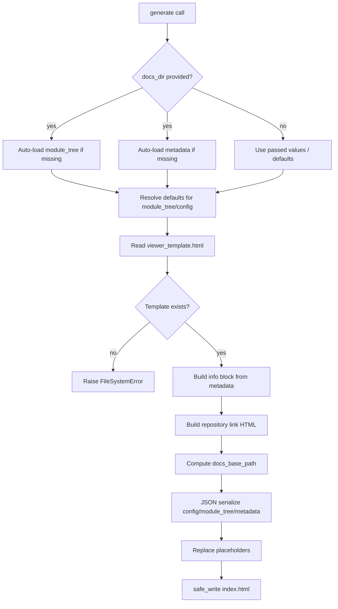
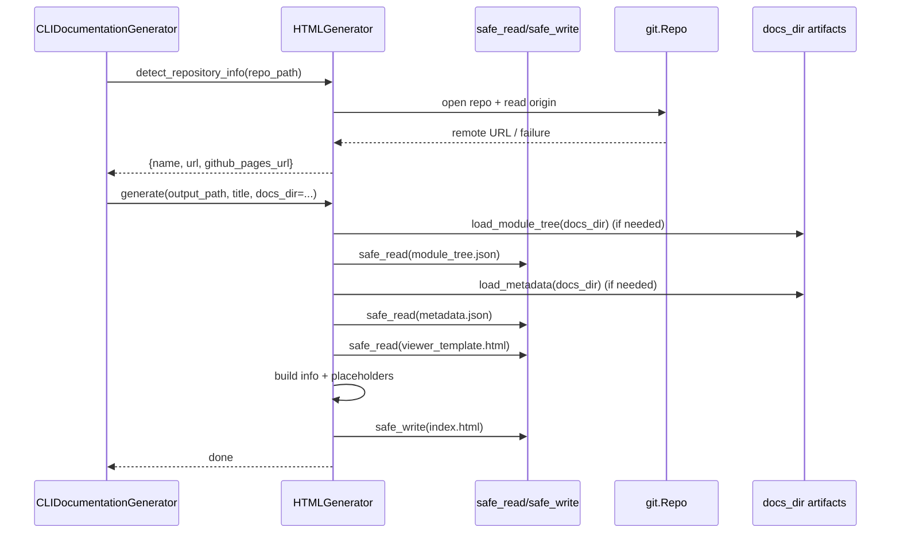
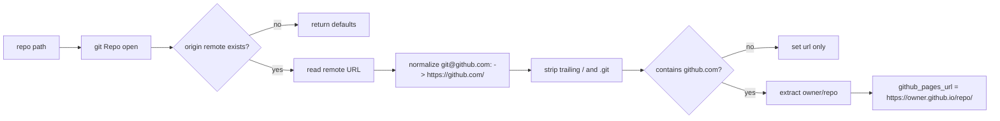

# html-viewer-generation Module

## Introduction

The `html-viewer-generation` module provides static viewer generation for CodeWiki’s CLI output. Its core component, `HTMLGenerator`, transforms generated documentation artifacts (Markdown + JSON metadata/module tree) into a single `index.html` tailored for GitHub Pages and local browsing.

At runtime, this module is usually invoked by the CLI adapter layer (see [cli-adapter-generation.md](cli-adapter-generation.md)) as an optional final stage.

---

## Core Component

- **`codewiki.cli.html_generator.HTMLGenerator`**

`HTMLGenerator` is a focused utility class that:

1. Locates and loads the HTML template.
2. Loads documentation context (`module_tree.json`, `metadata.json`) when available.
3. Builds embeddable JSON payloads and optional repository info blocks.
4. Replaces template placeholders.
5. Writes a fully self-contained `index.html` file.

---

## Module Responsibilities

### In scope

- Static HTML viewer generation from docs artifacts.
- Template placeholder replacement.
- Safe file I/O via CLI filesystem utilities.
- Best-effort metadata/repo enrichment (non-fatal when absent).
- GitHub remote normalization + GitHub Pages URL inference.

### Out of scope

- Producing Markdown documentation content itself (see [documentation-generator.md](documentation-generator.md)).
- Progress lifecycle and stage orchestration (see [cli-adapter-generation.md](cli-adapter-generation.md) and [cli-observability.md](cli-observability.md)).
- Persistent user/repo config management (see [configuration-and-credentials.md](configuration-and-credentials.md)).

---

## Internal API Overview

### Constructor

`HTMLGenerator(template_dir: Optional[Path] = None)`

- Uses provided `template_dir` when supplied.
- Otherwise defaults to package template path:
  - `codewiki/templates/github_pages/viewer_template.html` (resolved relative to module).

### Public methods

1. **`load_module_tree(docs_dir)`**
   - Reads `module_tree.json` from docs directory.
   - If missing, returns a fallback “Overview” tree.
   - Raises `FileSystemError` if read/parse fails.

2. **`load_metadata(docs_dir)`**
   - Reads `metadata.json` if present.
   - Returns `None` when absent or non-critical parse/read errors occur.

3. **`generate(...)`**
   - Main entrypoint for viewer generation.
   - Optionally auto-loads module tree + metadata from `docs_dir`.
   - Validates template presence.
   - Constructs info/repository sections and embedded JSON blocks.
   - Replaces placeholders and writes output atomically.

4. **`detect_repository_info(repo_path)`**
   - Uses GitPython (`git.Repo`) to infer:
     - repository name,
     - remote URL (normalized https URL),
     - GitHub Pages URL when hosted on GitHub.
   - Best-effort behavior: returns partial info without raising on failure.

### Private helpers

- **`_build_info_content(metadata)`**: Produces HTML snippets from generation metadata.
- **`_escape_html(text)`**: Escapes HTML-sensitive characters to reduce injection risk in text fields.

---

## Architecture and Component Relationships

Notes:
- This module has a **thin dependency surface**: local template + safe fs helpers + optional GitPython.
- It is intentionally decoupled from dependency analysis and LLM orchestration internals.

---

## Dependency Map

Cross-module system references:
- Called by [cli-adapter-generation.md](cli-adapter-generation.md).
- Consumes artifacts generated by [documentation-generator.md](documentation-generator.md).
- Uses repository context that may also be used in [git-operations.md](git-operations.md).

---

## End-to-End Generation Flow

---

## Component Interaction Sequence

---

## Data Contracts and Embedded Payloads

`generate()` injects these values into template placeholders:

- `{{TITLE}}` → escaped page title.
- `{{REPO_LINK}}` → optional anchor to repository URL.
- `{{SHOW_INFO}}` → `block` or `none` based on metadata-derived info presence.
- `{{INFO_CONTENT}}` → generated HTML rows (model, date, commit, stats).
- `{{CONFIG_JSON}}` → JSON configuration object.
- `{{MODULE_TREE_JSON}}` → module tree JSON.
- `{{METADATA_JSON}}` → metadata JSON or `null`.
- `{{DOCS_BASE_PATH}}` → path hint for locating docs assets.

### Metadata fields consumed

`_build_info_content()` reads selected metadata structure:

- `generation_info.main_model`
- `generation_info.timestamp` (ISO parsing with graceful failure)
- `generation_info.commit_id` (first 8 chars)
- `statistics.total_components`
- `statistics.max_depth`

Unknown/additional fields are ignored.

---

## Repository Detection Logic

Behavioral notes:
- Errors are swallowed (best-effort), preventing HTML generation from failing due to git issues.
- URL normalization is targeted specifically at common GitHub SSH remotes.

---

## Error Handling Strategy

The module mixes **strict** and **lenient** failure modes intentionally:

### Strict (raises `FileSystemError`)

- Template missing in `generate()`.
- Module tree read/parse failure in `load_module_tree()`.
- Write failure while persisting `index.html` (via `safe_write`).

### Lenient (returns defaults / `None`)

- Missing `module_tree.json` → fallback overview tree.
- Missing or malformed `metadata.json` → no info panel.
- Git detection failures → partial repository info without exception.

This design keeps viewer generation robust for partial documentation states while still failing on core output/template integrity issues.

---

## Files and Artifacts

Primary inputs:

- `docs_dir/module_tree.json` (optional but expected in normal pipeline)
- `docs_dir/metadata.json` (optional enrichment)
- `templates/github_pages/viewer_template.html` (required)

Primary output:

- `<output_path>/index.html` (self-contained viewer shell)

Supporting filesystem behavior from `safe_write`:

- atomic write pattern (`.tmp` then replace), which reduces risk of partial/corrupt output during failures.

---

## How This Module Fits in the Overall System

Within the CLI Interface domain, `html-viewer-generation` is the **presentation packaging layer** that sits after content generation:

1. Dependency + module analysis define documentation structure (see [dependency-analyzer.md](dependency-analyzer.md)).
2. Documentation generation produces Markdown and metadata (see [documentation-generator.md](documentation-generator.md)).
3. This module emits a static web entry point (`index.html`) for browser-based navigation of those artifacts.

It acts as a bridge between generated data artifacts and a deployable/readable static viewer (especially GitHub Pages).

---

## Maintenance Notes

- Keep template placeholder names synchronized between `viewer_template.html` and replacement dictionary in `generate()`.
- If metadata schema evolves, `_build_info_content()` should be updated conservatively (maintaining backward compatibility).
- `docs_base_path` logic currently relies on directory name heuristics; verify behavior when output and docs locations diverge.
- If broader remote URL formats are needed (GitLab/enterprise GitHub), extend `detect_repository_info()` normalization rules.

---

## Related Module Documentation

- [cli-adapter-generation.md](cli-adapter-generation.md)
- [git-operations.md](git-operations.md)
- [documentation-generator.md](documentation-generator.md)
- [dependency-analyzer.md](dependency-analyzer.md)
- [configuration-and-credentials.md](configuration-and-credentials.md)
- [cli-observability.md](cli-observability.md)
