# java-c-cpp-csharp-analyzers

## Introduction

The **java-c-cpp-csharp-analyzers** module provides Tree-sitter-based static analysis for four compiled language families in CodeWiki’s Dependency Analyzer pipeline:

- Java (`TreeSitterJavaAnalyzer`)
- C (`TreeSitterCAnalyzer`)
- C++ (`TreeSitterCppAnalyzer`)
- C# (`TreeSitterCSharpAnalyzer`)

Its responsibility is to transform a single source file into normalized graph primitives:

- `Node` objects (discovered components)
- `CallRelationship` edges (dependencies and usage links)

These outputs are consumed downstream by graph resolution/projection services rather than fully resolved in this module.

---

## Scope and Responsibilities

This module focuses on **language-specific AST extraction**, not repository orchestration.

### What it does

1. Parse one file at a time using Tree-sitter grammars.
2. Extract language constructs into `Node` entries.
3. Build stable component IDs based on repository-relative module paths.
4. Emit relationship edges (calls, inheritance, field/property/type usage, object creation).
5. Return `(List[Node], List[CallRelationship])` through wrapper functions.

### What it does not do

- Repository traversal and file discovery.
- Cross-repository/global symbol resolution.
- Final deduplication/normalization across all files.

Those responsibilities are handled by:
- [call-graph-analysis-engine](call-graph-analysis-engine.md)
- [dependency-parser-and-component-projection](dependency-parser-and-component-projection.md)
- [analysis-service-orchestration](analysis-service-orchestration.md)

---

## Core Components

### `TreeSitterJavaAnalyzer`
**Path:** `codewiki.src.be.dependency_analyzer.analyzers.java.TreeSitterJavaAnalyzer`

Extracts nodes for:
- class / abstract class
- interface
- enum
- record
- annotation
- method (stored as `ClassName.method` name when class context exists)

Extracts relationships for:
- inheritance (`class extends`)
- interface implementation (`implements`)
- field type usage
- method invocation (object-based, heuristic variable type lookup)
- object creation (`new`)

Key characteristics:
- Uses primitive/common built-in filter set to avoid noisy links.
- Frequently emits unresolved edges (`is_resolved=False`) for later global resolution.

---

### `TreeSitterCAnalyzer`
**Path:** `codewiki.src.be.dependency_analyzer.analyzers.c.TreeSitterCAnalyzer`

Extracts nodes for:
- function definitions
- struct definitions (including typedef-struct forms)
- global variables (tracked in lookup map; only function/struct emitted in final `nodes` list)

Extracts relationships for:
- function-to-function calls (excluding known libc/system functions)
- function usage of global variables

Key characteristics:
- Treats global variable references as resolved intra-file dependencies.
- Emits function call targets as simple names for later cross-file resolution.

---

### `TreeSitterCppAnalyzer`
**Path:** `codewiki.src.be.dependency_analyzer.analyzers.cpp.TreeSitterCppAnalyzer`

Extracts nodes for:
- class
- struct
- function
- method (detected from enclosing class/struct; used in lookup)
- namespace
- global variable

Extracts relationships for:
- call expressions (`calls`)
- class inheritance (`inherits`)
- object creation (`creates`)
- global variable usage (`uses`)

Key characteristics:
- Distinguishes class methods vs free functions where possible.
- Applies heuristic class-method target detection (`_class_has_method`) for call edges.
- Uses relationship labels (`relationship_type`) in emitted edges where available.

---

### `TreeSitterCSharpAnalyzer`
**Path:** `codewiki.src.be.dependency_analyzer.analyzers.csharp.TreeSitterCSharpAnalyzer`

Extracts nodes for:
- class / abstract class / static class
- interface
- struct
- enum
- record
- delegate

Extracts relationships for:
- class base-list inheritance/implementation (when base found among top-level nodes)
- property type usage
- field type usage
- method parameter type usage

Key characteristics:
- Focuses on type-level dependencies more than call-expression-level invocation edges.
- Uses primitive/common framework-type filtering for dependency noise reduction.

---

## Shared Contract and Model Usage

All analyzers emit shared analysis-domain models from [analysis-domain-models](analysis-domain-models.md):

- `Node`
  - identity (`id`, `component_id`, `name`)
  - kind (`component_type`, `node_type`)
  - source location (`file_path`, `relative_path`, `start_line`, `end_line`)
  - source snippet and metadata (`source_code`, `docstring`, `class_name`, etc.)
- `CallRelationship`
  - `caller`, `callee`, `call_line`, `is_resolved`

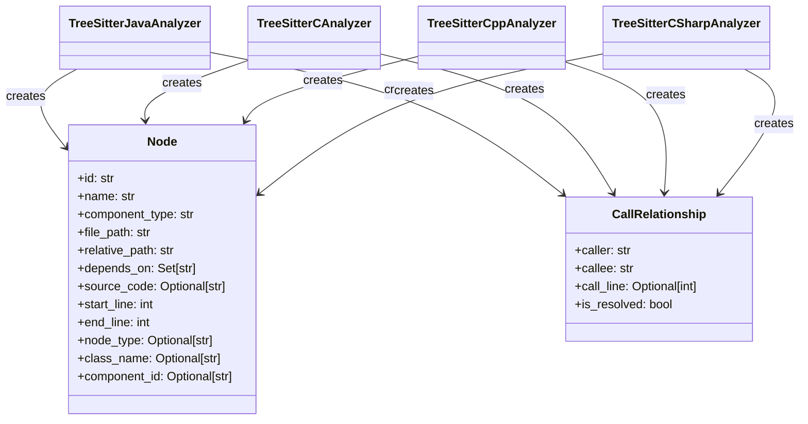

---

## Module Architecture

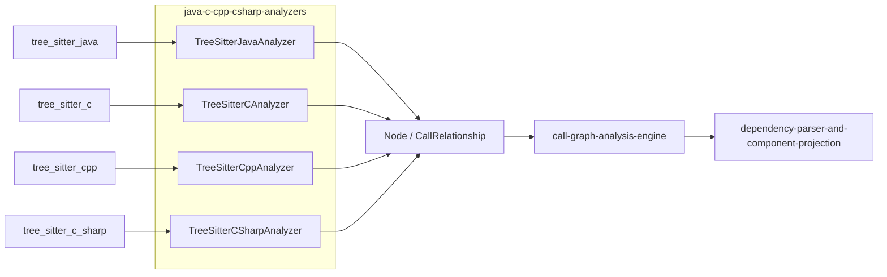

---

## Dependency and Integration Context

This module sits in the Language Analyzers layer and integrates as follows:

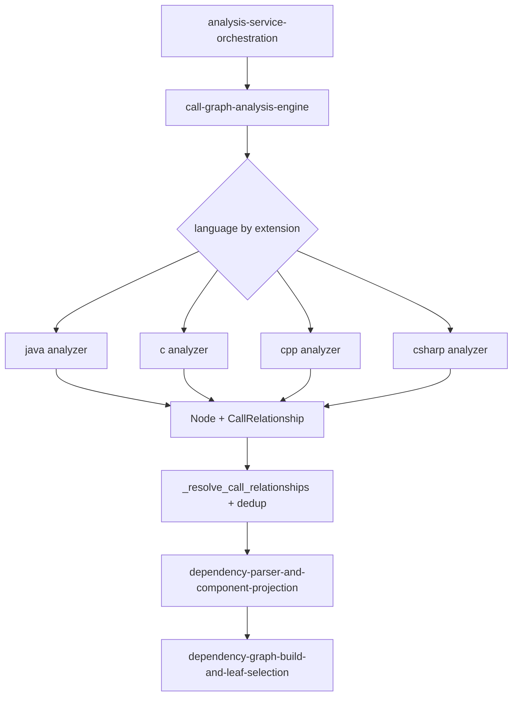

Related module documentation:
- [call-graph-analysis-engine](call-graph-analysis-engine.md)
- [dependency-parser-and-component-projection](dependency-parser-and-component-projection.md)
- [dependency-graph-build-and-leaf-selection](dependency-graph-build-and-leaf-selection.md)
- [analysis-service-orchestration](analysis-service-orchestration.md)
- [analysis-domain-models](analysis-domain-models.md)

---

## End-to-End Data Flow

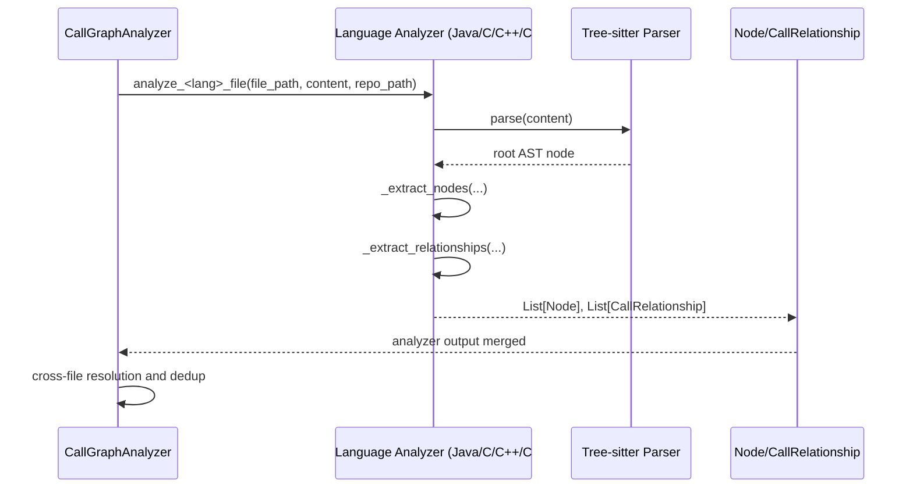

---

## Component Interaction Pattern (Common Analyzer Lifecycle)

Although each language analyzer differs in grammar details, they follow a shared pattern:

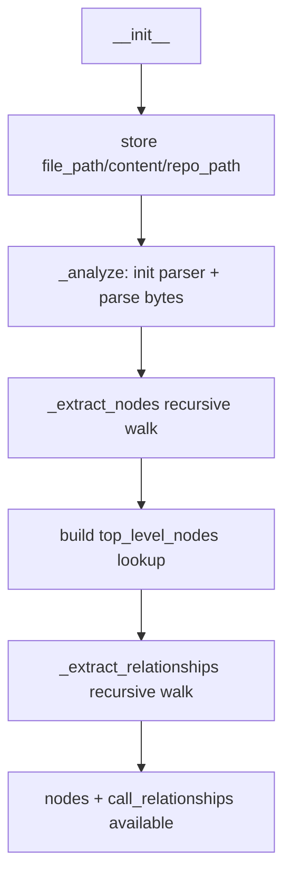

### Internal interaction roles

- `top_level_nodes` map:
  - temporary symbol table for local resolution hints.
- `_get_module_path` + `_get_component_id`:
  - normalizes IDs into dotted, file-qualified component keys.
- `_is_primitive_type` / `_is_system_function`:
  - filters standard-library noise.

---

## Per-Language Process Flows

### Java flow

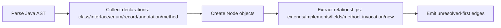

### C flow

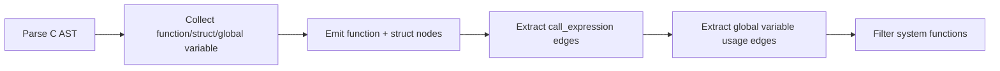

### C++ flow

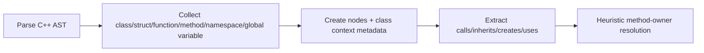

### C# flow

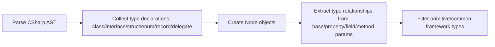

---

## Identifier and Resolution Strategy

All analyzers derive component IDs from repository-relative file paths, then append symbol names.

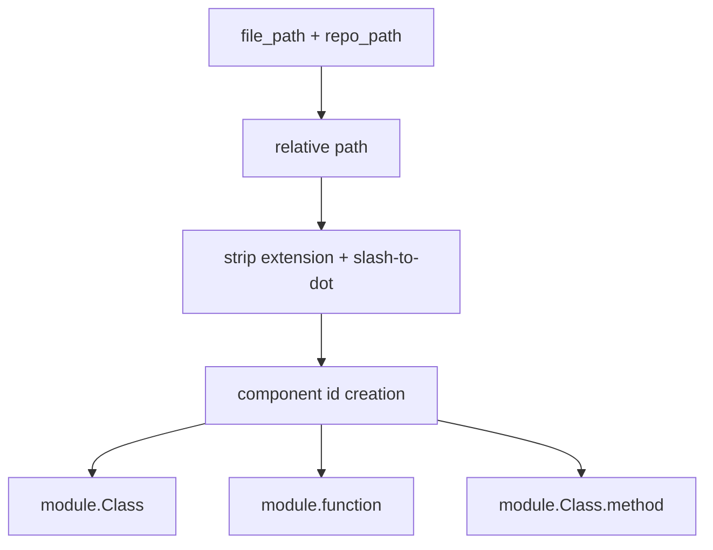

Resolution semantics in this module:
- `is_resolved=True` generally means locally resolvable with analyzer context.
- `is_resolved=False` means deferred resolution is expected downstream.

For global resolution rules, see [call-graph-analysis-engine](call-graph-analysis-engine.md).

---

## Quality Characteristics and Trade-offs

### Strengths

- Multi-language parity under one normalized output contract.
- AST-based extraction (better structural fidelity than regex parsing).
- Preserves rich source metadata for documentation and graph rendering.

### Current trade-offs

- Resolution is mostly heuristic/local (especially method/variable type inference in Java/C++).
- Built-in/system filtering lists are curated and incomplete by design.
- Different analyzers emphasize different dependency styles:
  - Java/C++ include more behavior-oriented call edges.
  - C# emphasizes type coupling edges.
  - C focuses function + global-variable usage.

---

## Public Wrapper Functions

Each file exposes a thin convenience entry point:

- `analyze_java_file(file_path, content, repo_path=None)`
- `analyze_c_file(file_path, content, repo_path=None)`
- `analyze_cpp_file(file_path, content, repo_path=None)`
- `analyze_csharp_file(file_path, content, repo_path=None)`

All wrappers:
1. instantiate analyzer class,
2. run analysis during initialization,
3. return `(nodes, call_relationships)`.

---

## How This Module Fits the Overall System

`java-c-cpp-csharp-analyzers` is the **language extraction backend** for statically typed/compiled-language files in CodeWiki.

It supplies standardized graph primitives into the Dependency Analyzer pipeline, where cross-file linking, deduplication, projection, and documentation generation happen in adjacent modules.

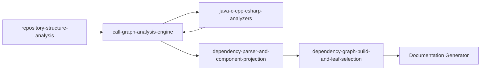
