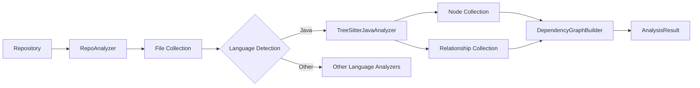

# Java Analyzer Module Documentation

## Overview

The Java Analyzer module is a key component of the dependency analysis engine, responsible for parsing Java source files to extract structural information and dependency relationships. It uses Tree-sitter, a powerful parsing library, to build abstract syntax trees (ASTs) from Java code, then traverses these trees to identify code elements and their connections.

This module serves as the Java-specific implementation within the broader language analyzer ecosystem, working alongside similar analyzers for other languages like Python, C#, and JavaScript.

## Core Component: TreeSitterJavaAnalyzer

The `TreeSitterJavaAnalyzer` class is the heart of the Java Analyzer module. It encapsulates all functionality for analyzing Java code, extracting nodes (code elements) and call relationships (dependencies between elements).

### Initialization

```python
def __init__(self, file_path: str, content: str, repo_path: str = None):
```

**Parameters:**
- `file_path` (str): The full path to the Java file being analyzed
- `content` (str): The raw content of the Java file as a string
- `repo_path` (str, optional): The root path of the repository containing the file

**Side Effects:**
- Initializes the parser with Tree-sitter Java language
- Parses the input content into an AST
- Extracts nodes and relationships through the `_analyze()` method

### Key Methods

#### `_analyze()`
The main analysis method that orchestrates the entire parsing process:
1. Sets up the Tree-sitter parser with Java language support
2. Parses the content into an AST
3. Extracts nodes by traversing the AST
4. Extracts relationships by analyzing the AST structure

#### `_extract_nodes(node, top_level_nodes, lines)`
Recursively traverses the AST to identify and collect code elements:
- **Classes and abstract classes** (identified by `class_declaration` nodes)
- **Interfaces** (identified by `interface_declaration` nodes)
- **Enums** (identified by `enum_declaration` nodes)
- **Records** (identified by `record_declaration` nodes)
- **Annotations** (identified by `annotation_type_declaration` nodes)
- **Methods** (identified by `method_declaration` nodes)

Each identified element is converted into a `Node` object with comprehensive metadata including:
- Unique component ID
- Name and type
- File path information
- Source code snippet
- Line numbers
- Display name

#### `_extract_relationships(node, top_level_nodes)`
Identifies and records various types of relationships between code elements:

1. **Inheritance relationships** (class extends another class)
2. **Interface implementation** (class/enum/record implements interface)
3. **Field type usage** (class has field of another class/interface type)
4. **Method calls** (method invocations on objects)
5. **Object creation** (instantiation of other classes)

Each relationship is stored as a `CallRelationship` object with caller, callee, line number, and resolution status.

### Helper Methods

#### Path and Component ID Methods
- `_get_module_path()`: Converts file path to module-style path using dots
- `_get_relative_path()`: Gets path relative to repository root
- `_get_component_id()`: Constructs unique component identifier

#### AST Traversal Helpers
- `_find_containing_class()`: Finds the class containing a given AST node
- `_find_containing_class_name()`: Gets the name of the containing class
- `_find_containing_method()`: Finds the method containing a given AST node
- `_find_variable_type()`: Attempts to determine the type of a variable
- `_search_variable_declaration()`: Searches for variable declarations in code blocks

#### Type and Identifier Helpers
- `_get_identifier_name()`: Extracts identifier name from AST node
- `_get_type_name()`: Extracts type name from type nodes (including generics)
- `_is_primitive_type()`: Checks if a type is a Java primitive or common built-in type

### Public API Function

#### `analyze_java_file()`
```python
def analyze_java_file(file_path: str, content: str, repo_path: str = None) -> Tuple[List[Node], List[CallRelationship]]:
```

This is the main entry point for using the Java Analyzer. It creates a `TreeSitterJavaAnalyzer` instance and returns the extracted nodes and relationships.

**Parameters:**
- `file_path` (str): Path to the Java file
- `content` (str): Content of the Java file
- `repo_path` (str, optional): Repository root path

**Returns:**
- Tuple containing two lists:
  1. List of `Node` objects representing code elements
  2. List of `CallRelationship` objects representing dependencies

## Architecture and Integration

The Java Analyzer module fits into the larger system architecture as follows:



The module works in conjunction with:
- **RepoAnalyzer**: Coordinates overall repository analysis
- **DependencyGraphBuilder**: Constructs dependency graphs from collected nodes and relationships
- **Other language analyzers**: Part of the multi-language support system

## Usage Examples

### Basic Usage

```python
from codewiki.src.be.dependency_analyzer.analyzers.java import analyze_java_file

# Read a Java file
with open("Example.java", "r") as f:
    content = f.read()

# Analyze the file
nodes, relationships = analyze_java_file(
    file_path="path/to/Example.java",
    content=content,
    repo_path="path/to/repo"
)

# Process results
print(f"Found {len(nodes)} code elements")
print(f"Found {len(relationships)} dependencies")
```

### Advanced Usage with Direct Class Instantiation

```python
from codewiki.src.be.dependency_analyzer.analyzers.java import TreeSitterJavaAnalyzer

# Create analyzer instance
analyzer = TreeSitterJavaAnalyzer(
    file_path="path/to/Example.java",
    content=content,
    repo_path="path/to/repo"
)

# Access extracted nodes
for node in analyzer.nodes:
    print(f"{node.component_type}: {node.name}")
    print(f"  Lines: {node.start_line}-{node.end_line}")

# Access relationships
for rel in analyzer.call_relationships:
    print(f"{rel.caller} -> {rel.callee} at line {rel.call_line}")
```

## Edge Cases and Limitations

### Known Limitations

1. **Limited Type Resolution**: The analyzer has limited ability to resolve types from imported libraries or other files not directly analyzed. Most relationships are marked with `is_resolved=False`.

2. **Variable Type Inference**: Type inference for variables is limited to local variable declarations and field declarations within the same file. It cannot track types through complex assignment chains or method returns.

3. **Lambda Expressions**: Lambda expressions and functional interfaces are not fully analyzed for relationship extraction.

4. **Method Overloading**: The analyzer doesn't distinguish between overloaded methods when tracking calls.

5. **Reflection**: Relationships established through reflection are not detected.

### Edge Cases Handled

1. **Nested Classes**: Inner classes and nested types are properly identified and associated with their containing classes.

2. **Generics**: Generic types are recognized (though type parameters are not tracked in relationships).

3. **Multiple Types per File**: Multiple top-level types in a single file are all processed correctly.

4. **Unusual Path Formats**: Handles both forward-slash and back-slash path formats for cross-platform compatibility.

## Error Conditions

The analyzer is designed to be robust and generally continues processing even when encountering issues:

1. **Malformed Java Code**: The Tree-sitter parser is error-tolerant and will still produce an AST even for syntactically incorrect code, though node extraction may be incomplete.

2. **Missing Repository Path**: If `repo_path` is not provided or cannot be used to compute a relative path, the full file path is used instead.

3. **Unidentified Nodes**: Nodes that cannot be properly identified or named are skipped rather than causing errors.

## Configuration Options

The Java Analyzer module doesn't have direct configuration options, but it is affected by:

- **Tree-sitter Java Language**: The parser relies on the tree-sitter-java library which defines the Java grammar.

- **Repository Path**: The optional `repo_path` parameter affects how component IDs and relative paths are calculated.

## Related Modules

- [dependency_analysis_engine](dependency_analysis_engine.md): The parent module containing the Java Analyzer
- [managed_language_analyzers](managed_language_analyzers.md): The sub-module containing Java and C# analyzers
- [ast_parsing_and_language_analyzers](ast_parsing_and_language_analyzers.md): Contains all language-specific analyzers
- [csharp_analyzer](csharp_analyzer.md): The C# counterpart to this module
