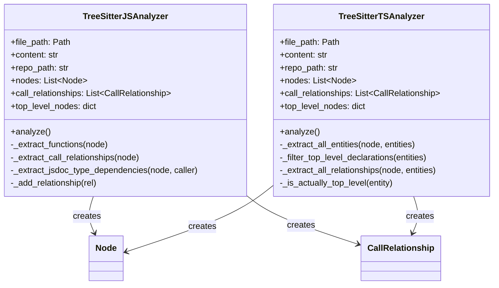
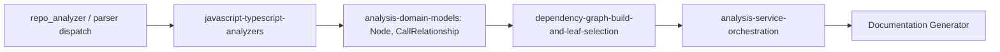
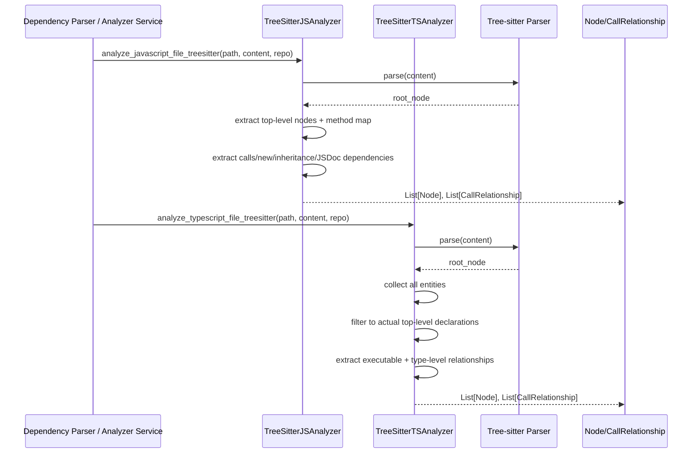
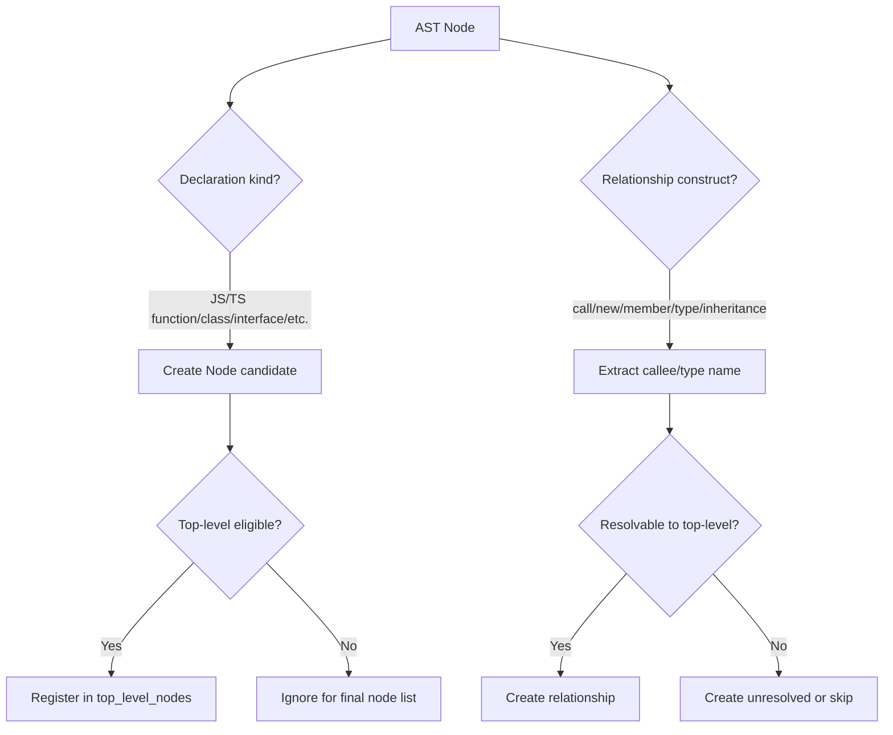
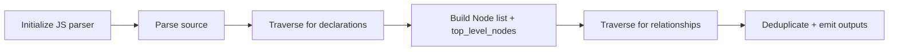
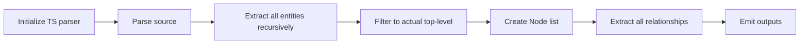

# javascript-typescript-analyzers

## Introduction

The **javascript-typescript-analyzers** module provides Tree-sitter-based static analysis for JavaScript and TypeScript source files. It is responsible for extracting:

- **Component nodes** (functions, classes, interfaces, types, enums, methods)
- **Intra-file dependency edges** as `CallRelationship` records (calls, `new`, inheritance, type references, selected documentation/type-comment links)

This module is part of **Language Analyzers** and feeds normalized graph data into the broader dependency-analysis pipeline.

---

## Purpose and Responsibilities

At runtime, this module converts raw source text into graph-ready model objects from [analysis-domain-models](analysis-domain-models.md):

- `Node`: a documented top-level component identity with metadata
- `CallRelationship`: directional dependency/call edge

### Primary responsibilities

1. Parse JS/TS code using Tree-sitter grammars
2. Identify top-level declarations to include in dependency graphs
3. Build stable component IDs using normalized module paths
4. Extract relationship edges from executable and type-level constructs
5. Return analyzer outputs through language-specific wrapper functions

---

## Core Components

### 1) `TreeSitterJSAnalyzer`
**Path:** `codewiki.src.be.dependency_analyzer.analyzers.javascript.TreeSitterJSAnalyzer`

Main behavior:
- Initializes JavaScript parser (`tree_sitter_javascript`)
- Traverses AST to extract:
  - classes / abstract classes / interfaces
  - function declarations (including generator)
  - exported functions
  - arrow/function-expression declarations from lexical declarations
  - class methods and arrow-function fields (for mapping)
- Extracts relationships from:
  - `call_expression`
  - `await` call expressions
  - `new_expression`
  - inheritance (`class_heritage`)
  - JSDoc type annotations (`@param`, `@returns`, `@type`, `@typedef`, `@interface`)
- Deduplicates relationships via `seen_relationships`

Notable implementation choices:
- Uses `top_level_nodes` as a lookup table for resolution hints
- Computes both `module_path` (dot-separated) and `relative_path`
- Marks many links unresolved by default unless clearly local/top-level
- Skips parser failures gracefully and returns partial/empty analysis

### 2) `TreeSitterTSAnalyzer`
**Path:** `codewiki.src.be.dependency_analyzer.analyzers.typescript.TreeSitterTSAnalyzer`

Main behavior:
- Initializes TypeScript parser (`tree_sitter_typescript.language_typescript()`)
- Performs a two-phase entity analysis:
  1. Collect *all* entities with context/depth metadata
  2. Filter entities to “actually top-level” declarations
- Supports richer TS declaration coverage:
  - functions, generator functions, arrow functions
  - methods
  - classes / abstract classes / interfaces
  - type aliases
  - enums
  - export statements (including export-wrapped declarations)
  - ambient declarations (`declare module`, namespace-like forms)
- Extracts relationships from:
  - calls and constructor invocations
  - member accesses
  - type annotations / type arguments
  - inheritance and implementation clauses
  - constructor parameter type dependencies

Notable implementation choices:
- Uses AST parent/context checks to avoid nested/local symbols polluting top-level graph
- Excludes variable nodes from exported node list (`_should_include_node`)
- Relationship extraction emphasizes top-level targets and type-aware dependencies

### 3) Wrapper functions
- `analyze_javascript_file_treesitter(file_path, content, repo_path=None)`
- `analyze_typescript_file_treesitter(file_path, content, repo_path=None)`

Both wrappers:
- instantiate analyzer
- run `.analyze()`
- return `(List[Node], List[CallRelationship])`
- degrade safely to empty output on exceptions

---

## Internal Architecture

---

## Dependency Context in the System

This module is downstream from language-agnostic orchestration and upstream from graph-building/documentation generation.

Related modules:
- Orchestration and service layer: [analysis-service-orchestration](analysis-service-orchestration.md)
- AST parsing and language dispatch: [dependency-parser-and-component-projection](dependency-parser-and-component-projection.md)
- Graph construction/selection: [dependency-graph-build-and-leaf-selection](dependency-graph-build-and-leaf-selection.md)
- Shared analysis models: [analysis-domain-models](analysis-domain-models.md)
- Python counterpart for comparison: [python-ast-analyzer](python-ast-analyzer.md)

---

## Detailed Data Flow

---

## Component Interaction and Resolution Strategy

Key difference:
- **JS analyzer** is declaration-first and lightweight, with explicit JSDoc support.
- **TS analyzer** is entity-graph oriented and more type-system-aware.

---

## Process Flows

### JavaScript analyzer process

### TypeScript analyzer process

---

## Output Contract

Both analyzers produce:
- `nodes: List[Node]`
- `call_relationships: List[CallRelationship]`

Important output characteristics:
- IDs are file-module-qualified (`<normalized_module_path>.<symbol>`)
- `source_code`, `start_line`, `end_line`, and `relative_path` are preserved for downstream documentation and graph rendering
- Many edges are intentionally emitted with `is_resolved=False` for later resolution phases

---

## Error Handling and Robustness

- Parser initialization failures are logged and analysis short-circuits safely
- Individual extraction errors are caught and logged at debug level
- Wrapper functions provide fail-safe empty outputs to protect higher-level workflows

This behavior keeps pipeline execution resilient when repositories contain malformed or unsupported syntax.

---

## Known Constraints / Design Trade-offs

- Resolution scope is largely intra-file and name-based; full import/export cross-file resolution is deferred to later graph stages.
- JS method-call handling includes heuristics and may skip/approximate some object/member calls.
- TS member-expression extraction can produce broad callee names for chained expressions.
- Built-in filtering sets are intentionally conservative in current implementation.

---

## How It Fits the Overall System

Within the full codewiki pipeline, this module is the **language-specific extraction layer** for JS/TS:

1. A higher-level service selects language analyzers ([dependency-parser-and-component-projection](dependency-parser-and-component-projection.md)).
2. This module emits standardized `Node` and `CallRelationship` objects.
3. Graph modules merge/analyze these relationships ([dependency-graph-build-and-leaf-selection](dependency-graph-build-and-leaf-selection.md), [call-graph-analysis-engine](call-graph-analysis-engine.md)).
4. Results are consumed by orchestration and docs generation ([analysis-service-orchestration](analysis-service-orchestration.md), `Documentation Generator`).

In short: **it translates JS/TS ASTs into graph primitives used by the rest of the dependency-analysis and documentation stack.**
