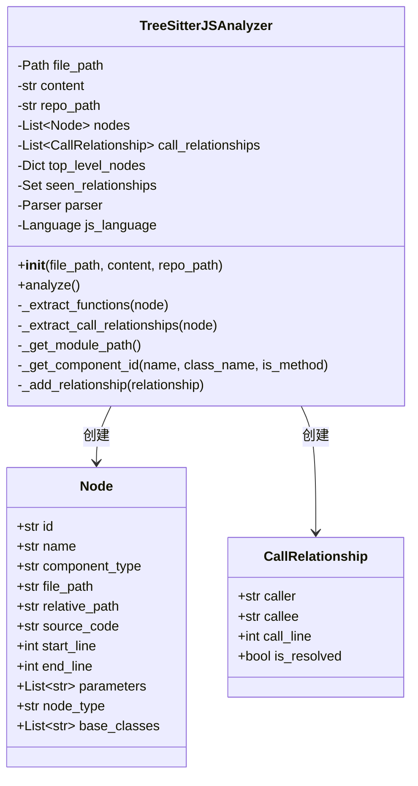
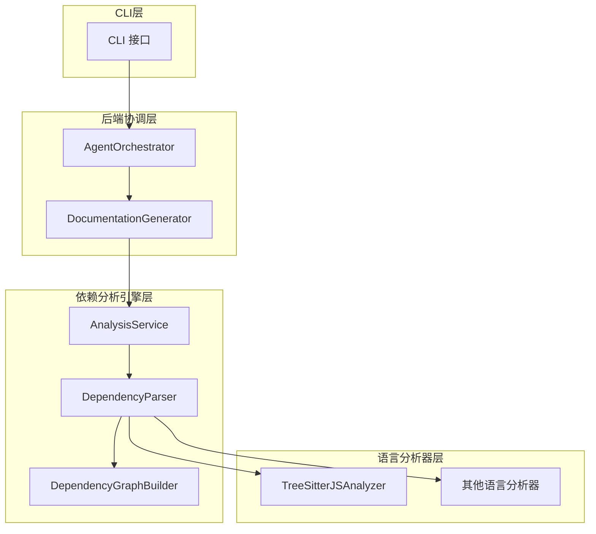

# JavaScript 分析器 (javascript_analyzer)

## 1. 概述

`javascript_analyzer` 模块是 CodeWiki 项目中负责解析和分析 JavaScript 源代码的核心组件，使用 Tree-sitter 库构建抽象语法树 (AST)，并从中提取代码结构元素和依赖关系。该模块是 [dependency_analysis_engine](dependency_analysis_engine.md) 模块的子模块，专门处理 JavaScript 语言的分析。

### 核心功能

- 解析 JavaScript 文件的抽象语法树
- 提取类、函数、方法等代码节点
- 识别调用关系和继承关系
- 解析 JSDoc 注释中的类型依赖
- 生成标准化的 Node 和 CallRelationship 对象供上层系统使用

## 2. 架构设计

### 2.1 核心组件结构

`javascript_analyzer` 模块的核心类是 `TreeSitterJSAnalyzer`，它封装了完整的分析流程：



### 2.2 模块定位

`javascript_analyzer` 位于整体系统的 AST 解析与语言分析层，它为上层的依赖分析和文档生成提供基础数据：



## 3. 核心组件详解

### 3.1 TreeSitterJSAnalyzer 类

`TreeSitterJSAnalyzer` 是 JavaScript 分析的核心类，它封装了从源代码解析到生成依赖关系的完整流程。

#### 初始化

```python
def __init__(self, file_path: str, content: str, repo_path: str = None):
    self.file_path = Path(file_path)
    self.content = content
    self.repo_path = repo_path or ""
    self.nodes: List[Node] = []
    self.call_relationships: List[CallRelationship] = []
    self.top_level_nodes = {}
    self.seen_relationships = set()
    
    try:
        language_capsule = tree_sitter_javascript.language()
        self.js_language = Language(language_capsule)
        self.parser = Parser(self.js_language)
    except Exception as e:
        logger.error(f"Failed to initialize JavaScript parser: {e}")
        self.parser = None
        self.js_language = None
```

**参数说明：**
- `file_path`: 待分析的 JavaScript 文件路径
- `content`: 文件内容字符串
- `repo_path`: 仓库根路径（用于计算相对路径）

**初始化步骤：**
1. 设置基本属性和内部存储结构
2. 初始化 Tree-sitter JavaScript 语言解析器
3. 如解析器初始化失败，记录错误并设置 `parser` 为 `None`

#### 分析主流程 - analyze()

```python
def analyze(self) -> None:
    if self.parser is None:
        logger.warning(f"Skipping {self.file_path} - parser initialization failed")
        return

    try:
        tree = self.parser.parse(bytes(self.content, "utf8"))
        root_node = tree.root_node

        logger.debug(f"Parsed AST with root node type: {root_node.type}")

        self._extract_functions(root_node)
        self._extract_call_relationships(root_node)

        logger.debug(
            f"Analysis complete: {len(self.nodes)} nodes, {len(self.call_relationships)} relationships"
        )

    except Exception as e:
        logger.error(f"Error analyzing JavaScript file {self.file_path}: {e}", exc_info=True)
```

**功能说明：**
1. 检查解析器是否可用，不可用时提前返回
2. 将源代码解析为抽象语法树
3. 提取函数、类等代码节点
4. 提取调用关系和依赖关系
5. 记录分析结果和异常

### 3.2 节点提取功能

#### _extract_functions 和 _traverse_for_functions

这些方法负责从 AST 中提取各种代码结构元素：

```python
def _extract_functions(self, node) -> None:
    self._traverse_for_functions(node)
    self.nodes.sort(key=lambda n: n.start_line)

def _traverse_for_functions(self, node) -> None:
    if node.type in ["class_declaration", "abstract_class_declaration", "interface_declaration"]:
        cls = self._extract_class_declaration(node)
        if cls:
            self.nodes.append(cls)
            self.top_level_nodes[cls.name] = cls
            self._extract_methods_from_class(node, cls.name)
            
    elif node.type == "function_declaration":
        # 提取函数声明
        # ...
    
    # 遍历子节点
    for child in node.children:
        self._traverse_for_functions(child)
```

**支持的节点类型：**

| 节点类型 | 说明 | 处理方法 |
|---------|------|---------|
| `class_declaration` | 类声明 | `_extract_class_declaration` |
| `abstract_class_declaration` | 抽象类声明 | `_extract_class_declaration` |
| `interface_declaration` | 接口声明 | `_extract_class_declaration` |
| `function_declaration` | 函数声明 | `_extract_function_declaration` |
| `generator_function_declaration` | 生成器函数声明 | `_extract_function_declaration` |
| `export_statement` | 导出语句 | `_extract_exported_function` |
| `lexical_declaration` | 词法声明 | `_extract_arrow_function_from_declaration` |

#### 类提取 - _extract_class_declaration

```python
def _extract_class_declaration(self, node) -> Optional[Node]:
    # 提取类名称
    name_node = self._find_child_by_type(node, "type_identifier")
    if not name_node:
        name_node = self._find_child_by_type(node, "identifier")
    if not name_node:
        return None
    name = self._get_node_text(name_node)
    
    # 提取基本信息和继承关系
    line_start = node.start_point[0] + 1
    line_end = node.end_point[0] + 1
    base_classes = []
    heritage_node = self._find_child_by_type(node, "class_heritage")
    if heritage_node:
        for child in heritage_node.children:
            if child.type in ["identifier", "type_identifier"]:
                base_classes.append(self._get_node_text(child))
    
    # 创建并返回 Node 对象
    # ...
```

#### 方法提取 - _extract_methods_from_class

该方法从类定义中提取方法和箭头函数字段：

```python
def _extract_methods_from_class(self, class_node, class_name: str) -> None:
    class_body = self._find_child_by_type(class_node, "class_body")
    if not class_body:
        return
        
    for child in class_body.children:
        if child.type == "method_definition":
            method_name = self._get_method_name(child)
            if method_name:
                method_key = f"{self._get_module_path()}.{class_name}.{method_name}"
                method_node = self._create_method_node(child, method_name, class_name)
                if method_node:
                    self.top_level_nodes[method_key] = method_node
        elif child.type == "field_definition":
            # 处理箭头函数字段
            field_name = self._get_field_name(child)
            if field_name and self._is_arrow_function_field(child):
                method_key = f"{self._get_module_path()}.{class_name}.{field_name}"
                method_node = self._create_method_node(child, field_name, class_name)
                if method_node:
                    self.top_level_nodes[method_key] = method_node
```

### 3.3 调用关系提取功能

#### _extract_call_relationships 和 _traverse_for_calls

这些方法负责识别代码中的调用关系：

```python
def _extract_call_relationships(self, node) -> None:
    current_top_level = None
    self._traverse_for_calls(node, current_top_level)

def _traverse_for_calls(self, node, current_top_level) -> None:
    # 处理当前上下文节点
    if node.type in ["class_declaration", "abstract_class_declaration", "interface_declaration"]:
        # 设置当前类名作为上下文
        # 处理继承关系
    elif node.type == "function_declaration":
        # 设置当前函数名作为上下文
    # ...
    
    # 提取调用关系
    if node.type == "call_expression" and current_top_level:
        call_info = self._extract_call_from_node(node, current_top_level)
        if call_info:
            self._add_relationship(call_info)
    
    elif node.type == "await_expression" and current_top_level:
        # 处理 await 后的调用
    elif node.type == "new_expression" and current_top_level:
        # 处理 new 表达式
    
    # 递归处理子节点
    for child in node.children:
        self._traverse_for_calls(child, current_top_level)
```

#### 调用关系提取 - _extract_call_from_node

```python
def _extract_call_from_node(self, node, caller_name: str) -> Optional[CallRelationship]:
    try:
        call_line = node.start_point[0] + 1
        callee_name = self._extract_callee_name(node)
        
        if not callee_name:
            return None
        
        call_text = self._get_node_text(node)
        is_method_call = "this." in call_text or "super." in call_text
        
        caller_id = f"{self._get_module_path()}.{caller_name}"
        
        # 特殊处理方法调用
        if is_method_call:
            # 尝试解析为当前类的方法调用
        
        callee_id = f"{self._get_module_path()}.{callee_name}"
        if callee_name in self.top_level_nodes:
            return CallRelationship(
                caller=caller_id,
                callee=callee_id,
                call_line=call_line,
                is_resolved=True,
            )
        
        return CallRelationship(
            caller=caller_id,
            callee=callee_id,
            call_line=call_line,
            is_resolved=False,
        )
        
    except Exception as e:
        logger.debug(f"Error extracting call relationship: {e}")
        return None
```

### 3.4 JSDoc 类型依赖提取

该模块还能从 JSDoc 注释中提取类型依赖关系：

```python
def _extract_jsdoc_type_dependencies(self, node, caller_name: str) -> None:
    try:
        # 检查节点前的注释
        if hasattr(node, 'prev_sibling') and node.prev_sibling:
            prev = node.prev_sibling
            if prev.type == "comment":
                comment_text = self._get_node_text(prev)
                self._parse_jsdoc_types(comment_text, caller_name, node.start_point[0] + 1)
        
        # 检查节点子注释
        for child in node.children:
            if child.type == "comment":
                comment_text = self._get_node_text(child)
                self._parse_jsdoc_types(comment_text, caller_name, node.start_point[0] + 1)
                
    except Exception as e:
        logger.debug(f"Error extracting JSDoc dependencies: {e}")
```

支持解析的 JSDoc 类型：
- `@param {Type}` - 参数类型
- `@return {Type}` 或 `@returns {Type}` - 返回值类型
- `@type {Type}` - 变量类型
- `@typedef {Object} TypeName` - 类型定义
- `@interface InterfaceName` - 接口声明

### 3.5 辅助方法

#### 路径和组件ID生成

```python
def _get_module_path(self) -> str:
    # 计算相对于仓库的模块路径，移除扩展名并用点分隔
    if self.repo_path:
        try:
            rel_path = os.path.relpath(str(self.file_path), self.repo_path)
        except ValueError:
            rel_path = str(self.file_path)
    else:
        rel_path = str(self.file_path)
    
    for ext in ['.js', '.ts', '.jsx', '.tsx', '.mjs', '.cjs']:
        if rel_path.endswith(ext):
            rel_path = rel_path[:-len(ext)]
            break
    return rel_path.replace('/', '.').replace('\\', '.')

def _get_component_id(self, name: str, class_name: str = None, is_method: bool = False) -> str:
    # 生成组件唯一标识符
    module_path = self._get_module_path()
    
    if is_method and class_name:
        return f"{module_path}.{class_name}.{name}"
    elif class_name and not is_method: 
        return f"{module_path}.{name}"
    else:  
        return f"{module_path}.{name}"
```

#### 树遍历和节点操作

```python
def _find_child_by_type(self, node, node_type: str):
    """查找指定类型的第一个子节点"""
    for child in node.children:
        if child.type == node_type:
            return child
    return None

def _get_node_text(self, node) -> str:
    """获取节点对应的源代码文本"""
    start_byte = node.start_byte
    end_byte = node.end_byte
    return self.content.encode("utf8")[start_byte:end_byte].decode("utf8")
```

### 3.6 公开函数 - analyze_javascript_file_treesitter

```python
def analyze_javascript_file_treesitter(
    file_path: str, content: str, repo_path: str = None
) -> Tuple[List[Node], List[CallRelationship]]:
    """使用 tree-sitter 分析 JavaScript 文件"""
    try:
        logger.debug(f"Tree-sitter JS analysis for {file_path}")
        analyzer = TreeSitterJSAnalyzer(file_path, content, repo_path)
        analyzer.analyze()
        logger.debug(
            f"Found {len(analyzer.nodes)} top-level nodes, {len(analyzer.call_relationships)} calls"
        )
        return analyzer.nodes, analyzer.call_relationships
    except Exception as e:
        logger.error(f"Error in tree-sitter JS analysis for {file_path}: {e}", exc_info=True)
        return [], []
```

这是模块的公开接口函数，它封装了 `TreeSitterJSAnalyzer` 类的创建和分析过程，返回提取到的节点和调用关系。

## 4. 使用示例

### 基本使用

```python
from codewiki.src.be.dependency_analyzer.analyzers.javascript import analyze_javascript_file_treesitter

# 准备文件内容
file_path = "/path/to/project/src/utils.js"
content = """
class Calculator {
  constructor() {
    this.value = 0;
  }
  
  add(num) {
    this.value = this._sum(this.value, num);
    return this;
  }
  
  _sum(a, b) {
    return a + b;
  }
}

function multiply(a, b) {
  return a * b;
}

/**
 * @param {Calculator} calc
 * @param {number} value
 * @returns {Calculator}
 */
function calculate(calc, value) {
  return calc.add(value);
}

module.exports = { Calculator, multiply, calculate };
"""

# 分析文件
nodes, relationships = analyze_javascript_file_treesitter(file_path, content, "/path/to/project")

# 输出结果
print(f"提取到 {len(nodes)} 个节点:")
for node in nodes:
    print(f"  - {node.display_name} ({node.start_line}-{node.end_line})")

print(f"\n提取到 {len(relationships)} 个调用关系:")
for rel in relationships:
    status = "✓" if rel.is_resolved else "✗"
    print(f"  {status} {rel.caller} -> {rel.callee} (line {rel.call_line})")
```

### 预期输出示例

```
提取到 5 个节点:
  - class Calculator (2-14)
  - method constructor (3-4)
  - method add (6-9)
  - method _sum (11-13)
  - function multiply (17-18)
  - function calculate (25-27)

提取到 5 个调用关系:
  ✓ src.utils.Calculator.add -> src.utils.Calculator._sum (line 7)
  ✗ src.utils.calculate -> src.utils.Calculator (line 26)
  ✓ src.utils.calculate -> src.utils.Calculator.add (line 26)
  ✗ src.utils.calculate -> number (line 26)
  ✗ src.utils.calculate -> Calculator (line 21)
```

## 5. 数据结构与输出

### 5.1 Node 对象

该模块生成的 `Node` 对象（见 [dependency_analysis_engine](dependency_analysis_engine.md)）包含以下关键字段：

| 字段 | 类型 | 说明 |
|-----|------|-----|
| `id` | str | 组件唯一标识符 |
| `name` | str | 组件名称 |
| `component_type` | str | 组件类型（class/method/function等） |
| `file_path` | str | 完整文件路径 |
| `relative_path` | str | 相对于仓库的路径 |
| `source_code` | str | 组件源代码 |
| `start_line` | int | 起始行号 |
| `end_line` | int | 结束行号 |
| `parameters` | List[str] | 参数列表 |
| `node_type` | str | 节点类型 |
| `base_classes` | List[str] | 基类列表（针对类） |
| `class_name` | str | 所属类名（针对方法） |
| `display_name` | str | 显示名称 |

### 5.2 CallRelationship 对象

生成的 `CallRelationship` 对象（见 [dependency_analysis_engine](dependency_analysis_engine.md)）包含：

| 字段 | 类型 | 说明 |
|-----|------|-----|
| `caller` | str | 调用者组件ID |
| `callee` | str | 被调用者组件ID |
| `call_line` | int | 调用发生的行号 |
| `is_resolved` | bool | 是否在当前文件中解析到被调用者 |

## 6. 限制与注意事项

### 6.1 已知限制

1. **动态调用分析限制**：由于 JavaScript 的动态特性，对于使用变量或计算属性名的调用，分析器可能无法准确解析
   ```javascript
   const funcName = Math.random() > 0.5 ? 'foo' : 'bar';
   obj[funcName](); // 无法准确解析调用
   ```

2. **跨文件依赖**：目前版本主要分析单个文件内的依赖关系，不解析跨文件的 import/require 依赖

3. **高阶函数和回调**：高阶函数调用和回调函数的解析能力有限

4. **复杂的 JSDoc 类型**：对于复杂的 JSDoc 类型表达式，仅支持基本类型和简单的泛型解析

5. **部分现代 JavaScript 特性**：一些最新的 JavaScript 语法特性可能未完全支持

### 6.2 注意事项

1. **解析器初始化失败**：如果 Tree-sitter 解析器初始化失败，模块将记录警告并返回空结果，而不是抛出异常

2. **路径计算**：正确设置 `repo_path` 对于生成准确的相对路径和组件 ID 非常重要

3. **编码处理**：源代码以 UTF-8 编码处理，对于其他编码的文件可能需要预先转换

4. **异常处理**：分析过程中的大部分异常被捕获并记录为调试日志，以确保即使部分解析失败也能继续处理其他部分

## 7. 扩展与集成

### 7.1 与其他模块的关系

`javascript_analyzer` 模块与以下模块有密切关系：

- [dependency_analysis_engine](dependency_analysis_engine.md)：父模块，负责协调整个依赖分析过程
- [typescript_analyzer](typescript_analyzer.md)：姐妹模块，处理 TypeScript 文件分析
- [python_ast_language_analyzer](python_ast_language_analyzer.md)：处理 Python 文件的姐妹模块

### 7.2 集成点

该模块主要通过 `DependencyParser` 类（见 [ast_parsing_orchestration](ast_parsing_orchestration.md)）集成到更大的系统中：

```python
# 简化的集成示例
class DependencyParser:
    def parse(self, file_path, content, repo_path):
        ext = os.path.splitext(file_path)[1]
        if ext in ['.js', '.jsx', '.mjs', '.cjs']:
            return analyze_javascript_file_treesitter(file_path, content, repo_path)
        # 处理其他语言...
```

## 8. 总结

`javascript_analyzer` 模块是 CodeWiki 系统中专门负责 JavaScript 代码分析的组件，它使用 Tree-sitter 解析库构建 AST，从中提取类、函数、方法等代码节点，并识别它们之间的调用关系和继承关系。该模块还支持从 JSDoc 注释中提取类型依赖，为文档生成和依赖分析提供丰富的数据基础。

该模块的设计遵循单一职责原则，封装了 JavaScript 分析的复杂性，提供简单的接口供上层系统使用，是整个依赖分析引擎中重要的组成部分。
