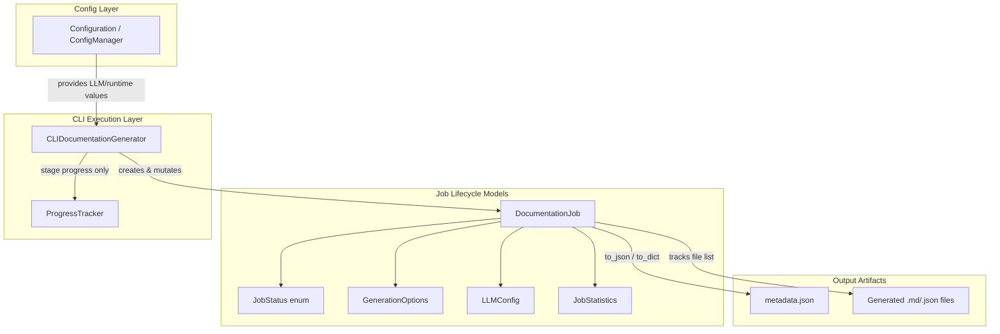
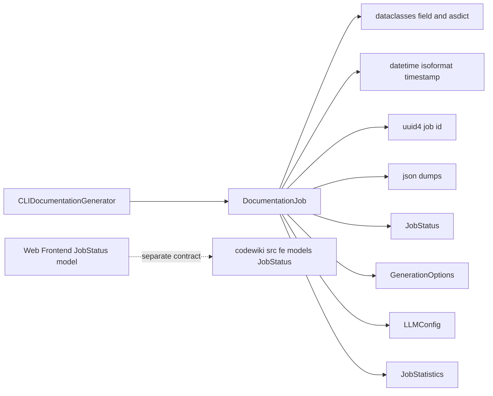
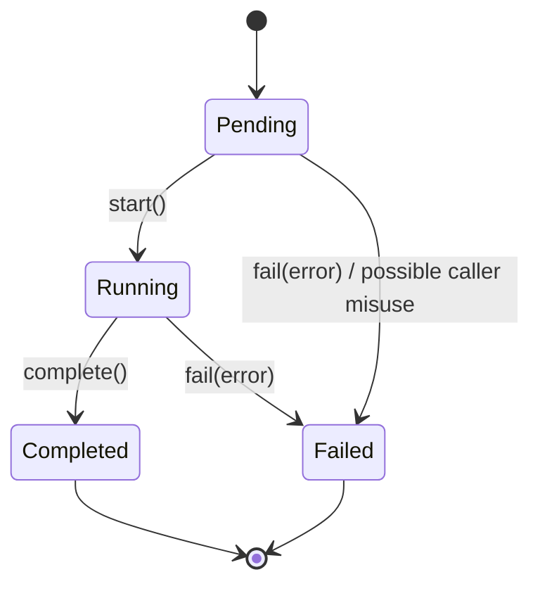
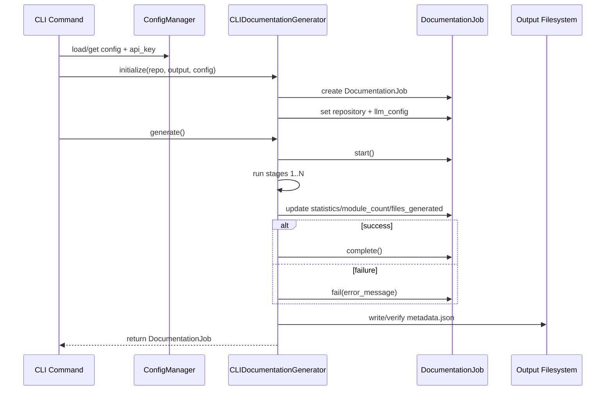
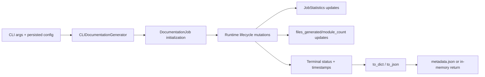
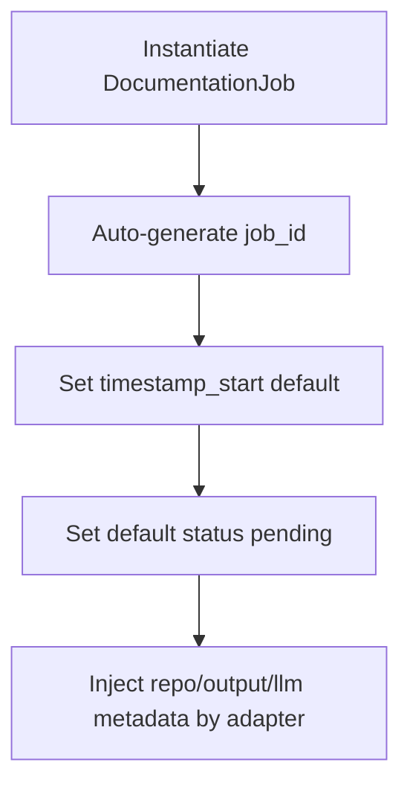
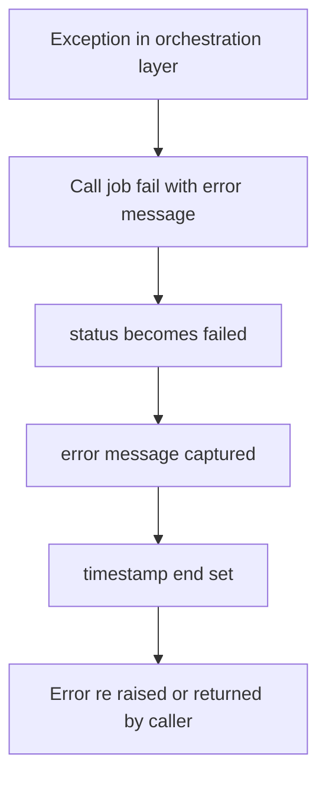
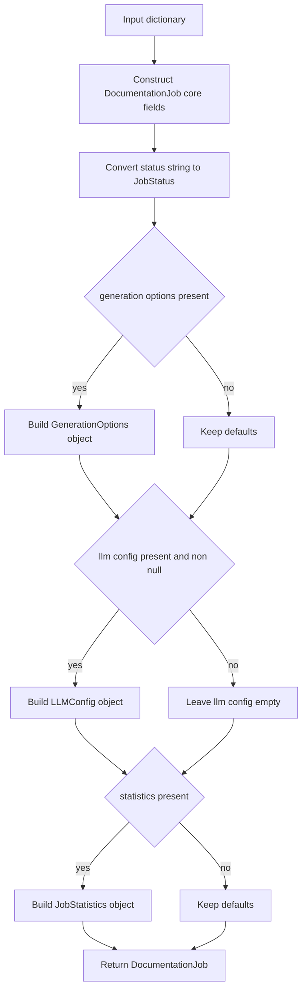
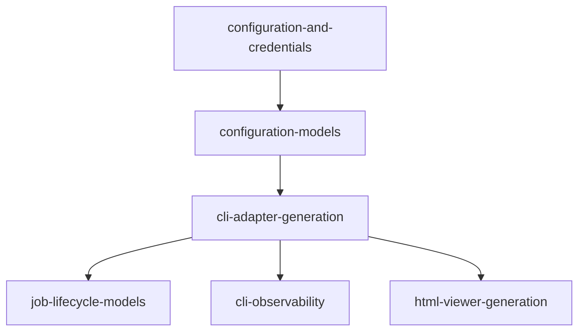

# job-lifecycle-models Module

## Introduction

The `job-lifecycle-models` module defines the **canonical CLI-side data contract for documentation job execution state**.

It provides five core models in `codewiki.cli.models.job`:

- `DocumentationJob`
- `JobStatus`
- `JobStatistics`
- `LLMConfig`
- `GenerationOptions`

Together, these models represent:

- job identity and repository context,
- lifecycle state transitions (pending → running → completed/failed),
- execution statistics and outputs,
- generation/runtime options,
- model endpoint configuration snapshot.

This module is intentionally lightweight (pure data models + serialization helpers), and is consumed by execution/orchestration layers such as [cli-adapter-generation.md](cli-adapter-generation.md).

---

## Purpose and Responsibilities

### In scope

1. Define strongly-typed lifecycle states via `JobStatus` enum.
2. Represent job execution metadata in `DocumentationJob`.
3. Represent nested structured payloads:
   - `GenerationOptions`
   - `LLMConfig`
   - `JobStatistics`
4. Provide lifecycle transition helpers:
   - `start()`
   - `complete()`
   - `fail(error_message)`
5. Provide JSON-compatible conversion helpers:
   - `to_dict()` / `to_json()`
   - `from_dict()`

### Out of scope

- Running the generation pipeline itself ([cli-adapter-generation.md](cli-adapter-generation.md)).
- Progress UI/ETA rendering ([cli-observability.md](cli-observability.md)).
- Configuration persistence and credentials ([configuration-and-credentials.md](configuration-and-credentials.md)).
- Backend generation/analysis internals.

---

## Core Components

## 1) `JobStatus` (Enum)

`JobStatus` is a `str`-backed enum for stable serialization and comparison.

Values:

- `PENDING = "pending"`
- `RUNNING = "running"`
- `COMPLETED = "completed"`
- `FAILED = "failed"`

Design implications:

- JSON-ready without custom enum encoding (uses `.value`).
- Enforces a constrained lifecycle vocabulary across CLI flows.

---

## 2) `GenerationOptions` (Dataclass)

Encapsulates runtime toggles/options used when generating docs.

Fields:

- `create_branch: bool = False`
- `github_pages: bool = False`
- `no_cache: bool = False`
- `custom_output: Optional[str] = None`

This model captures intent/options that can be persisted alongside job metadata, even if enforcement happens in orchestration layers.

---

## 3) `JobStatistics` (Dataclass)

Holds measurable run statistics.

Fields:

- `total_files_analyzed: int = 0`
- `leaf_nodes: int = 0`
- `max_depth: int = 0`
- `total_tokens_used: int = 0`

In current CLI adapter integration, at least `total_files_analyzed` and `leaf_nodes` are populated during dependency analysis.

---

## 4) `LLMConfig` (Dataclass)

Captures LLM endpoint/model snapshot associated with a job.

Fields:

- `main_model: str`
- `cluster_model: str`
- `base_url: str`

This is useful for provenance/auditability of generated documentation artifacts.

---

## 5) `DocumentationJob` (Dataclass)

Primary aggregate model representing one documentation generation run.

### Identity and repository context

- `job_id` (UUID string, auto-generated)
- `repository_path`
- `repository_name`
- `output_directory`
- `commit_hash`
- `branch_name`

### Lifecycle and timing

- `timestamp_start` (ISO string)
- `timestamp_end` (optional ISO string)
- `status: JobStatus` (default `PENDING`)
- `error_message`

### Outputs and metrics

- `files_generated: List[str]`
- `module_count: int`
- `statistics: JobStatistics`

### Configuration snapshot

- `generation_options: GenerationOptions`
- `llm_config: Optional[LLMConfig]`

### Behavior methods

- `start()` → sets status to `RUNNING`, refreshes `timestamp_start`.
- `complete()` → sets status to `COMPLETED`, sets `timestamp_end`.
- `fail(error_message)` → sets status to `FAILED`, stores message, sets `timestamp_end`.
- `to_dict()` / `to_json()` → emits nested JSON-serializable structure.
- `from_dict(data)` → reconstructs top-level and nested objects.

---

## Architecture Overview



---

## Dependency and Relationship Map



Notes:

- CLI and Web Frontend both define job status concepts, but they are **separate model contracts** with different state vocabularies and timestamps/fields.
- Keep cross-layer mappings explicit in orchestration boundaries rather than assuming direct interchangeability.

---

## Data Model and Serialization Contract

Conceptual serialized job payload:

```json
{
  "job_id": "uuid",
  "repository_path": "/abs/path/repo",
  "repository_name": "repo",
  "output_directory": "/abs/path/repo/docs",
  "commit_hash": "",
  "branch_name": null,
  "timestamp_start": "2026-01-01T00:00:00.000000",
  "timestamp_end": null,
  "status": "running",
  "error_message": null,
  "files_generated": ["module-a.md", "metadata.json"],
  "module_count": 12,
  "generation_options": {
    "create_branch": false,
    "github_pages": false,
    "no_cache": false,
    "custom_output": null
  },
  "llm_config": {
    "main_model": "...",
    "cluster_model": "...",
    "base_url": "https://..."
  },
  "statistics": {
    "total_files_analyzed": 100,
    "leaf_nodes": 40,
    "max_depth": 0,
    "total_tokens_used": 0
  }
}
```

Serialization characteristics:

- `status` is serialized as raw string value.
- Nested dataclasses are flattened via `asdict(...)`.
- `llm_config` is nullable and omitted as `null` if unset.

---

## Lifecycle State Machine



Recommended operational invariant (enforced by caller discipline, not hard guards):

- Call `start()` once before execution work.
- Call exactly one terminal transition (`complete()` or `fail(...)`).

---

## Component Interaction (CLI Path)



---

## End-to-End Data Flow



---

## Process Flows

### 1) Job creation and initialization flow



### 2) Failure handling flow



### 3) Deserialization flow (`from_dict`)



---

## Integration in the Overall System

Within **CLI Models**, this module complements [configuration-models.md](configuration-models.md):

- `configuration-models` answers **"how should generation be configured?"**
- `job-lifecycle-models` answers **"what happened during execution?"**

System position:



---

## Maintainer Notes and Caveats

1. **Enum coercion strictness**
   - `from_dict()` does `JobStatus(data.get('status', 'pending'))`.
   - Unknown status strings raise `ValueError`; callers should validate or handle migration paths.

2. **Timestamp format**
   - Uses `datetime.now().isoformat()` (naive local time by default).
   - If timezone consistency is required across systems, consider UTC-aware timestamps.

3. **Lifecycle guardrails are implicit**
   - Methods do not enforce transition validity (e.g., `complete()` after `failed`).
   - Invariants depend on orchestrator behavior.

4. **Statistics are partially populated by current CLI flow**
   - `max_depth` and `total_tokens_used` exist in schema but may remain default unless explicitly updated.

5. **Frontend status model differs**
   - Web frontend has a separate `JobStatus` representation (`queued/processing/completed/failed`).
   - Keep adapter/mapping logic explicit between CLI and web contexts.

---

## Related Documentation

- [configuration-models.md](configuration-models.md)
- [configuration-and-credentials.md](configuration-and-credentials.md)
- [cli-adapter-generation.md](cli-adapter-generation.md)
- [cli-observability.md](cli-observability.md)
- [html-viewer-generation.md](html-viewer-generation.md)

---

## Summary

`job-lifecycle-models` is the CLI job-state backbone: a compact, serializable model layer that standardizes how documentation runs are identified, tracked, finalized, and reported. It enables reliable orchestration and post-run introspection without embedding execution logic in the models themselves.
