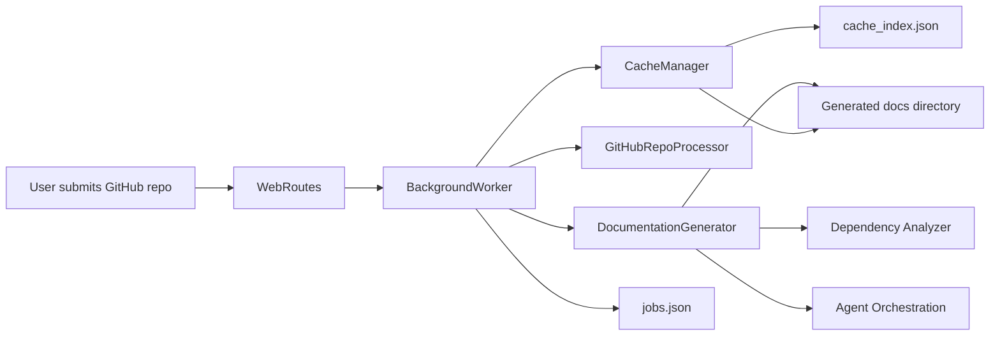
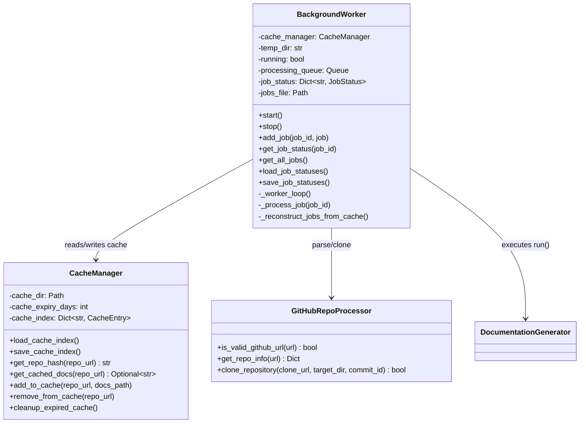
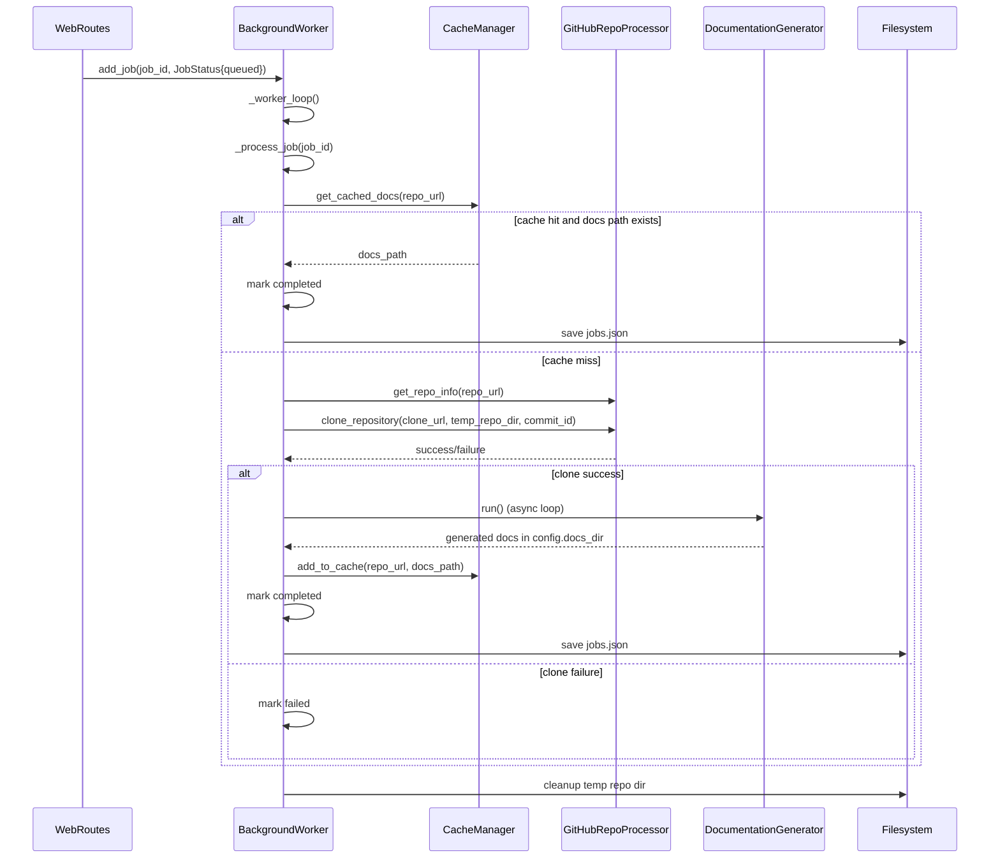
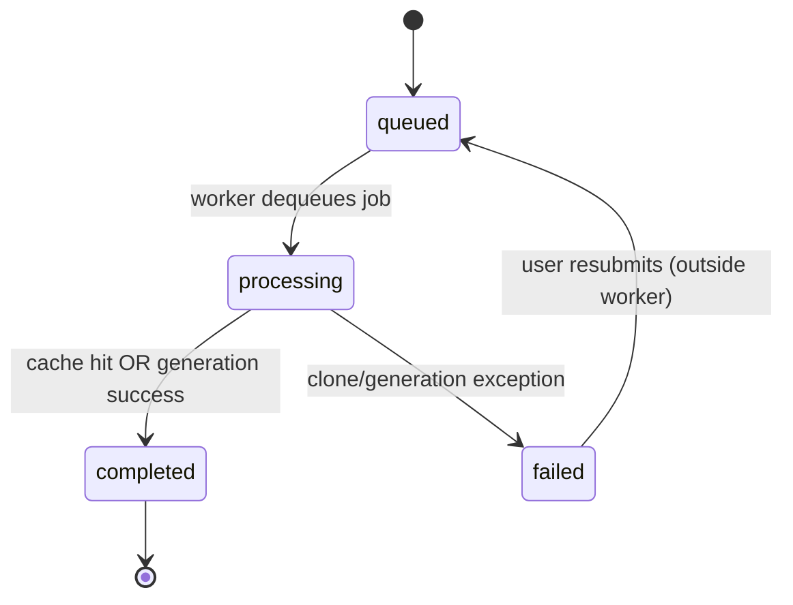
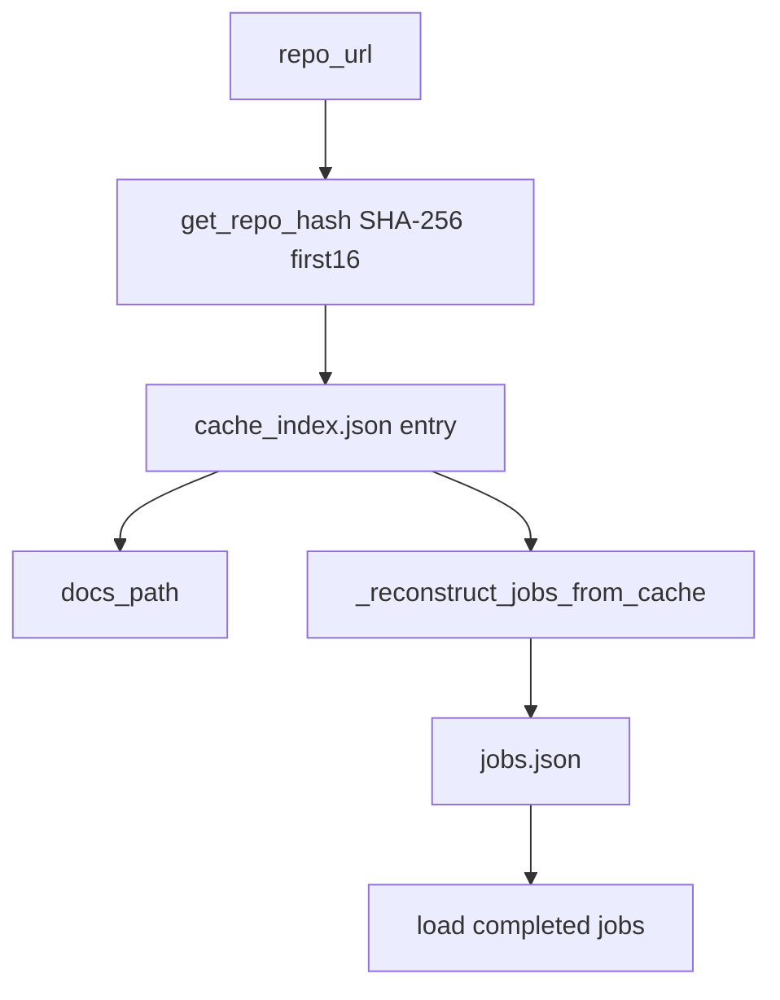
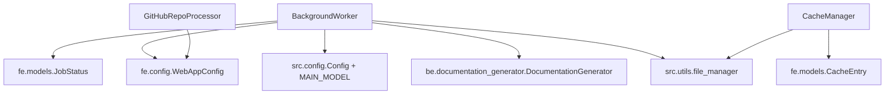
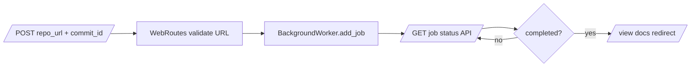

# job-processing-and-execution

## Introduction

The **job-processing-and-execution** module is the runtime engine behind asynchronous documentation generation in the Web Frontend. It coordinates three core components:

- `BackgroundWorker` (`codewiki.src.fe.background_worker.BackgroundWorker`)
- `GitHubRepoProcessor` (`codewiki.src.fe.github_processor.GitHubRepoProcessor`)
- `CacheManager` (`codewiki.src.fe.cache_manager.CacheManager`)

Together, they implement a queue-driven pipeline that accepts repository jobs, reuses cached documentation when possible, clones repositories when needed, invokes backend documentation generation, and persists job/cache state for recovery.

---

## Purpose and Responsibilities

This module is responsible for:

1. **Asynchronous job execution** with a background thread and bounded queue.
2. **Repository preparation** via GitHub URL parsing/validation and git cloning (with optional commit checkout).
3. **Cache lifecycle management** for generated docs.
4. **Job state tracking and persistence** (`queued` → `processing` → `completed` / `failed`).
5. **Recovery behavior** after restarts (load completed jobs; reconstruct missing jobs from cache entries).

It does **not** handle HTTP request parsing or HTML rendering directly—those live in Web routing and UI modules. For request lifecycle details, see `web-routing-and-request-lifecycle.md`.

---

## Position in the Overall System

Related module docs:
- Backend generation orchestration: [Documentation Generator](Documentation Generator.md)
- Analysis subsystem: [Dependency Analyzer](Dependency Analyzer.md)
- Agent execution layer: [Agent Orchestration](Agent Orchestration.md)

---

## Core Architecture

### Component Relationships

- **`BackgroundWorker` is the orchestrator**: owns queue, job state, execution loop, and integration points.
- **`CacheManager` is the persistence/index layer** for cache lookup and expiration.
- **`GitHubRepoProcessor` is stateless utility logic** for URL normalization metadata and git operations.

---

## End-to-End Process Flow

---

## Job Lifecycle and State Model

### Status fields tracked in `JobStatus`

- Identity: `job_id`, `repo_url`, `commit_id`
- Lifecycle timestamps: `created_at`, `started_at`, `completed_at`
- Execution status: `status`, `progress`, `error_message`
- Output references: `docs_path`, `main_model`

---

## Data Persistence and Recovery

### Persistent artifacts

- **`output/cache/cache_index.json`**: cache entries keyed by repo URL hash.
- **`output/cache/jobs.json`**: persisted job states (only completed jobs are restored on startup).
- **Docs directories** under `output/docs/<job-id>-docs` (set by `BackgroundWorker` using `Config.docs_dir`).

### Recovery strategy implemented

1. On startup, worker loads `jobs.json` if present.
2. It restores **completed jobs only** (avoids reviving in-flight/partial states).
3. If no jobs file exists, it reconstructs synthetic completed jobs from cache index.

This is a pragmatic consistency-first model: avoid uncertain resumptions, prefer reproducible re-submission.

---

## Dependency Map

### External integration points

- **Input boundary**: `WebRoutes` submits jobs and polls status.
- **Execution boundary**: `DocumentationGenerator.run()` performs deep backend orchestration.
- **Storage boundary**: local filesystem for cache indexes, job records, and generated docs.

---

## Concurrency and Execution Semantics

- Single daemon thread started by `BackgroundWorker.start()`.
- Queue: `Queue(maxsize=WebAppConfig.QUEUE_SIZE)` (back-pressure safeguard).
- Worker loop behavior:
  - Poll queue; process one job at a time.
  - Sleep 1s when idle or on loop-level error.
- Async bridge: each job creates a **new event loop** to run `DocumentationGenerator.run()`.

Implication: execution is serialized in this worker implementation, simplifying shared state handling (`job_status` dict) but limiting throughput to one active generation at a time.

---

## Caching Strategy

- Cache key = stable hash of normalized repo URL (`sha256(url)[:16]`).
- Validity = `now - created_at < cache_expiry_days`.
- On hit:
  - return `docs_path`
  - update `last_accessed`
- On expiry:
  - remove entry from index.

Important behavior: cache is URL-based; commit-specific differentiation is not encoded in the cache key by this module.

---

## Error Handling and Operational Characteristics

### Implemented safeguards

- Clone subprocess failures return `False` with stderr logging.
- Job-level exception handling marks job `failed` with message and completion timestamp.
- Temp repo cleanup in `finally` block.
- Defensive loading/saving of JSON with exception catch.

### Observed design tradeoffs

- `jobs.json` persistence is explicitly saved on success/cache-hit paths; failed statuses are kept in-memory unless saved elsewhere.
- URL-to-job identity is repo-full-name based (`owner--repo`), while cache identity is URL-hash based.
- Cleanup uses shell command (`rm -rf`) via subprocess (platform assumptions apply).

---

## Typical Interaction with Web Layer

For full route behavior and form/API contracts, see `web-routing-and-request-lifecycle.md` and frontend model docs.

---

## Practical Notes for Maintainers

- If adding multi-worker parallelism, review thread safety of `job_status`, cache writes, and event loop creation strategy.
- If commit-level correctness is required for cache hits, include `commit_id` in cache identity.
- Consider persisting failed job states immediately for better restart observability.
- Consider replacing shell cleanup with cross-platform filesystem APIs.

---

## Summary

The module provides a robust, restart-aware, queue-based execution core for web-triggered documentation generation. `BackgroundWorker` orchestrates, `GitHubRepoProcessor` prepares source code checkouts, and `CacheManager` optimizes repeated requests. It is the operational bridge between web submission flow and backend documentation synthesis.
