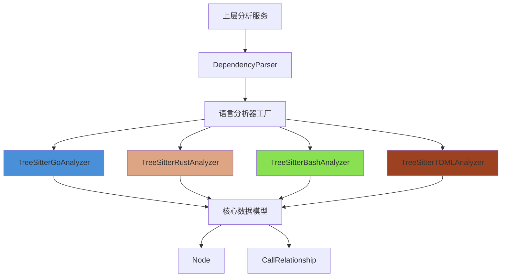
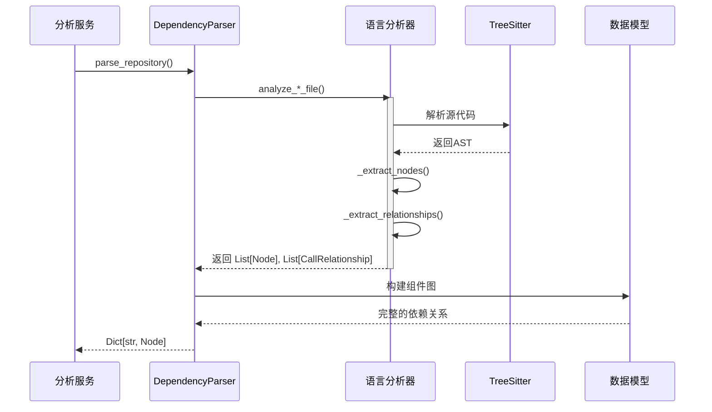

# Systems & Infrastructure Language Analyzers Module

## 1. 模块概述

`language_analyzers` 模块是 CodeWiki 依赖分析引擎的核心组件之一，专注于提供对系统编程、基础设施配置和脚本语言的代码结构分析与依赖关系提取能力。该模块通过 TreeSitter 解析技术，实现对 Go、Rust、Bash 脚本以及 TOML 配置文件的语法分析，能够自动提取代码中的定义节点（如函数、结构体、类型）以及它们之间的调用依赖关系。

### 设计理念

本模块的设计遵循**统一接口、语言特定实现**的原则。每种语言的分析器都独立实现其特定的解析逻辑，但共享相同的输出数据结构，确保不同语言的分析结果能够无缝集成到上层的依赖图构建系统中。该设计使得系统可以轻松扩展支持新的语言，同时保持整体架构的一致性。

### 核心功能

- **多语言语法解析**：支持 Go、Rust、Bash 脚本和 TOML 配置文件的抽象语法树（AST）解析
- **代码节点提取**：自动识别并提取函数、方法、结构体、枚举、Trait 等顶级代码定义
- **依赖关系分析**：追踪函数调用、方法调用、Trait 实现等代码依赖关系
- **元数据收集**：获取源代码位置、行号、显示名称等辅助信息

### 模块地位

本模块属于 `dependency_analysis_engine` 下的 `systems_and_infra_analyzers` 子模块，与其他语言分析器（如 C 家族、Web 脚本语言、托管语言等）共同构成 CodeWiki 的多语言分析能力矩阵。分析结果通过 `DependencyParser` 和 `AnalysisService` 整合后，用于构建完整的代码依赖图，最终服务于文档生成和代码理解。

## 2. 架构设计

### 整体架构

`language_analyzers` 模块采用简洁的分层架构，每个语言分析器都是独立的类，通过公共的数据模型与上层系统交互。



### 组件关系

每个语言分析器都遵循相似的内部结构：

1. **初始化阶段**：接收文件路径、内容和仓库路径，设置初始状态
2. **解析阶段**：使用 TreeSitter 解析源代码生成抽象语法树
3. **节点提取**：遍历 AST，识别并提取感兴趣的代码结构
4. **关系分析**：再次遍历 AST，识别调用和依赖关系
5. **结果输出**：返回提取到的节点列表和关系列表

### 数据流向



## 3. 核心组件详解

### TreeSitterGoAnalyzer

`TreeSitterGoAnalyzer` 负责分析 Go 语言源代码文件，提取函数、方法、结构体和接口定义，并追踪它们之间的调用关系。

#### 核心功能

- **函数声明识别**：提取顶级函数定义，包括函数名、参数列表和源代码位置
- **方法声明分析**：识别带接收者的方法，正确处理值接收者和指针接收者
- **类型声明处理**：识别结构体（struct）、接口（interface）和其他类型定义
- **调用关系提取**：追踪函数调用、方法调用和限定类型调用

#### 关键方法

| 方法名 | 功能描述 | 参数 | 返回值 |
|--------|----------|------|--------|
| `_analyze` | 主分析流程，协调解析、节点提取和关系分析 | 无 | 无 |
| `_extract_nodes` | 递归遍历 AST，提取函数、方法和类型声明 | node, top_level_nodes, lines | 无 |
| `_extract_relationships` | 识别调用表达式并构建调用关系 | node, top_level_nodes | 无 |
| `_get_receiver_type` | 从方法声明中提取接收者类型 | method_node | 接收者类型名称或 None |
| `_resolve_call_target` | 解析调用目标，处理标识符、选择器表达式和限定类型 | fn_node | 被调用的函数/方法名 |

#### Go 语言分析特点

Go 分析器特别关注以下语言特性：
- 函数与方法的区分（通过接收者判断）
- 结构体和接口的类型定义
- 指针类型和值类型接收者的处理
- 选择器表达式（如 `obj.Method`）和限定类型（如 `pkg.Func`）的解析

#### 使用示例

```python
from codewiki.src.be.dependency_analyzer.analyzers.go import analyze_go_file

# 分析单个 Go 文件
nodes, relationships = analyze_go_file(
    file_path="/path/to/file.go",
    content="package main\n\nfunc main() {\n    hello()\n}\n\nfunc hello() {\n    println(\"Hello\")\n}",
    repo_path="/path/to/repo"
)

# 处理分析结果
for node in nodes:
    print(f"Found: {node.display_name} at {node.file_path}:{node.start_line}")

for rel in relationships:
    print(f"Call: {rel.caller} -> {rel.callee} at line {rel.call_line}")
```

---

### TreeSitterRustAnalyzer

`TreeSitterRustAnalyzer` 专注于分析 Rust 语言源代码，处理 Rust 特有的语言特性如结构体、枚举、Trait、impl 块等复杂结构。

#### 核心功能

- **函数与方法提取**：识别独立函数和 impl 块中的方法
- **类型定义分析**：处理结构体（struct）、枚举（enum）和 Trait 定义
- **Trait 实现追踪**：识别 `impl Trait for Type` 模式，建立类型与 Trait 之间的依赖
- **调用关系解析**：处理函数调用、方法调用和作用域解析标识符

#### 关键方法

| 方法名 | 功能描述 | 参数 | 返回值 |
|--------|----------|------|--------|
| `_extract_nodes` | 提取 Rust 特定的代码结构，支持 impl 块上下文传递 | node, top_level_nodes, lines, impl_type | 无 |
| `_extract_params` | 从函数签名中提取参数，包括 `self` 参数 | fn_node | 参数名称列表 |
| `_find_containing_impl_type` | 查找函数所在的 impl 块，确定方法所属类型 | node | impl 类型名称或 None |
| `_resolve_call_target` | 处理 Rust 特有的调用语法，如 `obj.method` 和 `path::to::func` | fn_node | 被调用项名称 |

#### Rust 语言分析特点

Rust 分析器的设计重点在于处理 Rust 独特的语法结构：
- **impl 块**：正确识别类型的固有方法和 Trait 实现方法
- **Trait 系统**：建立类型与实现的 Trait 之间的依赖关系
- **模式匹配**：在参数提取中处理 Rust 灵活的参数模式
- **作用域解析**：正确解析 `::` 运算符分隔的路径

#### 使用示例

```python
from codewiki.src.be.dependency_analyzer.analyzers.rust import analyze_rust_file

# 分析 Rust 源文件
nodes, relationships = analyze_rust_file(
    file_path="/path/to/lib.rs",
    content="""
    struct Greeter;
    
    trait Greet {
        fn greet(&self);
    }
    
    impl Greet for Greeter {
        fn greet(&self) {
            println!("Hello from Rust!");
        }
    }
    
    fn main() {
        let g = Greeter;
        g.greet();
    }
    """,
    repo_path="/path/to/repo"
)
```

---

### TreeSitterBashAnalyzer

`TreeSitterBashAnalyzer` 用于分析 Bash 脚本文件，提取函数定义并追踪脚本内的函数调用关系。

#### 核心功能

- **函数定义识别**：提取 Bash 脚本中的函数声明
- **命令调用分析**：识别脚本中的命令调用，区分内置命令和自定义函数
- **调用关系建立**：在函数和它调用的其他函数之间建立关系

#### 关键方法

| 方法名 | 功能描述 | 参数 | 返回值 |
|--------|----------|------|--------|
| `_extract_nodes` | 识别 Bash 函数定义 | node, top_level_nodes, lines | 无 |
| `_extract_relationships` | 分析命令调用，过滤内置命令，建立函数间关系 | node, top_level_nodes | 无 |
| `_find_containing_fn` | 确定命令调用所在的函数上下文 | node, top_level_nodes | 调用者函数 ID 或 None |

#### Bash 脚本分析特点

Bash 分析器需要处理 Shell 脚本的特殊性：
- **内置命令过滤**：维护一个广泛的内置命令列表，避免将它们误识别为自定义函数
- **灵活的函数语法**：处理 `function name { }` 和 `name() { }` 两种函数声明风格
- **命令上下文**：准确判断命令调用是否发生在函数内部

#### 内置命令过滤

分析器内置了一个全面的 Bash 内置命令和常用工具集合，包括：
- Shell 关键字：`if`, `then`, `else`, `for`, `while`, `case` 等
- 内置命令：`echo`, `printf`, `read`, `exit`, `export` 等
- 常用工具：`ls`, `mkdir`, `rm`, `grep`, `awk`, `sed` 等

#### 使用示例

```python
from codewiki.src.be.dependency_analyzer.analyzers.bash import analyze_bash_file

# 分析 Bash 脚本
nodes, relationships = analyze_bash_file(
    file_path="/path/to/script.sh",
    content="""
    #!/bin/bash
    
    function greet() {
        echo "Hello, $1!"
    }
    
    main() {
        local name="World"
        greet "$name"
    }
    
    main
    """,
    repo_path="/path/to/repo"
)
```

---

### TreeSitterTOMLAnalyzer

`TreeSitterTOMLAnalyzer` 专门用于分析 TOML 配置文件，将配置文件的结构提取为代码节点。由于 TOML 是配置语言而非编程语言，此分析器不提取调用关系。

#### 核心功能

- **表结构提取**：识别 TOML 中的顶级表（table）定义
- **表数组处理**：识别数组表（array of tables）结构
- **配置节组织**：按顶级节名组织配置结构，忽略子节的细分

#### 关键方法

| 方法名 | 功能描述 | 参数 | 返回值 |
|--------|----------|------|--------|
| `_extract_nodes` | 提取表和表数组作为配置节点 | root, lines | 无 |

#### TOML 配置分析特点

TOML 分析器的设计考虑了配置文件的特殊性：
- **结构化视图**：将配置文件表示为层次化的节点，而不是扁平的键值对
- **顶级节聚焦**：只提取顶级配置节，避免生成过多细粒度节点
- **无调用关系**：由于是配置文件，不产生任何调用关系

#### 支持的 TOML 结构

分析器识别两种主要的 TOML 结构：
1. **标准表**：`[section]` 格式的配置块
2. **表数组**：`[[array]]` 格式的配置块数组

对于复合键名（如 `section.subsection`），只提取顶级部分（`section`）作为节点。

#### 使用示例

```python
from codewiki.src.be.dependency_analyzer.analyzers.toml import analyze_toml_file

# 分析 TOML 配置文件
nodes, relationships = analyze_toml_file(
    file_path="/path/to/Cargo.toml",
    content="""
    [package]
    name = "my-project"
    version = "0.1.0"
    
    [dependencies]
    serde = "1.0"
    tokio = { version = "1.0", features = ["full"] }
    
    [[bin]]
    name = "app"
    path = "src/main.rs"
    """,
    repo_path="/path/to/repo"
)

# 输出提取到的配置节
for node in nodes:
    print(f"Config section: {node.display_name}")
```

## 4. 核心数据模型

本模块的所有分析器都产生统一格式的输出，基于以下核心数据模型：

### Node 模型

`Node` 表示代码库中的一个可识别组件，如函数、方法、类或配置节。

```python
class Node(BaseModel):
    id: str                    # 组件的唯一标识符
    name: str                  # 组件名称
    component_type: str        # 组件类型（function, method, struct, table等）
    file_path: str             # 完整文件路径
    relative_path: str         # 相对于仓库根目录的路径
    depends_on: Set[str]       # 此组件依赖的其他组件ID集合
    source_code: Optional[str] # 组件的源代码片段
    start_line: int            # 起始行号（从1开始）
    end_line: int              # 结束行号
    has_docstring: bool        # 是否有文档字符串
    docstring: str             # 文档字符串内容
    parameters: Optional[List[str]]  # 参数名称列表
    node_type: Optional[str]   # 节点类型（与component_type类似，用于兼容性）
    base_classes: Optional[List[str]]  # 基类/实现的Trait列表
    class_name: Optional[str]  # 所属类/类型名称（对于方法）
    display_name: Optional[str] # 用于显示的格式化名称
    component_id: Optional[str] # 组件ID（与id重复，用于兼容性）
```

### CallRelationship 模型

`CallRelationship` 表示两个组件之间的调用或依赖关系。

```python
class CallRelationship(BaseModel):
    caller: str               # 调用者组件ID
    callee: str               # 被调用者组件ID或名称
    call_line: Optional[int]  # 调用发生的行号
    is_resolved: bool         # 是否已解析为已知组件
```

## 5. 使用指南

### 基本使用流程

各语言分析器的使用方式基本一致，通常遵循以下步骤：

1. **准备输入**：获取文件路径、文件内容和仓库根目录
2. **调用分析函数**：使用对应的 `analyze_*_file` 函数
3. **处理结果**：处理返回的节点和关系列表

### 集成到分析流程

在 CodeWiki 系统中，这些分析器通常不直接使用，而是通过 `DependencyParser` 和 `AnalysisService` 间接调用：

```python
from codewiki.src.be.dependency_analyzer.ast_parser import DependencyParser

# 创建解析器实例
parser = DependencyParser(
    repo_path="/path/to/repository",
    include_patterns=["*.go", "*.rs", "*.sh", "*.toml"],
    exclude_patterns=["*test*", "vendor/*"]
)

# 解析整个仓库
components = parser.parse_repository()

# 访问解析结果
for component_id, component in components.items():
    print(f"{component.display_name} - {len(component.depends_on)} dependencies")
```

### 扩展新的语言分析器

要添加新的语言分析器，建议遵循以下模式：

1. **创建分析器类**，实现与现有分析器相似的接口
2. **提供便捷函数**，如 `analyze_*_file`
3. **使用公共数据模型**，确保输出兼容性
4. **集成到上层服务**，更新 `AnalysisService` 以支持新语言

## 6. 注意事项与限制

### 常见边界情况

1. **部分解析的文件**：如果源代码有语法错误，TreeSitter 仍会尝试生成 AST，但可能导致不完整的分析结果
2. **生成的代码**：分析器会处理所有输入内容，包括机器生成的代码，可能产生噪声
3. **动态调用**：对于动态语言特性（如 Rust 的 `dyn Trait` 或 Go 的反射），静态分析可能无法完全解析
4. **外部依赖**：对标准库和外部库的调用会被识别，但无法解析到具体实现

### 性能考虑

- **大文件处理**：分析器会将整个文件内容加载到内存，超大文件可能需要特殊处理
- **仓库规模**：对于大型仓库，建议使用 `include_patterns` 和 `exclude_patterns` 限制分析范围
- **缓存策略**：上层分析服务通常会实现缓存机制，避免重复分析未更改的文件

### 错误处理

分析器设计为在遇到问题时尽可能继续工作：
- 无法识别的语法结构会被跳过而不是导致整个分析失败
- 缺失的可选数据会被设置为默认值而非抛出异常
- 所有分析器都使用日志记录问题，而不是依赖异常传递

### 内置函数过滤

各语言分析器都维护了内置函数/关键字列表，避免将它们识别为用户定义的组件。这些列表可能需要随语言版本更新而更新。

## 7. 相关模块参考

- [dependency_analysis_engine](dependency_analysis_engine.md) - 完整的依赖分析引擎概述
- [ast_parsing_and_language_analyzers](ast_parsing_and_language_analyzers.md) - AST 解析与语言分析器总览
- [analysis_orchestration](analysis_orchestration.md) - 分析编排服务
- [dependency_graph_construction](dependency_graph_construction.md) - 依赖图构建
