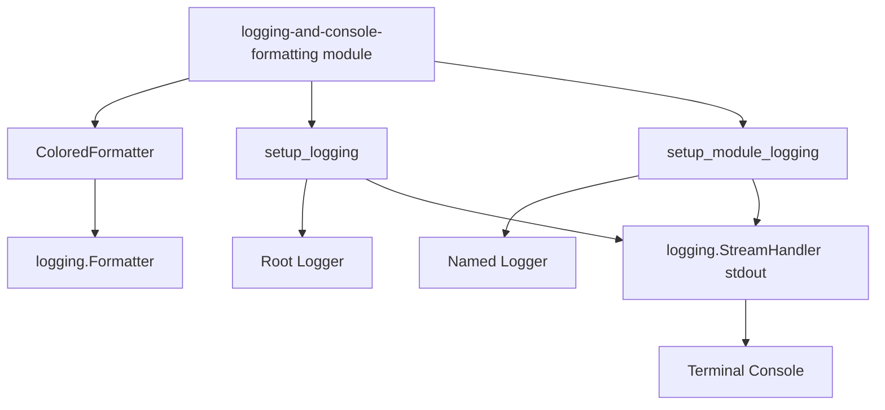
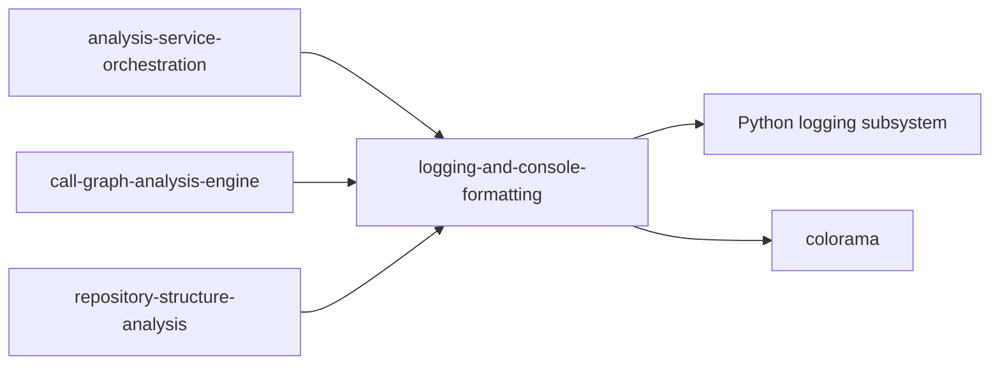
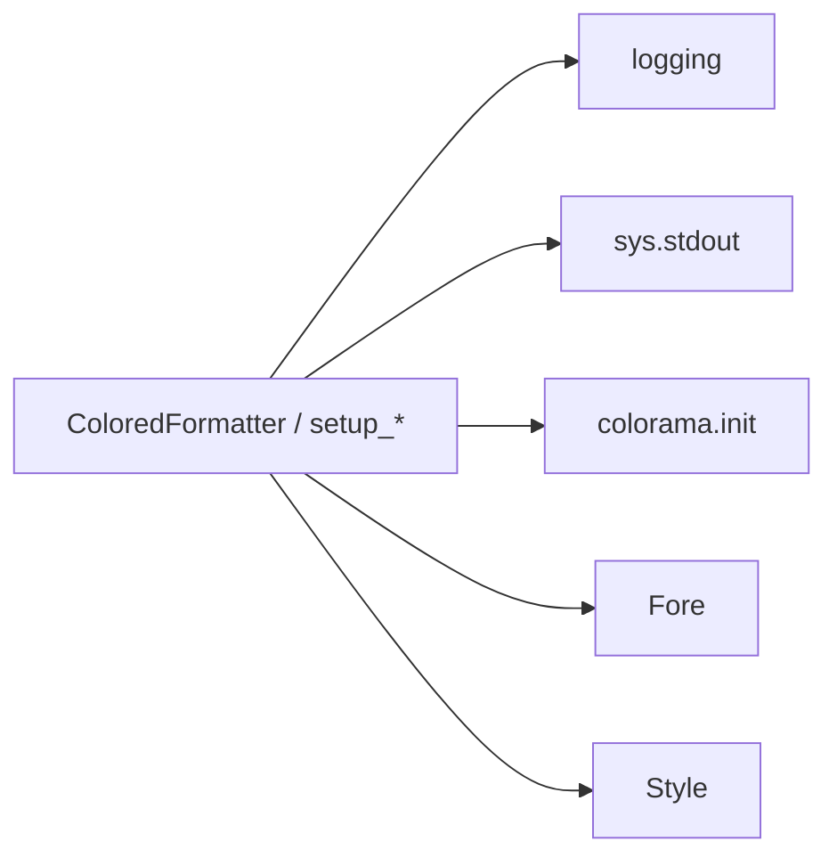
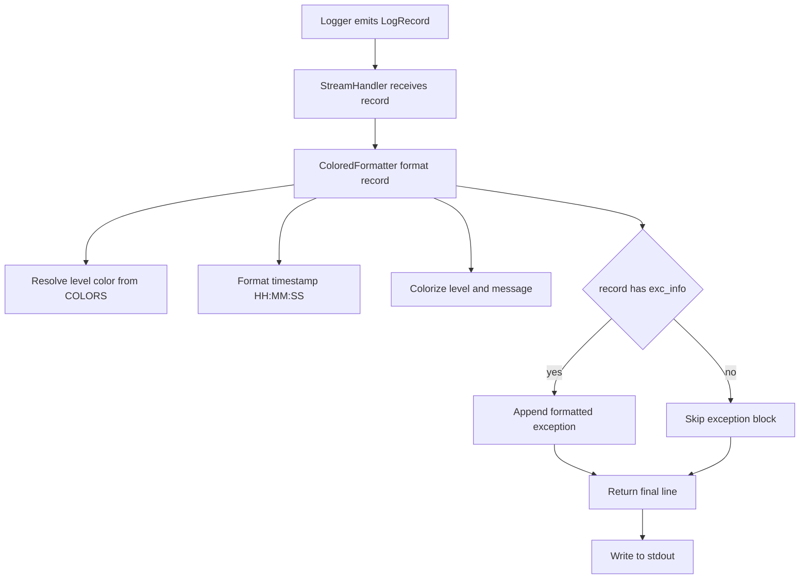
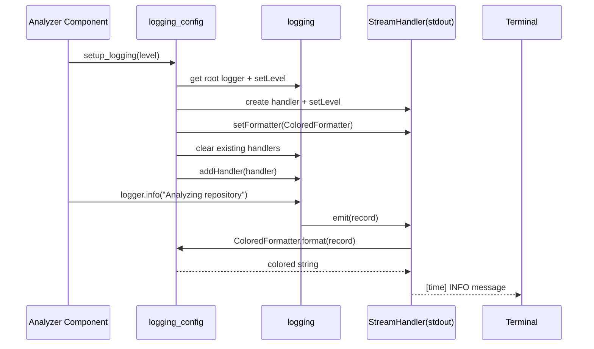
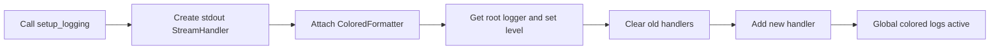
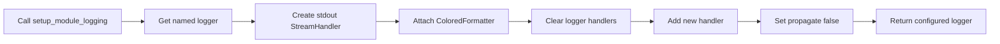

# logging-and-console-formatting Module

## Introduction

The `logging-and-console-formatting` module provides the Dependency Analyzer’s console logging foundation, centered on a custom `ColoredFormatter` that renders severity-aware, colorized log lines for terminal output.

Although small, this module is operationally important: it standardizes how runtime diagnostics are presented during repository analysis workflows driven by modules such as [analysis-service-orchestration.md](analysis-service-orchestration.md), [call-graph-analysis-engine.md](call-graph-analysis-engine.md), and [repository-structure-analysis.md](repository-structure-analysis.md).

---

## Purpose and Scope

### Primary responsibilities

- Define a custom formatter (`ColoredFormatter`) for readable, colorized console logs.
- Provide convenience setup functions for:
  - global/root logging (`setup_logging`), and
  - per-module logger initialization (`setup_module_logging`).
- Prevent common CLI logging issues such as duplicate handler emission.

### Out of scope

- It does **not** perform analysis, parsing, or graph construction.
- It does **not** manage CLI progress bars (see [cli-observability.md](cli-observability.md)).
- It does **not** persist logs to files or external observability backends.

---

## Core Component

## `codewiki.src.be.dependency_analyzer.utils.logging_config.ColoredFormatter`

`ColoredFormatter` subclasses `logging.Formatter` and overrides `format(record)` to build a custom line layout:

- **Timestamp** (`[HH:MM:SS]`) in blue
- **Level column** (`DEBUG`, `INFO`, etc.) padded to width 8 and colorized by severity
- **Message** colorized using the same severity color
- Optional exception traceback appended when `record.exc_info` is present

### Severity color mapping

| Log Level | Color |
|---|---|
| DEBUG | Blue |
| INFO | Cyan |
| WARNING | Yellow |
| ERROR | Red |
| CRITICAL | Bright Red |

### Supporting constants

- `COLORS`: severity → color map
- `COMPONENT_COLORS`: timestamp/reset/module palette (note: `module` is defined but currently not injected into output line)

---

## Module API Surface

Even though the core component is `ColoredFormatter`, this module exposes three practical integration points:

1. `ColoredFormatter`
2. `setup_logging(level=logging.INFO)`
3. `setup_module_logging(module_name: str, level=logging.INFO)`

### `setup_logging(...)` (root logger configuration)

Behavior:

- Creates a `StreamHandler(sys.stdout)`.
- Applies `ColoredFormatter`.
- Sets root logger level.
- Clears existing root handlers (`root_logger.handlers.clear()`) to avoid duplicate output.
- Attaches the colored console handler.

Use this when you want a single app-wide logging style.

### `setup_module_logging(...)` (isolated logger configuration)

Behavior:

- Gets named logger via `logging.getLogger(module_name)`.
- Sets logger level + stream handler + `ColoredFormatter`.
- Clears existing handlers on that logger.
- Sets `logger.propagate = False` to prevent root duplication.
- Returns configured logger for immediate use.

Use this when individual modules need explicit logger isolation.

---

## Architecture and Component Relationships

### Relationship to other system modules

> This module is a shared utility under the Dependency Analyzer backend and can be consumed by any component that relies on Python’s logging framework.

---

## Dependency View

### External dependencies

- **`logging`**: core logging API and `Formatter` base class.
- **`sys`**: stdout stream binding for console handler.
- **`colorama`**: cross-platform terminal ANSI handling (`init(autoreset=True)`).

---

## Data Flow: From Log Record to Colored Console Line

---

## Interaction Flow (Setup + Runtime)

---

## Process Flows

### A) Global logging setup process

### B) Module-specific setup process

---

## Operational Notes and Design Implications

- **Duplicate prevention by design**:
  - Root path clears root handlers.
  - Module path clears module handlers and disables propagation.
- **Console-first orientation**: output is optimized for interactive readability, not structured machine ingestion.
- **Cross-platform terminal behavior** relies on `colorama.init(autoreset=True)`.
- **Formatting schema is intentionally compact**: timestamp + padded level + message.

### Implementation nuance

The module-level docstring mentions a “module name” color, and `COMPONENT_COLORS` includes a `module` entry, but current `format()` output does not render a module-name column. This is useful context for maintainers considering formatter evolution.

---

## How This Module Fits into the Overall System

Within the Dependency Analyzer subsystem, this module serves as the **presentation layer for runtime diagnostics**:

- analysis orchestration and engines generate log events,
- this module standardizes how those events are shown in terminal sessions,
- other modules remain focused on analysis logic, while formatting concerns stay centralized.

For deeper logic and workflow behavior, see:

- [analysis-service-orchestration.md](analysis-service-orchestration.md)
- [call-graph-analysis-engine.md](call-graph-analysis-engine.md)
- [repository-structure-analysis.md](repository-structure-analysis.md)
- [dependency-parser-and-component-projection.md](dependency-parser-and-component-projection.md)

For CLI-facing observability patterns (separate from backend logging), see:

- [cli-observability.md](cli-observability.md)
