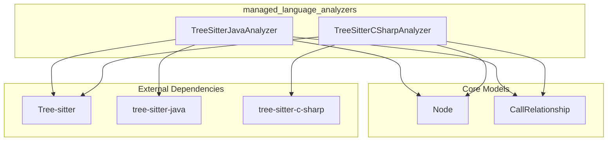
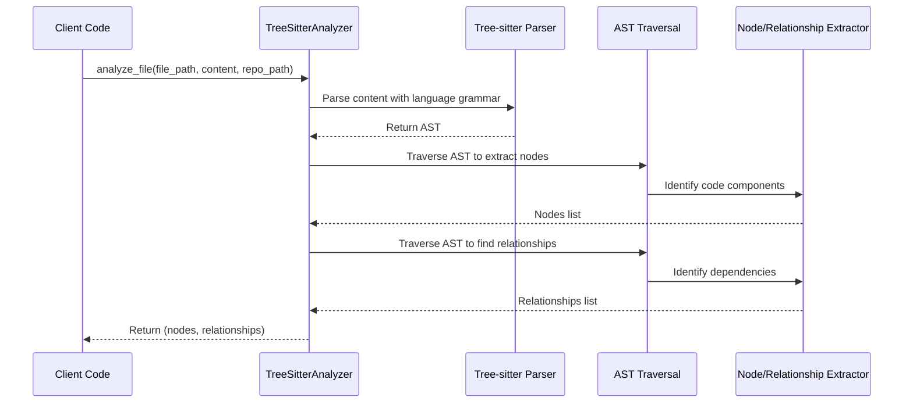

# Managed Language Analyzers Module Documentation

## Overview

The `managed_language_analyzers` module is a critical sub-component of the `dependency_analysis_engine` that provides static code analysis capabilities for managed programming languages, specifically Java and C#. This module is responsible for parsing source code files, extracting structural information about code components, and identifying dependencies and relationships between these components.

### Purpose and Design Rationale

Managed languages like Java and C# share common characteristics such as strong type systems, object-oriented paradigms, and structured syntax. This module leverages these similarities to provide a consistent approach to code analysis while accommodating language-specific syntax and features. The design uses Tree-sitter, a powerful parsing library, to create abstract syntax trees (ASTs) from source code, which are then traversed to extract meaningful information about code structure and dependencies.

The module exists to:
1. Provide language-specific parsing and analysis for Java and C# codebases
2. Extract code components (classes, interfaces, methods, etc.) with their metadata
3. Identify relationships between components (inheritance, method calls, field dependencies, etc.)
4. Support the broader dependency analysis engine by providing structured data for graph construction

## Architecture

The `managed_language_analyzers` module follows a consistent pattern across both language analyzers, with each language having its own dedicated analyzer class. The architecture is designed to be self-contained and focused on the specific parsing needs of each language.

### Component Diagram



### Architecture Explanation

The module consists of two main analyzer classes, each responsible for a specific managed language:

1. **TreeSitterJavaAnalyzer**: Handles parsing and analysis of Java source files
2. **TreeSitterCSharpAnalyzer**: Handles parsing and analysis of C# source files

Both analyzers follow a similar workflow:
- Accept a file path, file content, and optional repository path
- Use Tree-sitter with the appropriate language grammar to parse the source code into an AST
- Traverse the AST to extract code components (nodes)
- Analyze the AST to identify relationships between components
- Return the collected nodes and relationships as structured data

The analyzers depend on core models (`Node` and `CallRelationship`) from the `dependency_analysis_engine` module to represent the extracted information in a standardized format that can be used by other parts of the system.

## Sub-modules

The `managed_language_analyzers` module is composed of two main language-specific analyzers, each functioning as a sub-module:

### Java Analyzer

The Java analyzer is implemented in the `TreeSitterJavaAnalyzer` class and provides comprehensive analysis of Java source code. It can identify various Java constructs including classes, interfaces, enums, records, annotations, and methods. The analyzer extracts detailed information about each component including its location in the source file, source code snippet, and relationships with other components.

Key capabilities include:
- Detection of inheritance relationships (class extends another class)
- Identification of interface implementations
- Analysis of field type dependencies
- Recognition of method calls and object creations
- Resolution of variable types to identify implicit dependencies

For more detailed information, see the [Java Analyzer documentation](java_analyzer.md).

### C# Analyzer

The C# analyzer is implemented in the `TreeSitterCSharpAnalyzer` class and provides similar capabilities for C# source code. It can identify C# constructs such as classes, interfaces, structs, enums, records, and delegates. The analyzer extracts metadata about each component and identifies relationships between them.

Key capabilities include:
- Detection of class inheritance and interface implementation through base lists
- Analysis of property type dependencies
- Identification of field type dependencies
- Recognition of method parameter type dependencies

For more detailed information, see the [C# Analyzer documentation](csharp_analyzer.md).

## Data Flow

The following diagram shows the data flow through the managed language analyzers:



## Usage

The `managed_language_analyzers` module is typically used as part of the larger `dependency_analysis_engine` but can also be used independently for specific analysis tasks.

### Basic Usage

To use the analyzers, you can call the convenience functions provided for each language:

```python
# For Java files
from codewiki.src.be.dependency_analyzer.analyzers.java import analyze_java_file

nodes, relationships = analyze_java_file(
    file_path="/path/to/YourClass.java",
    content="public class YourClass { ... }",
    repo_path="/path/to/repository"
)

# For C# files
from codewiki.src.be.dependency_analyzer.analyzers.csharp import analyze_csharp_file

nodes, relationships = analyze_csharp_file(
    file_path="/path/to/YourClass.cs",
    content="public class YourClass { ... }",
    repo_path="/path/to/repository"
)
```

### Integration with Dependency Analysis Engine

Within the larger system, these analyzers are typically invoked by the `DependencyParser` component from the `ast_parsing_and_language_analyzers` module, which coordinates the analysis of multiple files and feeds the results into the `DependencyGraphBuilder` for constructing a comprehensive dependency graph.

## Configuration

The `managed_language_analyzers` module doesn't require explicit configuration files. However, there are several implicit configuration points:

### Language Primitives

Each analyzer includes a predefined set of primitive and common built-in types that are excluded from dependency analysis. These can be modified by updating the `_is_primitive_type` method in each analyzer class if you need to include or exclude specific types from dependency tracking.

### Tree-sitter Grammars

The analyzers rely on external Tree-sitter grammar libraries:
- `tree-sitter-java` for Java parsing
- `tree-sitter-c-sharp` for C# parsing

These should be installed as dependencies in your environment.

## Limitations and Edge Cases

When working with the `managed_language_analyzers` module, be aware of the following limitations and edge cases:

### Unresolved Dependencies

Many relationships are marked as `is_resolved=False` because the analyzers work on a single file at a time and may not have information about types defined in other files. Full resolution of these dependencies requires coordination with the broader analysis engine.

### Complex Type Inference

The analyzers have limited ability to infer types in complex scenarios, such as:
- Generic type arguments beyond simple extraction
- Lambda expressions and functional interfaces
- Dynamic type resolution in certain C# scenarios
- Complex method overload resolution

### Language Feature Coverage

While the analyzers cover many common language features, they may not handle every possible language construct:
- Java: Certain newer Java features might have limited support
- C#: Some advanced C# features may not be fully analyzed

### Error Handling

The analyzers assume valid source code. If provided with syntactically incorrect code, the Tree-sitter parser will still produce an AST (with error nodes), but the analysis results may be incomplete or inaccurate.

## Related Modules

- [ast_parsing_and_language_analyzers](ast_parsing_and_language_analyzers.md): The parent module that coordinates the use of these analyzers
- [dependency_analysis_engine](dependency_analysis_engine.md): The overall engine that uses these analyzers for dependency graph construction
- [core_domain_models](core_domain_models.md): Defines the `Node` and `CallRelationship` models used by these analyzers
