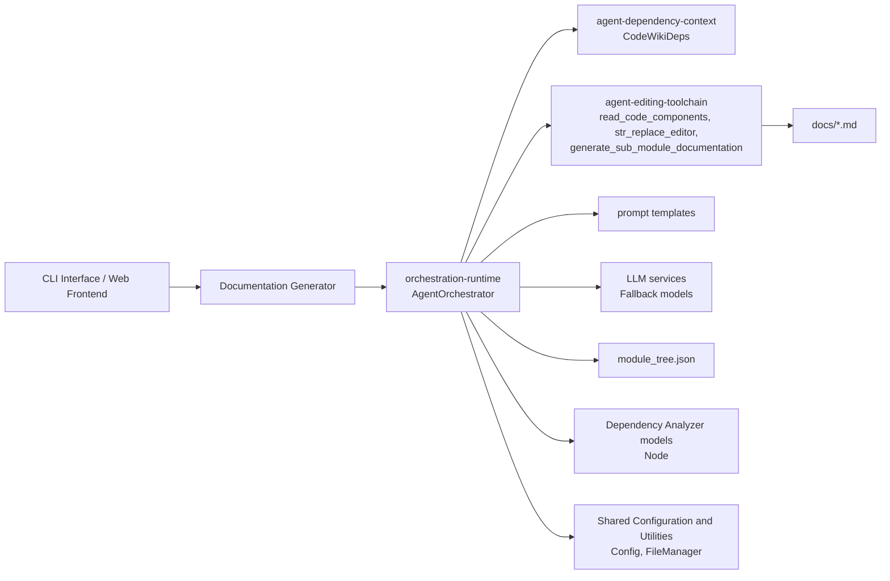
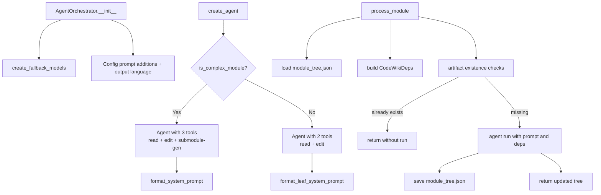
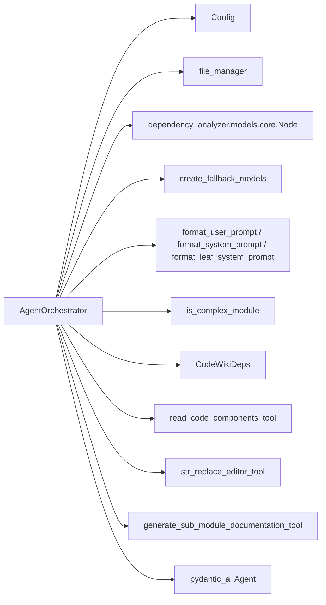
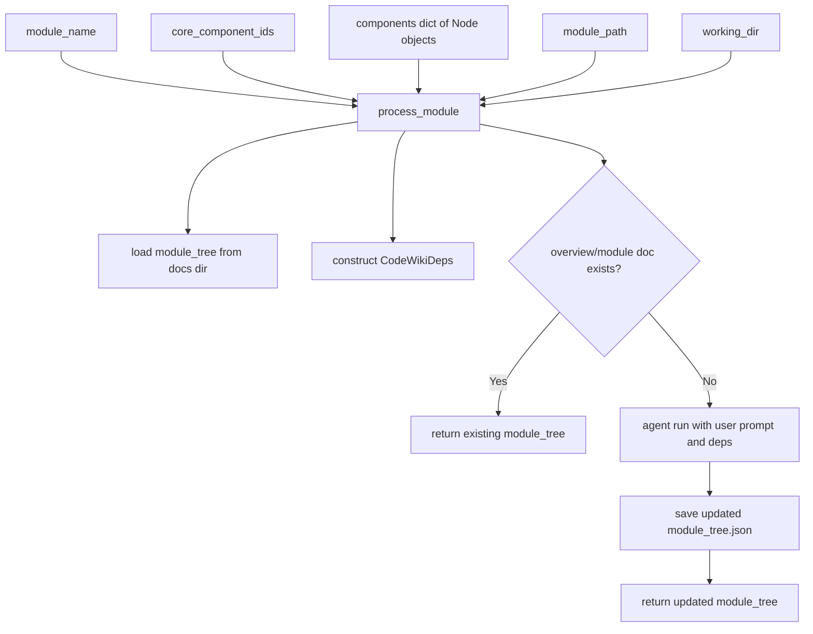
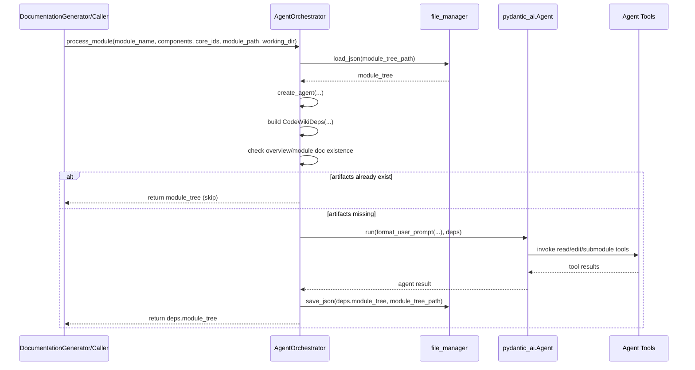
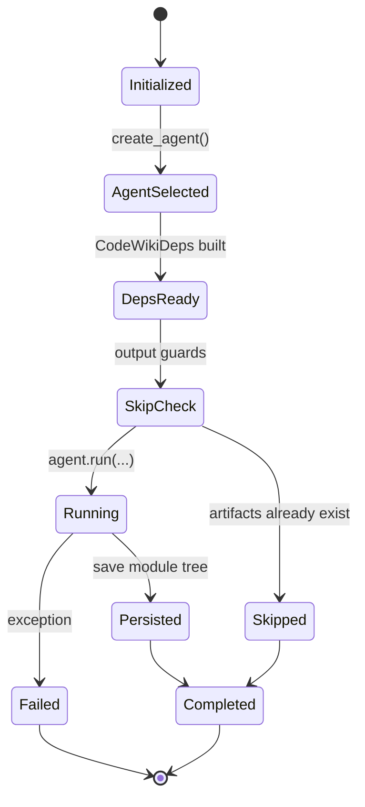
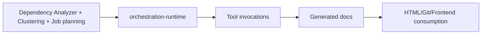

# orchestration-runtime Module

## Introduction

The `orchestration-runtime` module is the execution core of CodeWiki’s agent-based documentation workflow.

Its main component, `AgentOrchestrator`, is responsible for:

- selecting the right AI agent profile for a module,
- injecting runtime dependencies (repository/docs paths, module tree, depth constraints, config),
- executing the agent with the correct prompts and tools,
- handling idempotency checks and persistence of orchestration state.

In short: this module turns *module metadata + code components* into an actual **agent run** that writes documentation artifacts.

---

## Position in the System

`orchestration-runtime` is not a parser and not a renderer—it is the **runtime coordinator** for AI documentation agents.

---

## Core Component: `AgentOrchestrator`

### Class Responsibilities

`AgentOrchestrator` owns three key responsibilities:

1. **Runtime bootstrap**
   - Stores global `Config`.
   - Builds fallback model chain via `create_fallback_models(config)`.
   - Extracts prompt customizations (`config.get_prompt_addition()`) and output language.

2. **Agent construction strategy** (`create_agent`)
   - Uses `is_complex_module(...)` to decide between:
     - **complex-module agent**: can generate sub-module docs (`generate_sub_module_documentation_tool` included),
     - **leaf-module agent**: read/edit tools only.
   - Chooses matching system prompt template:
     - `format_system_prompt(...)` for complex modules,
     - `format_leaf_system_prompt(...)` for leaf modules.

3. **Module execution lifecycle** (`process_module`)
   - Loads module tree from docs workspace.
   - Builds `CodeWikiDeps` runtime context.
   - Applies skip guards when output artifacts already exist.
   - Runs agent with `format_user_prompt(...)`.
   - Persists updated `module_tree.json`.
   - Logs and rethrows exceptions.

---

## Internal Architecture

---

## Dependency Map

### External modules to reference

- Dependency and context object details: [agent-dependency-context.md](agent-dependency-context.md)
- Editor and file mutation toolchain: [agent-editing-toolchain.md](agent-editing-toolchain.md)
- Top-level orchestration layer: [agent-orchestration.md](agent-orchestration.md)
- Global config and file I/O helpers: [shared-configuration-and-utilities.md](shared-configuration-and-utilities.md)
- Upstream workflow driver: [documentation-generator.md](documentation-generator.md)

---

## Data Flow

### Runtime Context (`CodeWikiDeps`) injected into agent

`AgentOrchestrator` passes a rich dependency object to tools and agent runtime, including:

- absolute docs and repo paths,
- current module identity and module-tree location,
- full component registry for lookup,
- recursion limits (`max_depth`, `current_depth`),
- global config and custom instructions.

This context is the contract that allows agent tools to behave deterministically across nested module-generation steps.

---

## Component Interaction Sequence

---

## Process Flow (State-Oriented)

---

## Notable Runtime Behaviors

- **Complexity-based capability elevation**: only multi-file (complex) modules receive the sub-module generation tool.
- **Prompt specialization**: system prompt differs for complex vs leaf modules; user prompt always includes formatted module tree and grouped core-component code.
- **Idempotency guards**:
  - If overview artifact exists, execution short-circuits.
  - If module markdown already exists, execution short-circuits.
- **Persistent orchestration state**: updated module tree is written back after successful run.
- **Fail-fast errors**: exceptions are logged with traceback and re-raised for upstream handling.

---

## Operational and Maintenance Notes

1. **Guard ordering matters**
   - `overview` existence is checked before module doc existence; this can bypass run execution early.
   - If behavior changes are needed (e.g., regenerate module docs while overview exists), update guard policy explicitly.

2. **`module_tree` nullability**
   - `load_json` can return `None` when file is missing; callers should ensure the file is initialized before orchestration starts.

3. **Depth control is delegated via deps**
   - Recursive or sub-module generation policy is carried through `CodeWikiDeps` (`max_depth`, `current_depth`).

4. **Tool contract stability is critical**
   - Runtime correctness depends on agent tools (`read_code_components`, `str_replace_editor`, sub-module generator) honoring `CodeWikiDeps` conventions.

---

## How This Module Fits the Overall Architecture

`orchestration-runtime` is the **execution bridge** between static analysis/planning and concrete markdown output.

- Upstream modules decide *what* module should be generated.
- This module decides *how* to run the agent for that module.
- Toolchain modules perform *actual file/code interactions*.

---

## Related Documentation

- [agent-orchestration.md](agent-orchestration.md)
- [agent-dependency-context.md](agent-dependency-context.md)
- [agent-editing-toolchain.md](agent-editing-toolchain.md)
- [documentation-generator.md](documentation-generator.md)
- [dependency-analyzer.md](dependency-analyzer.md)
- [shared-configuration-and-utilities.md](shared-configuration-and-utilities.md)
