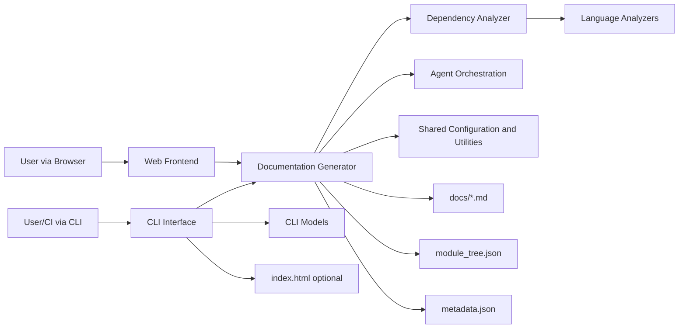
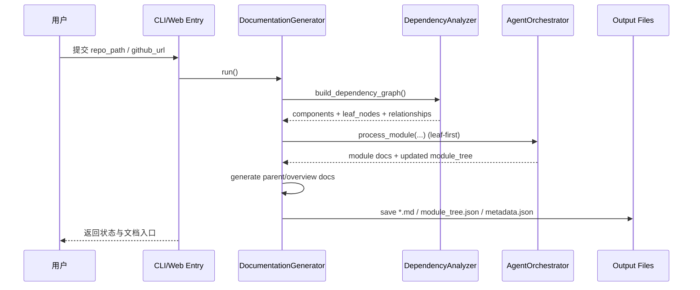

# CodeWiki 仓库概览

## 1) 仓库目的

`CodeWiki` 是一个“代码仓库自动文档化”系统：  
它将本地/GitHub 仓库输入，经过依赖分析、模块聚类、Agent 驱动的文档生成与汇总，输出结构化文档产物（如 `*.md`、`module_tree.json`、`metadata.json`、可选 `index.html`），并支持 CLI 与 Web 两种使用形态。

---

## 2) 端到端架构（E2E）

---

## 3) 仓库结构与核心模块

| 模块 | 路径 | 角色 |
|---|---|---|
| CLI Interface | `codewiki/cli` | CLI 编排入口、配置/Git/HTML/日志进度 |
| CLI Models | `codewiki/cli/models` | CLI 配置与任务生命周期数据契约 |
| Documentation Generator | `codewiki/src/be/documentation_generator.py` | 文档生成总控编排器 |
| Dependency Analyzer | `codewiki/src/be/dependency_analyzer` | 仓库结构扫描、调用图/依赖图分析 |
| Language Analyzers | `codewiki/src/be/dependency_analyzer/analyzers` | 多语言 AST/Tree-sitter 解析 |
| Agent Orchestration | `codewiki/src/be` | Agent 运行时与编辑工具链编排 |
| Web Frontend | `codewiki/src/fe` | Web 路由、异步任务、缓存与展示 |
| Shared Configuration and Utilities | `codewiki/src` | 共享配置 `Config` 与 `FileManager` |

---

## 4) 核心模块文档索引（引用）

- **CLI Interface**  
  主文档：`CLI Interface.md`  
  子文档：`cli-adapter-generation.md`、`configuration-and-credentials.md`、`git-operations.md`、`html-viewer-generation.md`、`cli-observability.md`

- **CLI Models**  
  主文档：`CLI Models.md`  
  子文档：`configuration-models.md`、`job-lifecycle-models.md`

- **Documentation Generator**  
  主文档：`Documentation Generator.md`

- **Dependency Analyzer**  
  主文档：`Dependency Analyzer.md`  
  子文档：`analysis-service-orchestration.md`、`call-graph-analysis-engine.md`、`repository-structure-analysis.md`、`dependency-parser-and-component-projection.md`、`dependency-graph-build-and-leaf-selection.md`、`analysis-domain-models.md`、`logging-and-console-formatting.md`

- **Language Analyzers**  
  主文档：`Language Analyzers.md`  
  子文档：`python-ast-analyzer.md`、`javascript-typescript-analyzers.md`、`java-c-cpp-csharp-analyzers.md`、`php-analyzer-and-namespace-resolution.md`

- **Agent Orchestration**  
  主文档：`Agent Orchestration.md`  
  子文档：`orchestration-runtime.md`、`agent-dependency-context.md`、`agent-editing-toolchain.md`

- **Web Frontend**  
  主文档：`Web Frontend.md`  
  子文档：`job-processing-and-execution.md`、`web-routing-and-request-lifecycle.md`、`frontend-models-and-configuration.md`、`template-rendering-utilities.md`

- **Shared Configuration and Utilities**  
  主文档：`Shared Configuration and Utilities.md`  
  子文档：`configuration-runtime-and-prompt-control.md`、`file-io-abstraction.md`

---

## 5) 典型输出产物

- `*.md`（模块文档与总览）
- `module_tree.json`（当前模块树）
- `first_module_tree.json`（初次聚类快照）
- `metadata.json`（生成元数据）
- `index.html`（可选静态浏览页）