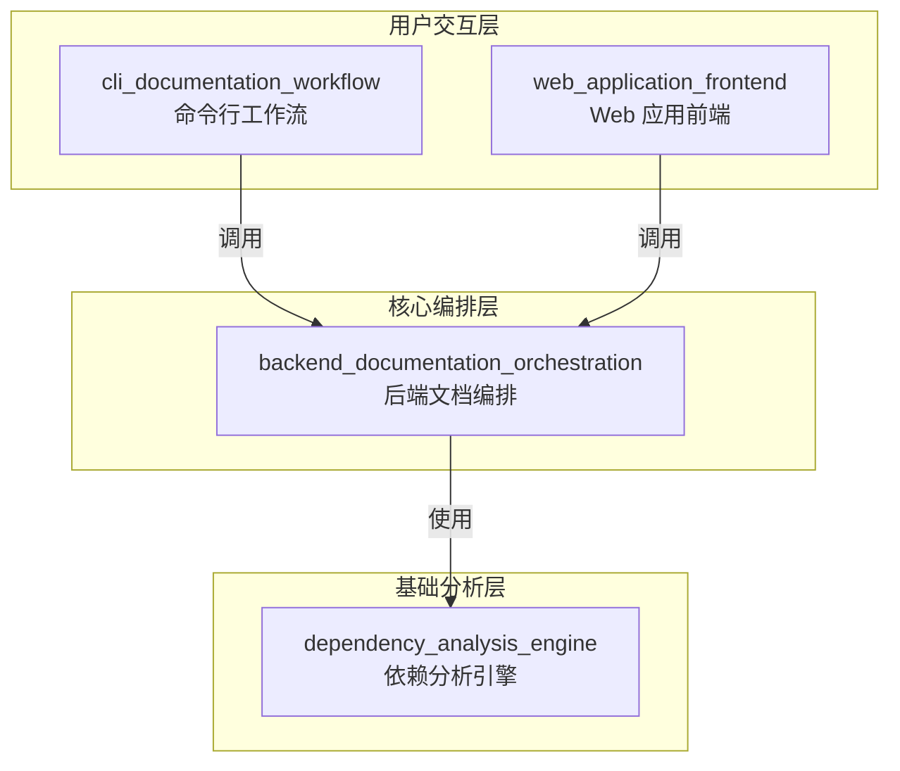
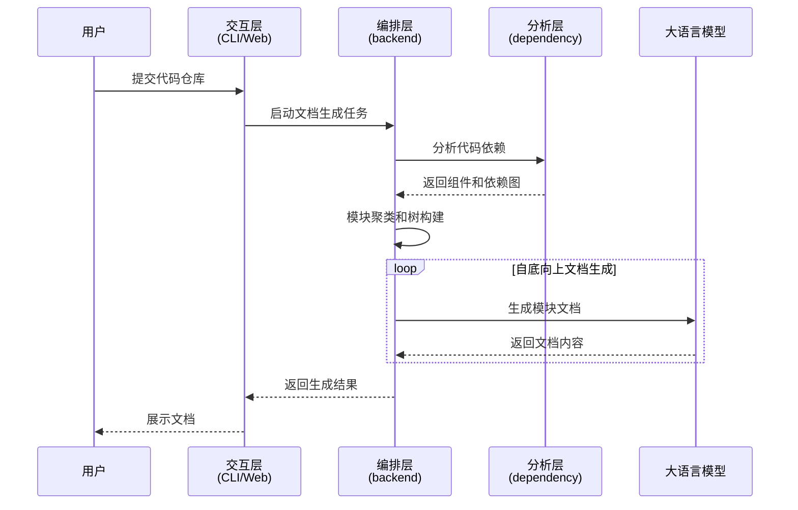
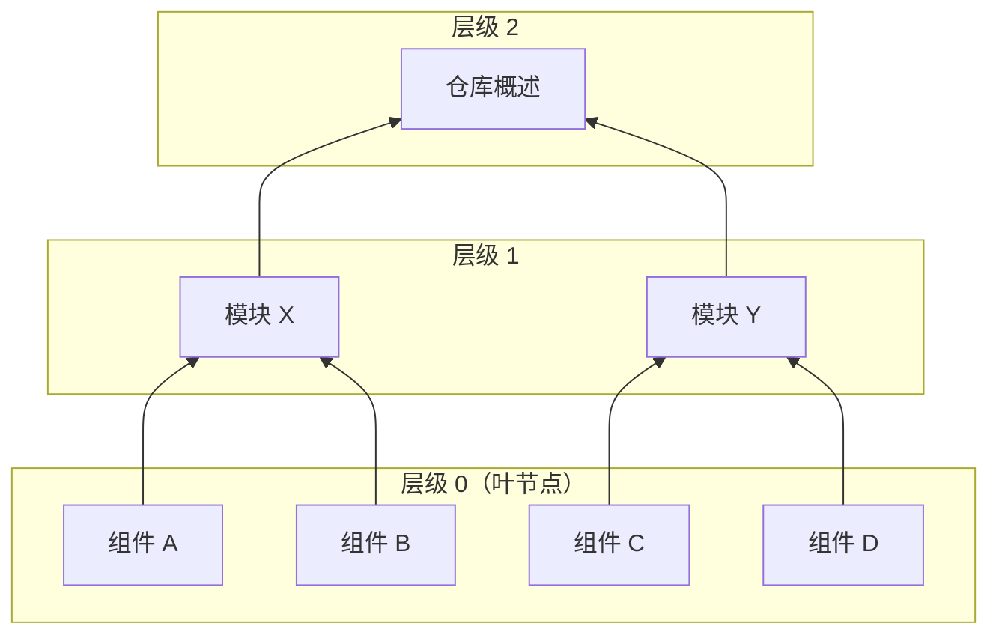

# CodeWiki 仓库概述

## 1. 仓库简介

CodeWiki 是一个智能化代码仓库文档自动生成系统，它通过分析代码仓库的依赖关系、调用结构和模块组织，结合大语言模型（LLM）自动生成高质量、结构化的技术文档。该系统支持多种编程语言，能够处理从小型工具库到大型复杂项目的代码仓库，并提供 CLI 和 Web 两种交互方式。

### 核心目标
- **自动化文档生成**：将代码仓库自动转换为结构清晰、内容完整的技术文档
- **多语言支持**：支持 Python、JavaScript/TypeScript、Java、C#、C/C++、Go、Rust、PHP 等主流编程语言
- **智能分析**：通过依赖分析和模块聚类理解代码库的架构和组织
- **多端交互**：提供命令行工具和 Web 应用两种使用方式
- **可扩展架构**：模块化设计，支持灵活的配置和定制

## 2. 仓库架构

CodeWiki 采用分层模块化架构设计，将依赖分析、文档生成编排、CLI 工作流和 Web 前端等功能清晰分离，形成完整的文档生成流水线。

### 系统架构图



### 分层说明

1. **用户交互层**：提供用户与系统交互的接口
   - `cli_documentation_workflow`：命令行工具，支持配置管理、Git 集成、HTML 生成等功能
   - `web_application_frontend`：Web 应用，提供仓库提交、任务监控、文档查看等功能

2. **核心编排层**：负责协调整个文档生成流程
   - `backend_documentation_orchestration`：核心编排模块，管理 AI 代理、并发处理、模块树管理等

3. **基础分析层**：提供代码分析和依赖关系构建能力
   - `dependency_analysis_engine`：多语言依赖分析引擎，构建代码调用图和依赖关系

### 数据流向



## 3. 核心模块说明

### 3.1 cli_documentation_workflow（命令行工作流模块）

**路径**：`codewiki/cli`

该模块是 CodeWiki 的命令行接口层，负责将后端文档生成引擎与用户交互连接起来。它提供了完整的命令行工具功能，包括配置管理、Git 仓库操作、文档生成流程协调、进度跟踪以及 HTML 静态站点生成等核心功能。

**核心组件**：
- `CLIDocumentationGenerator`：整个 CLI 工作流的核心协调器
- `ConfigManager`：配置管理器，处理用户设置的持久化和 API 密钥的安全存储
- `GitManager`：Git 仓库操作管理器，处理分支创建、提交和远程仓库检测
- `HTMLGenerator`：动态 HTML 查看器生成器
- `StaticHTMLGenerator`：静态 HTML 预渲染器
- `ProgressTracker`：多阶段进度跟踪器
- `CLILogger`：彩色日志输出器

**详细文档**：[cli_documentation_workflow 模块文档](#cli_documentation_workflow-模块文档)

### 3.2 backend_documentation_orchestration（后端文档编排模块）

**路径**：`codewiki/src/be`

该模块是 CodeWiki 系统的核心编排层，负责协调和管理整个文档生成流程。它通过智能代理 orchestration、并发处理和动态规划技术，将代码仓库自动转换为结构化的技术文档。

**核心组件**：
- `DocumentationGenerator`：整个文档生成流程的主控制器
- `AgentOrchestrator`：负责为每个模块创建和配置适当的 AI 代理
- `ModuleTreeManager`：提供线程安全的模块树访问和持久化机制
- `Config`：集中管理 CodeWiki 系统的所有配置项
- `FileManager`：提供统一的文件 I/O 操作接口

**核心设计理念**：
- 自底向上的文档生成策略，先处理最底层的叶节点模块
- 基于层级的并发处理，提高效率
- 线程安全的并发访问，确保数据一致性

**详细文档**：[backend_documentation_orchestration 模块文档](#backend_documentation_orchestration-模块文档)

### 3.3 dependency_analysis_engine（依赖分析引擎模块）

**路径**：`codewiki/src/be/dependency_analyzer`

该模块是 CodeWiki 系统的核心分析组件，主要负责解析代码库并构建其内部依赖关系图。它通过多语言源代码解析、抽象语法树（AST）遍历和调用关系分析，为文档生成、代码理解和架构可视化提供基础数据支持。

**核心组件**：
- `AnalysisService`：提供统一的分析 API，协调仓库克隆、结构分析和代码分析
- `RepoAnalyzer`：负责仓库结构分析，构建文件树并应用过滤规则
- `CallGraphAnalyzer`：协调多语言分析器，提取调用关系并构建调用图
- `DependencyParser`：AST 解析编排器，管理多语言解析过程
- `DependencyGraphBuilder`：协调依赖图构建过程，提供持久化功能
- 多种语言分析器：支持 Python、JavaScript、TypeScript、Java、C#、C、C++、PHP、Go、Rust 等

**核心功能**：
- 多语言源代码解析
- 代码实体提取（类、函数、方法、接口等）
- 依赖关系发现（调用、继承、实现、引用等）
- 结构化数据输出
- 叶节点识别

**详细文档**：[dependency_analysis_engine 模块文档](#dependency_analysis_engine-模块文档)

### 3.4 web_application_frontend（Web 应用前端模块）

**路径**：`codewiki/src/fe`

该模块是 CodeWiki 系统的用户界层，提供基于 Web 的平台，使用户能够提交 GitHub 仓库进行文档生成、监控任务状态并查看生成的文档。该模块作为用户与 CodeWiki 系统交互的主要入口，抽象了底层文档生成流水线的复杂性。

**核心组件**：
- `WebRoutes`：Web 界面的中央协调器，处理所有 HTTP 请求
- `BackgroundWorker`：管理文档生成任务的异步处理
- `CacheManager`：提供生成文档的智能缓存
- `GitHubRepoProcessor`：处理与 GitHub 仓库的所有交互
- `WebAppConfig`：为 Web 应用提供集中式配置设置
- 数据模型：`RepositorySubmission`、`JobStatus`、`JobStatusResponse`、`CacheEntry`

**核心功能**：
- 仓库提交和验证
- 异步任务处理和状态监控
- 智能缓存管理
- 文档查看和导航
- GitHub 仓库集成

**详细文档**：[web_application_frontend 模块文档](#web_application_frontend-模块文档)

## 4. 核心功能与工作流程

### 4.1 完整文档生成流程

CodeWiki 的完整文档生成流程包含以下几个主要阶段：

1. **仓库准备**：接收用户输入的仓库路径或 GitHub URL，准备代码仓库
2. **依赖分析**：解析代码文件，提取代码实体，构建依赖关系图
3. **模块聚类**：将相关组件聚合为逻辑模块，形成层次化结构
4. **文档生成**：采用自底向上的方式，并发生成各模块文档
5. **结果输出**：生成 Markdown 文档、HTML 查看器或静态网站

### 4.2 自底向上的文档生成策略

CodeWiki 采用自底向上的文档生成策略，确保父模块文档能够基于并子模块的完整内容进行聚合和总结：



**处理顺序**：
1. 首先处理层级 0 的叶节点组件
2. 然后处理层级 1 的模块，聚合其子模块的内容
3. 最后处理层级 2 的仓库概述，聚合所有模块的内容

### 4.3 并发处理机制

对于大型仓库，CodeWiki 采用基于层级的并发处理策略：

1. **层级计算**：首先计算每个模块的处理级别，叶节点为 0，父节点为子节点最大级别 + 1
2. **层级顺序处理**：从最低级别开始，逐级向上处理
3. **同级别并发**：同一级别的模块可以并发处理，提高效率
4. **锁保护共享资源**：使用 `ModuleTreeManager` 保护模块树的并发访问
5. **信号量控制并发度**：使用信号量限制最大并发数，避免资源耗尽

## 5. 技术栈与依赖

| 类别 | 技术/依赖 | 用途 |
|------|-----------|------|
| 编程语言 | Python 3.8+ | 主要开发语言 |
| 代码解析 | Tree-sitter | 多语言 AST 解析 |
| 代码解析 | Python AST | Python 专用解析 |
| Web 框架 | FastAPI | Web 应用后端 |
| 模板引擎 | Jinja2 | HTML 模板渲染 |
| 并发处理 | asyncio | 异步任务处理 |
| 版本控制 | GitPython / subprocess | Git 仓库操作 |
| AI 集成 | 自定义 LLM 客户端 | 文档生成 |
| 配置管理 | JSON / 系统密钥环 | 配置和密钥存储 |

## 6. 安装与使用指南

### 6.1 基本使用（CLI）

```python
from pathlib import Path
from codewiki.cli.config_manager import ConfigManager
from codewiki.cli.adapters.doc_generator import CLIDocumentationGenerator

# 配置设置
config_manager = ConfigManager()
config_manager.save(
    api_key="your-api-key",
    base_url="https://api.example.com",
    main_model="gpt-4",
    cluster_model="gpt-3.5-turbo"
)

# 文档生成
generator = CLIDocumentationGenerator(
    repo_path=Path("/path/to/repo"),
    output_dir=Path("/path/to/output"),
    config=config,
    verbose=True,
    generate_html=True
)
job = generator.generate()
```

### 6.2 Web 应用使用

1. 启动 Web 服务器
2. 访问 Web 界面
3. 提交 GitHub 仓库 URL
4. 监控任务状态
5. 查看生成的文档

## 7. 配置与定制

CodeWiki 提供了丰富的配置选项，可以根据需要进行定制：

### LLM 配置
- `base_url`：LLM API 基础 URL
- `main_model`：主要文档生成模型
- `cluster_model`：模块聚类模型
- `fallback_model`：备用模型
- `max_tokens`：LLM 响应最大令牌数

### 生成配置
- `max_token_per_module`：每个模块的最大令牌数
- `max_depth`：层次分解的最大深度
- `max_concurrent`：最大并发数
- `output_language`：输出语言

### 代理指令定制
- `include_patterns`：包含的文件模式
- `exclude_patterns`：排除的文件/目录模式
- `focus_modules`：重点关注的模块
- `doc_type`：文档类型（api、architecture、user-guide、developer）
- `custom_instructions`：自定义指令

## 8. 总结与亮点

CodeWiki 是一个功能强大、架构清晰的代码文档自动生成系统，其主要亮点包括：

1. **多语言支持**：支持多种主流编程语言，能够处理多样化的代码仓库
2. **智能分析**：通过依赖分析和模块聚类，深入理解代码库的架构
3. **自底向上生成**：确保文档的一致性和完整性，父模块基于子模块内容聚合
4. **高效并发处理**：采用基于层级的并发策略，提高大型仓库的处理效率
5. **多端交互**：提供 CLI 和 Web 两种使用方式，满足不同用户需求
6. **灵活配置**：丰富的配置选项和代理指令，支持高度定制化
7. **模块化架构**：清晰的分层设计，易于维护和扩展

CodeWiki 通过将代码分析、AI 生成和用户体验有机结合，为代码仓库的文档化提供了一种高效、智能的解决方案。