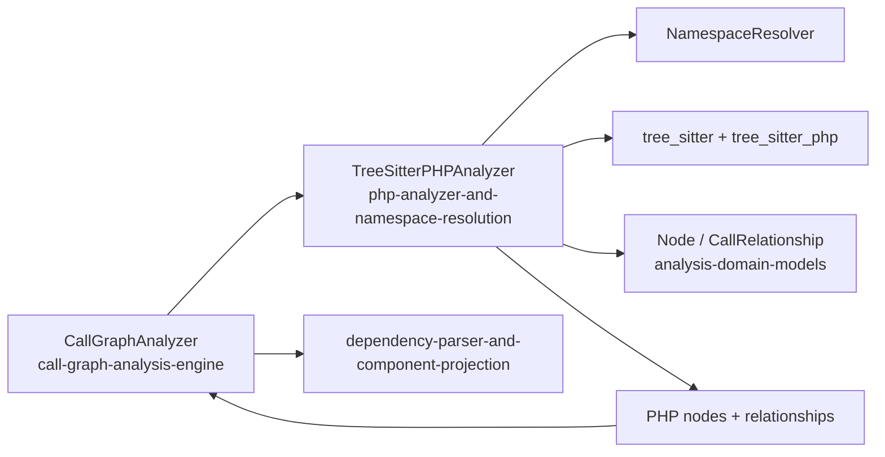
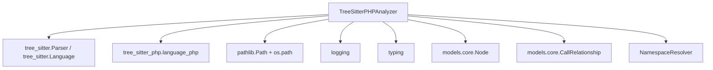
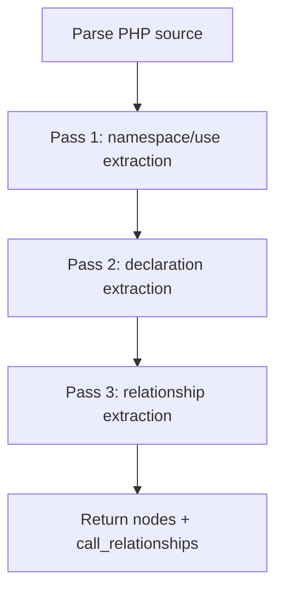
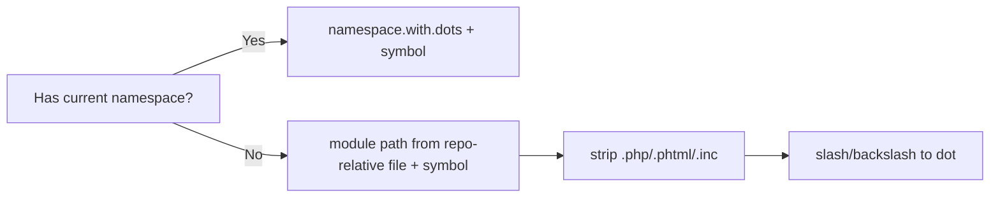
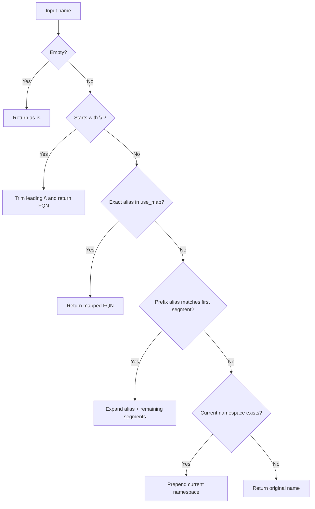
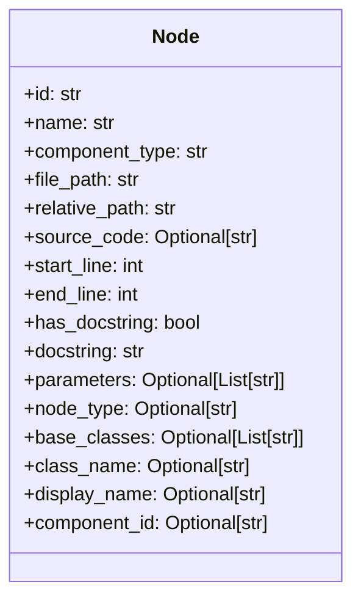
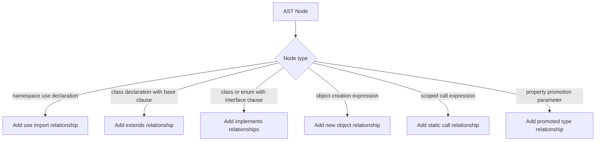
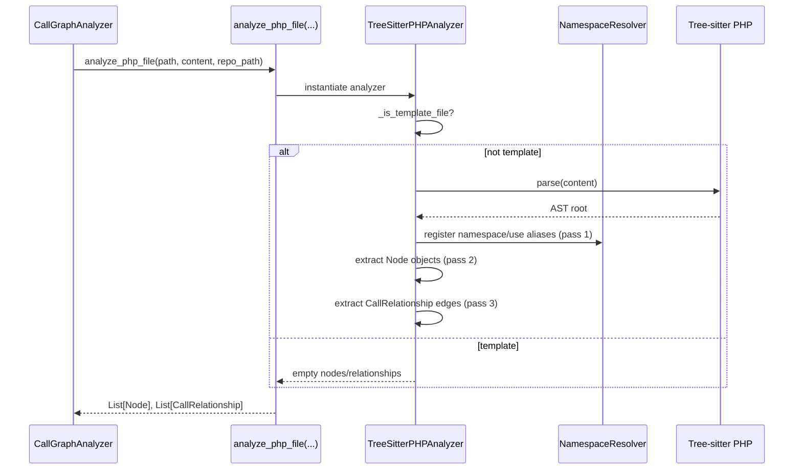

# php-analyzer-and-namespace-resolution Module

## Introduction

The `php-analyzer-and-namespace-resolution` module provides PHP-specific static analysis in the Language Analyzers layer.
It parses PHP source files with Tree-sitter, extracts structural components (`class`, `interface`, `trait`, `enum`, `function`, `method`), and emits dependency edges as `CallRelationship` objects.

Its distinguishing capability is **PHP namespace/use resolution** through `NamespaceResolver`, which converts local and aliased symbols into normalized fully qualified names for graph construction.

In the wider pipeline, this module is invoked by the call graph stage and feeds normalized `Node`/`CallRelationship` records into downstream projection and dependency graph modules (see [call-graph-analysis-engine.md](call-graph-analysis-engine.md), [dependency-parser-and-component-projection.md](dependency-parser-and-component-projection.md), and [analysis-domain-models.md](analysis-domain-models.md)).

---

## Core Components

## 1) `TreeSitterPHPAnalyzer`
**Path:** `codewiki.src.be.dependency_analyzer.analyzers.php.TreeSitterPHPAnalyzer`

Primary responsibilities:

- Parse one PHP file via `tree_sitter_php.language_php()`.
- Skip template-oriented PHP files (Blade/Twig/PHTML and common template directories).
- Extract namespace/use context in a first AST pass.
- Extract nodes in a second AST pass.
- Extract relationships in a third AST pass.
- Normalize identifiers to dotted component IDs and relationship targets.

## 2) `NamespaceResolver`
**Path:** `codewiki.src.be.dependency_analyzer.analyzers.php.NamespaceResolver`

Primary responsibilities:

- Track current namespace (`register_namespace`).
- Track `use` aliases (`register_use`), including implicit aliases.
- Resolve symbol names to fully qualified namespace names (`resolve`) using:
  1. Fully-qualified input passthrough,
  2. Exact alias lookup,
  3. Alias-prefix lookup for partial names,
  4. Fallback to current namespace.

## 3) Wrapper function
- `analyze_php_file(file_path, content, repo_path=None)`

Behavior:
- Instantiates `TreeSitterPHPAnalyzer`.
- Returns `(List[Node], List[CallRelationship])`.

---

## Architectural Position

This module is intentionally language-local:

- It analyzes a **single PHP file at a time**.
- It does not orchestrate repository traversal or persistence.
- It emits unresolved edges (`is_resolved=False`) for later global graph resolution.

---

## Dependency Map

### External model contract

- `Node` captures identity, type, source span, docstring metadata, class context, parameters, and base classes.
- `CallRelationship` captures directional dependency links (`caller`, `callee`, `call_line`, `is_resolved`).

For full schemas, see [analysis-domain-models.md](analysis-domain-models.md).

---

## Analyzer Pipeline (Three-Pass AST Strategy)

`TreeSitterPHPAnalyzer._analyze()` performs three recursive passes over the same AST:

1. **Namespace pass**: `_extract_namespace_info`
   - captures `namespace_definition`
   - captures `namespace_use_declaration` and registers aliases
2. **Node pass**: `_extract_nodes`
   - builds `Node` objects for declarations
3. **Relationship pass**: `_extract_relationships`
   - creates `CallRelationship` edges for imports, inheritance, creation, static calls, and promoted-property type dependencies

### Why this design matters

- Namespace/use context is available before relationship extraction.
- Symbol resolution is deterministic within file scope.
- Node extraction stays focused on structure, while relationships are handled separately.

---

## Component Identification Strategy

Component IDs are derived from namespace when available, otherwise from normalized module path.

Rules:

- If namespace exists:
  - class/function ID: `Namespace.Symbol`
  - method-in-class node name uses `Class.method`, ID becomes `Namespace.Class.method`
- If namespace not set:
  - ID is based on relative file module path

This aligns with downstream projection expectations in [dependency-parser-and-component-projection.md](dependency-parser-and-component-projection.md).

---

## Namespace Resolution Behavior

`NamespaceResolver.resolve(name)` decision flow:

Supported `use` forms:

- Simple use: `use App\\User;`
- Aliased use: `use App\\User as U;`
- Group use: `use App\\{User, Post};`
- Group with alias clauses (where present in AST)

---

## Extracted Node Types and Metadata

Declarations recognized by `_extract_nodes`:

- `class_declaration` → `class` or `abstract class`
- `interface_declaration` → `interface`
- `trait_declaration` → `trait`
- `enum_declaration` → `enum`
- `function_definition` → `function`
- `method_declaration` → `method`

Per-node enrichment includes:

- source snippet (`source_code`) using file lines and AST span
- line range (`start_line`, `end_line`)
- PHPDoc capture (`has_docstring`, `docstring`)
- function/method parameters
- class base list (`extends` + `implements` names)
- class context (`class_name`) and display label

---

## Relationship Extraction Coverage

`_extract_relationships` emits edges for:

1. **Imports (`use`)**
   - Caller: file module path
   - Callee: imported FQN (dotted)
2. **Inheritance (`extends`)**
   - Caller: declaring class component ID
   - Callee: resolved base class
3. **Interface implementation (`implements`)**
   - Caller: class/enum component ID
   - Callee: resolved interface name(s)
4. **Object creation (`new`)**
   - Caller: containing class
   - Callee: resolved created type
5. **Static scoped call (`::`)**
   - Caller: containing class
   - Callee: resolved target class
6. **Constructor property promotion types (PHP 8+)**
   - Caller: containing class
   - Callee: resolved promoted type

All emitted relationships are marked `is_resolved=False` by this analyzer, leaving final resolution to later graph stages.

---

## Filtering, Safety, and Noise Reduction

### Template skipping

Before parsing, analyzer exits early for template-like files:

- suffixes: `.blade.php`, `.phtml`, `.twig.php`
- directories containing: `views`, `templates`, `resources/views`

This prevents frontend/template files from polluting backend dependency graphs.

### Primitive/built-in filtering

`_is_primitive` excludes common PHP primitives and core built-ins (e.g., `string`, `int`, `array`, `Exception`, `Iterator`, `DateTime`, `stdClass`, etc.) from dependency edges.

### Recursion guard

A hard depth cap (`MAX_RECURSION_DEPTH = 100`) is applied to recursive AST walks to prevent stack issues on pathological trees.

---

## End-to-End Sequence (Within Dependency Analysis)

---

## Interaction with Adjacent Modules

- Upstream orchestration and multi-language routing are handled by [call-graph-analysis-engine.md](call-graph-analysis-engine.md).
- Result projection into component dependency maps is handled by [dependency-parser-and-component-projection.md](dependency-parser-and-component-projection.md).
- Shared model semantics are defined in [analysis-domain-models.md](analysis-domain-models.md).
- For comparison with other language analyzers, see [python-ast-analyzer.md](python-ast-analyzer.md) and [javascript-typescript-analyzers.md](javascript-typescript-analyzers.md).

---

## Practical Notes for Maintainers

- The analyzer currently uses a single parser mode (`language_php`) suitable for mixed PHP/HTML content.
- `_top_level_nodes` is populated during node extraction; in this implementation, relationship extraction mostly relies on namespace resolution and containing-class lookup rather than full graph-level symbol matching.
- The primitive check recreates a lowercase set per call (`{p.lower() for p in PHP_PRIMITIVES}`); if performance becomes critical, this can be precomputed.
- Parameter extraction currently captures `named_type`/`primitive_type`; more advanced union/intersection/display formatting could be expanded if needed.

---

## Summary

The `php-analyzer-and-namespace-resolution` module is the PHP-specific extraction engine that converts file-level ASTs into graph-ready structural nodes and dependency edges, with namespace/use-aware symbol normalization.

Its three-pass design (namespace → nodes → relationships), template filtering, and primitive exclusion make it a practical and robust contributor to the broader Dependency Analyzer pipeline.
