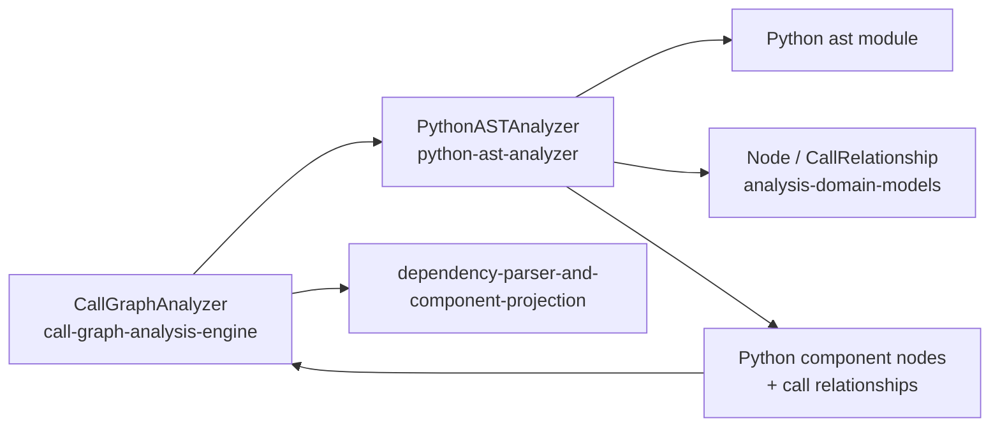
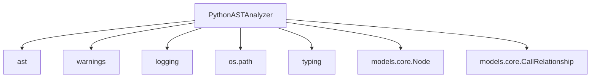
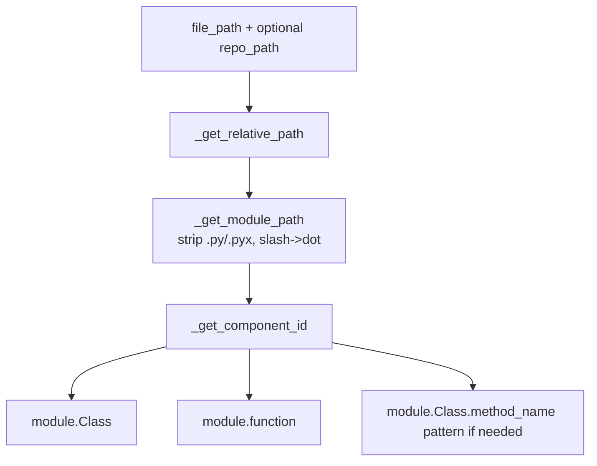
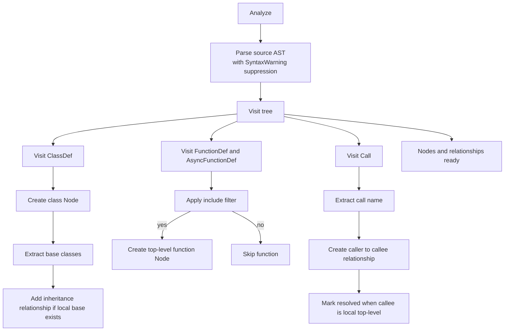
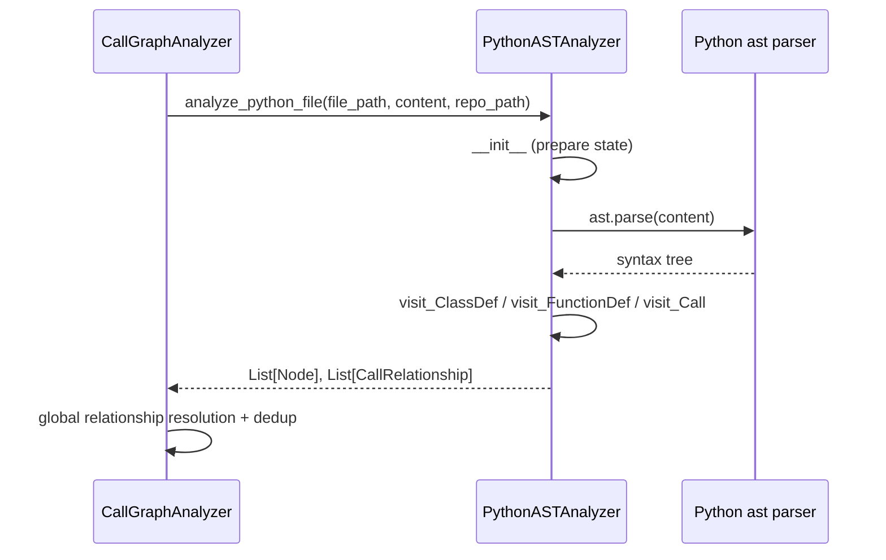
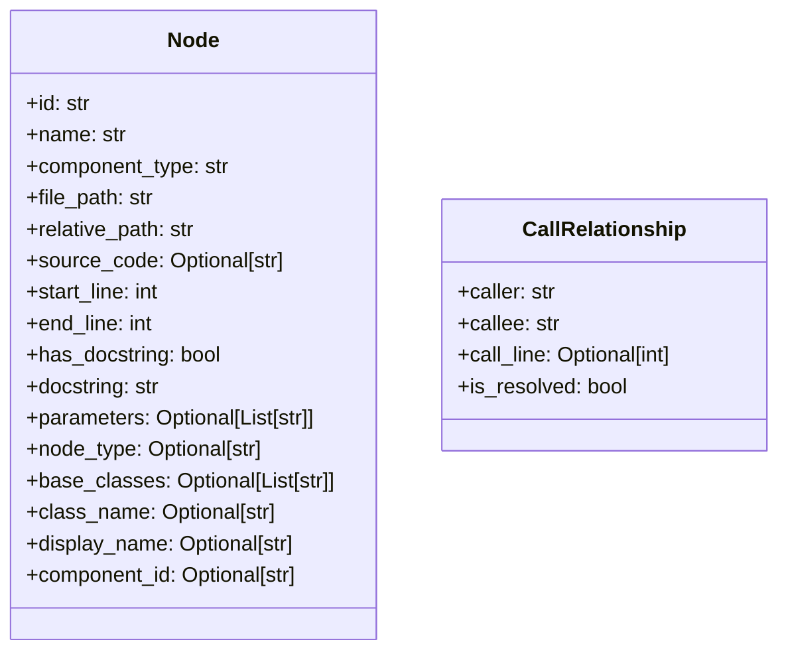
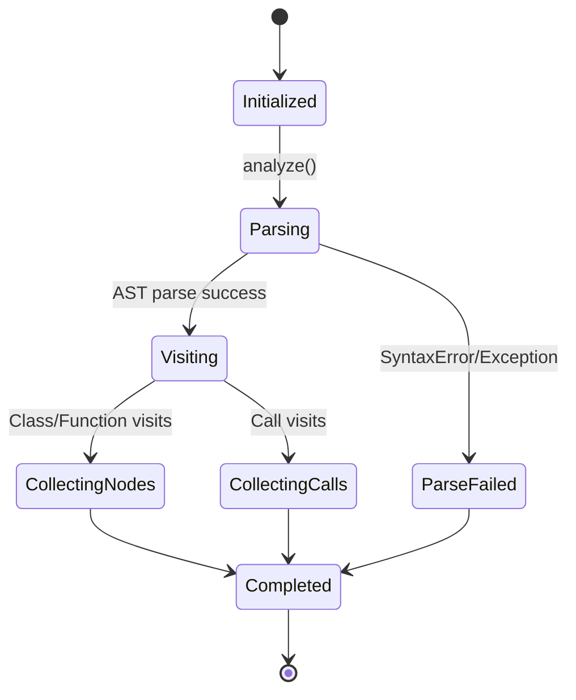
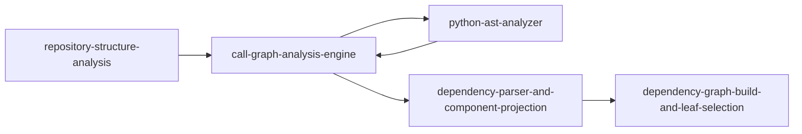

# python-ast-analyzer Module

## Introduction

The `python-ast-analyzer` module is the Python-specific static analysis engine in CodeWiki’s language analyzer layer.
Its core class, `PythonASTAnalyzer`, parses Python source code into an AST (`ast` module), extracts top-level components (classes and functions), and records call/inheritance relationships as normalized `Node` and `CallRelationship` models.

In the overall pipeline, this module is the Python backend used by [call-graph-analysis-engine.md](call-graph-analysis-engine.md), which then feeds higher-level orchestration and projection modules.

---

## Core Component

- `PythonASTAnalyzer` (`codewiki.src.be.dependency_analyzer.analyzers.python.PythonASTAnalyzer`)

Also provided in the same file:

- `analyze_python_file(file_path, content, repo_path=None)` — convenience wrapper that instantiates the analyzer and returns `(nodes, call_relationships)`.

---

## Architectural Position

`python-ast-analyzer` is intentionally narrow in scope:

- It **does not** walk repositories or choose files.
- It **does not** resolve cross-file imports.
- It **does not** persist graph outputs.

Those concerns are handled in adjacent modules (see [call-graph-analysis-engine.md](call-graph-analysis-engine.md) and [dependency-parser-and-component-projection.md](dependency-parser-and-component-projection.md)).

---

## Dependency Map

### External contract dependencies

- `Node` fields populated include identity, source span, docstring, class metadata, and display data.
- `CallRelationship` records caller/callee IDs or symbolic names with `is_resolved` hinting whether a call target is local/top-level.

For model schema details, see [analysis-domain-models.md](analysis-domain-models.md).

---

## Class Responsibilities

`PythonASTAnalyzer` is a stateful `ast.NodeVisitor` that:

1. Parses one Python file.
2. Tracks traversal context (`current_class_name`, `current_function_name`).
3. Creates top-level class/function `Node`s.
4. Extracts class inheritance edges (when base class is top-level in same file).
5. Extracts call edges from function/class bodies.
6. Marks relationships as resolved only when callee matches a known top-level node in current file.

### Internal state

- `file_path`, `repo_path`, `content`, `lines`
- `nodes: List[Node]`
- `call_relationships: List[CallRelationship]`
- `top_level_nodes: Dict[str, Node]`
- `current_class_name`, `current_function_name`

---

## Component Identification Strategy

IDs are generated from repository-relative module paths.

### Rules used

- Module path is derived from `relative_path` and normalized to dotted format.
- Class node ID: `module_path.ClassName`
- Top-level function node ID: `module_path.function_name`
- Caller IDs for calls:
  - inside class body/method context: `module_path.CurrentClass`
  - inside top-level function: `module_path.current_function`

---

## AST Traversal and Extraction Flow

---

## Interaction Sequence (Within Call Graph Pipeline)

Important: cross-file and cross-language resolution is intentionally deferred to [call-graph-analysis-engine.md](call-graph-analysis-engine.md).

---

## Method-Level Behavior

### `visit_ClassDef(node)`

- Creates a `Node` with:
  - `component_type="class"`, `node_type="class"`
  - `base_classes` extracted from `ast.Name` / dotted `ast.Attribute`
  - source snippet and line range
  - docstring metadata
- Adds class to `top_level_nodes`.
- Emits inheritance relationship for base classes already known as top-level nodes in same module.
- Sets/clears `current_class_name` around nested traversal.

### `_process_function_node(node)`

- Only creates nodes for **top-level** functions (`not self.current_class_name`).
- Creates `Node` with `component_type="function"`, `node_type="function"`, parameters from positional args.
- Applies filter `_should_include_function`.
- Tracks function context (`current_function_name`) while traversing function body.

### `visit_Call(node)`

- Executes when in class or function context.
- Uses `_get_call_name` to normalize call target.
- Produces `CallRelationship` with:
  - `caller` from current context
  - `callee` as canonical local ID if known, else symbolic call name
  - `call_line=node.lineno`
  - `is_resolved=True` only for same-file top-level matches

### `_get_call_name(node)`

Supports:

- simple name calls: `foo()` → `foo`
- attribute calls: `obj.method()` → `obj.method`
- nested attributes: `a.b.c()`

And filters a curated set of Python built-ins (`print`, `len`, `isinstance`, etc.) to reduce noise.

---

## Data Contracts Produced

`analyze_python_file(...)` returns:

- `List[Node]` (classes + top-level functions only)
- `List[CallRelationship]` (calls + local inheritance links)

---

## Resolution Semantics and Limits

### What “resolved” means in this module

`is_resolved=True` only indicates: “callee name matched a top-level component discovered in the same file/module during this analyzer run.”

It does **not** imply global certainty across the entire repository.

### Current constraints

- Methods are not emitted as standalone nodes; class-level context is used as caller identity.
- Function parameter extraction includes positional args but not full signature richness (e.g., kw-only/default metadata formatting).
- Built-in filtering is static and heuristic.
- Attribute call fallback (`node.attr`) may lose full target context in complex expressions.
- Syntax errors are logged and file is skipped (best-effort behavior).

---

## Process Lifecycle (State View)

---

## How This Module Fits the Overall System

`python-ast-analyzer` is one implementation in the Language Analyzers layer and contributes Python-specific extraction into a shared multi-language call graph pipeline.

- Inbound orchestration and file dispatch: [call-graph-analysis-engine.md](call-graph-analysis-engine.md)
- Shared domain contracts: [analysis-domain-models.md](analysis-domain-models.md)
- Post-processing/projection to dependency graph components: [dependency-parser-and-component-projection.md](dependency-parser-and-component-projection.md)
- Higher-level orchestration: [analysis-service-orchestration.md](analysis-service-orchestration.md)

---

## Related Modules

- [call-graph-analysis-engine.md](call-graph-analysis-engine.md)
- [analysis-domain-models.md](analysis-domain-models.md)
- [analysis-service-orchestration.md](analysis-service-orchestration.md)
- [dependency-parser-and-component-projection.md](dependency-parser-and-component-projection.md)
- [dependency-graph-build-and-leaf-selection.md](dependency-graph-build-and-leaf-selection.md)
