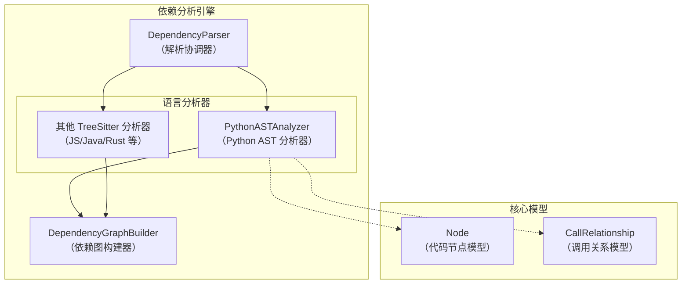
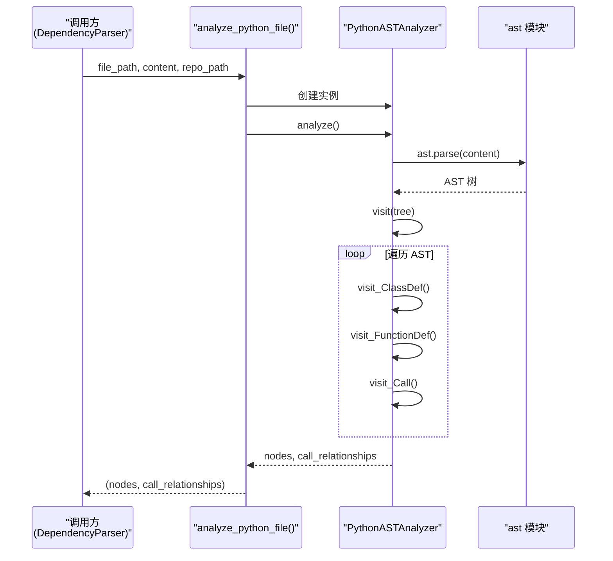
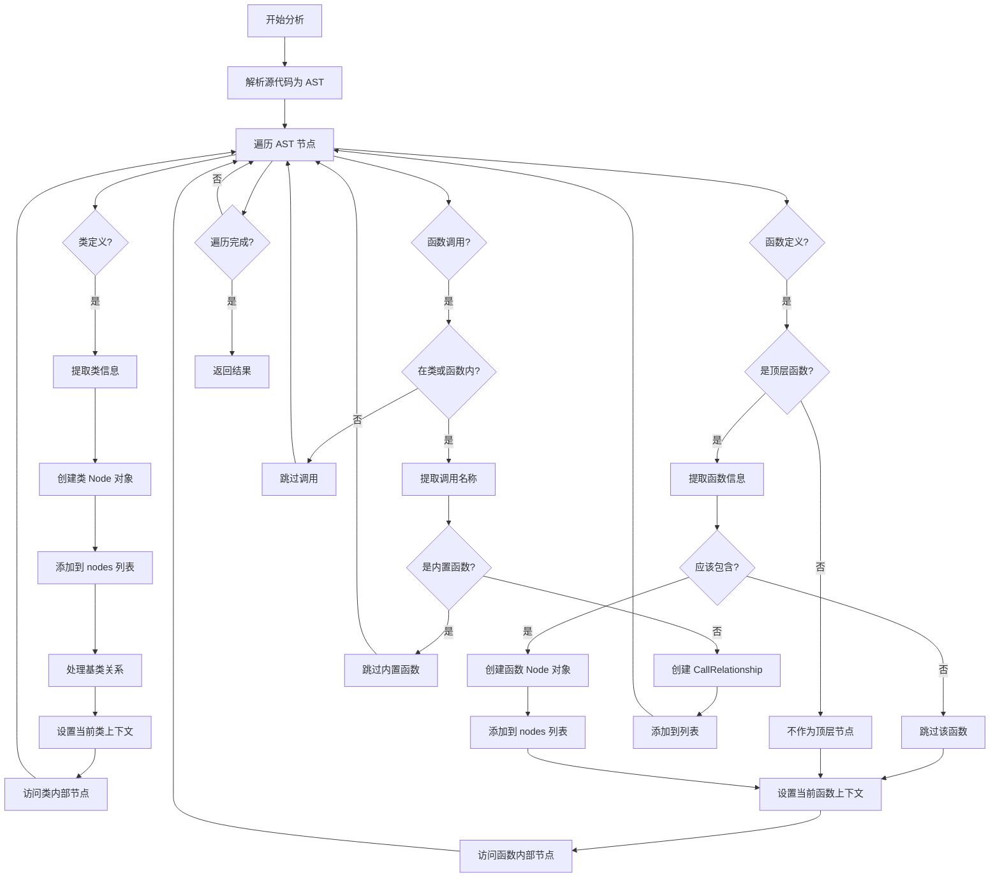

# Python AST 语言分析器模块文档

## 1. 模块概述

Python AST 语言分析器模块是依赖分析引擎的核心组件之一，专门负责解析 Python 源代码文件，通过抽象语法树（AST）分析提取代码结构、类定义、函数定义以及它们之间的调用关系。该模块使用 Python 标准库中的 `ast` 模块进行源代码解析，无需依赖外部解析器，能够准确、高效地处理 Python 代码。

### 1.1 设计目的

该模块的设计目的是为代码文档生成系统提供 Python 代码的结构化分析能力。通过解析 Python 源代码，提取关键的代码元素（如类、函数）及其相互关系，为后续的依赖图构建、文档生成提供基础数据。与其他语言使用 Tree-sitter 解析器不同，Python 分析器利用 Python 自身的 AST 能力，确保了与 Python 语言特性的完美兼容性。

### 1.2 在系统中的位置

Python AST 语言分析器模块位于依赖分析引擎的 `ast_parsing_and_language_analyzers` 子模块下，与其他语言的分析器（如 JavaScript、Java、Rust 等）并列。它接收来自 `DependencyParser` 的解析请求，并将分析结果返回给依赖图构建模块。

## 2. 核心组件详解

### 2.1 PythonASTAnalyzer 类

`PythonASTAnalyzer` 是该模块的核心类，继承自 `ast.NodeVisitor`，实现了访问者模式来遍历 AST 节点。

#### 类定义与初始化

```python
class PythonASTAnalyzer(ast.NodeVisitor):
    def __init__(self, file_path: str, content: str, repo_path: Optional[str] = None):
        """
        Initialize the Python AST analyzer.

        Args:
            file_path: Path to the Python file being analyzed
            content: Raw content of the Python file
            repo_path: Repository root path for calculating relative paths
        """
```

**参数说明：**
- `file_path`: 要分析的 Python 文件的完整路径
- `content`: Python 文件的原始内容字符串
- `repo_path`: 仓库根路径，用于计算相对路径（可选）

**初始化的内部状态：**
- `file_path`: 存储文件路径
- `repo_path`: 存储仓库根路径
- `content`: 存储文件内容
- `lines`: 将内容按行分割后的列表
- `nodes`: 存储提取到的代码节点（类、函数）
- `call_relationships`: 存储提取到的调用关系
- `current_class_name`: 当前正在处理的类名
- `current_function_name`: 当前正在处理的函数名
- `top_level_nodes`: 顶层节点的字典映射，用于快速查找

#### 核心方法

##### 2.1.1 _get_relative_path()

```python
def _get_relative_path(self) -> str:
    """Get relative path from repo root."""
```

**功能：** 计算文件相对于仓库根目录的路径。如果未提供仓库路径，则返回原始文件路径。

**返回值：** 字符串形式的相对路径。

##### 2.1.2 _get_module_path()

```python
def _get_module_path(self) -> str:
```

**功能：** 将文件路径转换为 Python 模块路径格式（使用点分隔）。

**实现细节：**
- 首先获取相对路径
- 移除 `.py` 或 `.pyx` 扩展名
- 将路径分隔符（`/` 或 `\`）替换为点号

**返回值：** 点分隔的模块路径字符串。

##### 2.1.3 _get_component_id()

```python
def _get_component_id(self, name: str) -> str:
    """Generate dot-separated component ID."""
```

**功能：** 生成点分隔的组件标识符，用于唯一标识代码中的元素。

**参数：**
- `name`: 组件名称（类名或函数名）

**实现逻辑：**
- 如果当前在类内部，格式为：`模块路径.类名.组件名`
- 否则，格式为：`模块路径.组件名`

**返回值：** 唯一的组件标识符字符串。

##### 2.1.4 visit_ClassDef()

```python
def visit_ClassDef(self, node: ast.ClassDef):
    """Visit class definition and add to top-level nodes."""
```

**功能：** 访问类定义节点，提取类信息并创建 `Node` 对象。

**处理流程：**
1. 提取基类名称列表
2. 生成组件 ID 和相对路径
3. 创建 `Node` 对象，包含类的完整信息（名称、类型、源代码、行号、文档字符串等）
4. 将类节点添加到 `nodes` 列表和 `top_level_nodes` 字典
5. 处理基类关系，如果基类在同一文件中，则创建调用关系
6. 设置当前类名，递归访问类内部节点
7. 恢复当前类名为 None

**提取的类信息包括：**
- 类名
- 基类列表
- 源代码（从起始行到结束行）
- 起始行和结束行号
- 是否有文档字符串及文档字符串内容
- 显示名称（格式为 "class 类名"）

##### 2.1.5 _extract_base_class_name()

```python
def _extract_base_class_name(self, base):
    """Extract base class name from AST node."""
```

**功能：** 从基类 AST 节点中提取基类名称。

**支持的基类形式：**
- 简单名称（如 `object`）
- 属性访问（如 `module.Class` 或 `pkg.module.Class`）

**返回值：** 基类名称字符串，无法解析时返回 None。

##### 2.1.6 _process_function_node()

```python
def _process_function_node(self, node: ast.FunctionDef | ast.AsyncFunctionDef):
    """Process function definition - only add to nodes if it's top-level."""
```

**功能：** 处理函数定义节点（包括同步和异步函数）。

**处理逻辑：**
- 仅处理顶层函数（不在类内部的函数）
- 生成函数的 `Node` 对象，包含函数信息
- 通过 `_should_include_function()` 过滤不需要的函数
- 将符合条件的函数添加到 `nodes` 列表和 `top_level_nodes` 字典
- 设置当前函数名，递归访问函数内部节点
- 恢复当前函数名为 None

**提取的函数信息包括：**
- 函数名
- 参数列表
- 源代码
- 起始行和结束行号
- 文档字符串
- 显示名称（格式为 "function 函数名"）

##### 2.1.7 _should_include_function()

```python
def _should_include_function(self, func: Node) -> bool:
```

**功能：** 判断是否应该包含某个函数在分析结果中。

**当前过滤规则：**
- 排除以 `_test_` 开头的函数

**返回值：** 布尔值，表示是否包含该函数。

##### 2.1.8 visit_FunctionDef() 和 visit_AsyncFunctionDef()

```python
def visit_FunctionDef(self, node: ast.FunctionDef):
    """Visit function definition and extract function information."""

def visit_AsyncFunctionDef(self, node: ast.AsyncFunctionDef):
    """Visit async function definition and extract function information."""
```

**功能：** 分别处理同步函数和异步函数定义，都委托给 `_process_function_node()` 方法。

##### 2.1.9 visit_Call()

```python
def visit_Call(self, node: ast.Call):
    """Visit function call nodes and record relationships between top-level nodes."""
```

**功能：** 访问函数调用节点，记录调用关系。

**处理逻辑：**
- 仅当在类或函数内部时才处理调用
- 提取被调用函数的名称
- 确定调用者 ID（类 ID 或函数 ID）
- 确定被调用者 ID（如果是同一文件中的顶层节点，则使用完整 ID，否则使用调用名称）
- 创建 `CallRelationship` 对象，包含调用者、被调用者、调用行号和是否已解析的标志
- 将调用关系添加到 `call_relationships` 列表

##### 2.1.10 _get_call_name()

```python
def _get_call_name(self, node) -> str | None:
    """
    Extract function name from a call node.
    Handles simple names, attributes (obj.method), and filters built-ins.
    """
```

**功能：** 从调用节点中提取函数名称，同时过滤 Python 内置函数。

**支持的调用形式：**
- 简单函数调用（如 `func()`）
- 方法调用（如 `obj.method()`）
- 嵌套属性调用（如 `obj.attr.method()`）

**内置函数过滤：**
该方法维护了一个 Python 内置函数集合，会自动过滤掉对这些内置函数的调用，避免产生无意义的调用关系。内置函数包括 `print`、`len`、`str`、`int` 等常见函数。

**返回值：** 函数名称字符串，内置函数或无法解析时返回 None。

##### 2.1.11 analyze()

```python
def analyze(self):
    """Analyze the Python file and extract functions and relationships."""
```

**功能：** 执行完整的 Python 文件分析。

**处理流程：**
1. 使用 `warnings.catch_warnings()` 抑制语法警告（特别是关于无效转义序列的警告）
2. 使用 `ast.parse()` 解析源代码，生成 AST
3. 调用 `self.visit(tree)` 开始 AST 遍历
4. 记录调试日志，包含分析到的节点数和关系数
5. 捕获并处理 `SyntaxError`（源代码语法错误）
6. 捕获并处理其他异常，记录详细错误信息

### 2.2 analyze_python_file() 函数

```python
def analyze_python_file(
    file_path: str, content: str, repo_path: Optional[str] = None
) -> Tuple[List[Node], List[CallRelationship]]:
    """
    Analyze a Python file and return classes, functions, methods, and relationships.

    Args:
        file_path: Path to the Python file
        content: Content of the Python file
        repo_path: Repository root path for calculating relative paths

    Returns:
        tuple: (classes, functions, methods, call_relationships)
    """
```

**功能：** 这是模块的公共接口函数，提供了简洁的方式来分析 Python 文件。

**参数：**
- `file_path`: Python 文件路径
- `content`: 文件内容
- `repo_path`: 仓库根路径（可选）

**返回值：** 包含两个元素的元组：
1. `nodes`: 提取到的节点列表（类和函数）
2. `call_relationships`: 提取到的调用关系列表

**实现：** 创建 `PythonASTAnalyzer` 实例，调用其 `analyze()` 方法，然后返回结果。

## 3. 架构与数据流

### 3.1 组件架构

Python AST 语言分析器模块采用清晰的分层架构，以下是其在整个系统中的位置和关系：



### 3.2 数据流程

Python AST 分析器的内部工作流程如下：



### 3.3 节点提取流程

以下是详细的节点提取和处理流程：



## 4. 使用指南

### 4.1 基本用法

使用 Python AST 分析器非常简单，主要通过 `analyze_python_file()` 函数：

```python
from codewiki.src.be.dependency_analyzer.analyzers.python import analyze_python_file

# 读取文件内容
with open('example.py', 'r', encoding='utf-8') as f:
    content = f.read()

# 分析文件
nodes, relationships = analyze_python_file(
    file_path='path/to/example.py',
    content=content,
    repo_path='path/to/repo/root'  # 可选
)

# 处理结果
for node in nodes:
    print(f"Found {node.component_type}: {node.name}")

for rel in relationships:
    print(f"Call: {rel.caller} -> {rel.callee} at line {rel.call_line}")
```

### 4.2 直接使用 PythonASTAnalyzer 类

如果需要更细粒度的控制，可以直接使用 `PythonASTAnalyzer` 类：

```python
from codewiki.src.be.dependency_analyzer.analyzers.python import PythonASTAnalyzer

# 创建分析器实例
analyzer = PythonASTAnalyzer(
    file_path='path/to/example.py',
    content=content,
    repo_path='path/to/repo/root'
)

# 执行分析
analyzer.analyze()

# 访问结果
print(f"Nodes found: {len(analyzer.nodes)}")
print(f"Relationships found: {len(analyzer.call_relationships)}")

# 访问顶层节点字典
for name, node in analyzer.top_level_nodes.items():
    print(f"Top-level node: {name} -> {node.id}")
```

## 5. 配置与扩展

### 5.1 过滤函数

当前，`_should_include_function()` 方法提供了基本的函数过滤功能。可以通过继承并重写此方法来实现自定义过滤逻辑：

```python
class CustomPythonASTAnalyzer(PythonASTAnalyzer):
    def _should_include_function(self, func: Node) -> bool:
        # 自定义过滤逻辑
        if func.name.startswith('_'):  # 排除所有私有函数
            return False
        if func.name in ['deprecated_func', 'temp_func']:  # 排除特定函数
            return False
        return True
```

### 5.2 扩展节点类型

目前，分析器主要处理类和顶层函数。可以通过添加新的访问者方法来扩展支持的节点类型：

```python
class ExtendedPythonASTAnalyzer(PythonASTAnalyzer):
    def visit_Assign(self, node: ast.Assign):
        """处理赋值语句，例如提取模块级常量"""
        # 自定义处理逻辑
        self.generic_visit(node)
        
    def visit_Import(self, node: ast.Import):
        """处理导入语句，提取导入依赖"""
        # 自定义处理逻辑
        self.generic_visit(node)
        
    def visit_ImportFrom(self, node: ast.ImportFrom):
        """处理 from...import 语句"""
        # 自定义处理逻辑
        self.generic_visit(node)
```

### 5.3 自定义内置函数列表

可以通过继承并重写 `_get_call_name()` 方法来自定义内置函数列表：

```python
class CustomBuiltinsAnalyzer(PythonASTAnalyzer):
    def _get_call_name(self, node) -> str | None:
        # 自定义内置函数集合
        CUSTOM_BUILTINS = {
            "print", "len",  # 保留一些基本的
            "my_custom_builtin",  # 添加自定义的
            # 可以根据需要添加或删除
        }
        
        if isinstance(node, ast.Name):
            if node.id in CUSTOM_BUILTINS:
                return None
            return node.id
        # 其余逻辑保持不变...
```

## 6. 注意事项与限制

### 6.1 已知限制

1. **方法处理限制**：当前版本仅将顶层函数和类作为节点提取，类内部的方法不会被单独提取为节点，它们的调用会被记录为所属类的调用。

2. **动态调用解析限制**：对于动态调用（如使用 `getattr()`、`eval()`、`exec()` 等的调用），分析器无法准确解析被调用的函数。

3. **跨文件调用解析**：当前版本只能解析同一文件内的调用关系，无法自动解析跨文件的调用（虽然会记录调用名称，但 `is_resolved` 标志会设为 `False`）。

4. **装饰器影响**：装饰器包装的函数仍然会被正确识别，但装饰器本身的调用不会被特殊处理。

5. **Python 版本兼容性**：分析器使用标准库 `ast` 模块，其兼容性受运行时 Python 版本限制。例如，使用 Python 3.10 运行时可能无法正确解析包含 3.10+ 独有语法（如 `match-case`）的代码。

### 6.2 错误处理

分析器实现了健壮的错误处理机制：

1. **语法错误处理**：当遇到语法错误的 Python 文件时，会捕获 `SyntaxError` 并记录警告日志，而不会导致整个分析流程崩溃。

2. **通用异常处理**：捕获所有其他异常，记录详细的错误信息（包括堆栈跟踪），确保单个文件的分析失败不会影响其他文件。

3. **警告抑制**：自动抑制关于无效转义序列的 `SyntaxWarning`，这些警告通常来自于源代码中的正则表达式模式。

### 6.3 性能考虑

1. **内存使用**：对于大型文件，分析器会将整个文件内容和按行分割的列表存储在内存中。对于超大型文件（几万行以上），可能需要考虑内存使用。

2. **AST 遍历**：使用 `ast.NodeVisitor` 的访问者模式进行遍历，时间复杂度为 O(n)，其中 n 是 AST 节点数量，通常与代码行数成正比。

3. **建议**：对于大型代码库，建议分批处理文件，或在处理前过滤掉不需要分析的文件（如测试文件、第三方库代码等）。

## 7. 与其他模块的关系

Python AST 语言分析器模块与系统中的其他模块有以下重要关系：

### 7.1 依赖的核心模型

该模块依赖于 `core_domain_models` 模块中定义的数据模型：

- **Node**：表示代码中的节点（类、函数等）
- **CallRelationship**：表示节点之间的调用关系

这些模型的详细信息请参考 [dependency_analysis_engine.md](dependency_analysis_engine.md)。

### 7.2 与解析协调器的交互

该模块由 `DependencyParser` 调用，`DependencyParser` 负责根据文件类型选择合适的分析器。详细信息请参考 [ast_parsing_and_language_analyzers.md](ast_parsing_and_language_analyzers.md)。

### 7.3 与依赖图构建的关系

分析器的输出（节点和调用关系）会被传递给 `DependencyGraphBuilder`，用于构建完整的依赖图。详细信息请参考 [dependency_analysis_engine.md](dependency_analysis_engine.md)。

## 8. 总结

Python AST 语言分析器模块是一个专门为 Python 代码设计的高效、准确的分析工具。它利用 Python 标准库的 `ast` 模块，通过访问者模式遍历抽象语法树，提取代码结构和调用关系。该模块具有良好的错误处理机制、可扩展性和清晰的接口，是代码文档生成系统中不可或缺的组成部分。

通过本文档，开发者应该能够理解该模块的工作原理、使用方法和扩展方式，以及在实际应用中需要注意的问题和限制。
