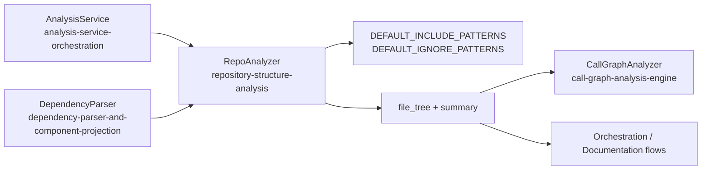
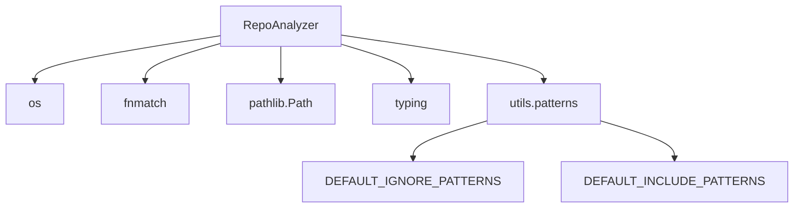
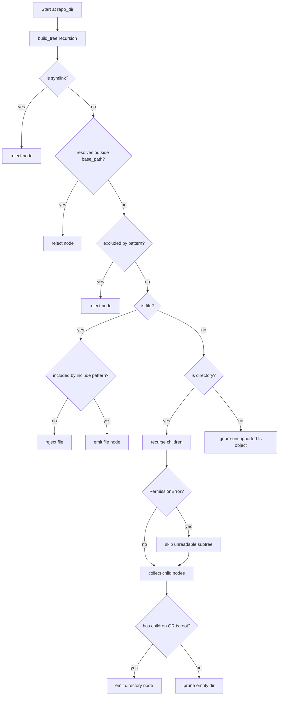
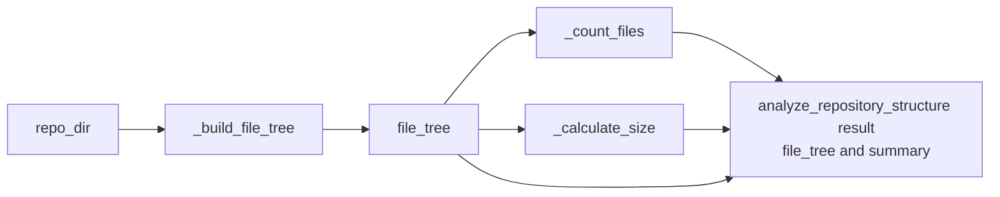
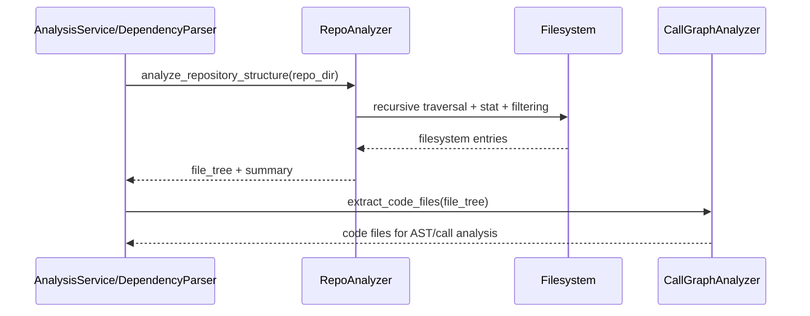
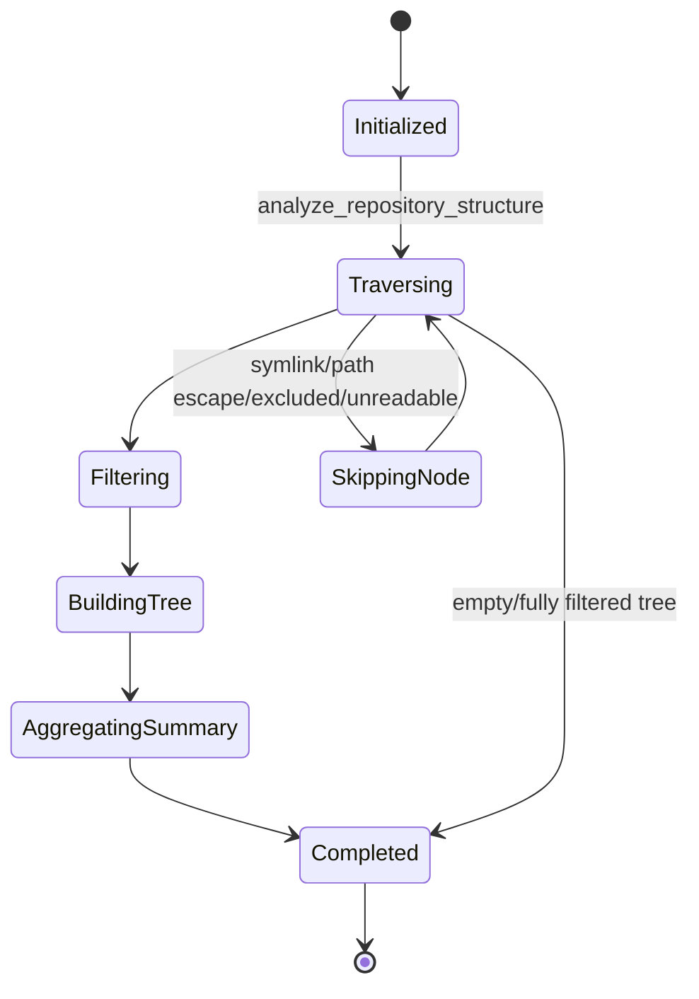
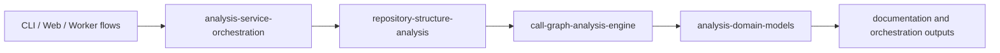

# repository-structure-analysis Module

## Introduction

The `repository-structure-analysis` module provides the repository traversal and filtering foundation for the Dependency Analyzer subsystem.
Its core component, `RepoAnalyzer`, converts a filesystem directory into a filtered, security-conscious file tree plus high-level summary metrics (`total_files`, `total_size_kb`).

In the broader pipeline, this module runs **before call-graph analysis** and determines which files are visible to downstream components.

---

## Core Component

### `RepoAnalyzer`

`RepoAnalyzer` is responsible for:

- recursively traversing a repository directory,
- applying include/exclude pattern filtering,
- rejecting unsafe filesystem targets (symlinks and path escapes),
- returning a normalized hierarchical tree representation,
- computing summary metrics from the resulting tree.

Public entrypoint:

- `analyze_repository_structure(repo_dir: str) -> Dict`

Internal helpers:

- `_build_file_tree(...)`
- `_should_exclude_path(...)`
- `_should_include_file(...)`
- `_count_files(...)`
- `_calculate_size(...)`

---

## Architectural Position



`RepoAnalyzer` is intentionally focused on filesystem structure and filtering, while language parsing and relationship extraction are delegated to [call-graph-analysis-engine.md](call-graph-analysis-engine.md).

---

## Dependency Map



### Dependency behavior

- **Pattern defaults** come from `utils.patterns`:
  - `DEFAULT_INCLUDE_PATTERNS`: language/config/doc style file extensions.
  - `DEFAULT_IGNORE_PATTERNS`: VCS, cache/build artifacts, media files, common test/example folders, etc.
- **Custom include patterns replace defaults**.
- **Custom exclude patterns are appended to defaults** (merged behavior).

---

## Constructor and Filtering Semantics

```mermaid
flowchart TD
    START[RepoAnalyzer.__init__] --> IN{include_patterns provided?}
    IN -->|yes| INY[use provided include only]
    IN -->|no| INN[use DEFAULT_INCLUDE_PATTERNS]

    START --> EX{exclude_patterns provided?}
    EX -->|yes| EXY[DEFAULT_IGNORE_PATTERNS + provided excludes]
    EX -->|no| EXN[use DEFAULT_IGNORE_PATTERNS]
```



### Practical implications

- Passing `include_patterns=[]` means "include all files not excluded" because `_should_include_file` returns `True` when include list is empty.
- Passing a non-empty include list narrows traversal output to matching files only.
- Exclusion logic still applies first, so excluded paths never make it into the tree even if include patterns match.

---

## File Tree Model

Tree nodes are dictionaries with two structural variants:

### Directory node

```json
{
  "type": "directory",
  "name": "src",
  "path": "src",
  "children": [ ... ]
}
```

### File node

```json
{
  "type": "file",
  "name": "repo_analyzer.py",
  "path": "codewiki/src/be/dependency_analyzer/analysis/repo_analyzer.py",
  "extension": ".py",
  "_size_bytes": 1234
}
```

Root directory is represented as:

- `type: "directory"`
- `path: "."`

The `_size_bytes` key is an internal value used for recursive size computation (`total_size_kb`).

---

## Traversal and Safety Workflow



### Security-relevant details

- Symlinks are always rejected (`path.is_symlink()`), which prevents indirect traversal.
- Resolved-path boundary checks reject escapes from repository root.
- The implementation handles Python compatibility by using:
  - `Path.is_relative_to(...)` when available,
  - string-prefix fallback for older environments.

---

## Exclusion and Inclusion Matching Logic

### Exclusion checks (`_should_exclude_path`)

A path is excluded if **any** pattern matches via one of these heuristics:

1. `fnmatch(path, pattern)` or `fnmatch(filename, pattern)`
2. directory-style pattern with trailing `/` matching path prefix
3. direct path equality or prefix (`path == pattern` or `path.startswith(pattern + "/")`)
4. path-segment membership (`pattern in path.split("/")`)

This combination allows broad matching for both glob and plain folder-name style patterns.

### Inclusion checks (`_should_include_file`)

- If include list is empty: include all files.
- Else include file only if path or filename matches any include glob.

Because exclusion runs earlier, include rules are not "override" rules.

---

## Data Flow Through the Module



Output contract:

- `file_tree`: nested directory/file nodes
- `summary.total_files`: recursive file count from filtered tree
- `summary.total_size_kb`: recursive sum of `_size_bytes / 1024`

---

## Runtime Interaction in System Context



This makes `RepoAnalyzer` the gatekeeper for downstream analysis scope.

---

## Process Lifecycle (State View)



---

## Edge Cases and Behavioral Notes

- **Empty directories are pruned** unless the directory is the root (`"."`).
- **Permission errors** in directories are ignored (best-effort traversal).
- **Non-file/non-directory objects** (device files, sockets, etc.) are ignored.
- **`json` import is currently unused** in this module.
- **Path separator assumptions** in exclusion logic use `/` for splitting; behavior is most predictable when paths are normalized in POSIX form.

---

## How This Module Fits the Overall System

`repository-structure-analysis` is the file-system discovery layer of the Dependency Analyzer:

1. [analysis-service-orchestration.md](analysis-service-orchestration.md) invokes `RepoAnalyzer` for local/full/structure-only workflows.
2. [call-graph-analysis-engine.md](call-graph-analysis-engine.md) consumes the resulting file tree to locate analyzable code files.
3. [dependency-parser-and-component-projection.md](dependency-parser-and-component-projection.md) relies on the same structure path before projecting components.



---

## Related Modules

For deeper details beyond this module boundary:

- [analysis-service-orchestration.md](analysis-service-orchestration.md)
- [call-graph-analysis-engine.md](call-graph-analysis-engine.md)
- [dependency-parser-and-component-projection.md](dependency-parser-and-component-projection.md)
- [dependency-graph-build-and-leaf-selection.md](dependency-graph-build-and-leaf-selection.md)
- [analysis-domain-models.md](analysis-domain-models.md)
- [logging-and-console-formatting.md](logging-and-console-formatting.md)
