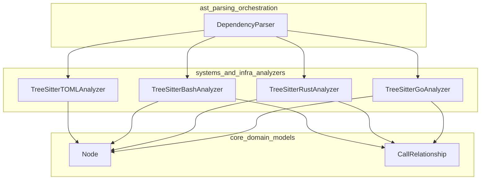

# Systems and Infrastructure Analyzers Module

## Overview

The `systems_and_infra_analyzers` module is a key component of the dependency analysis engine, responsible for analyzing code written in Go, Rust, Bash, and TOML files. This module provides Tree-sitter-based parsers that extract structural information and call relationships from source code, enabling the construction of comprehensive dependency graphs.

### Purpose and Design Rationale

This module exists to support the analysis of systems programming languages and infrastructure configuration files. Go and Rust are widely used for building performant, reliable systems software, while Bash is essential for scripting and automation. TOML serves as a common configuration format for many modern tools and applications. By providing analyzers for these languages, the module enables CodeWiki to understand dependencies in a broad range of software projects, from low-level system utilities to cloud infrastructure configurations.

The design follows a consistent pattern across all analyzers: each language has a dedicated analyzer class that uses Tree-sitter to parse the source code, extract relevant nodes (functions, methods, structs, etc.), and identify call relationships between these nodes. This uniform approach makes it easy to add support for additional languages in the future.

## Architecture

The module consists of four main language analyzers, each implemented as a separate file:

1. **TreeSitterGoAnalyzer** (go.py) - Analyzes Go source code
2. **TreeSitterRustAnalyzer** (rust.py) - Analyzes Rust source code  
3. **TreeSitterBashAnalyzer** (bash.py) - Analyzes Bash scripts
4. **TreeSitterTOMLAnalyzer** (toml.py) - Analyzes TOML configuration files

All analyzers share common functionality and produce consistent output formats: they extract `Node` objects representing code components and `CallRelationship` objects representing dependencies between these components. These models are defined in the [core domain models](core_domain_models.md) module.

### Architecture Diagram



## Component Descriptions

### TreeSitterGoAnalyzer

The `TreeSitterGoAnalyzer` is responsible for parsing Go source files and extracting:
- Functions and methods
- Structs, interfaces, and type definitions
- Call relationships between functions and methods

Key features include:
- Proper handling of Go's package structure
- Recognition of method receivers (both value and pointer types)
- Filtering of built-in functions to reduce noise
- Construction of fully qualified component IDs using module paths

### TreeSitterRustAnalyzer

The `TreeSitterRustAnalyzer` parses Rust source files and extracts:
- Functions and methods
- Structs, enums, and traits
- Implementations (impl blocks) and trait implementations
- Call relationships and trait dependencies

Notable capabilities:
- Distinguishes between free functions and methods within impl blocks
- Tracks trait implementations for structs and enums
- Handles Rust's module system and scoped identifiers
- Filters Rust standard library and built-in functions

### TreeSitterBashAnalyzer

The `TreeSitterBashAnalyzer` analyzes Bash scripts and extracts:
- Function definitions
- Call relationships between functions

Important aspects:
- Recognizes Bash function declaration syntax
- Filters out shell built-in commands and common utilities
- Tracks function calls within the script
- Handles various script file extensions (.sh, .bash, .zsh)

### TreeSitterTOMLAnalyzer

The `TreeSitterTOMLAnalyzer` processes TOML configuration files and extracts:
- Top-level tables
- Arrays of tables

Since TOML is a configuration format rather than a programming language, this analyzer does not extract call relationships. Instead, it focuses on identifying the structural components of the configuration file.

## Usage

Each analyzer is typically used through a top-level function that creates an instance of the analyzer and returns the extracted nodes and relationships:

```python
# Example: Using the Go analyzer
from codewiki.src.be.dependency_analyzer.analyzers.go import analyze_go_file

nodes, relationships = analyze_go_file(
    file_path="/path/to/file.go",
    content="package main\n\nfunc main() {\n    println(\"Hello, World!\")\n}",
    repo_path="/path/to/repo"
)
```

Similarly, the other analyzers have corresponding top-level functions:
- `analyze_rust_file` for Rust
- `analyze_bash_file` for Bash
- `analyze_toml_file` for TOML

## Integration with Other Modules

The analyzers in this module are typically called by the [DependencyParser](ast_parsing_orchestration.md) which coordinates the overall parsing process. The extracted nodes and relationships are then used by the [DependencyGraphBuilder](dependency_graph_construction.md) to build the final dependency graph.

For more information about how these analyzers fit into the larger system, see the [AST Parsing and Language Analyzers](ast_parsing_and_language_analyzers.md) module documentation.
