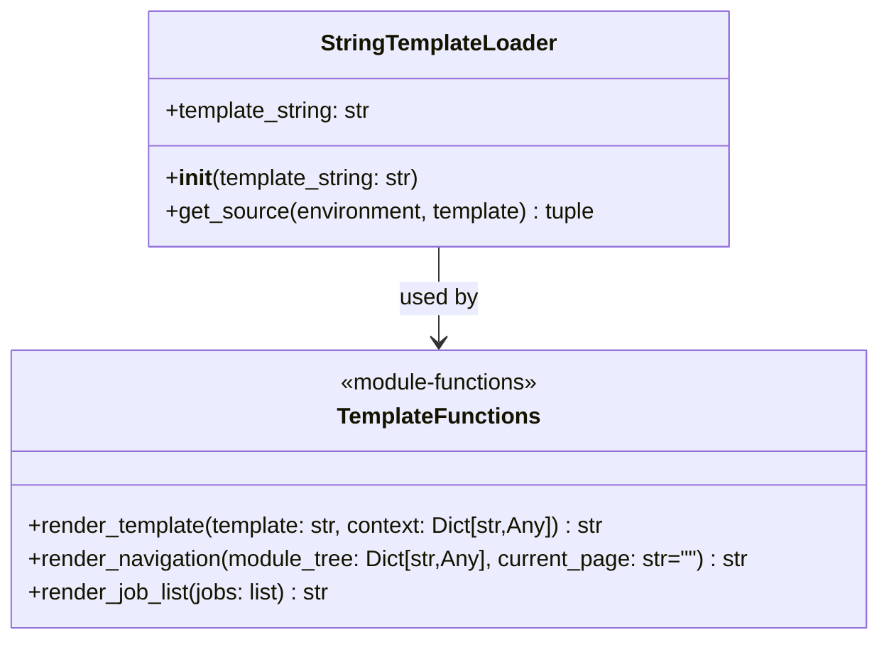
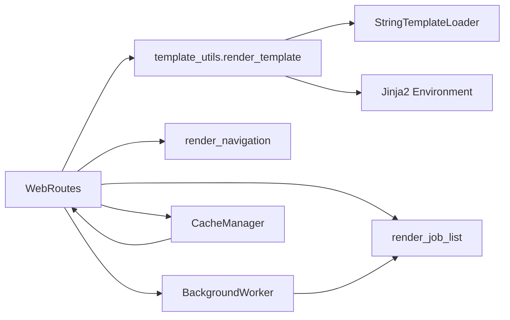
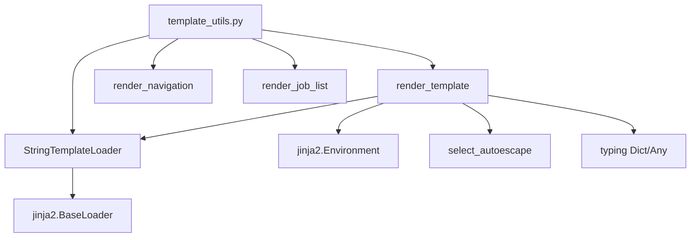
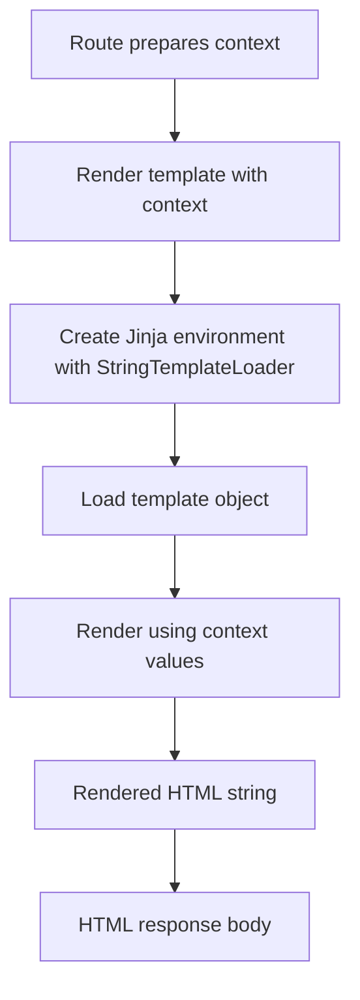
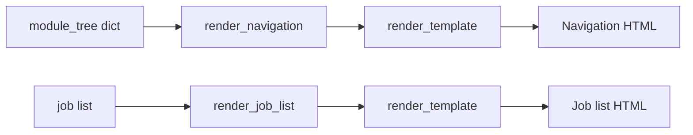
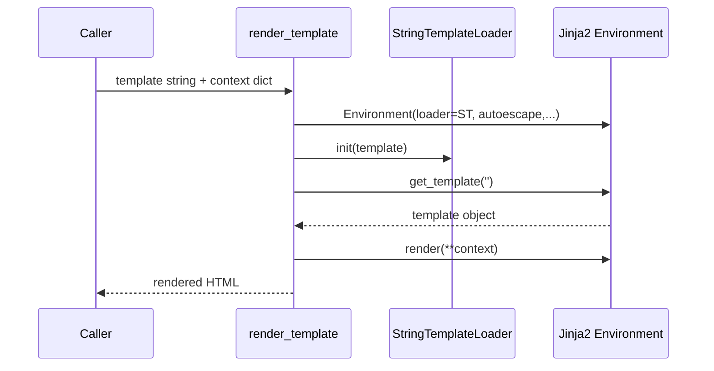
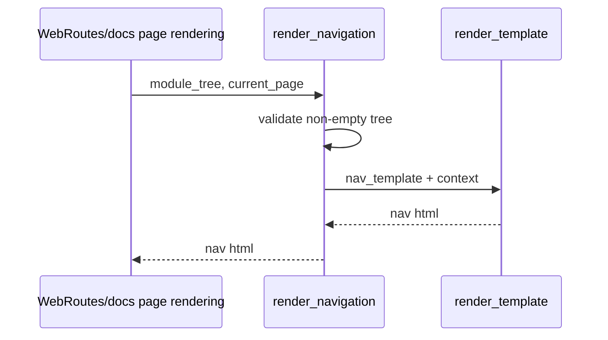
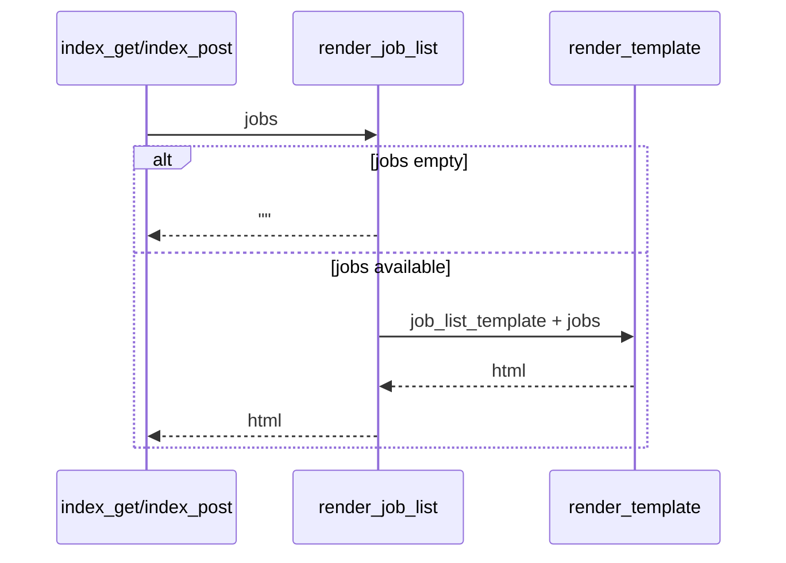

# template-rendering-utilities

## Introduction

The **template-rendering-utilities** module provides lightweight HTML rendering helpers for the Web Frontend, centered on `StringTemplateLoader` (`codewiki.src.fe.template_utils.StringTemplateLoader`).

It wraps Jinja2 to render **in-memory template strings** (instead of file-based templates), and exposes reusable rendering functions used by route handlers and UI pages.

---

## Purpose and Scope

This module is responsible for:

1. Rendering Jinja2 templates from raw strings.
2. Applying safe HTML/XML autoescaping defaults.
3. Producing reusable HTML fragments for:
   - module navigation (`render_navigation`)
   - recent jobs list (`render_job_list`)
4. Providing a small, framework-independent rendering utility used by FastAPI route logic.

It does **not** own HTTP routing, job lifecycle state, or Markdown conversion. See:

- [web-routing-and-request-lifecycle](web-routing-and-request-lifecycle.md)
- [job-processing-and-execution](job-processing-and-execution.md)
- [frontend-models-and-configuration](frontend-models-and-configuration.md)

---

## Core Components

### `StringTemplateLoader`

`StringTemplateLoader` subclasses `jinja2.BaseLoader` and returns a single template source directly from a string.

- `get_source(...)` returns `(template_string, None, lambda: True)`
  - `None` filename: template is not file-backed.
  - `lambda: True`: marks template as always up-to-date for this loader usage.

### `render_template(template, context)`

Creates a dedicated Jinja2 `Environment` per call with:

- `loader=StringTemplateLoader(template)`
- `autoescape=select_autoescape(['html', 'xml'])`
- `trim_blocks=True`
- `lstrip_blocks=True`

Then renders with `env.get_template('').render(**context)`.

### `render_navigation(module_tree, current_page="")`

Builds left-nav HTML from a module tree dictionary:

- section headings from top-level keys
- optional section “Overview” link when `components` exist
- child links when `children` exist
- active page CSS class when `current_page` matches generated filename

Returns empty string when module tree is empty.

### `render_job_list(jobs)`

Builds job card HTML list for recent submissions:

- repository URL and status badge
- progress text when available
- “View Documentation” button only when status is `completed` and `docs_path` exists

Returns empty string when no jobs are supplied.

---

## Architecture Context

Notes:
- The module is a **presentation utility layer** used by route handlers, not an orchestration layer.
- It converts existing runtime state (jobs/module tree/current page) into HTML fragments.

---

## Dependency Map

External dependency behavior:
- Jinja2 is the only runtime dependency for rendering.
- Autoescape is explicitly configured for HTML/XML safety in template output.

---

## Data Flow

For specialized helpers:

---

## Component Interaction and Process Flows

### 1) Generic template rendering flow

### 2) Navigation rendering flow

### 3) Job list rendering flow

---

## Integration with the Overall System

This module sits on the Web Frontend rendering path:

- `WebRoutes` builds context from job/cache/runtime state.
- `template-rendering-utilities` turns that context into HTML.
- The resulting HTML is returned in `HTMLResponse` to browser clients.

It is intentionally narrow and reusable, making route code cleaner by separating:

- **state gathering** (routes/workers/cache) from
- **string-based rendering** (this module).

For deeper integration behavior, refer to:

- [web-routing-and-request-lifecycle](web-routing-and-request-lifecycle.md)
- [job-processing-and-execution](job-processing-and-execution.md)

---

## Operational Notes

- Empty inputs are handled defensively (`""` returned for missing tree/jobs).
- Rendering environment is created per call (simple and stateless, with low coupling).
- Whitespace controls (`trim_blocks`, `lstrip_blocks`) keep generated HTML cleaner.
- Autoescape reduces accidental HTML injection in rendered content, though callers should still validate untrusted input and avoid marking unsafe content as trusted.
