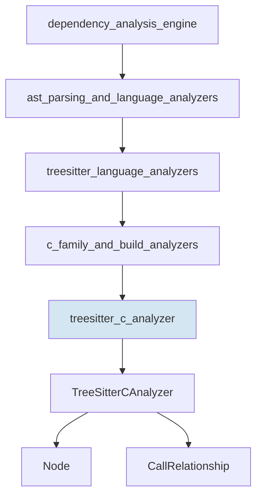
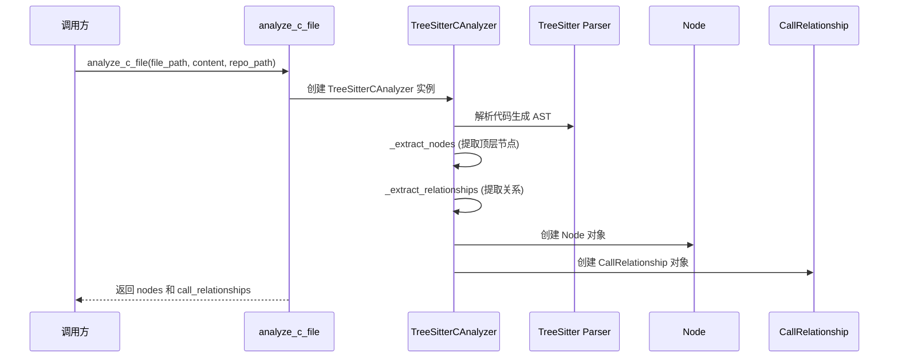

# TreeSitter C Analyzer 模块文档

## 1. 概述

`treesitter_c_analyzer` 模块是 CodeWiki 系统中专门用于分析 C 语言代码文件的组件，其核心类为 `TreeSitterCAnalyzer`。该模块通过 TreeSitter 解析库构建 C 代码的抽象语法树（AST），并从中提取出重要的代码元素（如函数、结构体和全局变量）以及这些元素之间的调用关系。它位于依赖分析引擎的 `ast_parsing_and_language_analyzers` 子模块下，是 C 家族语言分析器的重要组成部分。

该模块的主要设计目的是提供一种可靠且高效的方式来解析 C 语言代码，为整个依赖分析系统提供基础数据支持。通过使用 TreeSitter 库，它能够处理各种 C 代码语法变体，同时保持良好的性能和可维护性。

## 2. 核心组件详解

### 2.1 TreeSitterCAnalyzer 类

`TreeSitterCAnalyzer` 是本模块的核心类，负责执行 C 代码文件的完整分析流程。

#### 初始化与基本属性

```python
def __init__(self, file_path: str, content: str, repo_path: str = None):
    self.file_path = Path(file_path)
    self.content = content
    self.repo_path = repo_path or ""
    self.nodes: List[Node] = []
    self.call_relationships: List[CallRelationship] = []
    self._analyze()
```

**参数说明**：
- `file_path`: 要分析的 C 文件的完整路径
- `content`: 文件的内容字符串
- `repo_path`: 仓库的根目录路径（可选），用于计算相对路径

**主要属性**：
- `nodes`: 存储分析过程中提取的所有代码节点（函数、结构体等）
- `call_relationships`: 存储节点之间的调用关系

#### 核心分析流程

该类的分析过程主要由 `_analyze` 方法驱动，它执行以下步骤：

1. 初始化 TreeSitter 解析器并解析代码生成 AST
2. 通过递归遍历提取顶层节点
3. 再次遍历 AST 提取节点之间的关系

### 2.2 辅助方法与功能

#### 路径处理方法

- `_get_module_path()`: 计算模块路径，用于生成组件 ID
- `_get_relative_path()`: 计算文件相对于仓库根目录的路径
- `_get_component_id(name: str)`: 生成唯一的组件标识符

#### 节点提取方法

- `_extract_nodes(node, top_level_nodes, lines)`: 递归遍历 AST，提取顶层节点
- `_is_global_variable(node)`: 判断一个声明是否为全局变量
- `_extract_relationships(node, top_level_nodes)`: 提取节点间的关系

#### 关系查找方法

- `_find_containing_function(node, top_level_nodes)`: 查找包含某个节点的函数
- `_is_system_function(func_name: str)`: 判断一个函数是否为系统库函数

### 2.3 analyze_c_file 函数

这是模块提供的便捷函数，封装了分析过程，是外部代码使用该模块的主要入口点。

```python
def analyze_c_file(file_path: str, content: str, repo_path: str = None) -> Tuple[List[Node], List[CallRelationship]]:
    analyzer = TreeSitterCAnalyzer(file_path, content, repo_path)
    return analyzer.nodes, analyzer.call_relationships
```

## 3. 架构与工作原理

### 3.1 架构概览

`treesitter_c_analyzer` 模块在整个系统中的位置如下图所示：



### 3.2 分析流程

以下是该模块的完整分析流程：



详细的分析过程说明：

1. **初始化**：创建 `TreeSitterCAnalyzer` 实例时，会立即启动分析过程。
2. **语法解析**：使用 TreeSitter 库将源代码解析为抽象语法树。
3. **节点提取**：
   - 遍历 AST，识别并提取函数定义
   - 识别并提取结构体定义（包括 typedef 方式）
   - 识别并提取全局变量声明
4. **关系提取**：
   - 查找函数调用关系
   - 查找函数对全局变量的使用关系
5. **结果构建**：将提取的信息组织成 `Node` 和 `CallRelationship` 对象列表

## 4. 支持的代码元素与关系

### 4.1 提取的代码元素

| 元素类型 | 说明 | 提取方式 |
|---------|------|---------|
| 函数 | C 函数定义 | 识别 `function_definition` 节点并提取标识符 |
| 结构体 | 命名结构体 | 识别 `struct_specifier` 节点中的名称 |
| 结构体 | typedef 结构体 | 识别包含 `struct_specifier` 的 `type_definition` 节点 |
| 全局变量 | 全局声明的变量 | 识别不在函数内部的 `declaration` 节点 |

### 4.2 提取的关系

| 关系类型 | 说明 | 处理方式 |
|---------|------|---------|
| 函数调用 | 函数对函数的调用 | 存储调用者和被调用者，标记为未解析（等待跨文件解析） |
| 变量使用 | 函数对全局变量的使用 | 存储函数和变量，标记为已解析（同一文件内关系） |

## 5. 使用示例

### 基本使用

```python
from codewiki.src.be.dependency_analyzer.analyzers.c import analyze_c_file

# 读取文件内容
with open("example.c", "r") as f:
    content = f.read()

# 分析文件
nodes, relationships = analyze_c_file(
    file_path="/path/to/repo/example.c",
    content=content,
    repo_path="/path/to/repo"
)

# 处理结果
for node in nodes:
    print(f"Found {node.component_type}: {node.name}")

for rel in relationships:
    print(f"{rel.caller} calls {rel.callee} at line {rel.call_line}")
```

## 6. 限制与注意事项

### 6.1 已知限制

1. **系统函数识别**：系统库函数的识别依赖于硬编码的函数列表，可能无法覆盖所有情况。
2. **复杂语法**：对于某些复杂的 C 语法结构（如复杂的函数指针），可能无法完全准确解析。
3. **预处理器**：目前不处理 C 预处理器指令，这可能导致某些定义和关系被遗漏。
4. **跨文件解析**：函数之间的跨文件调用关系需要在更上层的 [CallGraphAnalyzer](analysis_orchestration.md) 中进行解析。

### 6.2 系统函数列表

该模块目前内置识别的系统函数包括：

- 标准 C 库：`printf`, `scanf`, `malloc`, `free`, `strlen`, `strcpy`, `strcmp`, `memcpy`, `memset`, `exit`, `abort`, `fopen`, `fclose`, `fread`, `fwrite`
- SDL 库：`SDL_Init`, `SDL_CreateWindow`, `SDL_Log`, `SDL_GetError`, `SDL_Quit`

如需支持更多库函数，需要在 `_is_system_function` 方法中进行扩展。

## 7. 与其他模块的关系

`treesitter_c_analyzer` 模块与以下模块紧密关联：

1. **[dependency_graph_construction](dependency_graph_construction.md)**：该模块使用 `treesitter_c_analyzer` 生成的节点和关系来构建完整的依赖图。
2. **[analysis_orchestration](analysis_orchestration.md)**：`CallGraphAnalyzer` 负责解析跨文件的函数调用关系。
3. **其他语言分析器**：该模块在设计上与其他 TreeSitter 语言分析器（如 [treesitter_cpp_analyzer](treesitter_cpp_analyzer.md)、[treesitter_java_analyzer](systems_and_infra_analyzers.md) 等）保持一致的接口。
