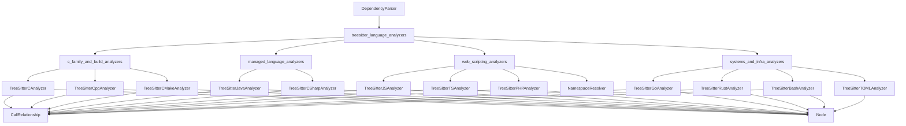
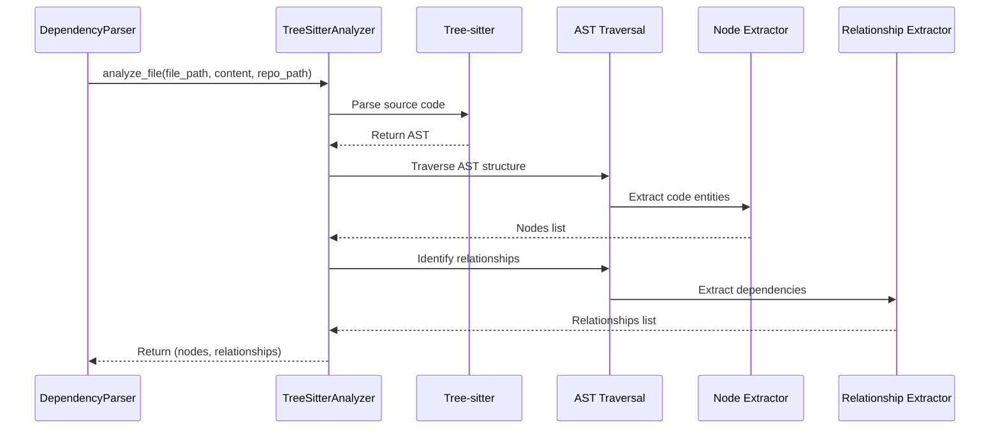

# treesitter_language_analyzers 模块概述

## 1. 模块目的

`treesitter_language_analyzers` 模块是 `dependency_analysis_engine` 依赖分析引擎的核心组件，专门负责利用 Tree-sitter 解析库对多种编程语言的源代码进行静态分析。该模块的主要设计目的是：

- **多语言支持**：为 C、C++、CMake、Java、C#、JavaScript、TypeScript、PHP、Go、Rust、Bash、TOML 等多种语言提供统一的解析接口
- **AST 解析与遍历**：使用 Tree-sitter 生成抽象语法树（AST），并通过遍历提取代码中的关键结构元素
- **实体提取**：识别并提取代码中的类、接口、函数、方法、结构体等核心代码实体
- **关系识别**：分析实体之间的调用、继承、实现、依赖等关系
- **标准化输出**：生成标准化的 `Node` 和 `CallRelationship` 数据结构，供上层依赖图构建模块使用

该模块通过将语言特定的解析逻辑封装在独立的分析器中，同时保持统一的接口，实现了代码库的多语言依赖分析能力，为整个 CodeWiki 系统的文档生成和代码理解提供了基础支撑。

## 2. 模块架构

`treesitter_language_analyzers` 模块采用分层架构设计，将不同语言的分析器按照语言家族和特性进行组织，形成清晰的结构。

### 2.1 整体架构图

### 2.2 数据流程图

### 2.3 架构说明

该模块按照语言特性和应用场景将分析器组织为四个子模块：

1. **c_family_and_build_analyzers**：负责 C、C++ 和 CMake 语言的分析，处理系统级编程语言和构建脚本
2. **managed_language_analyzers**：专注于 Java 和 C# 等托管语言的分析，处理面向对象和强类型语言特性
3. **web_scripting_analyzers**：针对 JavaScript、TypeScript 和 PHP 等 Web 脚本语言，处理动态类型和 Web 开发特性
4. **systems_and_infra_analyzers**：负责 Go、Rust、Bash 和 TOML 等系统和基础设施相关语言的分析

每个分析器都遵循相似的工作流程：接收文件输入 → 使用 Tree-sitter 解析生成 AST → 遍历 AST 提取节点 → 分析节点间关系 → 返回标准化数据结构。

## 3. 核心组件参考

`treesitter_language_analyzers` 模块包含以下核心子模块和组件：

### 3.1 c_family_and_build_analyzers 子模块
- [TreeSitterCAnalyzer](../c_family_and_build_analyzers/treesitter_c_analyzer.md)：C 语言代码分析器，提取函数、结构体、全局变量等实体及其调用关系
- [TreeSitterCppAnalyzer](../c_family_and_build_analyzers/treesitter_cpp_analyzer.md)：C++ 语言代码分析器，支持类、继承、方法等 C++ 特有特性
- [TreeSitterCMakeAnalyzer](../c_family_and_build_analyzers/treesitter_cmake_analyzer.md)：CMake 构建脚本分析器，提取函数、宏定义和构建命令关系

### 3.2 managed_language_analyzers 子模块
- [TreeSitterJavaAnalyzer](../managed_language_analyzers/java_analyzer.md)：Java 语言代码分析器，处理类、接口、方法、继承等 Java 特性
- [TreeSitterCSharpAnalyzer](../managed_language_analyzers/csharp_analyzer.md)：C# 语言代码分析器，支持 C# 类、接口、属性等特性分析

### 3.3 web_scripting_analyzers 子模块
- [TreeSitterJSAnalyzer](../web_scripting_analyzers/javascript_analyzer.md)：JavaScript 代码分析器，提取函数、类、方法调用及 JSDoc 类型依赖
- [TreeSitterTSAnalyzer](../web_scripting_analyzers/typescript_analyzer.md)：TypeScript 代码分析器，在 JavaScript 基础上增加类型注解、接口等特性支持
- [TreeSitterPHPAnalyzer](../web_scripting_analyzers/php_analyzer.md)：PHP 代码分析器，处理类、接口、trait 及命名空间解析
- [NamespaceResolver](../web_scripting_analyzers/php_analyzer.md)：PHP 命名空间解析器，辅助 PHP 分析器处理命名空间和 use 语句

### 3.4 systems_and_infra_analyzers 子模块
- [TreeSitterGoAnalyzer](../systems_and_infra_analyzers/language_analyzers.md)：Go 语言代码分析器，处理函数、方法、结构体等 Go 特性
- [TreeSitterRustAnalyzer](../systems_and_infra_analyzers/language_analyzers.md)：Rust 语言代码分析器，支持函数、结构体、trait、impl 块等 Rust 特性
- [TreeSitterBashAnalyzer](../systems_and_infra_analyzers/language_analyzers.md)：Bash 脚本分析器，提取函数定义和调用关系
- [TreeSitterTOMLAnalyzer](../systems_and_infra_analyzers/language_analyzers.md)：TOML 配置文件分析器，提取表格和数组结构

### 3.5 核心数据模型
- [Node](../../core_domain_models.md)：表示代码实体（类、函数、方法等）的节点对象
- [CallRelationship](../../core_domain_models.md)：表示节点间调用或依赖关系的对象

这些核心组件共同协作，为上层的 `DependencyParser` 提供了强大的多语言代码分析能力，是整个依赖分析引擎的基础。