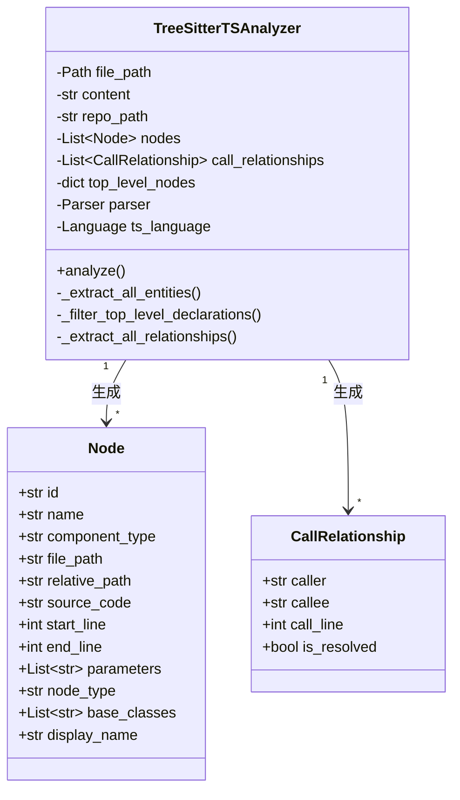
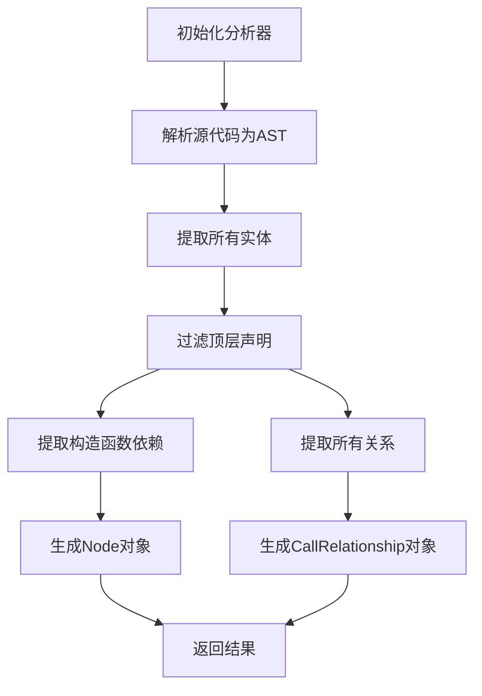
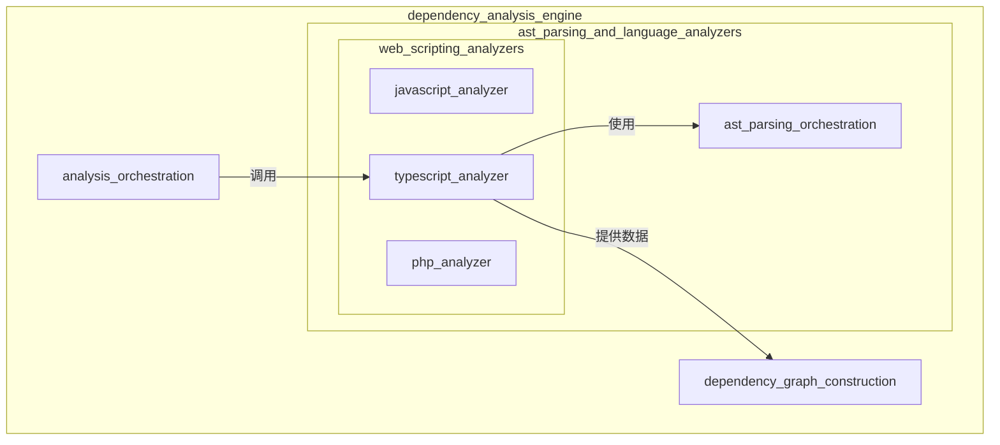

# TypeScript 分析器模块文档

## 概述

typescript_analyzer 模块是 dependency_analysis_engine 中 web_scripting_analyzers 子模块的重要组成部分，专门负责分析 TypeScript 源代码文件。该模块使用 Tree-sitter 解析技术构建抽象语法树（AST），进而提取代码中的关键实体及其相互关系，为构建完整的依赖图提供基础数据。

该模块的核心价值在于能够精确识别 TypeScript 特有的语言特性，如类、接口、类型别名、泛型、装饰器等，并正确解析它们之间的继承、实现、调用和依赖关系。

## 核心组件与架构

### TreeSitterTSAnalyzer 类

`TreeSitterTSAnalyzer` 是本模块的核心类，负责整个 TypeScript 代码分析过程。该类封装了从源代码解析到实体提取、关系识别的完整流程。

#### 主要职责：
1. 初始化 Tree-sitter 解析器并配置 TypeScript 语言支持
2. 解析源代码构建抽象语法树
3. 遍历 AST 提取所有代码实体（函数、类、接口等）
4. 识别并过滤出顶层声明
5. 分析实体间的调用和依赖关系
6. 构建标准化的 Node 和 CallRelationship 对象

### 主要数据结构



## 工作流程与数据流向

### 分析流程详解

typescript_analyzer 模块的工作流程可分为以下几个主要阶段：



#### 阶段 1：初始化与配置
- 创建 `TreeSitterTSAnalyzer` 实例
- 加载 Tree-sitter TypeScript 语言解析器
- 配置文件路径、内容和仓库根路径

#### 阶段 2：AST 解析
- 使用 Tree-sitter 解析器将源代码转换为抽象语法树
- 获取根节点作为遍历起点

#### 阶段 3：实体提取
- 递归遍历 AST 节点
- 识别各种类型的代码实体（函数、类、接口等）
- 收集实体元数据（名称、类型、位置、参数等）

#### 阶段 4：顶层声明过滤
- 判断每个实体是否为顶层声明
- 过滤掉嵌套在函数内或其他非顶层作用域的实体
- 为符合条件的实体创建 Node 对象

#### 阶段 5：关系提取
- 再次遍历 AST，重点关注关系相关节点
- 识别调用表达式、成员访问、类型引用等
- 构建实体间的 CallRelationship 对象

## 核心功能详解

### 1. 实体提取功能

`TreeSitterTSAnalyzer` 能够识别和提取多种 TypeScript 实体类型：

#### 支持的实体类型：
- **函数**：普通函数、生成器函数、箭头函数
- **类**：普通类、抽象类，包括继承关系
- **接口**：接口声明及其扩展关系
- **类型别名**：type 关键字定义的类型
- **枚举**：enum 声明
- **变量声明**：const、let、var 声明（部分处理）
- **导出语句**：各种形式的 export 声明
- **环境声明**：declare module、declare namespace 等

#### 关键方法 - `_extract_all_entities`：

该方法递归遍历 AST，识别并提取所有实体信息：

```python
def _extract_all_entities(self, node, all_entities: dict, depth=0) -> None:
    entity = None
    entity_name = None
    
    if node.type == "function_declaration":
        entity = self._extract_function_entity(node, "function", depth)
    elif node.type == "class_declaration":
        entity = self._extract_class_entity(node, "class", depth)
    # ... 更多类型判断
    
    if entity and entity.get('name'):
        entity_name = entity['name']
        entity['depth'] = depth  
        entity['node'] = node   
        entity['parent_context'] = self._get_parent_context(node)  
        all_entities[entity_name] = entity
    
    for child in node.children:
        self._extract_all_entities(child, all_entities, depth + 1)
```

### 2. 顶层声明过滤

为了构建有意义的依赖图，分析器需要区分顶层声明和嵌套声明。`_is_actually_top_level` 方法负责判断一个实体是否应该被视为顶层声明：

```python
def _is_actually_top_level(self, entity_data: dict) -> bool:
    node = entity_data.get('node')
    if not node or not node.parent:
        return True
    
    if self._is_inside_function_body(node):
        return False
    
    current = node.parent
    while current:
        parent_type = current.type
        
        if parent_type == "program":
            return True
        if parent_type == "export_statement":
            return True
        if parent_type == "ambient_declaration":
            return True
        if parent_type == "module":
            return True
        # ... 更多判断
        
        current = current.parent
    
    return False
```

### 3. 依赖关系提取

分析器能够识别多种类型的实体间关系：

#### 支持的关系类型：
- **函数调用关系**：通过 `call_expression` 识别
- **实例化关系**：通过 `new_expression` 识别
- **成员访问关系**：通过 `member_expression` 识别
- **类型引用关系**：通过 `type_annotation` 识别
- **泛型参数关系**：通过 `type_arguments` 识别
- **继承实现关系**：通过 `extends_clause` 和 `implements_clause` 识别

#### 关系提取核心逻辑：

```python
def _traverse_for_relationships(self, node, all_entities: dict, current_top_level: str = None) -> None:
    if current_top_level is None or self._is_new_top_level(node):
        new_top_level = self._get_top_level_name(node)
        if new_top_level and new_top_level in self.top_level_nodes:
            current_top_level = new_top_level
    
    if current_top_level:
        if node.type == "call_expression":
            self._extract_call_relationship(node, current_top_level, all_entities)
        elif node.type == "new_expression":
            self._extract_new_relationship(node, current_top_level, all_entities)
        elif node.type == "member_expression":
            self._extract_member_relationship(node, current_top_level, all_entities)
        # ... 更多关系类型
    
    for child in node.children:
        self._traverse_for_relationships(child, all_entities, current_top_level)
```

### 4. 构造函数依赖分析

`TreeSitterTSAnalyzer` 特别关注类构造函数的参数类型，将其视为类的依赖关系：

```python
def _extract_constructor_dependencies(self, class_node, class_name: str) -> None:
    try:
        class_body = self._find_child_by_type(class_node, "class_body")
        if not class_body:
            return
            
        for child in class_body.children:
            if child.type == "method_definition":
                property_name = self._find_child_by_type(child, "property_identifier")
                if property_name and self._get_node_text(property_name) == "constructor":
                    formal_params = self._find_child_by_type(child, "formal_parameters")
                    if formal_params:
                        self._extract_parameter_dependencies(formal_params, class_name)
                    break
    except Exception as e:
        logger.debug(f"Error extracting constructor dependencies: {e}")
```

## API 参考

### 主要入口函数

#### `analyze_typescript_file_treesitter`

这是模块的主要入口函数，提供简洁的接口来分析单个 TypeScript 文件。

```python
def analyze_typescript_file_treesitter(
    file_path: str, 
    content: str, 
    repo_path: str = None
) -> Tuple[List[Node], List[CallRelationship]]:
```

**参数：**
- `file_path` (str): TypeScript 文件的绝对路径
- `content` (str): 文件的源代码内容
- `repo_path` (str, optional): 仓库根目录路径，用于计算相对路径

**返回值：**
- Tuple[List[Node], List[CallRelationship]]: 包含两个元素的元组
  - 第一个元素：提取到的 Node 对象列表
  - 第二个元素：提取到的 CallRelationship 对象列表

### TreeSitterTSAnalyzer 类

#### 构造函数

```python
def __init__(self, file_path: str, content: str, repo_path: str = None):
```

**参数：**
- `file_path` (str): TypeScript 文件的路径
- `content` (str): 文件的源代码内容
- `repo_path` (str, optional): 仓库根目录路径

#### 主要公共方法

##### `analyze`

执行完整的分析流程，包括解析、实体提取和关系识别。

```python
def analyze(self) -> None:
```

**副作用：**
- 填充 `self.nodes` 列表
- 填充 `self.call_relationships` 列表

## 使用示例

### 基本使用

```python
from codewiki.src.be.dependency_analyzer.analyzers.typescript import (
    analyze_typescript_file_treesitter
)

# 读取文件内容
with open("example.ts", "r", encoding="utf-8") as f:
    content = f.read()

# 分析文件
nodes, relationships = analyze_typescript_file_treesitter(
    file_path="path/to/example.ts",
    content=content,
    repo_path="path/to/repo"
)

# 处理结果
print(f"找到 {len(nodes)} 个实体")
print(f"找到 {len(relationships)} 个关系")

for node in nodes:
    print(f"实体: {node.display_name} ({node.start_line}-{node.end_line})")

for rel in relationships:
    print(f"关系: {rel.caller} -> {rel.callee} (第{rel.call_line}行)")
```

### 直接使用 TreeSitterTSAnalyzer

```python
from codewiki.src.be.dependency_analyzer.analyzers.typescript import TreeSitterTSAnalyzer

# 创建分析器实例
analyzer = TreeSitterTSAnalyzer(
    file_path="path/to/file.ts",
    content="class MyClass { /* ... */ }",
    repo_path="path/to/repo"
)

# 执行分析
analyzer.analyze()

# 访问结果
for node in analyzer.nodes:
    print(f"类型: {node.component_type}, 名称: {node.name}")

for rel in analyzer.call_relationships:
    print(f"调用: {rel.caller} 调用 {rel.callee}")
```

## 与其他模块的关系

typescript_analyzer 模块在整个系统中的位置和与其他模块的关系：



typescript_analyzer 模块主要与以下模块交互：
- **ast_parsing_orchestration**：提供基础的 AST 解析协调功能
- **analysis_orchestration**：协调整体分析流程，可能调用 typescript_analyzer
- **dependency_graph_construction**：使用 typescript_analyzer 提取的实体和关系构建依赖图

详细的模块关系和依赖可参考 [dependency_analysis_engine](dependency_analysis_engine.md) 文档。

## 局限性与注意事项

### 当前局限性

1. **解析能力限制**：
   - 依赖于 Tree-sitter TypeScript 语法定义，可能无法完全支持最新的 TypeScript 特性
   - 对于高度复杂或非常规的 TypeScript 语法可能解析不准确

2. **实体识别限制**：
   - 主要关注顶层声明，对嵌套实体的处理有限
   - 不处理变量声明，除非它们直接关联函数
   - 装饰器的完整语义分析尚未实现

3. **关系识别限制**：
   - 不解析跨文件的依赖关系（需要上层模块处理）
   - 动态表达式和复杂类型的关系识别不够准确
   - 不处理字符串字面量类型的依赖关系

4. **类型系统限制**：
   - 不执行完整的类型检查或类型推断
   - 泛型类型参数的关系分析有限
   - 条件类型和映射类型等高级类型的处理不完善

### 使用注意事项

1. **错误处理**：
   - 始终检查返回的 nodes 和 relationships 是否为空
   - 注意查看日志输出，特别是警告和错误信息
   - 提供完整的 repo_path 有助于获得更准确的相对路径和模块路径

2. **性能考虑**：
   - 对于大型文件，解析过程可能需要较长时间
   - 内存消耗与源代码大小和复杂度成正比
   - 批量处理多个文件时，考虑适当的资源管理

3. **预处理建议**：
   - 确保输入的源代码是有效的 TypeScript
   - 对于损坏或不完整的代码，解析结果可能不可靠
   - 考虑先进行基本的语法检查再使用此分析器

## 扩展与贡献

### 扩展分析功能

如需扩展 typescript_analyzer 的功能，可以考虑以下方向：

1. **添加新的实体类型**：
   - 在 `_extract_all_entities` 方法中添加新的节点类型判断
   - 创建相应的提取方法，如 `_extract_xxx_entity`
   - 确保在 `_create_node_from_entity` 中正确处理新类型

2. **增强关系提取**：
   - 在 `_traverse_for_relationships` 中添加新的关系类型处理
   - 实现相应的 `_extract_xxx_relationship` 方法
   - 考虑如何处理更复杂的关系场景

3. **改进顶层声明检测**：
   - 调整 `_is_actually_top_level` 方法的逻辑
   - 添加新的父上下文判断条件
   - 优化嵌套实体的处理方式

### 调试技巧

1. **查看 AST 结构**：
   - 可以使用 Tree-sitter 的 CLI 工具或在线解析器查看 AST 结构
   - 在代码中临时添加打印语句输出节点类型和内容

2. **日志级别调整**：
   - 将日志级别设置为 DEBUG 可查看详细的分析过程
   - 关注实体提取和关系识别的关键步骤

3. **测试小片段**：
   - 针对特定语法结构创建小型测试文件
   - 单独分析这些文件以验证特定功能

## 相关模块参考

- [dependency_analysis_engine](dependency_analysis_engine.md) - 整体依赖分析引擎文档
- [javascript_analyzer](javascript_analyzer.md) - JavaScript 分析器模块文档
- [php_analyzer](php_analyzer.md) - PHP 分析器模块文档
- [ast_parsing_orchestration](ast_parsing_orchestration.md) - AST 解析协调模块文档
- [dependency_graph_construction](dependency_graph_construction.md) - 依赖图构建模块文档
