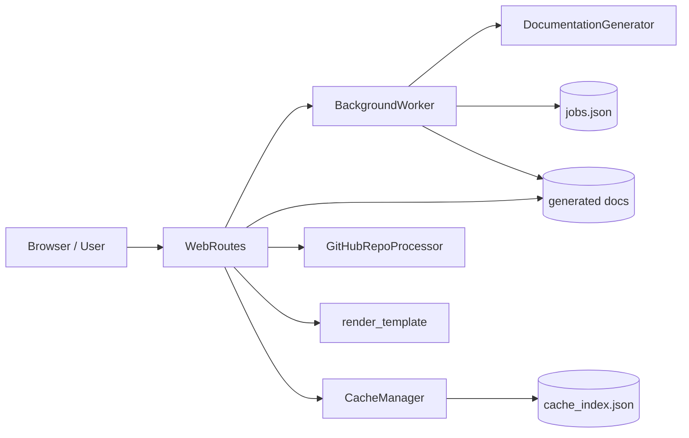
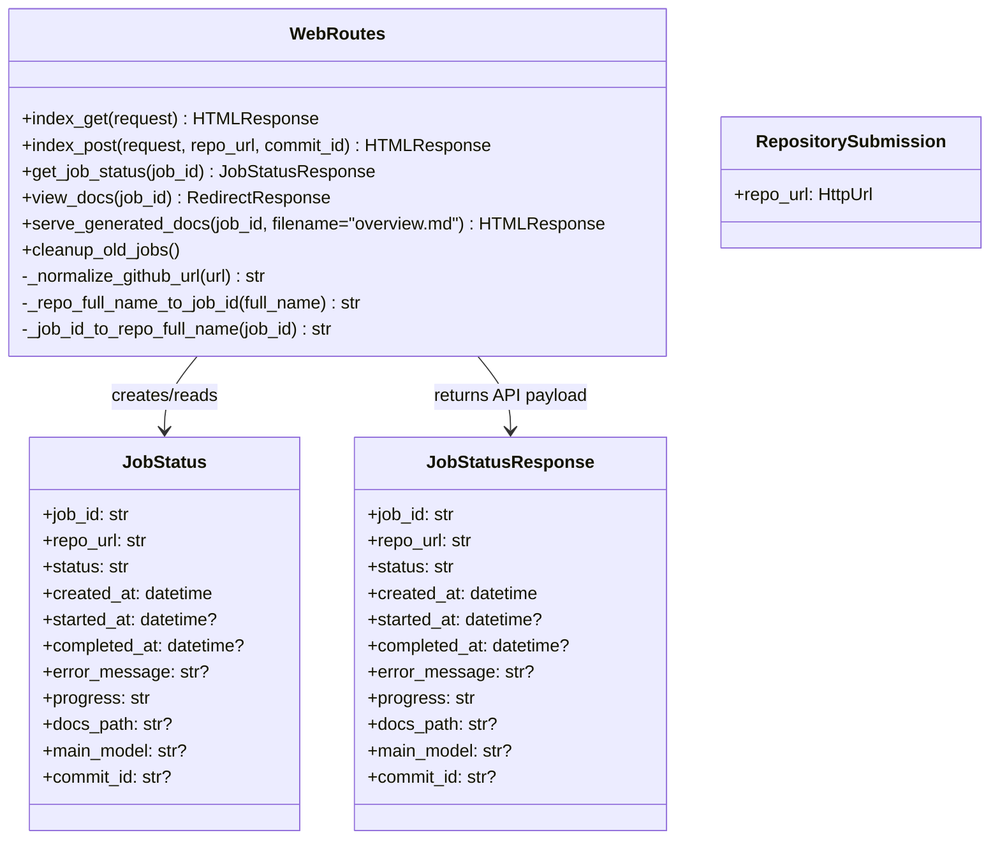
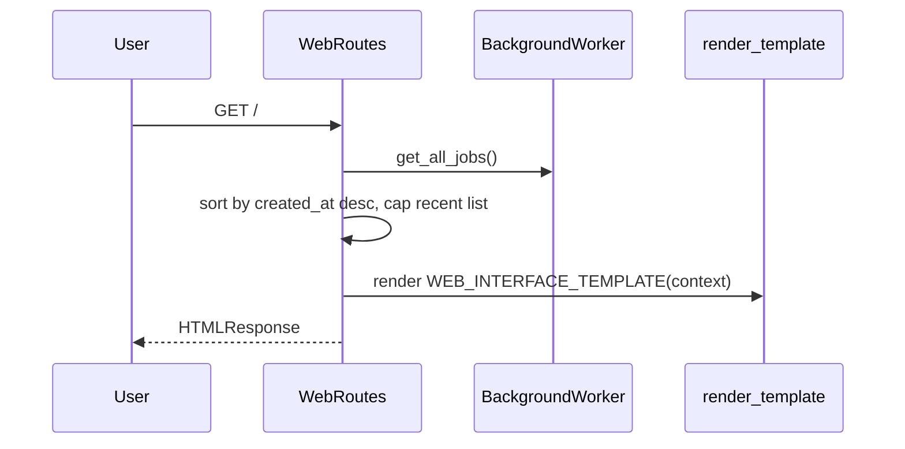
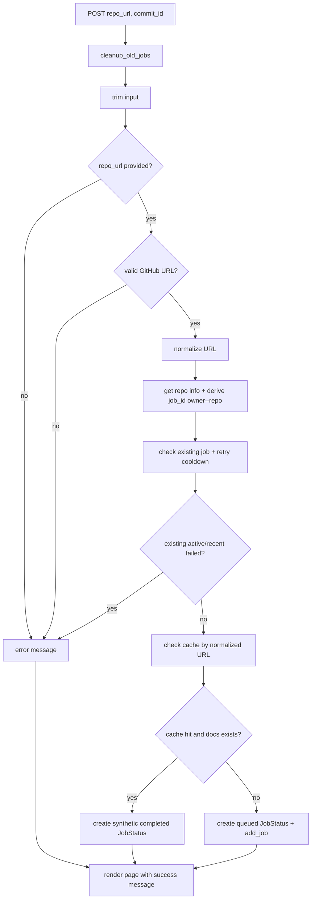
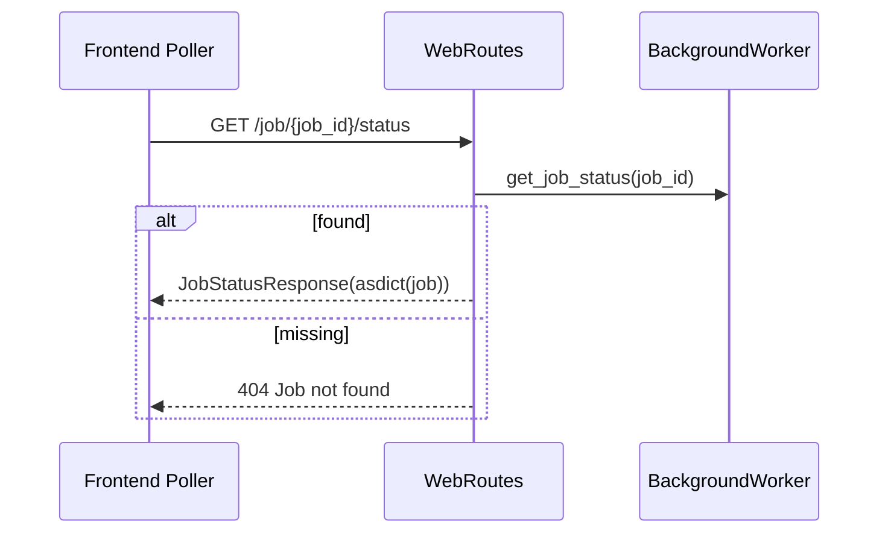
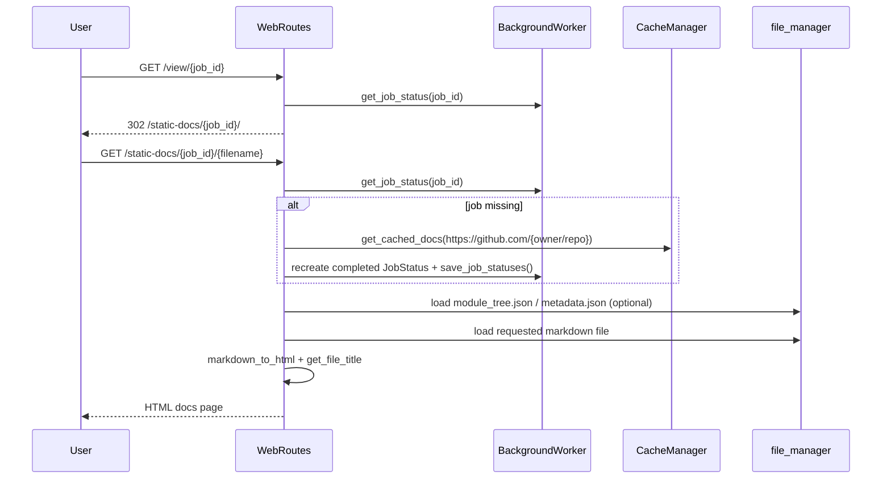
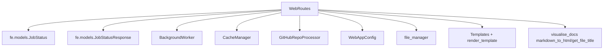
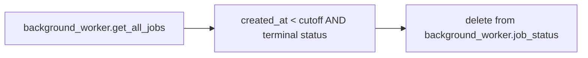
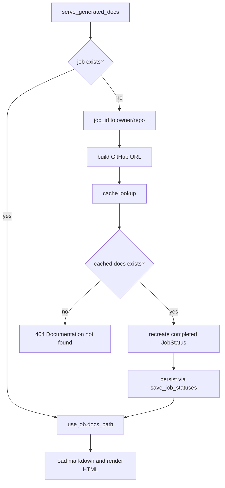

# web-routing-and-request-lifecycle

## Introduction

The **web-routing-and-request-lifecycle** module defines the HTTP-facing behavior of the CodeWiki web app. It is centered on:

- `WebRoutes` (`codewiki.src.fe.routes.WebRoutes`)
- `RepositorySubmission` (`codewiki.src.fe.models.RepositorySubmission`)
- `JobStatusResponse` (`codewiki.src.fe.models.JobStatusResponse`)
- `JobStatus` (`codewiki.src.fe.models.JobStatus`)

In practice, `WebRoutes` is the request coordinator between the browser UI and the async execution backend (`BackgroundWorker` + `CacheManager`). It validates user input, deduplicates submissions, surfaces job state, and renders generated documentation.

---

## Purpose and Scope

This module is responsible for:

1. **Routing and request handling** for form submissions and docs viewing.
2. **Input validation** for GitHub repositories and commit IDs.
3. **Job deduplication and retry cooldown control** using route-level checks.
4. **Response shaping** for both HTML pages and JSON API responses.
5. **Request-time reconstruction** of completed jobs from cache when job state is missing.

This module does **not** execute documentation generation itself. For worker internals and queue processing, see [job-processing-and-execution](job-processing-and-execution.md).

---

## Position in the System

---

## Core Components

### Notes
- `RepositorySubmission` is defined as a Pydantic model (`HttpUrl`) but current route submission uses `Form(...)` parameters directly in `index_post`.
- `JobStatus` is a dataclass used for internal mutable lifecycle tracking.
- `JobStatusResponse` is a Pydantic output contract for status API responses.

---

## Route Surface and Behavior

| Route handler | Type | Primary responsibility |
|---|---|---|
| `index_get` | HTML | Render main page and recent jobs |
| `index_post` | HTML | Validate/queue submission, handle dedupe and cache hit UX |
| `get_job_status` | JSON | Return machine-readable job status |
| `view_docs` | Redirect | Ensure docs available then redirect to docs viewer path |
| `serve_generated_docs` | HTML | Render requested markdown docs page with navigation/metadata |

---

## Request Lifecycle Flows

### 1) Main page load (`index_get`)

Key behavior:
- Displays up to the most recent jobs (implementation slices to 100).
- Includes empty form defaults plus recent job history.

### 2) Repository submission (`index_post`)

Important controls implemented in this flow:
- **Deduplication**: active (`queued`/`processing`) job with same `job_id` blocks duplicate enqueue.
- **Retry throttle**: recently failed job is blocked until `WebAppConfig.RETRY_COOLDOWN_MINUTES` elapses.
- **Cache short-circuit**: cached docs produce immediate completed status without queue processing.

### 3) Job status polling (`get_job_status`)

### 4) Docs redirect and rendering (`view_docs`, `serve_generated_docs`)

---

## Dependency and Interaction Map

### Relationship highlights
- `WebRoutes` is a **composition root** for web concerns; it receives `BackgroundWorker` and `CacheManager` via constructor injection.
- Job identity conversion helpers (`owner/repo` ↔ `owner--repo`) enable cache fallback and URL-safe routing.
- HTML rendering is template-driven (`render_template`) with markdown conversion delegated to docs visualizer utilities.

---

## Data Contracts and State Semantics

### `JobStatus` (internal state)
- Mutable lifecycle object shared with worker state map.
- Canonical statuses used by routes: `queued`, `processing`, `completed`, `failed`.

### `JobStatusResponse` (API payload)
- Built via `JobStatusResponse(**asdict(job))`.
- Ensures typed serialization of timestamps and optional fields.

### `RepositorySubmission` (input contract)
- Strong URL validation (`HttpUrl`) at model level.
- Current routes choose form-parameter validation instead of direct model binding.

---

## Cleanup and Retention Behavior

`cleanup_old_jobs()` removes old terminal jobs from in-memory worker state:

- cutoff = `now - WebAppConfig.JOB_CLEANUP_HOURS`
- removable statuses = `completed` or `failed`
- active states (`queued`, `processing`) are retained

This is invoked on `index_post` (submission path), not every read endpoint.

---

## Error Handling Model

Primary error surfaces:
- Invalid or empty repository URL → user-facing HTML error message.
- Missing job or docs artifacts → `HTTPException(404)`.
- File read/render failure in docs serving → `HTTPException(500)` with traceback detail.

Operationally, this creates:
- Friendly validation feedback for submission UX.
- Strict not-found semantics for missing artifacts.
- Best-effort optional loading for `module_tree.json` and `metadata.json` (fail-open behavior).

---

## Process Deep Dive: Cache-assisted Job Reconstruction

A distinctive flow in this module is serving docs when `job_id` is unknown in memory:

This improves resilience when process memory is reset but cache artifacts remain valid.

---

## Cross-Module References

To avoid duplicating implementation details:

- Worker queueing, cloning, cache persistence internals: [job-processing-and-execution](job-processing-and-execution.md)
- Backend generation orchestration: [Documentation Generator](Documentation Generator.md)
- Analyzer and agent backplane details: [Dependency Analyzer](Dependency Analyzer.md), [Agent Orchestration](Agent Orchestration.md)

---

## Summary

`WebRoutes` is the HTTP lifecycle controller for CodeWiki’s frontend runtime: it validates incoming repository requests, coordinates queue/cache decisions, exposes status APIs, and renders navigable documentation pages. Combined with `JobStatus`/`JobStatusResponse`, this module provides a clear boundary between user interactions and asynchronous backend execution.