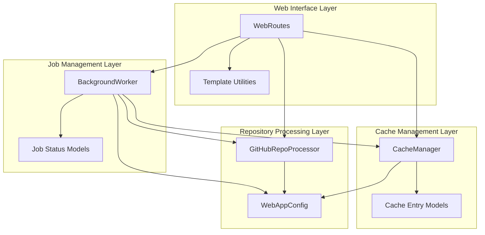

# Web Application Frontend Module Documentation

## 1. Module Overview

The Web Application Frontend module is the user-facing interface layer of the CodeWiki system, providing a web-based platform for users to submit GitHub repositories for documentation generation, monitor job status, and view generated documentation. This module acts as the primary entry point for user interaction with the CodeWiki system, abstracting away the complexity of the underlying documentation generation pipeline.

### Purpose and Design Rationale

This module exists to provide a user-friendly web interface that simplifies the process of generating documentation for GitHub repositories. The design rationale centers around several key principles:

1. **Accessibility**: Making documentation generation accessible through a simple web interface rather than requiring command-line interaction
2. **Transparency**: Providing real-time feedback on job status and progress to keep users informed throughout the process
3. **Efficiency**: Implementing intelligent caching mechanisms to avoid redundant processing of the same repository
4. **User Experience**: Offering a clean, intuitive interface with clear navigation for viewing generated documentation

The module solves the problem of making advanced documentation generation capabilities accessible to non-technical users while also providing the necessary infrastructure for job management, caching, and result presentation.

### Core Problems Solved

- **Repository Submission**: Providing a simple form for users to submit GitHub repositories with optional commit specificity
- **Job Orchestration**: Managing the queue of documentation generation jobs and tracking their status
- **Result Caching**: Storing and retrieving previously generated documentation to improve efficiency
- **Documentation Viewing**: Rendering generated documentation in a navigable web format

## 2. Architecture and Components

The web_application_frontend module follows a modular architecture with clear separation of concerns between different components. The architecture is designed to handle web requests, manage background processing, cache results, and serve documentation in a scalable and maintainable way.



### Architecture Explanation

The architecture is organized into four main layers, each with specific responsibilities:

1. **Web Interface Layer**: This layer handles HTTP requests and responses, serving HTML pages and API endpoints. The `WebRoutes` class is the central component here, managing all route handlers and coordinating with other components to fulfill user requests. The template utilities handle rendering HTML templates with dynamic content.

2. **Job Management Layer**: This layer manages the documentation generation jobs, from initial submission through completion. The `BackgroundWorker` class runs in a separate thread, processing jobs from a queue and updating their status as they progress. The job models define the data structures for tracking job information.

3. **Cache Management Layer**: This layer handles the storage and retrieval of previously generated documentation. The `CacheManager` class manages the cache index, checks for existing documentation, and handles cache expiration. This layer significantly improves performance by avoiding redundant processing.

4. **Repository Processing Layer**: This layer handles interactions with GitHub repositories, including URL validation, repository information extraction, and cloning. The `GitHubRepoProcessor` class provides these capabilities, while `WebAppConfig` offers centralized configuration settings for the entire frontend module.

### Component Interactions

The components interact in well-defined patterns:
- Web routes receive user input and coordinate with other components
- Background worker processes jobs asynchronously, using the cache manager to check for existing results and the GitHub processor to clone repositories
- All components rely on the configuration for settings and use the data models to maintain consistent state

This layered architecture promotes maintainability, testability, and scalability, allowing each component to evolve independently while maintaining clear interfaces for interaction.

## 3. Sub-modules and Key Components

The web_application_frontend module consists of several key components that work together to provide the complete web interface functionality. Each component has a specific responsibility and interacts with others through well-defined interfaces.

### WebRoutes
The `WebRoutes` class is the central orchestrator of the web interface, handling all HTTP requests and coordinating with other components to fulfill user needs. It manages the main page, repository submission, job status API, and documentation viewing endpoints. This class is responsible for validating user input, checking the cache, managing job submission, and cleaning up old jobs.

### BackgroundWorker
The `BackgroundWorker` class manages the asynchronous processing of documentation generation jobs. It maintains a queue of pending jobs, processes them sequentially in a separate thread, and tracks the status of each job throughout its lifecycle. This component handles cache checking, repository cloning, documentation generation coordination, and cleanup of temporary files.

### CacheManager
The `CacheManager` class provides intelligent caching of generated documentation to avoid redundant processing. It maintains an index of cached entries, checks for valid cached results when a repository is submitted, and handles cache expiration based on configured time limits. This component significantly improves system efficiency by reusing previously generated documentation when possible.

### GitHubRepoProcessor
The `GitHubRepoProcessor` class handles all interactions with GitHub repositories. It provides URL validation, repository information extraction, and repository cloning capabilities. This component ensures that submitted URLs are valid GitHub repositories, extracts necessary information like owner and repo name, and clones repositories either shallowly for latest commits or fully for specific commit checkouts.

### WebAppConfig
The `WebAppConfig` class provides centralized configuration settings for the web application. It defines default values for directories, queue sizes, cache expiration, server settings, and Git operations. This component ensures consistent configuration across the entire frontend module and provides utility methods for directory management and path resolution.

### Data Models
The module includes several data models that define the structure of key data entities:
- `RepositorySubmission`: Validates repository URL submissions
- `JobStatus`: Tracks the complete status of documentation generation jobs
- `JobStatusResponse`: Formats job status data for API responses
- `CacheEntry`: Represents cached documentation entries in the cache index

### Template Utilities
The template utilities provide HTML rendering capabilities using Jinja2 templates. The `StringTemplateLoader` enables loading templates from strings, while `render_template` handles the actual template rendering with context variables. Additional utilities render navigation menus and job lists for the web interface.

## 4. Usage Examples and Configuration

### Basic Usage

The web application frontend is designed to be intuitive for end users, but developers integrating or extending the module should understand the core usage patterns.

#### Starting the Web Interface

While the entry point isn't shown in the provided code, the typical pattern would involve initializing the core components and starting the background worker:

```python
from codewiki.src.fe.background_worker import BackgroundWorker
from codewiki.src.fe.cache_manager import CacheManager
from codewiki.src.fe.routes import WebRoutes
from codewiki.src.fe.config import WebAppConfig

# Ensure directories exist
WebAppConfig.ensure_directories()

# Initialize components
cache_manager = CacheManager()
background_worker = BackgroundWorker(cache_manager)

# Start the background worker
background_worker.start()

# Initialize routes
web_routes = WebRoutes(background_worker, cache_manager)

# Set up FastAPI application (not shown)
```

#### Repository Submission Flow

When a user submits a repository through the web interface:
1. The URL is validated using `GitHubRepoProcessor.is_valid_github_url()`
2. The URL is normalized for consistent caching and comparison
3. The cache is checked for existing documentation
4. If not in cache, a job is created and added to the queue
5. The background worker processes the job asynchronously

### Configuration Options

The `WebAppConfig` class provides several configuration options that can be customized:

```python
# Directories
WebAppConfig.CACHE_DIR = "./output/cache"      # Cache storage location
WebAppConfig.TEMP_DIR = "./output/temp"        # Temporary files location
WebAppConfig.OUTPUT_DIR = "./output"            # General output directory

# Queue settings
WebAppConfig.QUEUE_SIZE = 100                   # Maximum jobs in queue

# Cache settings
WebAppConfig.CACHE_EXPIRY_DAYS = 365            # How long to keep cached docs

# Job cleanup settings
WebAppConfig.JOB_CLEANUP_HOURS = 24000          # When to remove old jobs
WebAppConfig.RETRY_COOLDOWN_MINUTES = 3         # Wait before retrying failed jobs

# Server settings
WebAppConfig.DEFAULT_HOST = "127.0.0.1"         # Default server host
WebAppConfig.DEFAULT_PORT = 8000                 # Default server port

# Git settings
WebAppConfig.CLONE_TIMEOUT = 300                 # Git clone timeout in seconds
WebAppConfig.CLONE_DEPTH = 1                     # Shallow clone depth
```

### Custom Cache Configuration

You can customize the cache behavior when initializing the CacheManager:

```python
# Custom cache directory and expiration
cache_manager = CacheManager(
    cache_dir="/path/to/custom/cache",
    cache_expiry_days=30  # Shorter expiration for custom use case
)

# Manual cache management
cache_manager.cleanup_expired_cache()  # Remove expired entries
cache_manager.remove_from_cache(repo_url)  # Remove specific entry
```

### Job Status Monitoring

The background worker provides methods to monitor job status:

```python
# Get status of a specific job
job_status = background_worker.get_job_status(job_id)

# Get all jobs
all_jobs = background_worker.get_all_jobs()

# Filter recent jobs
from datetime import datetime, timedelta
recent_jobs = [
    job for job_id, job in all_jobs.items()
    if job.created_at > datetime.now() - timedelta(days=7)
]
```

## 5. Integration with Other Modules

The web_application_frontend module serves as the user interface layer that integrates with and orchestrates several other modules in the CodeWiki system.

### Integration with Backend Documentation Orchestration

The frontend module depends on the [backend_documentation_orchestration](backend_documentation_orchestration.md) module for the actual documentation generation. Specifically, it uses the `DocumentationGenerator` class to generate documentation once a repository has been cloned:

```python
# From background_worker.py
doc_generator = DocumentationGenerator(config, job.commit_id)
loop = asyncio.new_event_loop()
asyncio.set_event_loop(loop)
try:
    loop.run_until_complete(doc_generator.run())
finally:
    loop.close()
```

This integration allows the frontend to focus on user interaction and job management while delegating the complex documentation generation process to the backend module.

### Configuration Management

The frontend module uses the `Config` class from the backend module to configure the documentation generation process:

```python
# From background_worker.py
from codewiki.src.config import Config, MAIN_MODEL

# Create config for documentation generation
args = argparse.Namespace(repo_path=temp_repo_dir)
config = Config.from_args(args)
# Override docs_dir with job-specific directory
config.docs_dir = os.path.join("output", "docs", f"{job_id}-docs")
```

### Dependency Analysis Engine

While not directly used in the frontend code provided, the documentation generation process ultimately relies on the [dependency_analysis_engine](dependency_analysis_engine.md) module to analyze repository structure and dependencies. The frontend module doesn't directly interact with this module but benefits from its capabilities through the backend integration.

### CLI Documentation Module

The [cli_documentation](cli_documentation.md) module provides similar functionality through a command-line interface, while the web_application_frontend module provides a web-based interface. Both modules share common functionality patterns but are designed for different user interaction paradigms.

## 6. Error Handling and Edge Cases

The web_application_frontend module includes robust error handling for various scenarios that may occur during operation.

### Repository Submission Errors

- **Invalid GitHub URLs**: The `GitHubRepoProcessor.is_valid_github_url()` method validates URLs before processing, ensuring they point to actual GitHub repositories.
- **Empty Submissions**: The form submission handler checks for empty inputs and provides appropriate feedback.
- **Duplicate Jobs**: The system checks for already queued or processing jobs to avoid redundant work.

### Background Processing Errors

The `_process_job` method in `BackgroundWorker` includes comprehensive error handling:

```python
try:
    # Job processing logic
except Exception as e:
    # Update job status with error
    job.status = 'failed'
    job.completed_at = datetime.now()
    job.error_message = str(e)
    job.progress = f"Failed: {str(e)}"
```

This ensures that any failures during processing are caught, the job status is updated appropriately, and users are informed of the failure.

### Cache-related Edge Cases

- **Expired Cache**: The cache manager automatically removes expired entries and checks validity before returning cached results.
- **Missing Cache Files**: If a cache entry exists but the documentation files are missing, the system will regenerate the documentation.
- **Corrupted Cache Index**: The system handles corrupted cache index files gracefully, logging errors and continuing operation.

### Git Operations

- **Clone Failures**: The `GitHubRepoProcessor.clone_repository()` method handles Git clone failures, including timeout scenarios.
- **Specific Commits**: When a specific commit is requested, the system clones the full repository (not shallow) and checks out the specific commit, handling any errors in this process.

### Cleanup Guarantees

The background worker uses a finally block to ensure temporary repository directories are cleaned up even if processing fails:

```python
finally:
    # Cleanup temporary repository
    if 'temp_repo_dir' in locals() and os.path.exists(temp_repo_dir):
        try:
            subprocess.run(['rm', '-rf', temp_repo_dir], check=True)
        except Exception as e:
            print(f"Failed to cleanup temp directory: {e}")
```

## 7. Advanced Topics

### Job ID Generation

The system uses a consistent method for generating job IDs from repository full names:

```python
def _repo_full_name_to_job_id(self, full_name: str) -> str:
    """Convert repo full name to URL-safe job ID."""
    return full_name.replace('/', '--')

def _job_id_to_repo_full_name(self, job_id: str) -> str:
    """Convert job ID back to repo full name."""
    return job_id.replace('--', '/')
```

This bidirectional conversion allows for URL-safe job IDs while maintaining the ability to reconstruct the original repository identifier.

### URL Normalization

To ensure consistent caching and comparison, the system normalizes GitHub URLs:

```python
def _normalize_github_url(self, url: str) -> str:
    """Normalize GitHub URL for consistent comparison."""
    try:
        # Get repo info to standardize the URL format
        repo_info = GitHubRepoProcessor.get_repo_info(url)
        return f"https://github.com/{repo_info['full_name']}"
    except Exception:
        # Fallback to basic normalization
        return url.rstrip('/').lower()
```

This handles variations in URL format (e.g., with/without .git suffix, different cases) and ensures the same repository is always treated consistently.

### Job Reconstruction from Cache

For backward compatibility, the system can reconstruct job statuses from cache entries:

```python
def _reconstruct_jobs_from_cache(self):
    """Reconstruct job statuses from cache entries for backward compatibility."""
    # Logic to create job statuses from existing cache entries
```

This ensures a smooth transition if the job persistence mechanism changes or if the job file is lost.

### Template Rendering System

The template system uses Jinja2 with a custom string loader for flexibility:

```python
class StringTemplateLoader(BaseLoader):
    """Custom Jinja2 loader for string templates."""
    
    def __init__(self, template_string: str):
        self.template_string = template_string
    
    def get_source(self, environment, template):
        return self.template_string, None, lambda: True
```

This allows templates to be defined as strings within the code rather than requiring separate template files, simplifying deployment.

### Retry Cooldown

The system implements a retry cooldown period to prevent immediate reprocessing of failed jobs:

```python
recent_cutoff = datetime.now() - timedelta(minutes=WebAppConfig.RETRY_COOLDOWN_MINUTES)
if existing_job.status == 'failed' and existing_job.created_at > recent_cutoff:
    message = f"Repository recently failed processing. Please wait a few minutes before retrying (Job ID: {existing_job.job_id})"
```

This prevents overwhelming the system with repeated attempts to process a problematic repository.

## 8. Summary

The web_application_frontend module provides a comprehensive web-based interface for the CodeWiki documentation generation system. It abstracts the complexity of the underlying documentation generation pipeline and provides users with a simple, intuitive way to submit repositories, monitor progress, and view results.

Key strengths of this module include:
- A well-structured, layered architecture that promotes maintainability
- Intelligent caching to avoid redundant processing
- Robust error handling and cleanup mechanisms
- Asynchronous job processing for improved user experience
- Clear integration points with other CodeWiki modules

This module serves as the primary user-facing component of the CodeWiki system, making advanced documentation generation capabilities accessible to a wide range of users.
