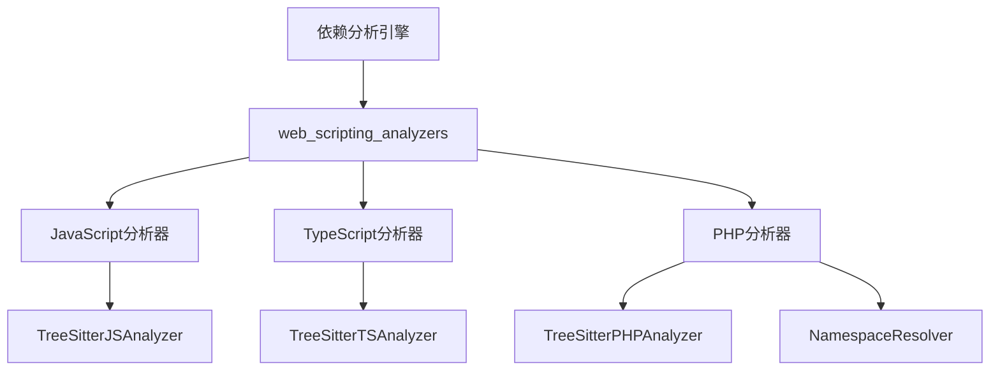
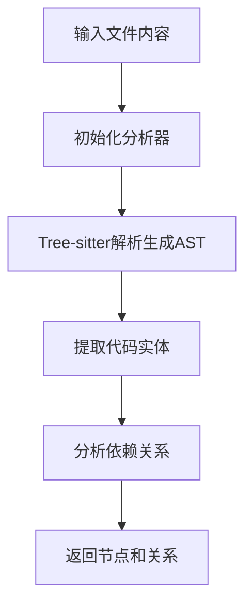

# web_scripting_analyzers 模块文档

## 1. 模块概述

`web_scripting_analyzers`模块是依赖分析引擎的核心子模块，专门用于分析Web脚本语言（JavaScript、TypeScript和PHP）的代码结构和依赖关系。该模块使用Tree-sitter解析库构建抽象语法树(AST)，从而能够精确地提取代码中的类、函数、方法等实体，以及它们之间的调用、继承和依赖关系。

### 主要功能
- JavaScript/TypeScript代码的静态分析
- PHP代码的静态分析和命名空间解析
- 类、接口、函数、方法等代码实体的提取
- 函数调用、继承、实现等依赖关系的识别
- 类型注解和JSDoc/PHPDoc注释的解析

### 设计理念
该模块采用分层设计，将语言特定的分析逻辑封装在独立的分析器类中，同时通过统一的接口与上层模块交互。每个语言分析器负责处理该语言特有的语法特性和依赖模式，确保分析的准确性和深度。

## 2. 架构与主流程

### 模块架构

`web_scripting_analyzers`模块由三个主要的语言分析器组成，每个分析器负责处理特定的Web脚本语言：



### 主要组件说明

- **JavaScript分析器**：通过`TreeSitterJSAnalyzer`类实现，使用Tree-sitter解析JavaScript代码，提取函数、类、方法等实体，并识别调用关系和JSDoc注释中的类型依赖。

- **TypeScript分析器**：通过`TreeSitterTSAnalyzer`类实现，在JavaScript分析的基础上增加了对TypeScript特有语法的支持，包括类型注解、接口、泛型等特性的解析。

- **PHP分析器**：通过`TreeSitterPHPAnalyzer`和`NamespaceResolver`类实现，处理PHP代码的分析，特别关注命名空间解析和PHP特有的特性如trait、enum等。

### 工作流程

所有分析器都遵循相似的工作流程：

1. **初始化**：创建分析器实例，设置文件路径、内容和仓库路径
2. **解析**：使用Tree-sitter解析代码生成抽象语法树
3. **实体提取**：遍历AST，提取类、函数、接口等代码实体
4. **关系分析**：再次遍历AST，识别实体间的依赖关系
5. **结果返回**：返回提取的节点和调用关系列表



## 3. 子模块功能

### JavaScript分析器

JavaScript分析器负责处理JavaScript文件的分析工作，主要功能包括：
- 提取函数声明、类声明、箭头函数等代码实体
- 识别函数调用、方法调用和构造函数调用
- 解析JSDoc注释中的类型依赖
- 处理继承关系和接口实现

详细信息请参阅 [JavaScript分析器文档](javascript_analyzer.md)

### TypeScript分析器

TypeScript分析器在JavaScript分析的基础上增加了对TypeScript特有特性的支持：
- 提取接口、类型别名、枚举等TypeScript特有实体
- 解析类型注解和类型参数
- 处理泛型、装饰器等高级特性
- 识别类型依赖关系

详细信息请参阅 [TypeScript分析器文档](typescript_analyzer.md)

### PHP分析器

PHP分析器专注于PHP语言的特性，提供全面的PHP代码分析能力：
- 提取类、接口、trait、枚举等实体
- 处理命名空间解析和use语句
- 识别继承、实现、对象创建等关系
- 解析PHPDoc注释和属性提升等PHP特性

详细信息请参阅 [PHP分析器文档](php_analyzer.md)

## 4. 核心功能与API

### 主要API函数

该模块提供了三个主要的入口函数，分别用于分析不同语言的文件：

1. `analyze_javascript_file_treesitter(file_path, content, repo_path)` - 分析JavaScript文件
2. `analyze_typescript_file_treesitter(file_path, content, repo_path)` - 分析TypeScript文件
3. `analyze_php_file(file_path, content, repo_path)` - 分析PHP文件

每个函数接收文件路径、文件内容和可选的仓库路径作为参数，返回一个包含节点列表和调用关系列表的元组。

### 核心数据结构

- `Node`：表示代码实体（类、函数、方法等）的节点对象
- `CallRelationship`：表示节点间调用或依赖关系的对象

这些数据结构在整个依赖分析引擎中共享，确保不同分析器生成的结果可以无缝集成。

## 5. 使用指南与示例

### 基本使用

```python
# JavaScript文件分析示例
from codewiki.src.be.dependency_analyzer.analyzers.javascript import analyze_javascript_file_treesitter

js_file_path = "path/to/file.js"
with open(js_file_path, 'r') as f:
    content = f.read()

nodes, relationships = analyze_javascript_file_treesitter(js_file_path, content, repo_path="path/to/repo")

# TypeScript文件分析示例
from codewiki.src.be.dependency_analyzer.analyzers.typescript import analyze_typescript_file_treesitter

ts_file_path = "path/to/file.ts"
with open(ts_file_path, 'r') as f:
    content = f.read()

nodes, relationships = analyze_typescript_file_treesitter(ts_file_path, content, repo_path="path/to/repo")

# PHP文件分析示例
from codewiki.src.be.dependency_analyzer.analyzers.php import analyze_php_file

php_file_path = "path/to/file.php"
with open(php_file_path, 'r') as f:
    content = f.read()

nodes, relationships = analyze_php_file(php_file_path, content, repo_path="path/to/repo")
```

### 扩展与自定义

要扩展该模块以支持新的语言或增强现有功能，可以：
1. 继承现有分析器类并重写特定方法
2. 实现新的语言分析器，遵循相同的接口模式
3. 扩展NamespaceResolver类以支持更复杂的命名空间解析逻辑

## 6. 注意事项与限制

- 所有分析器依赖于Tree-sitter解析库，需要确保相应的语言解析器已正确安装
- 对于非常大的文件，可能会遇到性能问题或递归深度限制
- 模板文件（如PHP的.blade.php文件）会被自动跳过，以避免误分析
- 动态特性（如JavaScript的eval、PHP的动态调用）无法被静态分析准确识别
- 分析结果的准确性取决于代码的规范性，对于非标准语法可能需要额外处理
