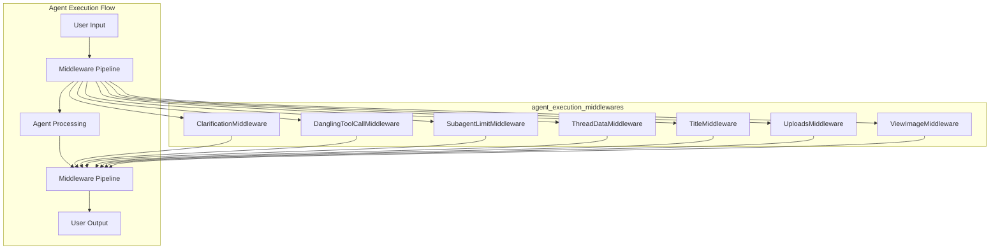

# Agent Execution Middlewares Module

## Introduction

The `agent_execution_middlewares` module provides a collection of middleware components that enhance and extend the functionality of agent execution in a conversational AI system. These middlewares intercept and modify the agent's execution flow at various points, enabling features like clarification handling, dangling tool call detection, subagent concurrency limits, thread data management, automatic title generation, uploads processing, and image viewing.

### Purpose and Design Rationale

This module exists to address common challenges in agent-based systems:

1. **Separation of Concerns**: Middleware allows cross-cutting concerns to be handled independently from core agent logic
2. **Flexibility**: Middlewares can be added, removed, or reordered without modifying the main agent implementation
3. **Consistency**: Common functionality is centralized in middleware components ensuring consistent behavior across agent interactions
4. **Enhanced User Experience**: Features like clarification requests, automatic titling, and image viewing improve the overall interaction quality

The design follows a middleware pattern where each component focuses on a specific functionality, allowing for modular and maintainable code.

## Architecture Overview

The module consists of several independent middleware components, each implementing the `AgentMiddleware` interface from LangChain. These middlewares can be composed together in a pipeline to process agent execution.



### Component Relationships

Each middleware in this module operates independently but can be combined to create a comprehensive processing pipeline. The middlewares interact with the agent state and message history at different points in the execution lifecycle:

- **Before agent execution**: `ThreadDataMiddleware`, `UploadsMiddleware`
- **Before model calls**: `DanglingToolCallMiddleware`, `ViewImageMiddleware`
- **After model calls**: `SubagentLimitMiddleware`
- **After agent execution**: `TitleMiddleware`
- **During tool calls**: `ClarificationMiddleware`

## Core Components

### 1. Clarification Middleware

Handles clarification requests by intercepting `ask_clarification` tool calls and interrupting execution to present questions to the user.

**Key Features:**
- Detects and intercepts clarification tool calls
- Formats user-friendly clarification messages with appropriate icons
- Interrupts execution to await user input
- Supports different clarification types with context and options

**Documentation:** [clarification_middleware.md](clarification_middleware.md)

### 2. Dangling Tool Call Middleware

Fixes dangling tool calls in message history that can cause LLM errors due to incomplete message formats.

**Key Features:**
- Detects AIMessages with tool_calls lacking corresponding ToolMessages
- Injects synthetic ToolMessages with error indicators
- Maintains correct message ordering by inserting patches immediately after problematic AIMessages

**Documentation:** [dangling_tool_call_middleware.md](dangling_tool_call_middleware.md)

### 3. Subagent Limit Middleware

Enforces maximum concurrent subagent tool calls per model response to prevent resource exhaustion.

**Key Features:**
- Truncates excess "task" tool calls from model responses
- Configurable limit between 2-4 concurrent subagents
- Prevents reliability issues with prompt-based limits

**Documentation:** [subagent_limit_middleware.md](subagent_limit_middleware.md)

### 4. Thread Data Middleware

Manages thread-specific data directories for workspace, uploads, and outputs.

**Key Features:**
- Creates structured directory hierarchy per thread
- Supports both lazy and eager initialization modes
- Makes directory paths available in agent state

**Documentation:** [thread_data_middleware.md](thread_data_middleware.md)

### 5. Title Middleware

Automatically generates concise, descriptive titles for conversation threads.

**Key Features:**
- Generates titles after first complete user-assistant exchange
- Uses lightweight LLM for title generation
- Falls back to user message snippet if generation fails
- Configurable length limits and prompts

**Documentation:** [title_middleware.md](title_middleware.md)

### 6. Uploads Middleware

Injects uploaded file information into the agent context, making files available for processing.

**Key Features:**
- Monitors thread-specific upload directories
- Only shows newly uploaded files (not previously shown)
- Formats file information with sizes and paths
- Injects file list into conversation context

**Documentation:** [uploads_middleware.md](uploads_middleware.md)

### 7. View Image Middleware

Injects image details into conversation when view_image tools complete, enabling LLM to "see" images.

**Key Features:**
- Detects completed view_image tool calls
- Verifies all tool calls in a message are completed
- Injects human-readable image summaries with base64 data
- Enables automatic image analysis without explicit user prompts

**Documentation:** [view_image_middleware.md](view_image_middleware.md)

## Usage and Configuration

### Adding Middlewares to Agent

Middlewares can be added to an agent during initialization:

```python
from langchain.agents import AgentExecutor
from src.agents.middlewares.clarification_middleware import ClarificationMiddleware
from src.agents.middlewares.thread_data_middleware import ThreadDataMiddleware
from src.agents.middlewares.title_middleware import TitleMiddleware

# Create agent with middlewares
agent = create_agent(...)
agent_executor = AgentExecutor(agent=agent, tools=tools)
agent_executor.middlewares = [
    ClarificationMiddleware(),
    ThreadDataMiddleware(),
    TitleMiddleware(),
    # Add other middlewares as needed
]
```

### Configuration Dependencies

This module depends on configuration from the [application_and_feature_configuration](application_and_feature_configuration.md) module:
- `TitleConfig` for title generation settings
- `Paths` for directory structure configuration

## Related Modules

- [agent_memory_and_thread_context](agent_memory_and_thread_context.md): Provides thread state management
- [application_and_feature_configuration](application_and_feature_configuration.md): Configuration for middleware behavior
- [subagents_and_skills_runtime](subagents_and_skills_runtime.md): Subagent execution limited by SubagentLimitMiddleware

## Best Practices

1. **Middleware Order**: Order matters - typically, data setup middlewares (ThreadDataMiddleware) should come first.
2. **State Management**: Be mindful of state modifications to avoid conflicts between middlewares.
3. **Error Handling**: Each middleware should handle its own errors gracefully.
4. **Performance**: Lazy initialization (default in ThreadDataMiddleware) is preferred for better performance.
