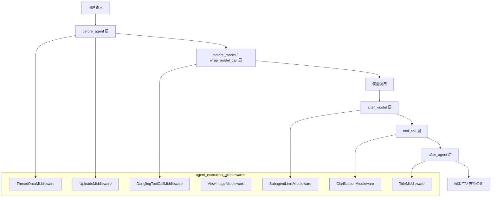
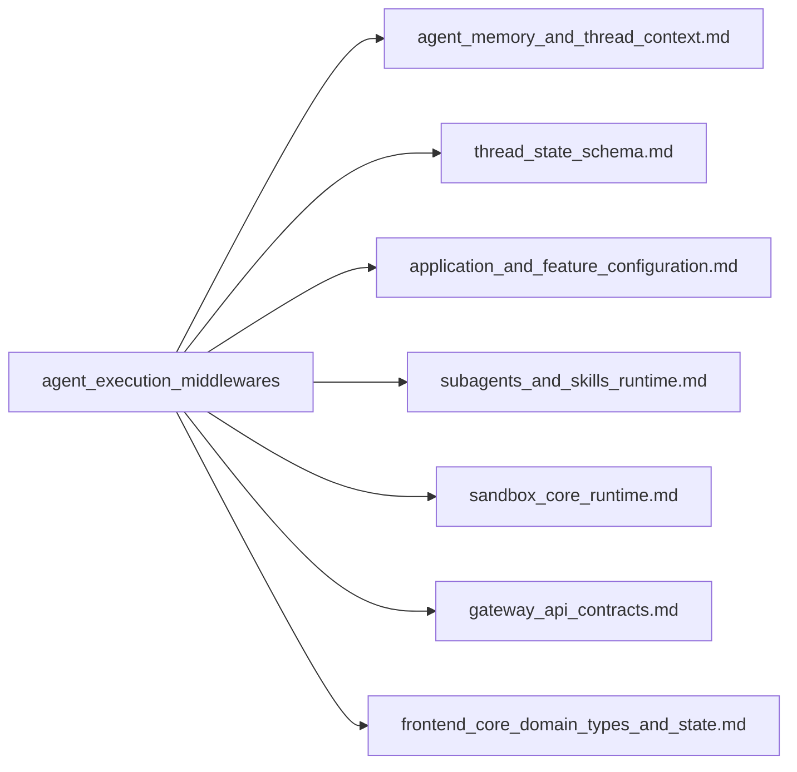
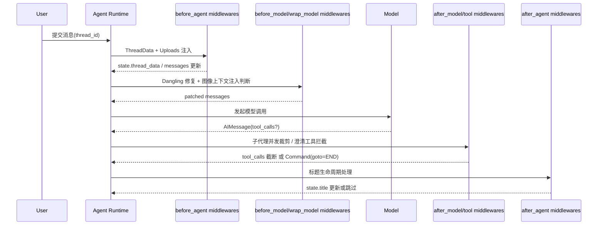

# agent_execution_middlewares 模块文档

## 模块简介

`agent_execution_middlewares` 是 DeerFlow Agent 运行时中的“执行治理层”。它不是直接负责回答问题、调用工具或持久化状态的业务模块，而是一组围绕执行生命周期关键节点（`before_agent`、`before_model`、`wrap_model_call`、`after_model`、`wrap_tool_call`、`after_agent`）的横切能力集合。该模块的核心价值在于：把“稳定性、可控性、上下文注入、用户交互体验”这些跨功能需求，从主 Agent 逻辑中剥离出来，形成可组合、可替换、可扩展的中间件链。

在真实生产场景中，纯粹依赖提示词或单点逻辑很难保证执行质量：模型可能超量发起子任务、工具调用可能因中断留下不完整历史、上传文件可能未被模型感知、图像工具结果可能无法转成可消费上下文、澄清问题可能和普通工具结果混在一起导致交互混乱。`agent_execution_middlewares` 的存在，就是为了系统性解决这些问题。它通过统一的 middleware 机制，把“执行控制”前置并标准化，使 Agent 在复杂多轮会话中保持结构正确、行为可预测、体验一致。

---

## 架构总览

### 1) 生命周期分层视图



这张图强调了一个关键事实：模块不是“按文件分类”，而是“按执行时机分层”。也正因为如此，你在排障时应优先问“问题发生在哪个生命周期节点”，再定位对应中间件，而不是先从功能名入手。

### 2) 依赖与系统集成视图



- 与 `thread_state_schema`、`agent_memory_and_thread_context` 的关系：提供并消费线程级状态字段（如 `thread_data`、`viewed_images`、`title`）。
- 与配置模块的关系：读取 `Paths`、`TitleConfig` 等运行策略。
- 与子代理运行时的关系：在模型输出阶段限制 `task` 工具并发，保护 `SubagentExecutor`。
- 与前后端契约的关系：澄清消息、上传文件上下文、图像注入内容最终都会影响前端分组渲染与用户交互体验。

---

## 子模块说明（高层）

> 下列子模块文档已拆分为独立文件。主文档只保留职责边界与集成关系，避免重复细节。完整子模块文档清单：
> [clarification_interception.md](clarification_interception.md)、[tool_call_resilience.md](tool_call_resilience.md)、[subagent_concurrency_control.md](subagent_concurrency_control.md)、[thread_bootstrap_and_upload_context.md](thread_bootstrap_and_upload_context.md)、[title_lifecycle.md](title_lifecycle.md)、[image_context_injection.md](image_context_injection.md)。

### clarification_interception

`clarification_interception` 负责把 `ask_clarification` 从“普通工具调用”提升为“执行中断协议”。当模型触发澄清工具时，中间件会构造标准化 `ToolMessage` 并返回 `Command(goto=END)`，立即结束当前轮执行，显式把控制权交还给用户。这一设计显著减少了“模型似乎继续执行但实际等待输入”的体验割裂。

详见：[clarification_interception.md](clarification_interception.md)

### tool_call_resilience

`tool_call_resilience` 负责修复悬空工具调用（dangling tool calls）。当历史中存在 `AIMessage.tool_calls` 但缺少对应 `ToolMessage` 时，该中间件会在正确位置插入合成错误结果，保证送入 LLM 的消息序列结构合法。它的重点不是恢复真实工具输出，而是维持协议完整性，避免模型 API 因格式错误失败。

详见：[tool_call_resilience.md](tool_call_resilience.md)

### subagent_concurrency_control

`subagent_concurrency_control` 在 `after_model` 阶段裁剪超量 `task` 工具调用，把单轮子代理并发限制在安全范围（实现中强制夹紧到 `[2,4]`）。它是上游控流阀，目的是防止子任务风暴和资源争抢，而非替代调度层队列。

详见：[subagent_concurrency_control.md](subagent_concurrency_control.md)

### thread_bootstrap_and_upload_context

`thread_bootstrap_and_upload_context` 包含 `ThreadDataMiddleware` 与 `UploadsMiddleware` 两类执行前注入逻辑：前者负责线程目录路径声明（可选 eager 创建），后者负责把“新增上传文件”前置到最后一条用户消息。它让模型在工具调用前就拥有正确路径语义与文件可见性。

详见：[thread_bootstrap_and_upload_context.md](thread_bootstrap_and_upload_context.md)

### title_lifecycle

`title_lifecycle` 负责线程标题生成生命周期：仅在首轮完整问答后触发、避免重复覆盖、失败时安全回退。该中间件将标题策略从业务层抽离成统一治理逻辑，并通过状态增量回写 `title`。

详见：[title_lifecycle.md](title_lifecycle.md)

### image_context_injection

`image_context_injection` 负责把 `view_image` 工具结果转换为模型可直接消费的多模态 `HumanMessage`（text + image_url data URL）。它会验证最近一条 assistant 工具调用是否全部完成，并做去重保护，避免重复注入。

详见：[image_context_injection.md](image_context_injection.md)

---

## 关键数据流



该流程体现了该模块“多点治理”的本质：不是单个中间件解决所有问题，而是在执行链不同阶段分别加护栏。

---

## 使用与装配建议

典型装配示例（示意）：

```python
from src.agents.middlewares.thread_data_middleware import ThreadDataMiddleware
from src.agents.middlewares.uploads_middleware import UploadsMiddleware
from src.agents.middlewares.dangling_tool_call_middleware import DanglingToolCallMiddleware
from src.agents.middlewares.view_image_middleware import ViewImageMiddleware
from src.agents.middlewares.subagent_limit_middleware import SubagentLimitMiddleware
from src.agents.middlewares.clarification_middleware import ClarificationMiddleware
from src.agents.middlewares.title_middleware import TitleMiddleware

middlewares = [
    ThreadDataMiddleware(lazy_init=True),
    UploadsMiddleware(),
    DanglingToolCallMiddleware(),
    ViewImageMiddleware(),
    SubagentLimitMiddleware(max_concurrent=3),
    ClarificationMiddleware(),
    TitleMiddleware(),
]
```

实践上，建议遵循“先准备上下文、再修复/增强模型输入、再约束模型输出、最后做执行后元信息回写”的顺序。若顺序错误，常见后果包括：文件信息未注入、图像重复注入、工具补丁位置不正确、标题触发时机异常。

---

## 配置与运行注意事项

- 路径与目录语义依赖 `Paths/get_paths`（见 [application_and_feature_configuration.md](application_and_feature_configuration.md)）。如果部署环境修改了 base_dir 或沙箱挂载，务必同步验证上传提示中的虚拟路径。
- 标题策略依赖 `TitleConfig`。`max_words` 是提示词软约束，`max_chars` 才是代码硬约束。
- 子代理并发限制是中间件参数 + 内置夹紧共同生效，不等于全局并发控制。
- 多模态注入会显著增加上下文体积；大图/多图场景需要配合上游压缩与清理策略。

---

## 扩展指南

如果你计划新增中间件，建议遵循以下原则：

1. **单一职责**：一个中间件只解决一个横切问题，避免做“全能中间件”。
2. **显式状态契约**：新增字段要在状态 schema 层可解释，并与现有字段避免冲突。
3. **同步/异步一致性**：若框架支持 async，务必同时实现 sync/async 版本。
4. **可观测性优先**：使用结构化日志而非 `print`，便于线上排障。
5. **幂等与去重**：注入型中间件必须考虑重复触发。

---

## 常见风险与排障线索

- **模型报工具消息格式错误**：优先检查 `tool_call_resilience` 是否生效。
- **用户收到澄清后流程继续乱跑**：检查 `clarification_interception` 是否返回了 `goto=END`。
- **子代理突然并发暴涨**：检查 `subagent_concurrency_control` 的实例参数与链路位置。
- **模型看不到上传文件**：检查 `thread_id`、uploads 目录、最后一条是否 `HumanMessage`。
- **图像反复注入或完全不注入**：检查 `image_context_injection` 去重文案与工具完成判定。
- **标题没生成**：检查 `TitleConfig.enabled`、消息计数门控条件与异常 fallback 日志。

---

## 相关阅读

- 线程与记忆上下文总览：[agent_memory_and_thread_context.md](agent_memory_and_thread_context.md)
- 线程状态结构定义：[thread_state_schema.md](thread_state_schema.md)
- 沙箱运行时与目录挂载：[sandbox_core_runtime.md](sandbox_core_runtime.md)
- 子代理执行机制：[subagents_and_skills_runtime.md](subagents_and_skills_runtime.md)
- 应用配置体系：[application_and_feature_configuration.md](application_and_feature_configuration.md)
- API 契约与上传相关接口：[gateway_api_contracts.md](gateway_api_contracts.md)
- 前端消息与线程状态类型：[frontend_core_domain_types_and_state.md](frontend_core_domain_types_and_state.md)
