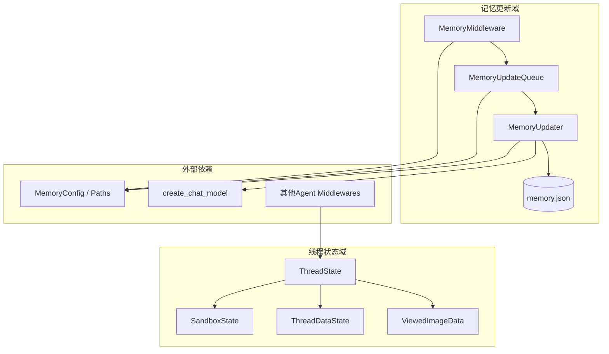
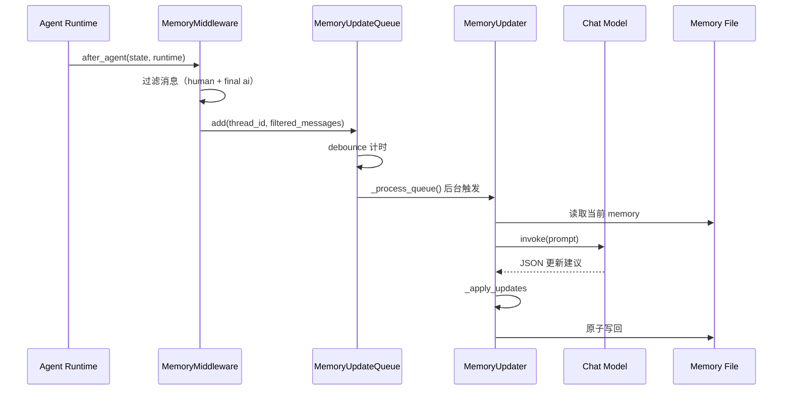
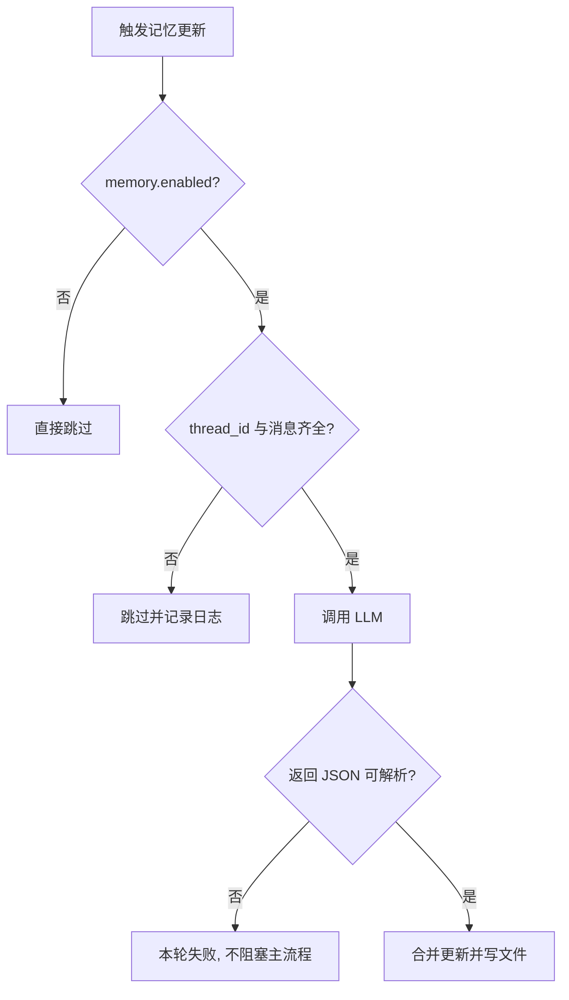

# agent_memory_and_thread_context 模块文档

## 1. 模块简介

`agent_memory_and_thread_context` 模块负责两件看似独立、实际上强相关的能力：**长期记忆更新**与**线程运行上下文建模**。前者让 Agent 能在多轮、多会话中逐步积累对用户与任务的理解；后者让 Agent 在单个线程内稳定追踪沙箱、文件路径、产物、图片查看状态等执行现场信息。二者结合，解决了“模型每轮都像第一次见用户”和“中间件之间状态不一致”这两类常见工程问题。

从设计上看，该模块刻意采用“轻入口 + 异步处理 + 结构化状态”的思路：在请求主路径中只做最小必要工作（例如入队），把高成本动作（LLM 记忆总结、文件持久化）移到后台；同时通过 `ThreadState` 统一数据契约，减少中间件间隐式耦合。这种设计牺牲了严格实时性，换来了更好的吞吐、可维护性与可扩展性。

## 2. 解决的问题与设计价值

在没有该模块时，系统通常会遇到以下问题：第一，记忆写入直接绑定在回复链路上，会增加用户等待时间；第二，频繁交互时重复触发总结，导致模型调用成本和限流风险显著上升；第三，不同中间件分别维护各自字段，状态语义漂移，最终演化为“谁都能写、谁都不敢改”的维护困境。

本模块通过 `MemoryMiddleware -> MemoryUpdateQueue -> MemoryUpdater` 的流水线解决前两类问题，通过 `ThreadState` 及其 reducer 机制解决第三类问题。最终效果是：记忆更新具备可控延迟与批处理能力，线程状态具备统一语义与可预测合并行为。

## 3. 架构总览

上图体现了两个核心子域。记忆更新域是“事件驱动 + 延迟处理”的后处理管线；线程状态域是“运行时共享 schema”，为中间件协作提供统一数据平面。两者在执行时并行发挥作用：一次请求既会更新 thread 状态，也可能在结束后触发记忆入队。

## 4. 关键流程

这里最关键的是：`after_agent` 阶段不做重任务，只做过滤和入队。因此用户响应延迟不被记忆总结显著放大。记忆写入采用最终一致性，通常在 debounce 窗口结束后完成。

## 5. 子模块说明（含交叉引用，以下文档已生成）

### 5.1 memory_pipeline（记忆更新流水线）

该子模块覆盖 `ConversationContext`、`MemoryUpdateQueue`、`MemoryUpdater`、`MemoryMiddleware` 与状态适配类型。它定义了从对话筛选、去抖入队、LLM 结构化更新到原子持久化的完整链路，并处理了缓存失效、JSON 解析失败、事实阈值过滤、最大事实数截断等关键细节。

详细设计、类方法行为、边界条件和扩展建议请阅读：[`memory_pipeline.md`](memory_pipeline.md)。

### 5.2 thread_state_schema（线程状态契约）

该子模块覆盖 `ThreadState`、`SandboxState`、`ThreadDataState`、`ViewedImageData` 以及两个 reducer（`merge_artifacts`、`merge_viewed_images`）。其重点不在业务逻辑，而在“多中间件同时写状态时如何可预测地合并”。尤其 `viewed_images` 的“空字典触发清空”语义，是避免图片重复注入的重要机制。

字段语义、合并策略、示例和注意事项请阅读：[`thread_state_schema.md`](thread_state_schema.md)。

## 6. 组件在整体系统中的位置

该模块不独立运行，它位于 Agent 执行编排层与配置/模型/存储之间：

- 与中间件编排关系：参考 [`agent_execution_middlewares.md`](agent_execution_middlewares.md)。
- 与配置项（`MemoryConfig`、`Paths`）关系：参考 [`application_and_feature_configuration.md`](application_and_feature_configuration.md)。
- 与模型客户端能力关系：参考 [`model_and_external_clients.md`](model_and_external_clients.md)。
- 与沙箱和线程目录关系：参考 [`sandbox_core_runtime.md`](sandbox_core_runtime.md)。
- 与对外 memory API 合同关系：参考 [`gateway_api_contracts.md`](gateway_api_contracts.md)。

建议阅读顺序是：先看本文件把握全局，再看 `memory_pipeline.md` 深入后处理链路，最后看 `thread_state_schema.md` 理解状态合并语义。

## 7. 使用与运维建议

在工程实践中，推荐将 `MemoryMiddleware` 作为标准 middleware 链的一部分启用，并确保 runtime context 始终带有 `thread_id`，否则记忆更新会被静默跳过。对于服务关闭流程，建议主动调用队列 `flush()`，减少待处理更新丢失。对于多实例部署场景，需重点评估共享 `memory.json` 的并发覆盖风险；如果有多 worker 写同一存储，建议将文件后端替换为具备并发控制的集中式存储。

配置层面，`debounce_seconds` 决定实时性与成本的平衡，`fact_confidence_threshold` 决定事实噪声水平，`max_facts` 决定长期记忆规模上限。建议在压测与真实流量下联调，而不是仅按默认值上线。

## 8. 需要重点关注的边界与限制

当前实现的已知限制包括：其一，队列与缓存是**进程内**语义，不能替代跨进程并发控制；其二，LLM 输出不稳定时会导致单轮更新失败，但系统不会自动重试；其三，事实新增默认随机 ID，语义重复项可能累积，只能靠阈值与上限间接控制；其四，记忆更新是最终一致性，不适合“本轮刚说完、下一 token 立刻依赖新记忆”的强实时场景。

## 9. 扩展方向

如果要扩展该模块，优先沿着稳定边界演进：在 `MemoryUpdater._apply_updates` 增加事实去重/分类限额策略；在消息过滤层根据业务保留部分高价值工具结果；将本地 JSON 存储抽象为数据库后端；或为失败更新加入可观测重试队列。无论采用哪种扩展，都应保持 `ThreadState` 字段语义稳定，避免破坏现有 middlewares 的合并假设。
